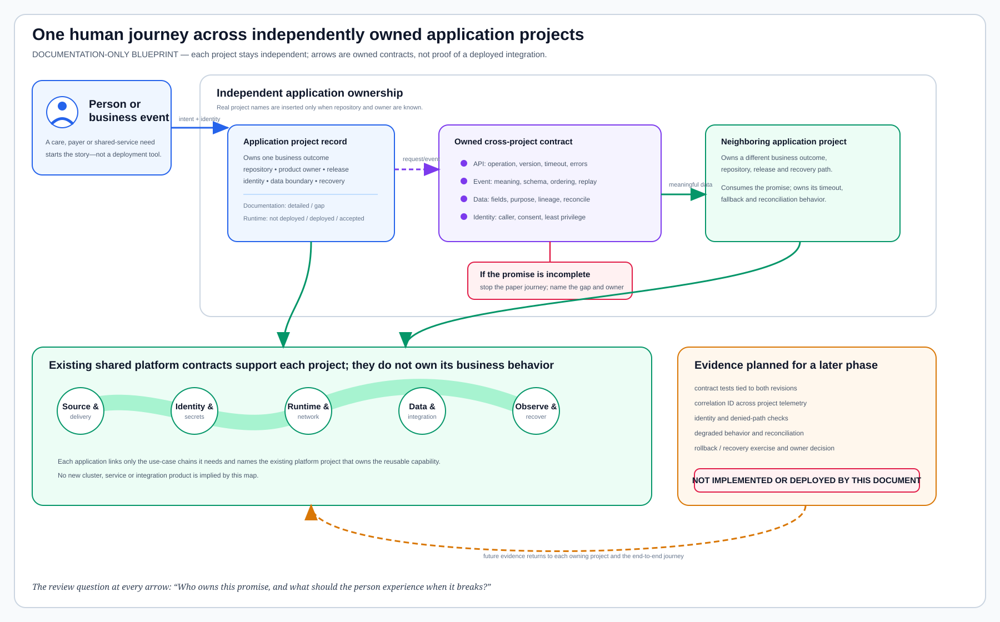

# How Separate Application Projects Become One Enterprise Workflow

Last verified: 2026-08-13

## The idea in plain language

An organization-wide workflow does not require one giant application or one
repository. It requires each real application project to state what it owns,
what it needs from its neighbors, and what happens when a neighbor is late,
unavailable, or sends something unexpected.

That is the purpose of this blueprint. It connects application records on
paper. It does **not** deploy an application, create infrastructure, generate a
Jenkins job, publish an image, or change a runtime.

The machine-readable companion is
[`application-integration-contracts.json`](application-integration-contracts.json).
It currently contains the six documented Podinfo-to-platform chains and an
empty application-to-application list because no second real application
project has been registered.

The [application-to-use-case coverage](application-usecase-coverage.md)
accounts for all 224 detailed pages without treating every platform capability
as a direct requirement of every application.

## One journey, several owners

A provider or payer journey begins with a person or business event, not with a
pipeline. The journey may cross several applications, but each application
keeps its own repository, owner, release cadence, data boundary and recovery
decision. The connection between two projects is a small, reviewable contract.

| Handoff | Questions the documentation must answer | Contract captured |
| --- | --- | --- |
| User or business event enters a project | Who starts the journey, for what outcome, and with what identity and consent? | Actor, trigger, purpose, identity assurance and data classification |
| One application calls another | Who owns the interface, which version is expected, and how are duplicate or late requests handled? | API operation, authentication, timeout, retry, idempotency and error model |
| One application publishes an event | What does the event mean, who may consume it, and how can it be replayed safely? | Event name, schema version, producer, consumers, ordering, retention and replay rule |
| Data crosses a project boundary | Which fields cross, why are they needed, and how are they reconciled? | Dataset/schema, minimum necessary fields, lineage, retention, quality and reconciliation rule |
| A platform supports the handoff | Which existing capability is required, and what evidence will later prove it? | Linked use-case chain, responsible platform project and future acceptance evidence |
| Something fails | What remains safe for the person, what degrades, and who acts? | Failure behavior, alert owner, manual fallback, recovery objective and evidence plan |

## Project record: the minimum useful detail

Every real application gets its own record and repository link. A portfolio
label such as “care delivery” or “payer operations” is not a substitute for an
application project. Until the real name, repository and owner are known, the
architecture records an inventory gap and stops there.

Each application record must contain:

- the human or business outcome it owns;
- its real repository and accountable product and operational owners;
- inbound and outbound APIs, events and datasets, each with a contract owner;
- identity, authorization, consent and minimum-necessary data boundaries;
- the existing platform projects and detailed use cases it expects to use;
- expected behavior when each dependency is slow, unavailable or incompatible;
- release, telemetry, incident, rollback and recovery expectations; and
- two independent statuses: documentation readiness and runtime state.

## Contract card between two projects

Use this card for every dependency edge. It is deliberately about meaning and
ownership before technology.

| Field | Required content |
| --- | --- |
| Business moment | The part of the provider, payer or shared-service journey this handoff advances |
| Producer project | Real repository and owner that creates the response, event or data |
| Consumer project | Real repository and owner that depends on it |
| Contract | Operation/event/dataset name, semantic version and canonical schema location |
| Identity and data | Calling principal, authorization rule, consent basis, classification and minimum fields |
| Timing | Expected latency or delivery window, timeout, retry and duplicate handling |
| Failure promise | What the consumer shows or does; what must never happen; escalation owner |
| Change rule | Compatibility promise, deprecation window and joint review authority |
| Evidence plan | Contract tests, correlation fields, future runtime checks and recovery exercise |
| Current truth | `documented`, `implemented`, `deployed` and `accepted` recorded separately |

## Common platform, without shared application ownership

Applications may use the same existing GitLab, Jenkins, AWX, Harbor,
Kubernetes, network, database and observability capabilities. That makes the
platform reusable; it does not merge the application projects.

The linkage rule is simple:

1. The application project owns its business behavior and release decision.
2. The producing project owns the interface meaning and compatibility promise.
3. The consuming project owns its timeout, fallback and reconciliation logic.
4. A named platform project owns the reusable delivery or runtime capability.
5. A service owner owns operational acceptance across the whole user journey.

No green platform check is allowed to make an application appear deployed.
Likewise, one healthy application cannot prove an end-to-end journey works.

## Current application truth

Only one concrete application repository is presently registered:
[`midhhealth/applications/podinfo`](projects/applications/podinfo.md). It is a
non-PHI reference project with a detailed platform-path record. Its runtime
state is **not deployed**, and implementation is not authorized by these docs.

The care-delivery and payer-operations portfolios still lack real application
names, repositories, owners and integration contracts. Those are honest
inventory gaps. This blueprint must be applied when those real projects are
provided; it must not manufacture placeholder systems to make the diagram look
complete.

### Podinfo's six documented platform relationships

| Contract | Owning platform responsibility | Current truth |
| --- | --- | --- |
| `podinfo-delivery-spine` | Platform Delivery owns the source-to-release and recovery design. | Linked in documentation; runtime evidence not collected |
| `podinfo-identity-and-secrets` | Security and Governance owns bounded identity, rotation and revocation expectations. | Linked in documentation; runtime evidence not collected |
| `podinfo-network-and-service-access` | Network Engineering owns the intended DNS, TLS, ingress and denied-path contract. | Linked in documentation; no hostname or route exists |
| `podinfo-operational-readiness` | Resilience and Service Operations owns readiness, escalation and recovery expectations. | Linked in documentation; no runtime acceptance exists |
| `podinfo-telemetry-and-release-feedback` | Observability and SRE owns release-correlated signal and health expectations. | Linked in documentation; no application telemetry exists |
| `podinfo-kubernetes-workload` | Kubernetes Platform owns the documented workload boundary on the existing cluster. | Linked in documentation; no namespace or workload exists |

These relationships connect one application to shared platform capabilities.
They are not application-to-application integrations. That second kind of link
can be documented only after another real application project is identified.

## Documentation review conversation

A useful review follows one business journey from beginning to end and asks,
at every boundary: “Who owns this promise?” Reviewers should be able to point
from the journey to an application record, from that record to a contract card,
and from the card to the platform use cases and future evidence plan.

The documentation is ready when no handoff depends on “the platform,” “the
integration layer,” or “another team” without a named project and owner. It is
still documentation: implementation, deployment and production validation
remain separate decisions.
