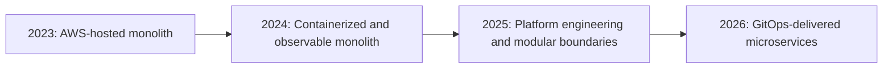

# Architecture Evolution: 2023–2026

The main purpose of this lab is to demonstrate how an enterprise hybrid-cloud
operating model evolved over the last three to four years. MAAS is retained as
one optional application-modernization reference workload; it is not the
program boundary. The 2018 product history provides context, while the primary
engineering narrative is the 2023–2026 platform modernization.

## Executive View

## 2023: AWS-Hosted Monolith

Characteristics:

- one primary application deployment unit
- tightly coupled application modules
- shared database ownership
- application and infrastructure changes released together
- AWS-specific operational procedures
- limited independent scaling
- failures can affect the entire application
- release rollback is an application-wide event

The first migration task is to inventory the actual AWS runtime, database,
storage, integrations, network flows, scheduled jobs, secrets, deployment
process, traffic, and operational dependencies. Documentation must distinguish
verified current state from assumptions.

## 2024: Containerized and Observable Monolith

Architecture changes:

- package the monolith as an immutable container
- externalize configuration and secrets
- introduce health, readiness, and liveness endpoints
- add structured logging and correlation IDs
- instrument metrics and distributed-tracing entry points
- establish GitLab/Jenkins build, test, scan, and artifact controls
- publish build artifacts and container images
- make database migrations repeatable

The application remains a monolith, but it becomes portable, measurable, and
safe enough to migrate.

## 2025: Platform Engineering and Modular Boundaries

Architecture changes:

- deploy the containerized monolith to Kubernetes
- introduce GitOps with Argo CD
- define environment overlays and immutable promotion
- introduce Keycloak, Vault, Harbor, Artifactory, SonarQube, and policy gates
- create a modular-monolith boundary map
- establish API contracts and domain ownership
- introduce the transactional outbox for reliable events
- add an API gateway/ingress boundary
- extract low-risk asynchronous capabilities first
- separate database schemas before separate databases

The objective is not to maximize service count. It is to create enforceable
boundaries and independent delivery paths.

## 2026: On-Premises Microservices Rehearsal

Architecture changes:

- run the complete platform on two Ubuntu/KVM hypervisors
- use Rocky Linux product VMs and a kubeadm Kubernetes cluster
- place user-facing HTTP services behind one non-HA
  `nginx.example.com` reverse proxy and `*.apps.example.com` URLs
- deploy independently versioned MAAS services through Argo CD
- give each service explicit API, event, data, SLO, and ownership contracts
- apply zero-trust service identity, external secrets, policy enforcement, and
  software-supply-chain controls
- use Prometheus, Loki, Tempo, and OpenTelemetry for service-level operations
- compare that cloud-native path with a three-node Elastic Stack and a
  standalone Splunk Enterprise deployment
- exercise migration, failure, rollback, backup, and disaster recovery
- defer EKS/ECR validation until the on-prem platform is accepted

The on-prem platform is a migration rehearsal environment, not a permanent
rejection of AWS. It makes architecture changes repeatable without incurring
cloud costs during every learning and failure exercise.

## Capability Progression

| Capability | 2023 | 2024 | 2025 | 2026 |
| --- | --- | --- | --- | --- |
| Application shape | Monolith | Containerized monolith | Modular monolith plus initial extractions | Independently deployable services |
| Delivery | Application-wide | CI-controlled container | GitOps introduction | Per-service GitOps |
| Runtime | Existing AWS runtime | Portable container | Kubernetes platform | On-prem Kubernetes; EKS deferred |
| Data | Shared ownership | Shared database with controlled migrations | Schema ownership and outbox | Service-owned data with governed sharing |
| Integration | In-process/direct calls | Instrumented calls | Versioned APIs and events | API/event contracts with compatibility tests |
| Security | Workload-level controls | Scans and external secrets | Policy and identity platform | Zero-trust and admission policy |
| Observability | Host/application logs | Metrics and structured logs | Correlation and traces | Per-service SLOs and dependency tracing |
| Scaling | Entire application | Entire container | Selected modules | Independent service scaling |
| Failure scope | Whole application | Whole deployment | Bounded modules | Bounded service and dependency |
| Rollback | Whole application | Image rollback | GitOps revision | Per-service image/config rollback |

## Evidence Required

For each annual architecture checkpoint, retain:

- architecture diagram
- deployment topology
- repository and pipeline structure
- dependency and data ownership map
- representative release evidence
- observability screenshots or exported dashboards
- incident and rollback exercise
- security and governance evidence
- migration decision record

The exercise is complete when a reviewer can explain not only the target
architecture, but why each transition was introduced and which risk it reduced.

The 2026 portfolio adds first-class capability domains for Linux systems,
database reliability, service resilience, data engineering, network
engineering, healthcare AI, and MLOps. These extend the original five
implementation projects to twelve enterprise projects without automatically
authorizing new infrastructure. Projects 6–10 have bounded first automation
slices; Healthcare AI and MLOps remain repository scaffolds.

The 2026 lab deliberately avoids infrastructure HA. Numeric suffixes are used
only for true cluster members such as Kubernetes workers and the three
Elasticsearch nodes. NGINX, GitLab, AWX, Kibana, Logstash, and Splunk remain
standalone services so the exercise emphasizes automation, migration, and
recovery instead of quorum design.
