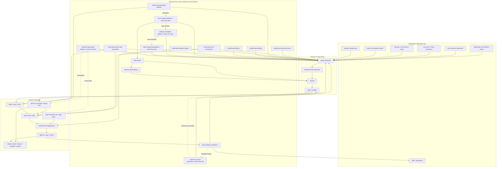

# Component Architecture: Ten-Project Enterprise Platform Program

This diagram explains how the active implementation repositories and
role-centered projects work together for **MidhHealth Integrated Care**, a
fictional integrated care delivery and health insurance organization with a
hybrid on-premises and cloud platform program.
Projects 6–10 are active first implementation slices and do not represent new
installed products or allocated VMs.

## Component Explanation

| Component | Purpose |
| --- | --- |
| MidhHealth Integrated Care | Fictional integrated care delivery and health insurance organization |
| Care Delivery Operations | Hospital systems, clinical platforms, digital care, patient access, and care operations |
| Insurance / Payer Operations | Claims, eligibility, authorizations, member services, payment integrity, and payer analytics |
| Application and Platform Teams | Consumers and contributors to the enterprise platform |
| Security / Governance / Audit | Reviews risk, compliance, evidence, and production controls |
| SRE / Operations | Owns reliability, incidents, alerts, and operational readiness |
| GitLab Group | Single enterprise program home for all repositories |
| Architecture Docs | Documents program architecture, role mapping, training standards, and interview material |
| DevSecOps Orchestrator | Automates build, test, scan, package, deploy, and evidence collection |
| Infrastructure Platform | Provisions AWS, Azure, and GCP infrastructure with Terraform and Ansible |
| Kubernetes GitOps | Manages cluster desired state, policies, namespaces, ingress, and application manifests |
| Observability/SRE | Provides dashboards, alerts, SLOs, incident runbooks, and RCA evidence |
| Governance Automation | Enforces IAM, secrets, compliance, backups, cost, certificates, and remediation |
| Linux Systems Platform | Active first slice for Linux lifecycle, baseline, patching, storage, DNS/NTP, drift, compliance evidence, and recovery runbooks against the existing VM fleet |
| Database Reliability Platform | Active first slice for database readiness, security, performance, backup, recovery, and lifecycle evidence |
| Resilience and Service Operations | Active first slice for service catalog, SLO, incident, exercise, and readiness evidence |
| Data Engineering Platform | Active first slice for source inventory, quality, orchestration, lineage, and access governance evidence |
| Network Engineering Platform | Active first slice for source-of-truth, DNS/DHCP, connectivity, firewall/proxy, and Kubernetes network evidence |
| Jenkins Jobs | Creates Jenkins pipeline jobs from source-controlled Job DSL, including `projects/run-ansible-playbook` |
| Jenkins Shared Library | Provides reusable AWX launch logic to pipelines, including playbook allowlists, extra-vars allowlists, and apply confirmation guardrails |
| Delivery Control Plane | GitLab, protected branches, Jenkins, AWX, and Ansible working together |
| Runtime Platforms | On-premises VMs/Kubernetes, cloud resources, applications, and telemetry |
| On-premises access and compute | One standalone NGINX proxy fronts user HTTP URLs; infra01/infra02 host dedicated Rocky Linux product VMs |
| Enterprise observability comparison | Three Elasticsearch nodes plus standalone Kibana, Logstash, and Splunk complement the Prometheus/Grafana path |

## Numbered Flow

1. Teams propose changes through GitLab merge requests.
2. Protected `main` branches ensure review, approvals, and evidence.
3. Jenkins and AWX automate build, deployment, and operations.
4. Terraform and Ansible provision and configure on-premises and cloud
   resources through the same review model.
5. GitOps syncs approved Kubernetes desired state to clusters.
6. Observability and governance continuously validate reliability, security, and compliance.
7. `linux-systems-platform` uses the Jenkins/AWX Ansible launcher for approved
   Linux operations against the existing VM fleet.
8. Projects 7–10 extend those controls into database, service operations, data,
   and network engineering using evidence-only first slices.

The current lab has no infrastructure HA. Numeric suffixes identify only true
cluster members. The Elastic/Splunk VMs are provisioned but their products are
not installed as of 2026-07-27. Project 6 uses existing VMs for operations
automation; Projects 7–10 have no dedicated runtime allocation and must not be
shown as deployed products.
