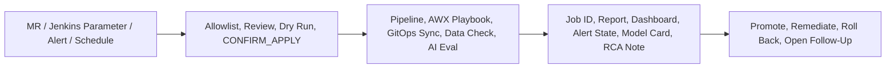

# Component Architecture: MidhHealth Enterprise Platform Program

This diagram explains how the active and planned implementation repositories and
platform teams work together for **MidhHealth Integrated Care**, a care delivery
and health insurance organization with a hybrid on-premises and cloud platform
program. The systems, database, resilience, data, and network first slices use
the existing VM fleet and do not represent new installed products or allocated
VMs.

The architecture is organized around executable work, not presentation-only
capability boxes. A project is useful when it can produce something concrete:
a Jenkins run, AWX job, GitLab pipeline, Ansible evidence report, Kubernetes
sync result, dashboard, alert, incident note, data-quality report, model card,
or controlled AI evaluation. That is the standard used to decide what belongs
in the repos.

```mermaid
flowchart TB
    subgraph org[MidhHealth Integrated Care]
        users[Application and Platform Teams]
        care[Care Delivery Operations]
        payer[Insurance / Payer Operations]
        governance[Security / Governance / Audit]
        sre[SRE / Operations]
        dataowners[Data and Database Teams]
        networkops[Network Engineering]
    end

    subgraph gitlab[GitLab Organization: midhhealth]
        arch[enterprise-architecture]
        delivery[platform-delivery]
        platform[platform-engineering]
        reliability[reliability-operations]
        security[security-governance]
        datagroup[data-and-integration]
        aiml[ai-and-ml-platform]
        careapps[care-delivery-platform]
        payerapps[payer-operations-platform]
    end

    arch --> archdocs[enterprise-architecture-docs]
    delivery --> cicd[devsecops-cicd-orchestrator]
    delivery --> jobs[jenkins-jobs]
    delivery --> lib[jenkins-shared-library]
    delivery --> ansjen[ansible-jenkins]
    delivery --> awxinv[awx-inventory]
    platform --> infra[cloud-infra-automation-platform]
    platform --> k8s[kubernetes-platform-gitops]
    platform --> ansk8s[ansible-kubernetes]
    platform --> systems[linux-systems-platform / active first slice]
    platform --> network[network-engineering-platform / active first slice]
    reliability --> obs[observability-sre-platform]
    reliability --> resilience[resilience-service-operations / active first slice]
    reliability --> ansobs[ansible-observability]
    reliability --> ansprom[ansible-prometheus]
    security --> gov[cloud-governance-ops-automation]
    datagroup --> database[database-reliability-platform / active first slice]
    datagroup --> dataeng[data-engineering-platform / active first slice]
    aiml --> ai[healthcare-ai-platform / planned]
    aiml --> mlops[mlops-model-platform / planned]

    subgraph delivery[Delivery Control Plane]
        mr[Merge Requests]
        protected[Protected main Branches]
        jenkins[Jenkins]
        awx[AWX / Ansible]
    end

    subgraph runtime[Runtime Platforms]
        proxy[Service-local NGINX / canonical URLs; legacy shared proxy during migration]
        kvm[infra01 and infra02 / Rocky VMs]
        cloud[AWS / Azure / GCP]
        clusters[AKS / EKS / GKE]
        apps[Containerized Applications]
        telemetry[Metrics / Logs / Traces]
        enterpriseobs[Elastic cluster / Kibana / Logstash; Splunk planned]
    end

    users --> mr
    care --> mr
    payer --> mr
    governance --> mr
    dataowners --> mr
    networkops --> mr
    archdocs --> mr
    cicd --> mr
    infra --> mr
    k8s --> mr
    obs --> mr
    ansobs --> mr
    ansprom --> mr
    gov --> mr
    systems --> mr
    database --> mr
    resilience --> mr
    dataeng --> mr
    ai --> mr
    mlops --> mr
    network --> mr
    jobs --> jenkins
    lib --> jenkins
    ansjen --> awx
    awxinv --> awx
    ansk8s --> awx
    mr --> protected
    protected --> jenkins
    jenkins --> awx
    systems --> jobs
    jobs --> lib
    awx --> kvm
    proxy --> apps
    kvm --> clusters
    kvm --> enterpriseobs
    infra --> cloud
    awx --> cloud
    cloud --> clusters
    k8s --> clusters
    cicd --> apps
    clusters --> apps
    apps --> telemetry
    telemetry --> obs
    telemetry --> enterpriseobs
    gov --> cloud
    gov --> clusters
    obs --> sre
    infra -. foundation .-> systems
    systems -. host services .-> database
    database -. governed data .-> dataeng
    dataeng -. governed data .-> ai
    dataeng -. curated features .-> mlops
    mlops -. model lifecycle .-> ai
    network -. connectivity .-> kvm
    network -. connectivity .-> clusters
    obs -. reliability signals .-> resilience
    resilience -. corrective automation .-> awx
```

## Component Explanation

| Component | Purpose |
| --- | --- |
| MidhHealth Integrated Care | Integrated care delivery and health insurance organization |
| Care Delivery Operations | Hospital systems, clinical platforms, digital care, patient access, and care operations |
| Insurance / Payer Operations | Claims, eligibility, authorizations, member services, payment integrity, and payer analytics |
| Application and Platform Teams | Consumers and contributors to the enterprise platform |
| Security / Governance / Audit | Reviews risk, compliance, evidence, and production controls |
| SRE / Operations | Owns reliability, incidents, alerts, and operational readiness |
| GitLab Organization | `midhhealth` top-level namespace with domain subgroups for platform, reliability, security, data, AI/ML, care delivery, and payer operations |
| Architecture Docs | Documents program architecture, role mapping, training standards, and interview material |
| DevSecOps Orchestrator | Automates build, test, scan, package, deploy, and evidence collection |
| Infrastructure Platform | Provisions AWS, Azure, and GCP infrastructure with Terraform and Ansible |
| Kubernetes GitOps | Manages cluster desired state, policies, namespaces, ingress, and application manifests |
| Observability/SRE | Provides dashboards, alerts, SLOs, incident runbooks, and RCA evidence |
| Governance Automation | Enforces IAM, secrets, compliance, backups, cost, certificates, and remediation |
| Linux Systems Platform | Active first slice against the existing VM fleet; authoritative scope is maintained only in the [enterprise portfolio](enterprise-project-portfolio-and-usecases.md#enterprise-linux-systems-engineering-platform) |
| Database Reliability Platform | Active first slice for database readiness, security, performance, backup, recovery, and lifecycle evidence |
| Resilience and Service Operations | Active first slice for service catalog, SLO, incident, exercise, and readiness evidence |
| Data Engineering Platform | Active first slice for source inventory, quality, orchestration, lineage, and access governance evidence |
| Network Engineering Platform | Active first slice for source-of-truth, DNS/DHCP, connectivity, firewall/proxy, and Kubernetes network evidence |
| Healthcare AI Platform | Planned domain for RAG, agents, AI assistants, FHIR-aware APIs, AI evaluation, guardrails and workflow integration |
| MLOps Model Platform | Planned domain for training, registry, model serving, monitoring, drift, retraining and governance |
| Jenkins Jobs | Creates Jenkins pipeline jobs from source-controlled Job DSL, including `projects/run-ansible-playbook` and `projects/deploy-kubernetes-ingress` |
| Jenkins Shared Library | Provides separate reusable contracts for AWX infrastructure operations and direct Helm release lifecycle |
| Delivery Control Plane | GitLab validates source; Jenkins orchestrates approved changes; AWX/Ansible configure infrastructure; Helm manages Kubernetes releases |
| Runtime Platforms | On-premises VMs/Kubernetes, cloud resources, applications, and telemetry |
| On-premises access and compute | Product-local NGINX fronts canonical HTTP URLs; the former standalone proxy remains only for not-yet-migrated routes; infra01/infra02 host dedicated Rocky Linux product VMs |
| Enterprise observability comparison | Three Elasticsearch nodes plus standalone Kibana, Logstash, and Splunk complement the Prometheus/Grafana path |

## Numbered Flow

1. Teams propose changes through GitLab merge requests.
2. Protected `main` branches ensure review, approvals, and evidence.
3. Jenkins orchestrates approved changes. It uses AWX for infrastructure and
   cluster configuration and Helm directly for Kubernetes releases.
4. Terraform and Ansible provision and configure on-premises and cloud
   resources through the same review model.
5. GitOps syncs approved Kubernetes desired state to clusters.
6. Observability and governance continuously validate reliability, security, and compliance.
7. `linux-systems-platform` uses the Jenkins/AWX Ansible launcher for approved
   Linux operations against the existing VM fleet.
8. Database reliability, service operations, data engineering, and network
   engineering extend those controls using evidence-only first slices.
9. Healthcare AI and MLOps extend the same controls into AI and ML model
   operations after data, security, Kubernetes and governance foundations are
   accepted.

## Executable Work Pattern

This pattern keeps the program honest. The enterprise architecture can mention
many tools, but the implementation repos should prioritize work that can be
run, observed, reviewed, and repeated.

The current lab has no infrastructure HA. Numeric suffixes identify only true
cluster members. Elastic Stack 9.4.2 is installed; Splunk remains
provisioned-only. Linux systems, database reliability, resilience/service
operations, data engineering, and network engineering use existing VMs for
first-slice automation and have no dedicated product allocation. The live
Kubernetes cluster currently contains core components, Flannel, and Headlamp;
the documented GitOps and policy add-ons remain planned.
