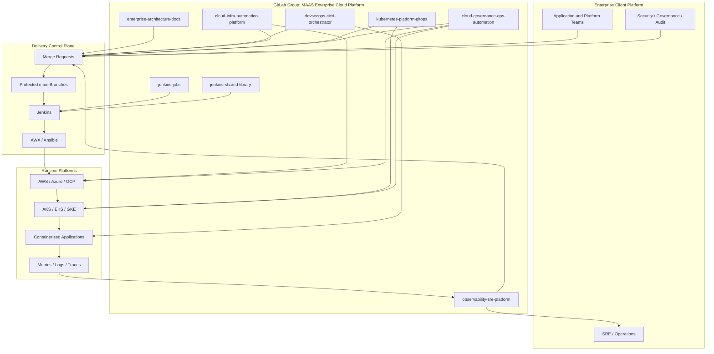

# Component Architecture: Enterprise Cloud Platform Program

This diagram explains how the project repositories work together as one enterprise cloud platform program.

## Component Explanation

| Component | Purpose |
| --- | --- |
| Application and Platform Teams | Consumers and contributors to the enterprise platform |
| Security / Governance / Audit | Reviews risk, compliance, evidence, and production controls |
| SRE / Operations | Owns reliability, incidents, alerts, and operational readiness |
| GitLab Group | Single enterprise program home for all repositories |
| Architecture Docs | Documents program architecture, role mapping, training standards, and interview material |
| DevSecOps Orchestrator | Automates build, test, scan, package, deploy, and evidence collection |
| Infrastructure Platform | Provisions AWS, Azure, and GCP infrastructure with Terraform and Ansible |
| Kubernetes GitOps | Manages cluster desired state, policies, namespaces, ingress, and application manifests |
| Observability/SRE | Provides dashboards, alerts, SLOs, incident runbooks, and RCA evidence |
| Governance Automation | Enforces IAM, secrets, compliance, backups, cost, certificates, and remediation |
| Jenkins Jobs | Creates Jenkins pipeline jobs from source-controlled Job DSL |
| Jenkins Shared Library | Provides reusable AWX launch logic to pipelines |
| Delivery Control Plane | GitLab, protected branches, Jenkins, AWX, and Ansible working together |
| Runtime Platforms | Cloud resources, Kubernetes clusters, applications, and telemetry |

## Numbered Flow

1. Teams propose changes through GitLab merge requests.
2. Protected `main` branches ensure review, approvals, and evidence.
3. Jenkins and AWX automate build, deployment, and operations.
4. Terraform and Ansible provision and configure cloud resources.
5. GitOps syncs approved Kubernetes desired state to clusters.
6. Observability and governance continuously validate reliability, security, and compliance.
