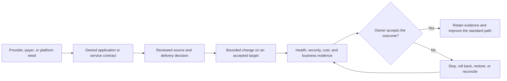

# Cross-Platform Outcome and Control Framework

Last reviewed: 2026-08-13

## Architecture decision

MidhHealth will fit the next generation of delivery, automation, cost,
security, reliability, interoperability, and AI-assurance work into the twelve
existing platform domains. These concerns do not create a thirteenth platform,
a new shared product, or permission to deploy infrastructure.

The platforms have different responsibilities, but they need one way to
describe a requested outcome, decide whether an action is safe, prove what
happened, and learn from the result. This framework supplies that common
language. The detailed use case remains owned by one platform; supporting
platforms contribute contracts or evidence without becoming alternate owners.

## The enterprise goal

The twelve platforms exist to help a provider, payer, or shared application
team turn an approved need into a service that can be delivered, observed,
secured, recovered, and explained. A platform capability is therefore not
complete merely because a tool ran. It must improve an outcome that an
application or operational owner recognizes.

The connected path is:

This flow does not imply that a real provider or payer application already
exists. Each application must first be registered in the
[Application Project Architecture and Linkage Register](application-project-deployment-register.md).

## Three standards shared by every platform

### 1. Decision and evidence contract

Every detailed use case and future implementation must make the following
fields answerable. They may live in several version-controlled artifacts, but
the handoffs must be traceable from the use-case page.

| Contract field | Question it must answer |
| --- | --- |
| Intent | What provider, payer, application, security, or operational outcome is requested? |
| Owner | Who owns the platform decision, and who accepts its effect on the consuming service? |
| Scope | Which source revision, application, environment, resources, dependencies, and data are included? |
| Current boundary | Which targets and products are accepted now, and which are planned, partial, or unavailable? |
| Policy | Which controls, thresholds, exceptions, and approvals govern the decision? |
| Evidence | Which immutable inputs and observations support the decision, who produced them, and when do they expire? |
| Decision | Did the control approve, reject, defer, or require a human decision, and why? |
| Action | What bounded operation is allowed, under which identity, and with what blast-radius limit? |
| Verification | Which independent observation proves that the intended result occurred and unrelated state stayed safe? |
| Recovery | What stops the action or returns the target to its previous safe state? |
| Learning | Which metric, incident, exception, or standard-path improvement follows from the result? |

A screenshot, reachable page, successful process, or green job may support the
evidence, but none is sufficient by itself. Evidence must identify the source
revision, target, actor, policy version, observation time, result, and owner.

### 2. Safe automation control loop

The same control loop applies to delivery rollback, infrastructure drift,
Kubernetes reconciliation, Linux patching, database recovery, network change,
cost remediation, AI release governance, and model rollback:

1. **Detect** a requested or observed condition from an attributable source.
2. **Diagnose** the affected service, dependency, owner, severity, and likely
   change without mutating the target.
3. **Recommend** a bounded action and show the expected impact.
4. **Decide** through policy; require a person when risk, uncertainty, scope,
   protected data, or production impact exceeds the accepted boundary.
5. **Execute** only against an allowlisted target with an attributable identity,
   concurrency limit, timeout, and stop condition.
6. **Verify** through an observation independent of the execution result.
7. **Recover** through zero-change stop, rollback, restore, reconciliation, or
   escalation when verification fails.
8. **Record and learn** by retaining sanitized evidence and assigning any
   corrective action to an owner.

Human approval is not a substitute for diagnostics or policy. Conversely,
automation may not interpret a missing approval, missing evidence, or unknown
target as permission to continue.

### 3. Platform outcome scorecard

Each platform selects measures relevant to the consuming service. The common
scorecard prevents teams from reporting only tool activity.

| Outcome | Example measures |
| --- | --- |
| Flow | Developer waiting time, queue delay, lead time, promotion time, and percentage using the supported path |
| Safety | Change-failure rate, rejected unsafe changes, rollback success, exception age, and unauthorized-scope attempts |
| Reliability | SLO attainment, error-budget burn, time to detect, time to recover, recurrence, and recovery-exercise success |
| Security and governance | Current control coverage, vulnerability exposure age, evidence freshness, privileged-action attribution, and exception expiry |
| Cost and capacity | Cost per application, environment, transaction, dataset, or AI request; anomaly response time; utilization and forecast accuracy |
| Quality | Contract compatibility, data-quality failures, AI evaluation results, model drift, false-pass rate, and escaped defects |
| Human outcome | Time saved, handoffs removed, diagnostic clarity, operator confidence, and owner acceptance |

Thresholds are not invented in architecture documentation. The accountable
owner sets a baseline and acceptance target before implementation. The first
slice may prove that measurement works without claiming an improvement that has
not yet been observed.

## Capability ownership across the twelve platforms

| Market-facing problem or pattern | Accountable platform | Existing use-case home | Required supporting handoff |
| --- | --- | --- | --- |
| Evidence-driven application delivery | DevSecOps Delivery | `UC-CICD-001`, `008`, `010`, `015`, `016` | Governance policy, observability health, resilience release decision, application contract |
| Trusted operational automation | Cloud Governance and Operations Automation | `UC-GOV-011` through `015` | Domain-specific diagnostics, approval boundary, AWX/Jenkins execution, independent verification |
| Cloud and AI unit economics | Cloud Governance and Operations Automation | `UC-GOV-016`, `017` | Infrastructure tags, Kubernetes allocation, data cost, AI token/latency and service ownership |
| Infrastructure drift and change impact | Multi-Cloud Infrastructure | `UC-INFRA-001`, `004`, `007`, `009`, `011`, `012` | Delivery plan, governance policy, service dependency and recovery evidence |
| Golden application runtime path | Kubernetes Platform with GitOps | `UC-K8S-003` through `009`, `011` | Delivery artifact, network route, secrets, SLO, ownership and rollback contract |
| Operational intelligence rather than isolated dashboards | Observability and SRE | `UC-OBS-007`, `008`, `014`, `015`, `016` | Telemetry ownership, recent change, dependency, SLO and runbook records |
| Continuous security and healthcare-control evidence | Cloud Governance and Operations Automation | `UC-GOV-001`, `004`, `006`, `007` | Linux, database, network, delivery and application control results |
| Software-supply-chain decisions | DevSecOps Delivery | `UC-CICD-005`, `006`, `010` through `013` | Registry/image policy, deployed-artifact inventory, ownership, exception and runtime evidence |
| Host lifecycle and vulnerability recovery | Linux Systems Engineering | `UC-LNX-022`, `023`, `024` | Governance priority, delivery review, observability health and resilience recovery decision |
| Data protection and recoverable persistence | Database Reliability | `UC-DB-005`, `012`, `013`, `015` through `019` | Application data contract, identity, audit, SLO and recovery evidence |
| Incident learning and dependency containment | Resilience and Service Operations | `UC-RSO-004` through `010`, `014` through `017`, `021` | Observability signal, platform runbook, application impact and corrective-action owner |
| Healthcare data and API contracts | Data Engineering and Integration | `UC-DATA-001`, `007`, `008`, `014` through `016`, `021` through `023` | FHIR/API consumer rules, schema compatibility, classification, lineage and reconciliation |
| Connectivity as a reviewed service dependency | Network Engineering and Automation | `UC-NET-001`, `009`, `012`, `020`, `022` through `030` | Application route, identity, policy, flow evidence, health check and rollback |
| FHIR-aware AI assurance | Healthcare AI | `UC-AI-006` through `015` | Data classification, API contract, model version, evaluation, access, workflow owner and incident path |
| Governed model lifecycle | MLOps Model Platform | `UC-MLOPS-001`, `004`, `005`, `008` through `015` | Training/data lineage, evaluation policy, serving health, application acceptance and rollback |

Some problems deliberately appear in several handoffs. That does not justify
duplicating ownership. For example, Governance owns the cost decision;
Kubernetes supplies workload allocation, Healthcare AI supplies inference
usage, and the application owner decides whether the resulting unit cost is
valuable.

## Focused enhancements to existing use cases

The portfolio already has sufficient domain coverage. Implementation planning
should deepen these existing use cases before proposing new ones.

| Existing area | Enhancement to add during implementation design | Evidence that will prove the enhancement later |
| --- | --- | --- |
| Delivery and image security | Produce and retain SBOM, provenance and policy decisions; map an artifact digest to every observed deployment; support VEX or a documented exploitability decision | Source revision, signed or attributable artifact metadata, policy result, deployment identity and dependency-owner query |
| Cloud cost and rightsizing | Attribute spend to application, owner, environment and service outcome; include Kubernetes, data and AI consumption; recommend rather than silently mutate | Allocation coverage, anomaly record, recommendation, approval or rejection reason, post-change utilization and unit-cost comparison |
| Compliance evidence | Map technical checks to the applicable MidhHealth healthcare-security control and show evidence freshness, scope, exception owner and expiry | Machine-readable control result plus restore, incident-readiness or access-review evidence where applicable |
| FHIR and API integration | Test schema and version compatibility, authorization boundaries, synthetic provider/payer workflows, replay behavior and dependency failure; use no real PHI in the lab | Versioned contract, synthetic fixture, producer/consumer results, unauthorized test, trace and reconciliation report |
| AI and model release | Record prompt, retrieval, data, tool and model versions; test safety, groundedness, privacy, cost, latency and rollback before promotion | Evaluation bundle, model or prompt decision, human-review record, runtime observation and rollback result |
| Observability and incident response | Join the user symptom to service ownership, dependencies, SLO impact and recent changes; make the suggested runbook explain its evidence | Incident timeline, change correlation, diagnosis confidence, operator decision, recovery verification and corrective action |
| Domain automation | Apply the shared control loop to Terraform, GitOps, Linux, database, network and recovery actions instead of treating a successful job as completion | Dry run, target allowlist, identity, approval decision, bounded execution, independent health check and rollback/restore proof |
| Application golden path | Require an application record to link source, artifact, runtime, route, data, dependencies, SLO, dashboard, runbook, cost owner and recovery path | Completed application deployment record with immutable references and owner acceptance |

## How an application uses the framework

An application remains a separate project. It does not become part of a
platform repository, and documentation does not deploy it. Once a real
application is registered, its deployment record selects only the platform
capabilities it needs:

1. The application owner describes users, data classification, interfaces,
   dependencies, expected demand and service outcome.
2. DevSecOps validates source and produces an attributable artifact.
3. Infrastructure, Linux, network, database, data and Kubernetes platforms
   provide only the applicable target contracts.
4. Governance evaluates identity, policy, security, cost and exceptions.
5. Observability defines how the application will be seen; Resilience defines
   how it will fail, recover and learn.
6. Healthcare AI and MLOps participate only if the registered application has
   an approved AI or model dependency.
7. The application owner accepts the end-to-end evidence and business effect;
   individual platform success does not substitute for that acceptance.

## Boundary for the current phase

This page completes a design connection. It does not claim that contracts,
code, dashboards, policies, evidence collectors, applications, cloud targets,
AI services, or remediation workflows have been implemented. Implementation
must reuse accepted infrastructure unless a later, separately approved design
and change record establishes another target.

No platform should install Harbor, Keycloak, Argo CD, External Secrets, a
FinOps product, an AI gateway, an observability product, or any other component
merely because this framework names a capability. Product selection follows
the canonical environment state, dependency-safe implementation order, and
separate change control.

## Review questions

Before accepting a cross-platform design, reviewers should be able to answer:

1. Which one platform owns the decision, and which service owner accepts the
   result?
2. What business or operational outcome improves if this use case succeeds?
3. Which existing platform contracts are consumed, and what happens when one
   is missing, stale, malformed or unavailable?
4. What keeps a recommendation separate from an authorized mutation?
5. How are identity, target scope, concurrency, timeout and blast radius
   bounded?
6. Which observation independently proves success, and how is recovery proven?
7. Which scorecard measure establishes the baseline and later demonstrates
   value?
8. Does the design reuse the twelve-platform architecture without silently
   creating a product, runtime or application?
