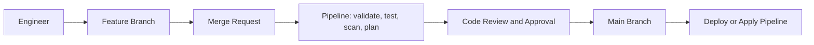
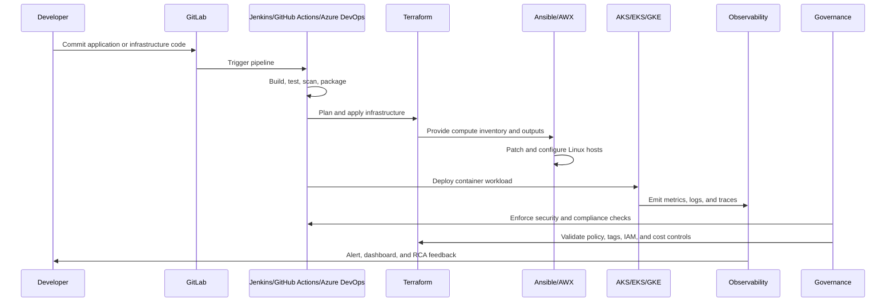
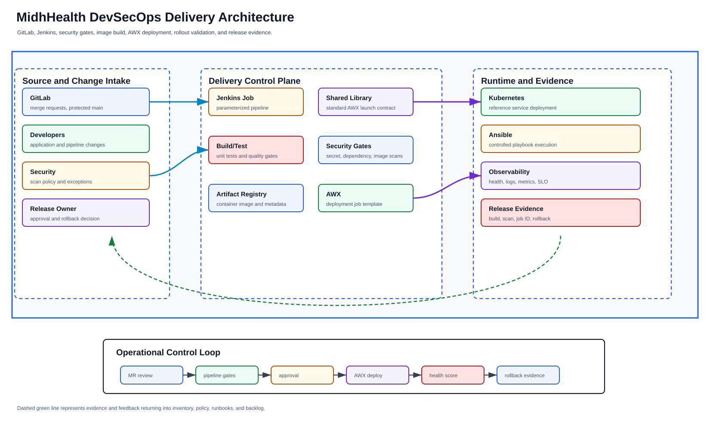
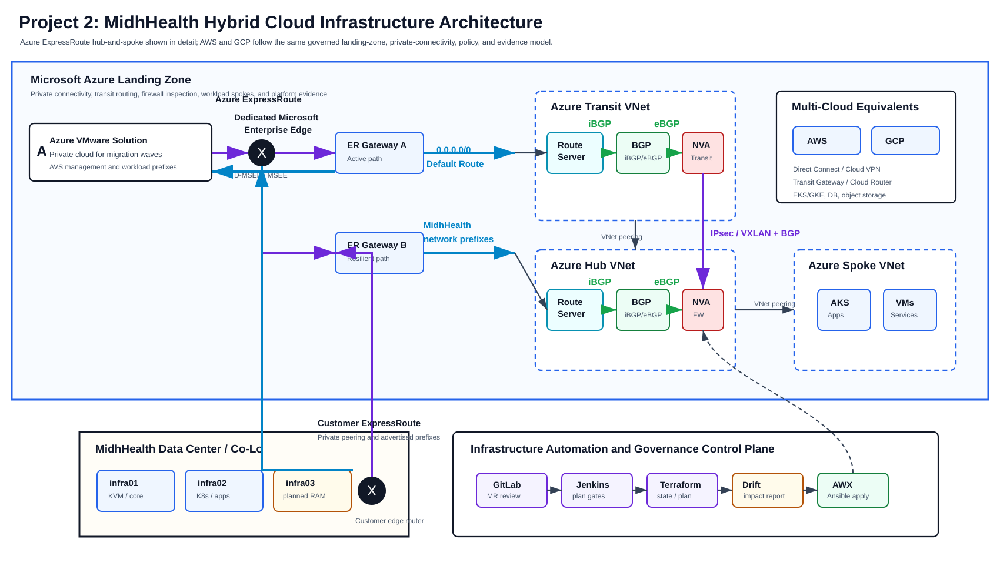
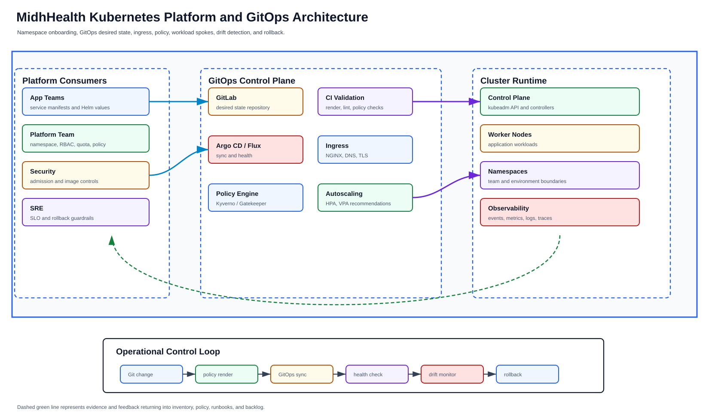
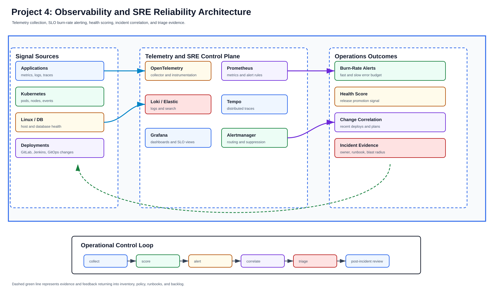
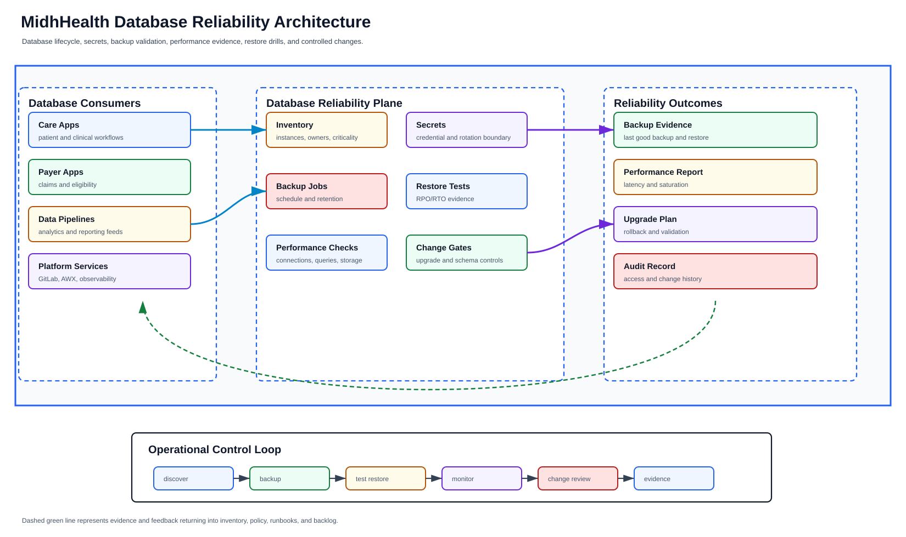
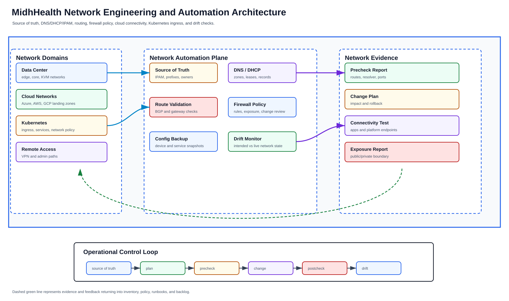
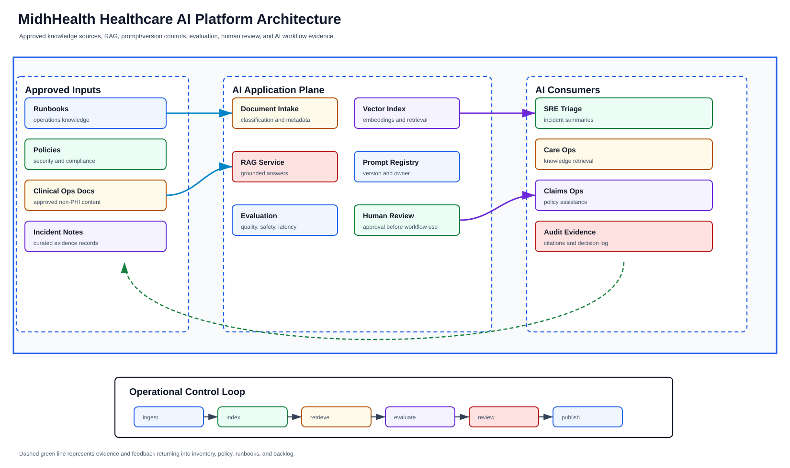
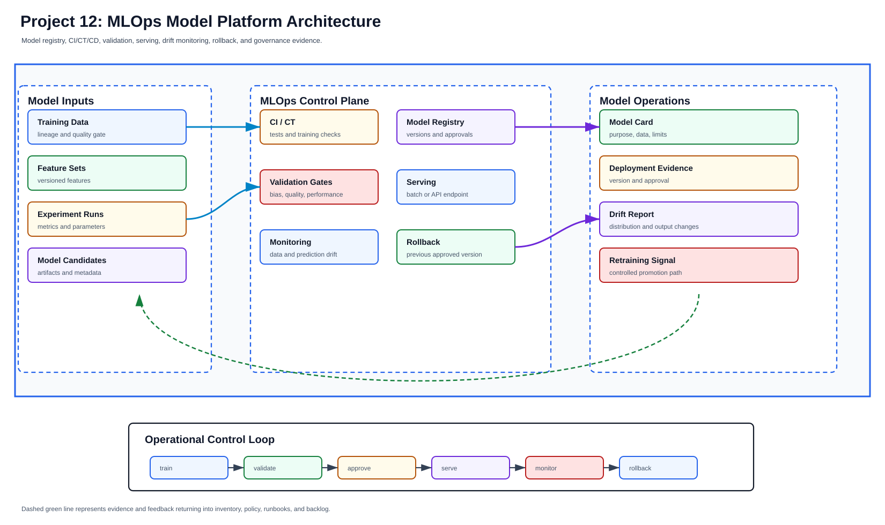

# Enterprise Project Portfolio and Use Case Coverage

**MidhHealth Integrated Care** is modeled as an integrated provider-payer
healthcare organization. Its platform supports hospital operations, digital
care, claims, eligibility, authorizations, member services, analytics,
security, and the hybrid infrastructure those services depend on.

The repositories map to the engineering teams that operate the platform:
delivery, infrastructure, Kubernetes, observability, governance, Linux systems,
databases, resilience, data engineering, network engineering, healthcare AI, and
MLOps. Each team owns a different part of the platform, but the end goal is the
same: reliable care delivery, efficient payer operations, governed data
movement, secure automation, and recoverable hybrid infrastructure.

The current implementation uses the existing VM fleet for the active systems,
database, resilience, data, and network slices. Those slices produce operating
evidence and automation without approving new product installs, new VMs, or
production capacity by themselves. The AI and ML domains add the engineering
capabilities needed for healthcare knowledge retrieval, model lifecycle,
evaluation, monitoring, and governance. The capacity plan includes
`midh-ai-edge-01`, a Mac Studio M1 for AI/ML development and edge inference,
plus a planned third Linux server with 256 GB RAM for heavier platform
workloads.

Every repository is expected to produce something reviewable for the shared
platform: code, pipelines, playbooks, GitOps state, policy checks, dashboards,
evidence, or operational runbooks.

## Healthcare Platform Requirements

The newer use cases are shaped from current healthcare technology requirements,
but the portfolio does not store job postings or copy role language. Healthcare
platform teams need hybrid systems that stay reliable while data movement is
modernized, AI workflows become safe enough to operate, and every change remains
reviewed, observable, and recoverable.

For MidhHealth, that translates into practical work:

| Platform requirement | MidhHealth use case direction |
| --- | --- |
| SRE roles now expect observability, resilience, automation, and AI-assisted operations to live together | Build alerts that carry enough context for triage, enrich incidents with runbook and dependency evidence, and measure whether automation actually reduces recovery time |
| Healthcare data roles keep asking for EHR, FHIR, HL7/X12, cloud data platforms, lineage, quality, and real-time pipelines | Treat data feeds as governed products: inventory the source, validate the schema, track lineage, monitor freshness, and make failures visible before downstream teams make decisions from stale data |
| AI roles are moving from experiments to production systems with RAG, agents, responsible AI, evaluation, and auditability | Start with constrained assistants for knowledge retrieval, claims or care-operation support, and incident summarization; require prompt/version tracking, human review, and safety checks before workflow integration |
| MLOps roles emphasize model registries, CI/CT/CD, serving, monitoring, drift, rollback, and governance evidence | Promote models like software: every candidate has data lineage, validation results, deployment evidence, telemetry, rollback path, and an owner |
| Cloud/platform roles still need CI/CD, IaC, Kubernetes, security, cost controls, and operational support | Keep the platform boring in the best way: repeatable builds, protected branches, review gates, secrets out of Git, and visible deployment evidence |
| Early-to-mid-career Linux roles combine core administration with automation, observability, security, hybrid infrastructure, and incident ownership | Treat Bash/Python tooling, monitoring and RCA, identity integration, vulnerability remediation, container and cloud host operations, and tested recovery as first-class Linux engineering work |

The goal is not to claim that every tool is installed today. The goal is to
define work that a healthcare platform team can operate, audit, and convert into
controlled automation.

## Executable Use-Case Standard

A use case is ready for implementation only when an engineer can turn it into a
pipeline job, playbook, script, dashboard, alert, API endpoint, policy check, or
runbook drill. Broad statements such as "improve reliability" or "modernize
data" are not enough. The repo should say what starts the work, what system is
touched, what the automation does, what evidence is produced, and what the safe
rollback or manual stop point is.

Every executable use case should answer these questions:

| Question | What good looks like |
| --- | --- |
| What starts it? | A merge request, Jenkins parameter, AWX template, GitLab schedule, alert, data-feed event, or manual incident command |
| What does it touch? | A known repo, inventory group, Kubernetes namespace, database, data feed, model artifact, dashboard, or service endpoint |
| What does it do? | Validate, deploy, scan, reconcile, collect evidence, compare drift, run a smoke test, enrich an incident, or generate a controlled report |
| How do we know it worked? | Pipeline result, AWX job ID, artifact, report, dashboard panel, alert state, SLO measurement, audit log, or runbook evidence |
| How do we keep it safe? | Protected branch, allowlist, dry-run mode, `CONFIRM_APPLY`, scoped credentials, no protected data by default, and documented rollback |

## Executable Backlog

This is the first cross-project backlog that should be converted into real
automation. It deliberately favors work we can prove in the lab over vague
enterprise ambitions.

| Backlog item | Primary repo | Executable form | Evidence produced |
| --- | --- | --- | --- |
| Run an approved Ansible playbook by selecting project, branch, inventory, playbook, and extra vars | `jenkins-jobs`, `jenkins-shared-library` | Jenkins parameterized job calls AWX after allowlist checks | Jenkins build log, AWX project sync, AWX job ID, playbook result |
| Check Linux fleet patch and baseline posture without changing hosts | `linux-systems-platform` | AWX evidence playbook in check/read-only mode | Host report for package, service, firewall, SELinux, disk, time, and access posture |
| Detect Linux configuration drift before a maintenance window | `linux-systems-platform` | Scheduled playbook compares desired controls with live state | Drift report, failed-control list, remediation candidate list |
| Validate database backup readiness and restore evidence | `database-reliability-platform` | AWX playbook checks backup jobs, last successful run, storage, and restore notes | Backup readiness report and restore-test evidence |
| Capture database performance and connection pressure | `database-reliability-platform` | Read-only SQL and host checks gathered through AWX | Query latency, connection, storage, and saturation report |
| Build a service readiness view for a care or payer workflow | `resilience-service-operations` | Service catalog plus SLO and dependency checks | Service owner, dependency, SLO, incident, and readiness record |
| Enrich an incident with recent deployments and runbook links | `observability-sre-platform`, `resilience-service-operations` | Alert rule or script joins alert labels, GitLab changes, service catalog, and runbook metadata | Incident context bundle and RCA starter note |
| Watch freshness for an EHR, claims, eligibility, or provider feed | `data-engineering-platform` | Scheduled data-quality check validates arrival time, schema, and row-count thresholds | Feed freshness report, schema result, downstream-consumer impact |
| Track data lineage from source feed to dashboard or model | `data-engineering-platform` | Metadata inventory and validation script | Source owner, transform path, consumers, and stale-link findings |
| Validate DNS, DHCP, proxy, and Kubernetes network paths before change | `network-engineering-platform` | Pre/post network check playbook | Resolver, route, port, ingress, and rollback evidence |
| Run a safe healthcare RAG prototype over approved documents | `healthcare-ai-platform` | Local Mac Studio or CI job indexes approved docs and runs evaluation prompts | Citation quality, answer quality, latency, and prompt/version report |
| Summarize an incident or runbook with citations | `healthcare-ai-platform`, `observability-sre-platform` | Controlled AI workflow uses approved incident notes and runbooks | Summary, cited sources, confidence notes, and human-review marker |
| Register and validate a small model artifact | `mlops-model-platform` | CI job records run metadata, validation metrics, and promotion decision | Model card, metric report, approval status, rollback reference |
| Detect model or data drift for a lab inference endpoint | `mlops-model-platform`, `data-engineering-platform` | Scheduled evaluation compares current sample distribution and output metrics | Drift report, SLO status, retraining recommendation |
| Confirm a release is observable before promotion | `devsecops-cicd-orchestrator`, `observability-sre-platform` | Pipeline gate checks health endpoint, metrics, logs, traces, and rollback metadata | Release evidence bundle and promotion decision |

These backlog items are the bridge between job-derived requirements and code.
Each one can become a GitLab issue, Jenkins job, AWX template, playbook, CI
stage, dashboard, or runbook without inventing a new product installation.

## 2026 Automation Focus Areas

The next implementation wave should focus on automation that keeps desired
state, runtime health, and deployment evidence connected. These areas are
current because teams are no longer satisfied with "we have Terraform" or "we
have monitoring." They want the platform to notice drift, explain impact,
propose a safe action, and prove the system recovered.

| Area | What MidhHealth should build next | Primary repos |
| --- | --- | --- |
| Infrastructure automation | Terraform drift detection, plan automation, state integrity checks, change impact analysis, policy-driven provisioning, and reconciliation loops | `cloud-infra-automation-platform`, `devsecops-cicd-orchestrator`, `cloud-governance-ops-automation` |
| Cloud operations automation | Event-driven remediation, runbook automation, human-approved recovery, cost anomaly detection, and right-sizing recommendations | `cloud-governance-ops-automation`, `resilience-service-operations`, `observability-sre-platform` |
| Kubernetes automation | GitOps reconciliation, live-vs-Git drift checks, automated rollback, progressive delivery, continuous verification, policy enforcement, and workload right-sizing | `kubernetes-platform-gitops`, `observability-sre-platform`, `devsecops-cicd-orchestrator` |
| Platform engineering | Internal developer portal, service catalog, golden paths, environment templates, reusable infrastructure modules, and self-service requests | `cloud-infra-automation-platform`, `kubernetes-platform-gitops`, `jenkins-jobs`, `jenkins-shared-library` |
| Observability and SRE | OpenTelemetry instrumentation, eBPF/zero-code visibility, observability pipelines, SLO as code, burn-rate alerting, health scoring, change correlation, and incident triage | `observability-sre-platform`, `resilience-service-operations`, `healthcare-ai-platform` |

The priority implementation path is a closed-loop workflow: detect drift or
degraded health, explain the operational impact, require approval when risk is
high, run a controlled remediation, and verify recovery.

| Focus item | Executable implementation |
| --- | --- |
| Terraform Drift Detector | Scheduled Terraform plan compares state and provider reality; output becomes a drift report |
| Automated Drift Remediation | Approved Jenkins/AWX workflow reapplies the reviewed Terraform configuration |
| Terraform Plan Analyzer | Merge requests publish summarized creates, updates, destroys, and risky dependencies |
| Infrastructure Change Impact Analyzer | Pipeline maps changed Terraform resources to apps, data feeds, routes, SLOs, and owners |
| Cloud Misconfiguration Detector | Policy scan checks public exposure, weak IAM, missing tags, encryption, backups, and logging |
| Kubernetes Drift Monitor | Script compares Git manifests with live cluster objects and flags unmanaged changes |
| GitOps Reconciliation | Argo CD or Flux restores approved desired state after review |
| Automated Rollback Controller | Deployment health score fails promotion and rolls back when SLO or smoke checks fail |
| Deployment Health Scoring | Release gate combines health endpoint, error rate, latency, logs, and recent alerts |
| SLO Burn-Rate Alerting | Prometheus rules alert on fast and slow budget burn, not just raw downtime |
| Change-to-Incident Correlation | Incident context links alerts to recent commits, deployments, Terraform plans, and GitOps syncs |
| Automated Incident Triage | Guarded workflow gathers service owner, dependency, dashboard, runbook, and likely change source |
| Self-Healing Infrastructure | Low-risk failures trigger known recovery playbooks, followed by validation |
| Cloud Cost Anomaly Detection | Scheduled report flags spend or usage jumps by project, owner, environment, or service |
| Resource Right-Sizing Automation | Utilization data proposes CPU, memory, storage, and replica adjustments with approval gates |

Current external signals support this direction. CNCF's Q1 2026 Technology
Radar placed Helm, Backstage, and kro in the application-delivery "Adopt"
category, and OpenTelemetry's 2026 eBPF work emphasizes production readiness
and hybrid instrumentation. MidhHealth should use those signals pragmatically:
Backstage-style portal and catalog work belongs in the platform backlog; Helm
and GitOps belong in Kubernetes delivery; OpenTelemetry and eBPF belong in
observability, profiling, and incident evidence.

## Enterprise Architecture


The architecture should be read left to right:

1. Business operations create platform demand through hospital, digital care,
   insurance, and partner workflows.
2. Application and product teams turn that demand into care delivery, payer
   operations, shared API, and analytics work.
3. The `midhhealth` GitLab organization holds the architecture, delivery,
   infrastructure, Kubernetes, governance, Linux, database, resilience, data,
   network, AI, and MLOps repositories.
4. GitLab CI, Jenkins, AWX, Ansible, Terraform, and GitOps execute approved
   changes against the shared runtime foundation.
5. Runtime, data, AI, observability, reliability, security, and compliance
   evidence flow back into the next platform decision.

The detailed component explanation lives in
[Component Architecture](component-architecture.md).

The deployment relationship among separate application repositories, shared
platform projects and linked use-case chains is maintained in the
[Application Project Architecture and Linkage Register](application-project-deployment-register.md).

## Organization Model

| Layer | Shared organizational capability |
| --- | --- |
| Business model | Integrated care delivery and health insurance provider |
| Provider operations | Hospital systems, clinical platforms, digital care, patient access, and care operations |
| Payer operations | Claims, eligibility, authorizations, member services, payment integrity, and analytics |
| Source control | One `midhhealth` GitLab organization, domain subgroups, protected branches, merge requests, and audit trail |
| Delivery | Jenkins, GitLab CI, AWX, Ansible, Terraform, GitOps, and reusable shared libraries |
| On-premises platform | KVM/libvirt, Rocky Linux VMs, DNS, NGINX, Kubernetes, observability, and product VMs |
| Cloud platform | AWS, Azure, and GCP foundations managed through the same Terraform, Ansible, CI, governance, and review model |
| AI/ML edge | Mac Studio M1 `midh-ai-edge-01` for non-production inference, embeddings, notebooks, and evaluation |
| Memory-optimized expansion | Planned 256 GB Linux server for data, observability, AI/ML backend workloads, and resilience exercises |
| Governance | Security, secrets, compliance, cost, backup, certificate, and change controls across both on-prem and cloud |
| Operations | SLOs, incident evidence, runbooks, platform telemetry, and controlled remediation |

## Portfolio Status

| Domain | Repository | Team page | Status on 2026-07-27 |
| --- | --- | --- | --- |
| DevSecOps delivery | `devsecops-cicd-orchestrator` | [Team model](projects/devsecops-delivery.md) | Active implementation |
| Multi-cloud infrastructure | `cloud-infra-automation-platform` | [Team model](projects/multi-cloud-infrastructure.md) | Active implementation |
| Kubernetes platform | `kubernetes-platform-gitops` | [Team model](projects/kubernetes-platform.md) | Active implementation |
| Observability and SRE | `observability-sre-platform` | [Team model](projects/observability-sre.md) | Active implementation |
| Governance and operations automation | `cloud-governance-ops-automation` | [Team model](projects/governance-operations.md) | Active implementation |
| Linux systems engineering | `linux-systems-platform` | [Team model](projects/linux-systems.md) | Active first implementation slice against existing VM fleet |
| Database reliability | `database-reliability-platform` | [Team model](projects/database-reliability.md) | Active first implementation slice against existing VM fleet |
| Resilience and service operations | `resilience-service-operations` | [Team model](projects/resilience-service-operations.md) | Active first implementation slice against existing VM fleet |
| Data engineering and integration | `data-engineering-platform` | [Team model](projects/data-engineering.md) | Active first implementation slice against existing VM fleet |
| Network engineering and automation | `network-engineering-platform` | [Team model](projects/network-engineering.md) | Active first implementation slice against existing VM fleet |
| Healthcare AI platform | `healthcare-ai-platform` | [Team model](projects/healthcare-ai.md) | Approved AI platform domain; implementation planned |
| MLOps model platform | `mlops-model-platform` | [Team model](projects/mlops-model-platform.md) | Approved ML platform domain; implementation planned |

The Linux systems, database reliability, resilience/service operations, data
engineering, and network engineering teams use existing automation, GitLab,
Jenkins/AWX, and VM capacity unless a documented capacity expansion is approved.
Their first implementation slices do not authorize product installation.

The healthcare AI and MLOps teams are approved logical platform domains. The
Mac Studio may be used for AI/ML development, local inference, embeddings,
notebooks, evaluation, and CI smoke tests. The planned 256 GB Linux server may
host heavier backend data, observability, AI/ML batch, and model-serving
workloads after installation and placement controls are documented. Protected
data access, production model deployment, external model providers, and
regulated AI workflows still require separate approval.

Team size, team-member responsibilities, operating interfaces, and use-case
scope are maintained in the [platform domain pages](projects/README.md).

## GitLab Repository Model

All projects and documentation should live in GitLab so code, review, approvals, and evidence are tied together.

For the standard branch naming, merge request, protected branch, environment, and rollback model, see [Enterprise Branching Strategy](branching-strategy.md).

Recommended GitLab organization:

```text
midhhealth/
```

Recommended subgroups and repositories:

| GitLab path | Purpose |
| --- | --- |
| `midhhealth/enterprise-architecture/enterprise-architecture-docs` | Architecture diagrams, use case mapping, implementation roadmap, engineer interview narratives |
| `midhhealth/platform-delivery/devsecops-cicd-orchestrator` | Jenkins/GitLab CI pipeline, security gates, Docker build, AWX/Ansible deployment |
| `midhhealth/platform-delivery/jenkins-jobs` | Jenkins Job DSL seed jobs and managed pipeline definitions |
| `midhhealth/platform-delivery/jenkins-shared-library` | Reusable Jenkins pipeline steps, including AWX launch helper |
| `midhhealth/platform-engineering/cloud-infra-automation-platform` | Terraform and Ansible automation for AWS, Azure, and GCP infrastructure |
| `midhhealth/platform-engineering/kubernetes-platform-gitops` | AKS/EKS/GKE platform, Helm, Argo CD/Flux, ingress, policy, autoscaling |
| `midhhealth/platform-engineering/linux-systems-platform` | Linux lifecycle, KVM, patching, configuration, storage, DNS and system services |
| `midhhealth/platform-engineering/network-engineering-platform` | IPAM, DNS/DHCP, routing, switching, firewalls, VPN, cloud and Kubernetes networking |
| `midhhealth/reliability-operations/observability-sre-platform` | Prometheus, Grafana, logs, traces, alerts, SLOs, incident dashboards |
| `midhhealth/reliability-operations/resilience-service-operations` | SLOs, incidents, capacity, performance, exercises, DR and service operations |
| `midhhealth/reliability-operations/ansible-observability` | Native observability product installation and operations |
| `midhhealth/reliability-operations/ansible-prometheus` | Prometheus, Grafana, and Node Exporter installation automation |
| `midhhealth/security-governance/cloud-governance-ops-automation` | IAM/RBAC, secrets, compliance, backup, DR, cost, certificate, remediation automation |
| `midhhealth/data-and-integration/database-reliability-platform` | Database lifecycle, performance, backup, recovery, security and upgrades |
| `midhhealth/data-and-integration/data-engineering-platform` | Batch/stream ingestion, orchestration, transformation, quality, lineage and lakehouse patterns |
| `midhhealth/ai-and-ml-platform/healthcare-ai-platform` | RAG, agentic workflows, AI assistants, FHIR-aware APIs, responsible AI controls, and AI workflow integration |
| `midhhealth/ai-and-ml-platform/mlops-model-platform` | ML lifecycle, feature pipelines, model registry, CI/CT/CD, serving, monitoring, drift, retraining, and model governance |
| `midhhealth/care-delivery-platform` | Future clinical, patient access, digital care, and hospital operations applications |
| `midhhealth/payer-operations-platform` | Future claims, eligibility, authorizations, member services, and payment integrity applications |

Recommended GitLab flow:



That makes GitLab the source of truth for code, infrastructure, documentation, merge requests, approvals, and CI/CD evidence.

## Delivery Standards

Each project should include these controls:

| Standard | Expected implementation |
| --- | --- |
| Repository ownership | Clear README, maintainers, protected branches, merge request approvals |
| Environment separation | `dev`, `qa`, `stage`, and `prod` folders or variables |
| CI/CD governance | Validate, test, scan, plan, approval, deploy stages |
| Security controls | Secrets scanning, dependency scanning, IaC scanning, image scanning |
| Change management | Merge requests, approval gates, deployment evidence, rollback notes |
| Operational readiness | Runbooks, troubleshooting guide, smoke tests, dashboards, alerts |
| Compliance evidence | Policy results, scan reports, tagging, IAM reviews, backup validation |
| Cost management | Required tags, resource sizing variables, scheduled cleanup where applicable |

## End-to-End Flow



## Enterprise DevSecOps Delivery Platform

**Purpose:** Automate application delivery from source code commit to secure deployment.

**Main tools:** GitLab, Jenkins, Docker, pytest, Trivy or similar scanners, AWX, Ansible.

**Architecture:**



This diagram shows the project architecture, control boundaries, runtime targets, evidence flow, and operational feedback loop.

**What this covers:**

| Use case | Coverage |
| --- | --- |
| [End-to-End CI/CD Pipeline Setup](use-cases/devsecops/UC-CICD-001-end-to-end-cicd-pipeline.md) | Source gates passed; dedicated agent, live Jenkins plan/deploy/rollback, and evidence acceptance remain pending under `CHG-2026-002` |
| [Automated Build Pipeline](use-cases/devsecops/UC-CICD-002-automated-build-pipeline.md) | Build process runs in pipeline instead of local machines |
| [Automated Unit Testing in CI](use-cases/devsecops/UC-CICD-003-automated-unit-testing-in-ci.md) | Tests run before package/deploy stages |
| [Code Quality Gate Integration](use-cases/devsecops/UC-CICD-004-code-quality-gate-integration.md) | Pipeline has a place for quality scans and gating |
| [Artifact Management Automation](use-cases/devsecops/UC-CICD-005-artifact-management-automation.md) | Build outputs and Docker images can be versioned and published |
| [Docker Image Build and Registry Push](use-cases/devsecops/UC-CICD-006-docker-image-build-and-registry-push.md) | Pipeline builds container images and can push to registry |
| [Environment-Based Release Promotion](use-cases/devsecops/UC-CICD-007-environment-based-release-promotion.md) | Pipeline supports environment variables and promotion gates |
| [Automated Rollback Controller](use-cases/devsecops/UC-CICD-008-automated-rollback-controller.md) | Pipeline reverses deployments when health or SLO checks fail |
| [Pipeline Template Standardization](use-cases/devsecops/UC-CICD-009-pipeline-template-standardization.md) | Jenkins shared library and job DSL standardize pipelines |
| [Secure CI/CD Pipeline Implementation](use-cases/devsecops/UC-CICD-010-secure-ci-cd-pipeline-implementation.md) | Security checks are embedded into delivery workflow |
| [Secrets Detection in Source Code](use-cases/devsecops/UC-CICD-011-secrets-detection-in-source-code.md) | Pipeline can run Gitleaks/TruffleHog-style checks |
| [Container Image Vulnerability Scanning](use-cases/devsecops/UC-CICD-012-container-image-vulnerability-scanning.md) | Pipeline can scan images before deployment |
| [Dependency Vulnerability Management](use-cases/devsecops/UC-CICD-013-dependency-vulnerability-management.md) | Dependency scanning fits before image build/deploy |
| [Terraform Plan Automation](use-cases/devsecops/UC-CICD-014-terraform-plan-automation.md) | Merge requests publish reviewed Terraform plan artifacts |
| [Deployment Health Scoring](use-cases/devsecops/UC-CICD-015-deployment-health-scoring.md) | Release gates score health, SLO burn, alerts and rollback readiness |

## Enterprise Multi-Cloud Infrastructure Platform

**Purpose:** Provision cloud infrastructure consistently using Terraform and configure compute with Ansible.

**Main tools:** Terraform, Ansible, AWS, Azure, GCP, cloud CLIs, managed PostgreSQL, object storage, VM compute, container platforms.

**Architecture:**



This is the infrastructure architecture layer for the enterprise platform. It
shows healthcare channels, on-premises facilities, shared platform services,
cloud landing zones, observability/evidence collection, and the
Terraform/Ansible control loop that keeps changes reviewed, traceable, and
recoverable.

**What this covers:**

| Use case | Coverage |
| --- | --- |
| [Terraform Drift Detection](use-cases/infrastructure/UC-INFRA-001-terraform-drift-detection.md) | Scheduled Terraform plan detects resources changed outside approved code |
| [Azure Infrastructure Provisioning Using Terraform](use-cases/infrastructure/UC-INFRA-002-azure-infrastructure-provisioning-using-terraform.md) | Azure stack covers resource group, VNet, VM, storage, database, container platform |
| [AWS VPC Landing Zone Setup](use-cases/infrastructure/UC-INFRA-003-aws-vpc-landing-zone-setup.md) | AWS stack covers VPC, subnet, security group, storage, database, compute |
| [Terraform Plan Analyzer](use-cases/infrastructure/UC-INFRA-004-terraform-plan-analyzer.md) | Plan output summarizes creates, updates, destroys and replacement risk |
| [Server Configuration Automation Using Ansible](use-cases/infrastructure/UC-INFRA-005-server-configuration-automation-using-ansible.md) | Ansible configures Linux hosts after provisioning |
| [Linux Server Patch Automation](use-cases/infrastructure/UC-INFRA-006-linux-server-patch-automation.md) | Ansible common role handles package baseline and can run patching |
| [Infrastructure Change Impact Analysis](use-cases/infrastructure/UC-INFRA-007-infrastructure-change-impact-analysis.md) | Planned changes map to services, owners, SLOs, data feeds and runbooks |
| [Cloud Resource Tagging Automation](use-cases/infrastructure/UC-INFRA-008-cloud-resource-tagging-automation.md) | Terraform variables and common tags standardize ownership/cost metadata |
| [Terraform State Integrity Monitoring](use-cases/infrastructure/UC-INFRA-009-terraform-state-integrity-monitoring.md) | State backend, lock behavior and unexpected modifications are validated |
| [Environment Standardization Across Dev/Test/Prod](use-cases/infrastructure/UC-INFRA-010-environment-standardization-across-dev-test-prod.md) | Same modules and variables can drive multiple environments |
| [Infrastructure Reconciliation Loop](use-cases/infrastructure/UC-INFRA-011-infrastructure-reconciliation-loop.md) | Desired and actual infrastructure state are compared on a schedule |
| [Policy-Driven Provisioning](use-cases/infrastructure/UC-INFRA-012-policy-driven-provisioning.md) | Terraform changes are blocked when they violate standards |

## Enterprise Kubernetes Platform with GitOps

**Purpose:** Build a standardized container platform for application teams.

**Main tools:** Kubernetes, AKS/EKS/GKE, Helm, Argo CD or Flux CD, Kustomize, ingress controller, OPA Gatekeeper or Kyverno.

**Current delivery boundary:** The active milestone completes these controls on
the existing four-node on-premises kubeadm cluster. AKS/EKS/GKE architecture
and Terraform portability remain future scope; managed-cloud deployment and
runtime acceptance are explicitly deferred and do not block acceptance of the
on-premises platform.

**Architecture:**



This diagram shows the project architecture, control boundaries, runtime targets, evidence flow, and operational feedback loop.

**What this covers:**

| Use case | Coverage |
| --- | --- |
| [AKS/EKS/GKE Cluster Provisioning Automation](use-cases/kubernetes/UC-K8S-002-aks-eks-gke-cluster-provisioning-automation.md) | Future scope: Terraform patterns remain planned; managed-cloud deployment and acceptance are deferred |
| [Kubernetes Configuration Drift](use-cases/kubernetes/UC-K8S-001-kubernetes-configuration-drift.md) | Live cluster state is compared with Git-defined desired state |
| [Kubernetes Application Deployment](use-cases/kubernetes/UC-K8S-003-kubernetes-application-deployment.md) | Helm/Kustomize deploy application workloads |
| [GitOps Reconciliation](use-cases/kubernetes/UC-K8S-004-gitops-reconciliation.md) | Argo CD or Flux restores approved desired state and records sync health |
| [Continuous Verification](use-cases/kubernetes/UC-K8S-005-continuous-verification.md) | Rollouts check latency, errors, restarts and alert state before promotion |
| [Kubernetes Security Baseline Implementation](use-cases/kubernetes/UC-K8S-006-kubernetes-security-baseline-implementation.md) | Policies enforce pod and namespace standards |
| [Kubernetes Security Policy Enforcement](use-cases/kubernetes/UC-K8S-007-kubernetes-security-policy-enforcement.md) | OPA Gatekeeper/Kyverno blocks unsafe workloads |
| [Kubernetes Policy-as-Code Governance](use-cases/kubernetes/UC-K8S-008-kubernetes-policy-as-code-governance.md) | Cluster rules are version-controlled |
| [Ingress and Traffic Management Standardization](use-cases/kubernetes/UC-K8S-009-ingress-and-traffic-management-standardization.md) | Common ingress, TLS, DNS, and routing pattern |
| [Workload Right-Sizing](use-cases/kubernetes/UC-K8S-010-workload-right-sizing.md) | CPU and memory requests are adjusted from observed utilization |
| [Container Registry and Image Supply Chain Security](use-cases/kubernetes/UC-K8S-011-container-registry-and-image-supply-chain-security.md) | Trusted registries and image scanning controls |
| [Event-Driven Autoscaling](use-cases/kubernetes/UC-K8S-012-event-driven-autoscaling.md) | Workloads scale from queues, events or custom metrics |
| [Kubernetes Cost Allocation](use-cases/kubernetes/UC-K8S-013-kubernetes-cost-allocation.md) | Namespace and workload usage is attributed to teams and applications |

## Enterprise Observability and SRE Reliability Platform

**Purpose:** Monitor applications, infrastructure, and Kubernetes platforms so incidents can be detected and resolved faster.

**Main tools:** Prometheus, Grafana, Loki, Tempo, OpenTelemetry, Alertmanager,
a three-node Elastic Stack, standalone Splunk Enterprise, and cloud monitoring
services.

**Architecture:**



This diagram shows the project architecture, control boundaries, runtime targets, evidence flow, and operational feedback loop.

The three observability paths are intentional: the Grafana stack demonstrates
cloud-native open-source operations, Elastic demonstrates clustered log
search, and Splunk demonstrates a licensed enterprise platform. The Elastic
and Splunk VMs are provisioned-only until their AWX runbooks complete.

**What this covers:**

| Use case | Coverage |
| --- | --- |
| [Kubernetes Cluster Health Monitoring](use-cases/observability/UC-OBS-002-kubernetes-cluster-health-monitoring.md) | Dashboards for pods, nodes, namespaces, restarts, and capacity |
| [OpenTelemetry Auto-Instrumentation](use-cases/observability/UC-OBS-003-opentelemetry-auto-instrumentation.md) | Standardized zero-touch metrics, logs and traces for supported workloads |
| [Centralized Log Management](use-cases/observability/UC-OBS-004-centralized-log-management.md) | Logs from pods, VMs, and services collected centrally |
| [eBPF Observability](use-cases/observability/UC-OBS-005-ebpf-observability.md) | Kernel-level telemetry captures runtime behavior where code changes are not practical |
| [Alerting and On-Call Notification](use-cases/observability/UC-OBS-006-alerting-and-on-call-notification.md) | Alerts route to incident channels or PagerDuty-style tools |
| [SLO as Code](use-cases/observability/UC-OBS-001-slo-as-code.md) | Service objectives and alert thresholds are versioned in Git |
| [Production Incident Troubleshooting Dashboard](use-cases/observability/UC-OBS-007-production-incident-troubleshooting-dashboard.md) | Single triage view for incidents |
| [Deployment Health Scoring](use-cases/observability/UC-OBS-008-deployment-health-scoring.md) | Release health combines latency, errors, restarts, logs, traces and synthetic checks |
| [API Error Rate Monitoring](use-cases/observability/UC-OBS-009-api-error-rate-monitoring.md) | Tracks 4xx, 5xx, timeout, and dependency failures |
| [Database Performance Monitoring](use-cases/observability/UC-OBS-010-database-performance-monitoring.md) | Database health and query symptoms can be dashboarded |
| [Telemetry Cost Optimization](use-cases/observability/UC-OBS-011-telemetry-cost-optimization.md) | Noisy metrics, high-cardinality labels, verbose logs and retention costs are controlled |
| [Synthetic Monitoring](use-cases/observability/UC-OBS-012-synthetic-monitoring.md) | External checks validate user-facing availability |
| [Cloud-Native Monitoring](use-cases/observability/UC-OBS-013-cloud-native-monitoring.md) | Cloud-managed services included in dashboards |
| [Change-to-Incident Correlation](use-cases/observability/UC-OBS-014-change-to-incident-correlation.md) | Incidents link to recent commits, deployments, Terraform plans and GitOps syncs |
| [Automated Incident Triage](use-cases/observability/UC-OBS-015-automated-incident-triage.md) | Triage output includes owner, dependency, dashboard, runbook and likely change source |
| [Burn-Rate Alerting](use-cases/observability/UC-OBS-016-burn-rate-alerting.md) | Fast and slow error-budget burn alerts replace noisy symptom-only paging |

## Enterprise Cloud Governance and Operations Automation

**Purpose:** Enforce security, compliance, cost, backup, certificate, and operational controls across cloud and Kubernetes environments.

**Main tools:** Terraform, Ansible, Checkov/tfsec, cloud IAM, Azure Key Vault/AWS Secrets Manager/GCP Secret Manager, policy as code, backup services, cost tools, automation scripts.

**Architecture:**


This diagram shows the project architecture, control boundaries, runtime targets, evidence flow, and operational feedback loop.

**What this covers:**

| Use case | Coverage |
| --- | --- |
| [Secrets Management Automation](use-cases/governance/UC-GOV-002-secrets-management-automation.md) | Centralize application and pipeline secrets |
| [Secure Secrets Management for Applications](use-cases/governance/UC-GOV-003-secure-secrets-management-for-applications.md) | Runtime secret injection avoids hardcoded credentials |
| [Cloud IAM and RBAC Standardization](use-cases/governance/UC-GOV-004-cloud-iam-and-rbac-standardization.md) | Least-privilege roles and access patterns |
| [Secrets Management with Key Vault](use-cases/governance/UC-GOV-005-secrets-management-with-key-vault.md) | Azure-focused secrets implementation path |
| [Cloud Misconfiguration Detector](use-cases/governance/UC-GOV-006-cloud-misconfiguration-detector.md) | Policy scans find public exposure, weak IAM, missing encryption, backup and logging gaps |
| [Automated Compliance Scanning](use-cases/governance/UC-GOV-001-compliance-evidence-collection.md) | Checkov/tfsec/policy checks run in pipelines |
| [Infrastructure Security Hardening](use-cases/governance/UC-GOV-007-infrastructure-security-hardening.md) | Enforces baseline cloud and Linux controls |
| [Private Endpoint Implementation](use-cases/governance/UC-GOV-008-private-endpoint-implementation.md) | Restricts service access to private networks |
| [DNS and Certificate Management](use-cases/governance/UC-GOV-009-dns-and-certificate-management.md) | Standardizes DNS and certificate lifecycle |
| [Certificate Expiry Monitoring](use-cases/governance/UC-GOV-010-certificate-expiry-monitoring.md) | Alerts before certificate expiration |
| [Runbook Automation](use-cases/governance/UC-GOV-011-runbook-automation.md) | Operational procedures become executable scripts or AWX workflows |
| [Event-Driven Remediation](use-cases/governance/UC-GOV-012-event-driven-remediation.md) | Alerts, cloud events or policy findings trigger guarded automation |
| [Human-in-the-Loop Remediation](use-cases/governance/UC-GOV-013-human-in-the-loop-remediation.md) | High-risk remediation pauses for approval before execution |
| [Closed-Loop Automation](use-cases/governance/UC-GOV-014-closed-loop-automation.md) | Detect, remediate, validate and record recovery for low-risk failures |
| [Self-Healing Infrastructure](use-cases/governance/UC-GOV-015-self-healing-infrastructure.md) | Known safe failures are repaired and verified automatically |
| [Cloud Cost Anomaly Detection](use-cases/governance/UC-GOV-016-cloud-cost-anomaly-detection.md) | Spend or usage spikes are detected by owner and environment |
| [Resource Right-Sizing Automation](use-cases/governance/UC-GOV-017-resource-right-sizing-automation.md) | Utilization recommends CPU, memory, storage and replica adjustments |
| [Automated Root-Cause Analysis](use-cases/governance/UC-GOV-018-automated-root-cause-analysis.md) | Telemetry, deployment and infrastructure changes are correlated for RCA |
| [Intelligent Alert Deduplication](use-cases/governance/UC-GOV-019-intelligent-alert-deduplication.md) | Repeated alerts are grouped into actionable incidents |

## Enterprise Linux Systems Engineering Platform

**Status:** Active first implementation slice. The repository manages Linux
operations use cases against the existing VM fleet; it does not create new VMs
or install major products.

**Purpose:** Standardize the lifecycle and operation of enterprise Linux,
virtualization, storage, network services, and system software.

**Candidate tools:** Ubuntu, Rocky Linux, KVM/libvirt, cloud-init, Ansible,
AWX, systemd, SELinux, firewalld, BIND, NGINX, LVM and XFS.

**Operational launcher:** Jenkins job `projects/run-ansible-playbook` invokes
the `jenkins-shared-library` `ansibleAwxPipeline` step, which reconciles AWX
project, inventory, inventory source, and job template objects before launching
the selected playbook. `playbooks/site.yml` requires `CONFIRM_APPLY=true`.

**Architecture:**


This diagram shows the Linux systems architecture, control boundaries, existing
fleet targets, evidence flow, and operational feedback loop.

| Use case | Coverage target | Architecture |
| --- | --- | --- |
| [Ubuntu and Rocky Linux Installation Standards](use-cases/linux/UC-LNX-001-os-installation-standards.md) | Reproducible supported operating-system builds | [View diagram](use-cases/linux/UC-LNX-001-os-installation-standards.md#architecture-diagram) |
| [KVM and libvirt Virtualization](use-cases/linux/UC-LNX-002-kvm-libvirt-virtualization.md) | Managed hypervisor, network, storage-pool and domain lifecycle | [View diagram](use-cases/linux/UC-LNX-002-kvm-libvirt-virtualization.md#architecture-diagram) |
| [VM Provisioning with cloud-init](use-cases/linux/UC-LNX-003-vm-provisioning-cloud-init.md) | Repeatable identity, network and SSH bootstrap | [View diagram](use-cases/linux/UC-LNX-003-vm-provisioning-cloud-init.md#architecture-diagram) |
| [Server Build and Retirement](use-cases/linux/UC-LNX-004-server-build-retirement.md) | Approved creation, handoff, backup and decommission workflow | [View diagram](use-cases/linux/UC-LNX-004-server-build-retirement.md#architecture-diagram) |
| [AWX and Ansible Configuration Management](use-cases/linux/UC-LNX-005-awx-ansible-configuration-management.md) | Idempotent configuration through version-controlled roles | [View diagram](use-cases/linux/UC-LNX-005-awx-ansible-configuration-management.md#architecture-diagram) |
| [Operating-System Patching](use-cases/linux/UC-LNX-006-operating-system-patching.md) | Assessed, scheduled and evidenced security updates | [View diagram](use-cases/linux/UC-LNX-006-operating-system-patching.md#architecture-diagram) |
| [Kernel and Major-Version Upgrades](use-cases/linux/UC-LNX-007-kernel-major-version-upgrades.md) | Rehearsed upgrade and rollback workflow | [View diagram](use-cases/linux/UC-LNX-007-kernel-major-version-upgrades.md#architecture-diagram) |
| [SELinux and Firewall Management](use-cases/linux/UC-LNX-008-selinux-firewall-management.md) | Enforced host security controls | [View diagram](use-cases/linux/UC-LNX-008-selinux-firewall-management.md#architecture-diagram) |
| [systemd Service Management](use-cases/linux/UC-LNX-009-systemd-service-management.md) | Standard service ownership, health and recovery | [View diagram](use-cases/linux/UC-LNX-009-systemd-service-management.md#architecture-diagram) |
| [Filesystem, LVM and Storage Management](use-cases/linux/UC-LNX-010-filesystem-lvm-storage-management.md) | Capacity, mount, ownership and recovery standards | [View diagram](use-cases/linux/UC-LNX-010-filesystem-lvm-storage-management.md#architecture-diagram) |
| [DNS, NTP and Host Networking](use-cases/linux/UC-LNX-011-dns-ntp-host-networking.md) | Consistent infrastructure service configuration | [View diagram](use-cases/linux/UC-LNX-011-dns-ntp-host-networking.md#architecture-diagram) |
| [SSH, sudo and Service Accounts](use-cases/linux/UC-LNX-012-ssh-sudo-service-accounts.md) | Least-privilege administrative access | [View diagram](use-cases/linux/UC-LNX-012-ssh-sudo-service-accounts.md#architecture-diagram) |
| [Package Repository Management](use-cases/linux/UC-LNX-013-package-repository-management.md) | Approved and pinned software sources | [View diagram](use-cases/linux/UC-LNX-013-package-repository-management.md#architecture-diagram) |
| [Performance and Capacity Troubleshooting](use-cases/linux/UC-LNX-014-performance-capacity-troubleshooting.md) | CPU, memory, disk and network diagnosis | [View diagram](use-cases/linux/UC-LNX-014-performance-capacity-troubleshooting.md#architecture-diagram) |
| [Configuration-Drift Detection](use-cases/linux/UC-LNX-015-configuration-drift-detection.md) | Desired-state comparison and remediation | [View diagram](use-cases/linux/UC-LNX-015-configuration-drift-detection.md#architecture-diagram) |
| [Server Compliance Evidence](use-cases/linux/UC-LNX-016-server-compliance-evidence.md) | Auditable operating-system and service posture | [View diagram](use-cases/linux/UC-LNX-016-server-compliance-evidence.md#architecture-diagram) |
| [Break-Glass Recovery](use-cases/linux/UC-LNX-017-break-glass-recovery.md) | Console, boot, filesystem and access recovery | [View diagram](use-cases/linux/UC-LNX-017-break-glass-recovery.md#architecture-diagram) |
| [Linux Automation and Tooling Development](use-cases/linux/UC-LNX-018-linux-automation-tooling-development.md) | Tested Bash/Python utilities, APIs and reusable operational automation | [View diagram](use-cases/linux/UC-LNX-018-linux-automation-tooling-development.md#architecture-diagram) |
| [Linux Monitoring and Incident Operations](use-cases/linux/UC-LNX-019-linux-monitoring-incident-operations.md) | Host metrics, logs, alerts, on-call triage, RCA and durable corrective actions | [View diagram](use-cases/linux/UC-LNX-019-linux-monitoring-incident-operations.md#architecture-diagram) |
| [Hybrid-Cloud and Container Host Engineering](use-cases/linux/UC-LNX-020-hybrid-cloud-container-host-engineering.md) | Secure Linux hosts for cloud VMs, Docker/Podman, Kubernetes and hybrid workloads | [View diagram](use-cases/linux/UC-LNX-020-hybrid-cloud-container-host-engineering.md#architecture-diagram) |
| [Enterprise Identity Integration](use-cases/linux/UC-LNX-021-enterprise-identity-integration.md) | LDAP, Kerberos, Active Directory, SSO, PAM and certificate-based host access | [View diagram](use-cases/linux/UC-LNX-021-enterprise-identity-integration.md#architecture-diagram) |
| [Vulnerability Remediation Lifecycle](use-cases/linux/UC-LNX-022-vulnerability-remediation-lifecycle.md) | Scan, prioritize, remediate, verify and document CIS, STIG, FIPS and organizational findings | [View diagram](use-cases/linux/UC-LNX-022-vulnerability-remediation-lifecycle.md#architecture-diagram) |
| [Backup, Restore, Disaster Recovery and HA Testing](use-cases/linux/UC-LNX-023-backup-restore-disaster-recovery-ha-testing.md) | Prove recoverability, failover, service continuity and restoration evidence | [View diagram](use-cases/linux/UC-LNX-023-backup-restore-disaster-recovery-ha-testing.md#architecture-diagram) |
| [Git-Based Linux Change Validation](use-cases/linux/UC-LNX-024-git-based-linux-change-validation.md) | Peer-reviewed source, CI checks, staged rollout, rollback and auditable change evidence | [View diagram](use-cases/linux/UC-LNX-024-git-based-linux-change-validation.md#architecture-diagram) |

## Enterprise Database Engineering and Reliability Platform

**Status:** Active first implementation slice. PostgreSQL 18 is active; the
repository provides read-only readiness, backup/restore, security, performance,
and lifecycle evidence automation. Runtime acceptance through Jenkins/AWX is
pending.

**Purpose:** Operate database platforms as reliable, secure, recoverable and
performance-managed enterprise services.

**Candidate tools:** PostgreSQL, PgBouncer, Ansible/AWX, pgBackRest, SQL
migration tools, Prometheus exporters, Grafana and Vault.

**Architecture:**



This diagram shows the database reliability architecture, control boundaries,
runtime targets, evidence flow, and operational feedback loop.

| Use case | Coverage target |
| --- | --- |
| [PostgreSQL Installation Through AWX](use-cases/database/UC-DB-002-postgresql-installation-through-awx.md) | Versioned and repeatable installation |
| [Database and Role Provisioning](use-cases/database/UC-DB-003-database-and-role-provisioning.md) | Approved service onboarding |
| [Schema Migration Automation](use-cases/database/UC-DB-004-schema-migration-automation.md) | Ordered, tested and reversible changes |
| [Backup and Point-in-Time Recovery](use-cases/database/UC-DB-005-backup-and-point-in-time-recovery.md) | Defined recovery points and retention |
| [Automated Restore Validation](use-cases/database/UC-DB-001-backup-restore-validation.md) | Evidence that backups are usable |
| [Major-Version Upgrade Automation](use-cases/database/UC-DB-006-major-version-upgrade-automation.md) | Rehearsed upgrade using supported methods |
| [Minor Patching](use-cases/database/UC-DB-007-minor-patching.md) | Controlled maintenance with health validation |
| [Database Performance Monitoring](use-cases/database/UC-DB-008-database-performance-monitoring.md) | Availability, latency, throughput and saturation |
| [Slow-Query Analysis](use-cases/database/UC-DB-009-slow-query-analysis.md) | Query diagnosis and remediation evidence |
| [Index and Statistics Maintenance](use-cases/database/UC-DB-010-index-and-statistics-maintenance.md) | Controlled database optimization |
| [Connection Pooling](use-cases/database/UC-DB-011-connection-pooling.md) | PgBouncer lifecycle and capacity controls |
| [TLS and Credential Rotation](use-cases/database/UC-DB-012-tls-and-credential-rotation.md) | Encrypted access and managed identities |
| [Database Auditing](use-cases/database/UC-DB-013-database-auditing.md) | Privileged and sensitive activity evidence |
| [Capacity Forecasting](use-cases/database/UC-DB-014-capacity-forecasting.md) | Storage, connection and workload growth |
| [Replication and Failover Exercises](use-cases/database/UC-DB-015-replication-and-failover-exercises.md) | Explicit cluster-only reliability testing |
| [RPO and RTO Validation](use-cases/database/UC-DB-016-rpo-and-rto-validation.md) | Measured recovery objectives |
| [Application Database Onboarding](use-cases/database/UC-DB-017-application-database-onboarding.md) | Ownership, access, SLO and backup contract |
| [Data Retention and Archival](use-cases/database/UC-DB-018-data-retention-and-archival.md) | Policy-driven lifecycle management |
| [Database Incident Runbooks](use-cases/database/UC-DB-019-database-incident-runbooks.md) | Repeatable diagnosis, escalation and recovery |

## Enterprise Resilience and Service Operations Platform

**Status:** Active first implementation slice. Evidence playbooks cover service
catalog, SLO governance, incident evidence, resilience exercises, and
operational readiness. Runtime acceptance through Jenkins/AWX is pending.

**Purpose:** Turn observability signals into reliable service operations,
incident response, performance engineering and tested recovery.

**Candidate tools:** Prometheus, Alertmanager, Grafana, Loki, Tempo,
OpenTelemetry, Elastic, Splunk, AWX, k6, JMeter, Litmus or Chaos Mesh.

**Architecture:**


This diagram shows the service operations architecture, control boundaries,
runtime targets, evidence flow, and operational feedback loop.

| Use case | Coverage target |
| --- | --- |
| [SLI and SLO Governance](use-cases/resilience/UC-RSO-002-sli-and-slo-governance.md) | Standard service-level objectives |
| [Error-Budget Management](use-cases/resilience/UC-RSO-003-error-budget-management.md) | Release and reliability decisions based on risk |
| [Incident Detection and Classification](use-cases/resilience/UC-RSO-004-incident-detection-and-classification.md) | Consistent severity and ownership |
| [On-Call and Escalation Workflows](use-cases/resilience/UC-RSO-005-on-call-and-escalation-workflows.md) | Defined response routing |
| [Automated Incident Evidence Collection](use-cases/resilience/UC-RSO-006-automated-incident-evidence-collection.md) | Logs, metrics, traces and changes captured |
| [Post-Incident Review](use-cases/resilience/UC-RSO-007-post-incident-review.md) | Blameless corrective-action tracking |
| [Problem Management](use-cases/resilience/UC-RSO-008-problem-management.md) | Recurring failure elimination |
| [Service Ownership](use-cases/resilience/UC-RSO-009-service-ownership.md) | Named technical and business accountability |
| [Dependency Mapping](use-cases/resilience/UC-RSO-010-dependency-mapping.md) | Runtime and service relationship visibility |
| [Synthetic Monitoring](use-cases/resilience/UC-RSO-011-synthetic-monitoring.md) | User-path availability testing |
| [Capacity and Saturation Testing](use-cases/resilience/UC-RSO-012-capacity-and-saturation-testing.md) | Resource-limit discovery |
| [Load and Performance Testing](use-cases/resilience/UC-RSO-013-load-and-performance-testing.md) | Repeatable workload validation |
| [Chaos and Failure Exercises](use-cases/resilience/UC-RSO-014-chaos-and-failure-exercises.md) | Controlled dependency and component failures |
| [Backup and Recovery Orchestration](use-cases/resilience/UC-RSO-015-backup-and-recovery-orchestration.md) | Coordinated service recovery |
| [Disaster-Recovery Exercises](use-cases/resilience/UC-RSO-016-disaster-recovery-exercises.md) | Full workflow rehearsal |
| [RTO and RPO Measurement](use-cases/resilience/UC-RSO-017-rto-and-rpo-measurement.md) | Evidence-based recovery objectives |
| [Certificate and Secret Expiry Response](use-cases/resilience/UC-RSO-018-certificate-and-secret-expiry-response.md) | Proactive and automated renewal response |
| [AWX Automated Remediation](use-cases/resilience/UC-RSO-019-awx-automated-remediation.md) | Guarded, auditable operational fixes |
| [Maintenance-Window Management](use-cases/resilience/UC-RSO-020-maintenance-window-management.md) | Planned service-impact coordination |
| [Operational Readiness Reviews](use-cases/resilience/UC-RSO-001-operational-readiness-review.md) | Production-readiness scorecards and gates |

## Enterprise Data Engineering and Integration Platform

**Status:** Active first implementation slice. Evidence playbooks cover source
inventory, data quality, orchestration, lineage/catalog, and access governance.
No data-platform product stack is installed.

**Purpose:** Provide governed batch, streaming, transformation, quality,
lineage and data-serving capabilities for enterprise data products.

**Candidate tools:** Airflow, Kafka, Debezium, Apicurio or Schema Registry,
dbt, Spark or Flink, MinIO/S3, Iceberg, Trino, OpenMetadata or DataHub.

**Architecture:**


This diagram shows the data engineering architecture, source and consumer
boundaries, evidence flow, and operational feedback loop.

| Use case | Coverage target |
| --- | --- |
| [Batch Data Ingestion](use-cases/data/UC-DATA-002-batch-data-ingestion.md) | Scheduled and recoverable source ingestion |
| [Streaming Data Ingestion](use-cases/data/UC-DATA-003-streaming-data-ingestion.md) | Durable event-driven data movement |
| [Change-Data Capture](use-cases/data/UC-DATA-004-change-data-capture.md) | Database changes published without application coupling |
| [ETL and ELT Pipelines](use-cases/data/UC-DATA-005-etl-and-elt-pipelines.md) | Standard extract, load and transform patterns |
| [Workflow Orchestration](use-cases/data/UC-DATA-006-workflow-orchestration.md) | Dependency, retry and scheduling control |
| [Data Quality Validation](use-cases/data/UC-DATA-001-healthcare-feed-quality.md) | Automated completeness, validity and freshness checks |
| [Schema Registry and Evolution](use-cases/data/UC-DATA-007-schema-registry-and-evolution.md) | Compatible event and dataset contracts |
| [Event-Contract Management](use-cases/data/UC-DATA-008-event-contract-management.md) | Ownership and versioning of event interfaces |
| [dbt Data Transformation](use-cases/data/UC-DATA-009-dbt-data-transformation.md) | Tested SQL transformation and documentation |
| [Distributed Data Processing](use-cases/data/UC-DATA-010-distributed-data-processing.md) | Scalable batch or stream computation |
| [Data Lake and Lakehouse Storage](use-cases/data/UC-DATA-011-data-lake-and-lakehouse-storage.md) | Governed object and table storage |
| [Data Warehouse Integration](use-cases/data/UC-DATA-012-data-warehouse-integration.md) | Controlled analytical serving |
| [Metadata Catalog and Discovery](use-cases/data/UC-DATA-013-metadata-catalog-and-discovery.md) | Searchable datasets and ownership |
| [Data Lineage](use-cases/data/UC-DATA-014-data-lineage.md) | Source-to-consumer traceability |
| [Data Classification](use-cases/data/UC-DATA-015-data-classification.md) | Sensitivity and regulatory metadata |
| [PII Controls](use-cases/data/UC-DATA-016-pii-controls.md) | Restricted handling of personal data |
| [Data Retention and Archival](use-cases/data/UC-DATA-017-data-retention-and-archival.md) | Policy-driven dataset lifecycle |
| [Pipeline Monitoring and Alerting](use-cases/data/UC-DATA-018-pipeline-monitoring-and-alerting.md) | Freshness, failure and latency signals |
| [Pipeline Retry and Backfill](use-cases/data/UC-DATA-019-pipeline-retry-and-backfill.md) | Safe historical reprocessing |
| [Dead-Letter Queues and Replay](use-cases/data/UC-DATA-020-dead-letter-queues-and-replay.md) | Recoverable event-processing failures |
| [Data Reconciliation](use-cases/data/UC-DATA-021-data-reconciliation.md) | Source and target correctness validation |
| [Dataset Ownership](use-cases/data/UC-DATA-022-dataset-ownership.md) | Data-product accountability and support |
| [Data Access Governance](use-cases/data/UC-DATA-023-data-access-governance.md) | Approved, auditable consumer access |
| [Data-Pipeline Disaster Recovery](use-cases/data/UC-DATA-024-data-pipeline-disaster-recovery.md) | Restored orchestration, state and data |
| [Data Performance and Cost Optimization](use-cases/data/UC-DATA-025-data-performance-and-cost-optimization.md) | Efficient compute, storage and retention |

## Enterprise Network Engineering and Automation Platform

**Status:** Active first implementation slice. Evidence playbooks cover network
source of truth, DNS/DHCP, connectivity, firewall/proxy, and Kubernetes
network review. This does not represent a deployed NetBox or network-emulation
product.

**Purpose:** Establish network source of truth, automation, segmentation,
connectivity, observability and safe change across on-prem and cloud.

**Candidate tools:** NetBox or Nautobot, Ansible network collections, BIND,
Kea, FRRouting or VyOS, containerlab/EVE-NG, Cilium/Hubble, MetalLB, WireGuard,
Prometheus, Blackbox Exporter, SNMP Exporter, Elastic and Splunk.

**Architecture:**



This diagram shows the network engineering architecture, source-of-truth
boundary, connectivity domains, evidence flow, and operational feedback loop.

| Use case | Coverage target |
| --- | --- |
| [Enterprise IP Address Management](use-cases/network/UC-NET-002-enterprise-ip-address-management.md) | Governed address and prefix allocation |
| [VLAN and Subnet Design](use-cases/network/UC-NET-003-vlan-and-subnet-design.md) | Standard segmentation and routing domains |
| [DHCP Reservation Management](use-cases/network/UC-NET-004-dhcp-reservation-management.md) | Controlled address-to-MAC assignments |
| [Authoritative and Recursive DNS](use-cases/network/UC-NET-005-authoritative-and-recursive-dns.md) | Managed internal name resolution |
| [Forward and Reverse DNS Automation](use-cases/network/UC-NET-006-forward-and-reverse-dns-automation.md) | Synchronized A/PTR lifecycle |
| [Router and Switch Configuration Backup](use-cases/network/UC-NET-007-router-and-switch-configuration-backup.md) | Recoverable network state |
| [Network Configuration Automation](use-cases/network/UC-NET-008-network-configuration-automation.md) | Version-controlled Ansible changes |
| [Network Configuration-Drift Detection](use-cases/network/UC-NET-009-network-configuration-drift-detection.md) | Desired versus running-state comparison |
| [Layer 2 Bridge Management](use-cases/network/UC-NET-010-layer-2-bridge-management.md) | Host and virtualization switching |
| [Layer 3 Routing](use-cases/network/UC-NET-011-layer-3-routing.md) | Static and dynamic route control |
| [Firewall Policy Management](use-cases/network/UC-NET-012-firewall-policy-management.md) | Reviewed least-privilege traffic policy |
| [NAT and Egress Management](use-cases/network/UC-NET-013-nat-and-egress-management.md) | Controlled outbound and translation paths |
| [Load Balancer and Reverse Proxy Configuration](use-cases/network/UC-NET-014-load-balancer-and-reverse-proxy-configuration.md) | Standard application entry points |
| [VPN and Remote Access](use-cases/network/UC-NET-015-vpn-and-remote-access.md) | Managed encrypted administration connectivity |
| [Cloud VPC and VNet Networking](use-cases/network/UC-NET-016-cloud-vpc-and-vnet-networking.md) | Reusable cloud network foundations |
| [Hybrid-Cloud Connectivity](use-cases/network/UC-NET-017-hybrid-cloud-connectivity.md) | Routed and secured environment integration |
| [Kubernetes Networking](use-cases/network/UC-NET-018-kubernetes-networking.md) | Cluster dataplane and service networking |
| [CNI Policy and Troubleshooting](use-cases/network/UC-NET-019-cni-policy-and-troubleshooting.md) | Cilium/Hubble policy and visibility |
| [Ingress and Egress Controls](use-cases/network/UC-NET-020-ingress-and-egress-controls.md) | Governed workload traffic paths |
| [MetalLB Address Management](use-cases/network/UC-NET-021-metallb-address-management.md) | Controlled service address pools |
| [Network Segmentation](use-cases/network/UC-NET-022-network-segmentation.md) | Environment and trust-zone isolation |
| [Private Endpoint and Private DNS](use-cases/network/UC-NET-023-private-endpoint-and-private-dns.md) | Non-public managed-service access |
| [Certificate and TLS Routing](use-cases/network/UC-NET-024-certificate-and-tls-routing.md) | Trusted encrypted service entry |
| [Network Performance Monitoring](use-cases/network/UC-NET-025-network-performance-monitoring.md) | Latency, loss, throughput and saturation |
| [Flow-Log Analysis](use-cases/network/UC-NET-026-flow-log-analysis.md) | Traffic behavior and security investigation |
| [Packet Capture and Troubleshooting](use-cases/network/UC-NET-027-packet-capture-and-troubleshooting.md) | Evidence-based protocol diagnosis |
| [Network Availability Testing](use-cases/network/UC-NET-028-network-availability-testing.md) | Synthetic and blackbox validation |
| [Network Configuration Compliance](use-cases/network/UC-NET-029-network-configuration-compliance.md) | Auditable device and service standards |
| [Network Incident Response](use-cases/network/UC-NET-030-network-incident-response.md) | Repeatable diagnosis and restoration |
| [Capacity and Bandwidth Planning](use-cases/network/UC-NET-031-capacity-and-bandwidth-planning.md) | Forecasted network growth |
| [Network Change Validation and Rollback](use-cases/network/UC-NET-001-network-change-validation.md) | Pre/post checks and safe recovery |

## Enterprise Healthcare AI Platform

**Status:** Approved planned project.

**Purpose:** Build production-ready AI application capabilities for care
delivery, payer operations, value-based care, member services, clinician
workflows, and enterprise knowledge automation.

**Candidate tools:** Python, FastAPI, LangChain or LangGraph, Semantic Kernel,
AutoGen, vector databases, Azure AI Search, Weaviate, Pinecone, FAISS,
OpenAI-compatible APIs, FHIR APIs, Kubernetes, Helm, Terraform, GitLab CI,
Prometheus, Grafana, OpenTelemetry, policy-as-code and responsible AI checks.

**Lab placement:** `midh-ai-edge-01` supports local inference, embeddings,
prompt evaluation, notebooks, and AI assistant prototypes without becoming a
production data host. Backend vector search, API services, telemetry, and
larger batch workloads should target Kubernetes or the planned 256 GB Linux
server when capacity is available.

**Architecture:**



This diagram shows the healthcare AI architecture, approved data boundaries,
evaluation gates, human review, evidence flow, and operational feedback loop.

| Use case | Coverage target |
| --- | --- |
| [Clinical AI Assistant Platform](use-cases/healthcare-ai/UC-AI-002-clinical-ai-assistant-platform.md) | Secure assistants for clinical workflow support |
| [Payer AI Assistant Platform](use-cases/healthcare-ai/UC-AI-003-payer-ai-assistant-platform.md) | Claims, eligibility, authorization and member-service support |
| [Retrieval-Augmented Generation](use-cases/healthcare-ai/UC-AI-001-retrieval-augmented-generation.md) | Governed document and knowledge retrieval |
| [Agentic Workflow Automation](use-cases/healthcare-ai/UC-AI-004-agentic-workflow-automation.md) | Tool-calling workflows with safe execution boundaries |
| [Healthcare Knowledge Base Indexing](use-cases/healthcare-ai/UC-AI-005-healthcare-knowledge-base-indexing.md) | Chunking, embeddings, ranking and searchable knowledge stores |
| [FHIR-Aware AI APIs](use-cases/healthcare-ai/UC-AI-006-fhir-aware-ai-apis.md) | Auditable clinical-data exchange for AI workflows |
| [AI Prompt and Response Evaluation](use-cases/healthcare-ai/UC-AI-007-ai-prompt-and-response-evaluation.md) | Regression, safety and quality evaluation |
| [Responsible AI Controls](use-cases/healthcare-ai/UC-AI-008-responsible-ai-controls.md) | Bias, transparency, approval and human-review guardrails |
| [AI Workflow Audit Logging](use-cases/healthcare-ai/UC-AI-009-ai-workflow-audit-logging.md) | Traceable prompts, context, tools and responses |
| [AI Cost and Latency Optimization](use-cases/healthcare-ai/UC-AI-010-ai-cost-and-latency-optimization.md) | Token, model, cache and inference performance controls |
| [AI Security and Access Control](use-cases/healthcare-ai/UC-AI-011-ai-security-and-access-control.md) | Least-privilege access to tools, data and model endpoints |
| [AI Release Governance](use-cases/healthcare-ai/UC-AI-012-ai-release-governance.md) | Reviewable promotion across development, QA, stage and production |
| [AI Observability](use-cases/healthcare-ai/UC-AI-013-ai-observability.md) | Metrics, traces, evaluations, failures and user feedback |
| [Clinical and Payer Workflow Integration](use-cases/healthcare-ai/UC-AI-014-clinical-and-payer-workflow-integration.md) | API-first integration into provider and insurance workflows |
| [AI Incident Response](use-cases/healthcare-ai/UC-AI-015-ai-incident-response.md) | Playbooks for unsafe output, tool failure and degraded models |

The first useful AI slice should feel small and real: index approved runbooks,
policy documents, service catalogs, and sanitized healthcare workflow notes;
let an engineer ask why an alert is noisy, why a claims feed is late, or what
changed before a service degraded; then return cited context, confidence,
owner, and next action. That is more valuable than a flashy assistant with no
audit trail.

## Enterprise MLOps Model Platform

**Status:** Approved planned project.

**Purpose:** Standardize machine-learning lifecycle operations for training,
validation, deployment, monitoring, retraining, model governance, and production
reliability across clinical, operational, financial and payer use cases.

**Candidate tools:** MLflow, Kubeflow, SageMaker, Azure ML, Vertex AI,
Databricks, Spark, Python, SQL, feature stores, model registries, Docker,
Kubernetes, Helm, Terraform, GitLab CI, Airflow, Prometheus, Grafana,
OpenTelemetry, Great Expectations and data-quality tooling.

**Lab placement:** `midh-ai-edge-01` supports experiment notebooks, small-model
inference, embeddings, evaluation jobs, and developer smoke tests. Training
pipelines, model registry services, feature pipelines, batch scoring, and
larger model-serving backends should target Kubernetes or the planned 256 GB
Linux server after workload labels, storage, and governance controls are set.

**Architecture:**



This diagram shows the MLOps architecture, model lifecycle boundaries,
validation gates, serving targets, evidence flow, and operational feedback loop.

| Use case | Coverage target |
| --- | --- |
| [ML Training Pipeline Standardization](use-cases/mlops/UC-MLOPS-002-ml-training-pipeline-standardization.md) | Repeatable training workflows |
| [Feature Engineering and Feature Stores](use-cases/mlops/UC-MLOPS-003-feature-engineering-and-feature-stores.md) | Governed reusable features |
| [Model Registry and Versioning](use-cases/mlops/UC-MLOPS-001-model-registry-versioning.md) | Traceable model lineage and promotion |
| [Model Validation Gates](use-cases/mlops/UC-MLOPS-004-model-validation-gates.md) | Accuracy, fairness, safety and performance checks |
| [CI/CT/CD for ML](use-cases/mlops/UC-MLOPS-005-ci-ct-cd-for-ml.md) | Automated train, test, validate, deploy and promote workflows |
| [Batch Inference](use-cases/mlops/UC-MLOPS-006-batch-inference.md) | Scheduled scoring and downstream delivery |
| [Real-Time Inference APIs](use-cases/mlops/UC-MLOPS-007-real-time-inference-apis.md) | Low-latency model serving |
| [Model Observability](use-cases/mlops/UC-MLOPS-008-model-observability.md) | Latency, errors, throughput and quality signals |
| [Drift Detection](use-cases/mlops/UC-MLOPS-009-drift-detection.md) | Data, prediction and concept drift monitoring |
| [Automated Retraining](use-cases/mlops/UC-MLOPS-010-automated-retraining.md) | Controlled retraining triggers and approvals |
| [Model Rollback](use-cases/mlops/UC-MLOPS-011-model-rollback.md) | Safe recovery to a prior approved model |
| [Experiment Tracking](use-cases/mlops/UC-MLOPS-012-experiment-tracking.md) | Metrics, artifacts, parameters and reproducibility |
| [ML Infrastructure as Code](use-cases/mlops/UC-MLOPS-013-ml-infrastructure-as-code.md) | Reproducible cloud and Kubernetes model environments |
| [Model Governance Evidence](use-cases/mlops/UC-MLOPS-014-model-governance-evidence.md) | Audit records for regulated model operation |
| [ML Incident Response](use-cases/mlops/UC-MLOPS-015-ml-incident-response.md) | Runbooks for degraded, biased or unavailable models |

The first useful MLOps slice should prove that a model can move through the
same discipline as application code. A small readmission-risk, claim-routing,
call-center intent, or capacity-forecasting model is enough: track the dataset,
record the training run, run validation gates, publish an approved artifact,
serve it in a controlled environment, watch drift and latency, and document the
rollback path.

## How Platform Domains Cover the Role Families

| Role family | Best matching domains |
| --- | --- |
| DevOps Engineer | Delivery, infrastructure automation, Kubernetes, Linux systems |
| Site Reliability Engineer | Kubernetes, observability, database reliability, resilience, healthcare AI, MLOps |
| Database Engineer | Database reliability, resilience, data engineering, MLOps |
| Linux/System Engineer | Infrastructure automation, observability, Linux systems, resilience |
| Data Engineer | Database reliability, data engineering, healthcare AI, MLOps |
| Network Engineer | Infrastructure automation, Kubernetes, Linux systems, network engineering |
| DevSecOps Engineer | Delivery, Kubernetes, governance |
| Cloud Infrastructure Engineer | Infrastructure automation, Linux systems, network engineering, healthcare AI, MLOps |
| Kubernetes Platform Engineer | Kubernetes, observability, network engineering, healthcare AI, MLOps |
| Platform Engineer | Delivery, infrastructure automation, Kubernetes, observability, Linux systems, healthcare AI, MLOps |
| Security/Governance Engineer | Delivery, governance, Linux systems, database reliability, data engineering, network engineering, healthcare AI, MLOps |
| AI Engineer | Data engineering, healthcare AI, MLOps |
| Machine Learning Engineer | Data engineering, healthcare AI, MLOps |

## Portfolio Use-Case Count

| Project | Use cases |
| --- | ---: |
| 1. DevSecOps Delivery | 15 |
| 2. Multi-Cloud Infrastructure | 12 |
| 3. Kubernetes with GitOps | 13 |
| 4. Observability and SRE | 16 |
| 5. Governance and Operations | 19 |
| 6. Linux Systems Engineering | 24 |
| 7. Database Engineering and Reliability | 19 |
| 8. Resilience and Service Operations | 20 |
| 9. Data Engineering and Integration | 25 |
| 10. Network Engineering and Automation | 31 |
| 11. Healthcare AI Platform | 15 |
| 12. MLOps Model Platform | 15 |
| **Total** | **224** |

## Portfolio Decision Record

| Date | Decision | Rationale | Operational effect |
| --- | --- | --- | --- |
| 2026-07-27 | Expand the architecture into a broader enterprise platform portfolio | Give DevOps, SRE, database, systems, data and network engineers complete specialist capability domains around shared provider-payer operations | Specialist domains are approved as target architecture only. No VM, IP, product, capacity commitment or implementation-completion claim is created by this decision. |
| 2026-07-27 | Create repository scaffolds for the specialist platform domains | Establish GitLab source-control homes for Linux systems, database reliability, resilience, data engineering, and network engineering | Repository creation only. Implementation, product installation, VM placement, and capacity expansion remain separately approved work. |
| 2026-07-27 | Start Linux systems implementation against the existing VM fleet | Implement Linux operations use cases without creating new infrastructure | Adds Ansible inventory, playbooks, roles, evidence reports, and runbooks for Linux lifecycle, baseline, patching, access, storage, network/time, capacity, drift, compliance, and break-glass recovery. |
| 2026-07-27 | Add Jenkins/AWX launcher guardrails for Linux systems operations | Let operators select project, branch, inventory, playbook, and extra vars while preserving review and safety controls | Adds `projects/run-ansible-playbook`, shared-library allowlists, `CONFIRM_APPLY` for state-changing playbooks, and AWX/Jenkins integration documentation. |
| 2026-07-27 | Start database, resilience, data, and network first implementation slices | Complete the approved specialist domain starts without expanding infrastructure | Adds safe Ansible evidence playbooks, GitLab CI validation, runbooks, engineering coverage, and Jenkins/AWX catalog registration for those teams. |
| 2026-07-27 | Add AI and ML platform domains | Reflect healthcare platform demand for production AI, RAG, agents, MLOps, model governance, drift monitoring and regulated AI operations | Adds approved planned domains for `healthcare-ai-platform` and `mlops-model-platform`; does not save individual job-posting details or authorize new runtime capacity. |
| 2026-07-27 | Add AI/ML edge and high-memory capacity direction | Separate developer inference from heavier backend workloads | Plans `midh-ai-edge-01` as a Mac Studio M1 AI/ML development and edge-inference node; infra03 is now available as a 256 GB Linux/KVM host for data, observability, AI/ML backend, and resilience workloads. |
| 2026-08-02 | Calibrate the Linux systems backlog against 25 recent full-time roles requiring fewer than seven years of experience | Preserve strong traditional Linux coverage while reflecting current expectations for automation, observability, security, hybrid infrastructure, identity, incident response and tested recovery | Expands the defined Linux portfolio from 17 to 24 use cases and the enterprise total from 217 to 224. This changes backlog scope only; it does not claim implementation, runtime acceptance, new infrastructure or product installation. |
| 2026-08-02 | Expand every Linux use case into an end-to-end IaC implementation page | Make each approved outcome implementable, reviewable, operable and useful for realistic interview preparation without duplicating the canonical portfolio list | Links every canonical Linux row to a detailed record covering current versus planned source, GitLab CI, Jenkins approval, Terraform/image and AWX/Ansible boundaries, canary rollout, idempotence, recovery, evidence, Jira stories, troubleshooting and interview answer signals. The pages are specifications, not implementation-completion claims. |
| 2026-08-02 | Give every Linux detail page its own architecture and direct engineering narrative | Make the workflow easy to understand without relying on a shared generic diagram or template-like prose | Adds 24 purpose-built SVGs, rewrites the page introductions and Jira descriptions in a natural engineering voice, and makes both requirements part of documentation validation. No runtime implementation or acceptance is claimed. |

## Recommended Implementation Order

1. Stabilize the existing on-prem control plane: GitLab, Jenkins, AWX,
   Kubernetes, observability, governance, and shared automation.
2. Continue Linux systems automation against the existing VM fleet; avoid new
   VMs unless a capacity review explicitly approves them.
3. Use the database reliability domain for database readiness, backup/restore, security,
   performance, and lifecycle evidence against existing database and backup VMs.
4. Use the network engineering domain for source-of-truth, DNS/DHCP,
   connectivity, firewall/proxy, and Kubernetes network review before changing
   DHCP, routing, or the physical network.
5. Use the resilience/service operations domain to consume existing
   observability signals and incident records for service catalog, SLO,
   incident, exercise, and readiness evidence.
6. Use the data engineering domain for data source, quality, orchestration,
   lineage, and access governance evidence before deploying any new data
   processing products.
7. Use the healthcare AI domain after data/governance foundations exist; start with RAG,
   agent guardrails, FHIR-aware APIs, AI evaluation, audit logging, and workflow
   integration.
8. Use the MLOps model platform after data-quality and Kubernetes foundations
   exist; start with ML lifecycle, model registry, CI/CT/CD, monitoring, drift,
   retraining and governance evidence.

This order avoids treating products as projects and builds reusable enterprise
capabilities for platform, reliability, security, systems, database, data,
network, AI and machine-learning engineering role families.
