# Enterprise Project Portfolio and Use Case Coverage

This document explains how the ten enterprise projects fit together and which
role-based use cases each one supports. Projects 1–5 have implementation
repositories. Projects 6–10 are approved logical architecture additions and
remain planned until their repositories, products, capacity, and VM placement
are separately approved.

The portfolio is role-centered for DevOps, SRE, Database, Linux/System, Data,
and Network Engineers. MAAS is one possible reference workload, not the
program's organizing principle.

These are not meant to read like classroom exercises. They are structured as working engineering repos with GitLab, CI/CD controls, environment separation, review gates, security checks, docs, and operational runbooks.

## Enterprise Architecture

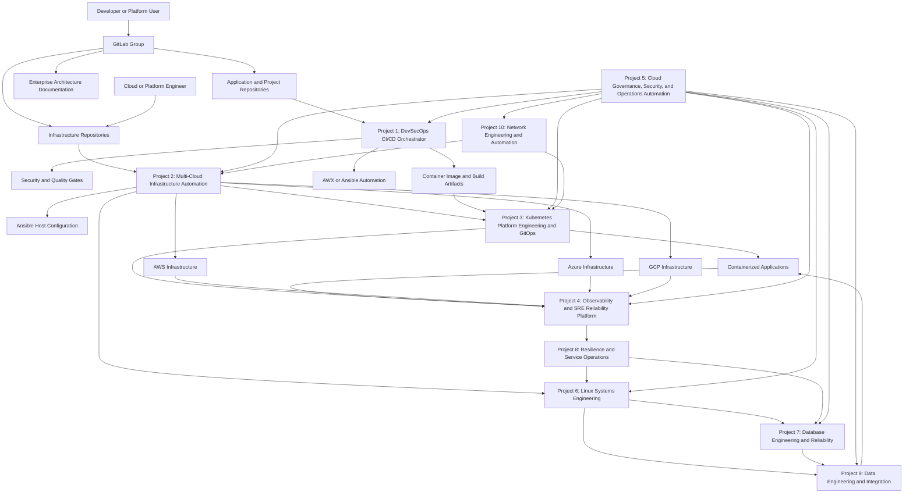

## Portfolio Status

| # | Repository | Status on 2026-07-27 |
| ---: | --- | --- |
| 1 | `devsecops-cicd-orchestrator` | Active implementation |
| 2 | `cloud-infra-automation-platform` | Active implementation |
| 3 | `kubernetes-platform-gitops` | Active implementation |
| 4 | `observability-sre-platform` | Active implementation |
| 5 | `cloud-governance-ops-automation` | Active implementation |
| 6 | `enterprise-linux-systems-platform` | Planned; repository not created |
| 7 | `enterprise-database-reliability-platform` | Planned; repository not created |
| 8 | `enterprise-resilience-service-operations` | Planned; repository not created |
| 9 | `enterprise-data-engineering-platform` | Planned; repository not created |
| 10 | `enterprise-network-engineering-platform` | Planned; repository not created |

Approval of a logical project does not authorize VM creation or product
installation. The current hypervisors are capacity constrained, so Projects
6–10 must first reuse existing automation and Kubernetes capacity or complete
a documented capacity expansion.

## GitLab Repository Model

All projects and documentation should live in GitLab so code, review, approvals, and evidence are tied together.

For the standard branch naming, merge request, protected branch, environment, and rollback model, see [Enterprise Branching Strategy](branching-strategy.md).

Recommended GitLab group:

```text
maas-enterprise-cloud-platform/
```

Recommended repositories:

| GitLab repository | Purpose |
| --- | --- |
| `enterprise-architecture-docs` | Architecture diagrams, use case mapping, implementation roadmap, engineer interview narratives |
| `devsecops-cicd-orchestrator` | Jenkins/GitLab CI pipeline, security gates, Docker build, AWX/Ansible deployment |
| `cloud-infra-automation-platform` | Terraform and Ansible automation for AWS, Azure, and GCP infrastructure |
| `kubernetes-platform-gitops` | AKS/EKS/GKE platform, Helm, Argo CD/Flux, ingress, policy, autoscaling |
| `observability-sre-platform` | Prometheus, Grafana, logs, traces, alerts, SLOs, incident dashboards |
| `cloud-governance-ops-automation` | IAM/RBAC, secrets, compliance, backup, DR, cost, certificate, remediation automation |
| `enterprise-linux-systems-platform` | Linux lifecycle, KVM, patching, configuration, storage, DNS and system services |
| `enterprise-database-reliability-platform` | Database lifecycle, performance, backup, recovery, security and upgrades |
| `enterprise-resilience-service-operations` | SLOs, incidents, capacity, performance, chaos, DR and service operations |
| `enterprise-data-engineering-platform` | Batch/stream ingestion, orchestration, transformation, quality, lineage and lakehouse patterns |
| `enterprise-network-engineering-platform` | IPAM, DNS/DHCP, routing, switching, firewalls, VPN, cloud and Kubernetes networking |
| `jenkins-jobs` | Jenkins Job DSL seed jobs and managed pipeline definitions |
| `jenkins-shared-library` | Reusable Jenkins pipeline steps, including AWX launch helper |

Recommended GitLab flow:

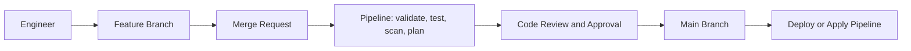

That makes GitLab the source of truth for code, infrastructure, documentation, merge requests, approvals, and CI/CD evidence.

## Delivery Standards

Each project should include these controls:

| Standard | Expected implementation |
| --- | --- |
| Repository ownership | Clear README, maintainers, protected branches, merge request approvals |
| Environment separation | `dev`, `qa`, `stage`, and `prod` folders or variables |
| CI/CD governance | Validate, test, scan, plan, approval, deploy stages |
| Security controls | Secrets scanning, dependency scanning, IaC scanning, image scanning |
| Change management | Merge requests, approval gates, deployment evidence, rollback notes |
| Operational readiness | Runbooks, troubleshooting guide, smoke tests, dashboards, alerts |
| Compliance evidence | Policy results, scan reports, tagging, IAM reviews, backup validation |
| Cost management | Required tags, resource sizing variables, scheduled cleanup where applicable |

## End-to-End Flow

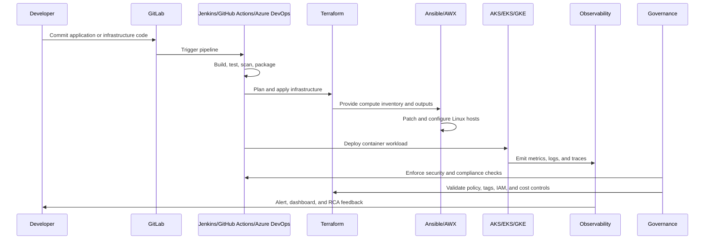

## Project 1: Enterprise DevSecOps Delivery Platform

**Purpose:** Automate application delivery from source code commit to secure deployment.

**Main tools:** GitLab, Jenkins, Docker, pytest, Trivy or similar scanners, AWX, Ansible.

**Architecture:**

```mermaid
flowchart LR
    repo[Application Repository] --> jenkins[Jenkins Pipeline]
    jenkins --> build[Build and Unit Tests]
    build --> quality[Code Quality Gate]
    quality --> security[Secrets, Dependency, and Image Scans]
    security --> image[Docker Image Build]
    image --> registry[Container Registry]
    registry --> awx[AWX Job Template]
    awx --> ansible[Ansible Deployment]
    ansible --> env[Target Environment]
```

**What this covers:**

| Use case | Coverage |
| --- | --- |
| End-to-End CI/CD Pipeline Setup | Implemented through Jenkins pipeline stages from checkout to deployment |
| Automated Build Pipeline | Build process runs in pipeline instead of local machines |
| Automated Unit Testing in CI | Tests run before package/deploy stages |
| Code Quality Gate Integration | Pipeline has a place for quality scans and gating |
| Artifact Management Automation | Build outputs and Docker images can be versioned and published |
| Docker Image Build and Registry Push | Pipeline builds container images and can push to registry |
| Environment-Based Release Promotion | Pipeline supports environment variables and promotion gates |
| Rollback Automation | Deployment stage can be extended with rollback/health check logic |
| Pipeline Template Standardization | Jenkins shared library and job DSL standardize pipelines |
| Secure CI/CD Pipeline Implementation | Security checks are embedded into delivery workflow |
| Secrets Detection in Source Code | Pipeline can run Gitleaks/TruffleHog-style checks |
| Container Image Vulnerability Scanning | Pipeline can scan images before deployment |
| Dependency Vulnerability Management | Dependency scanning fits before image build/deploy |
| Infrastructure as Code Security Scanning | Terraform scanning can be added before infrastructure apply |
| CI/CD Pipeline Reliability | Health checks and gated stages reduce failed deployments |

## Project 2: Enterprise Multi-Cloud Infrastructure Platform

**Purpose:** Provision cloud infrastructure consistently using Terraform and configure compute with Ansible.

**Main tools:** Terraform, Ansible, AWS, Azure, GCP, cloud CLIs, managed PostgreSQL, object storage, VM compute, container platforms.

**Architecture:**

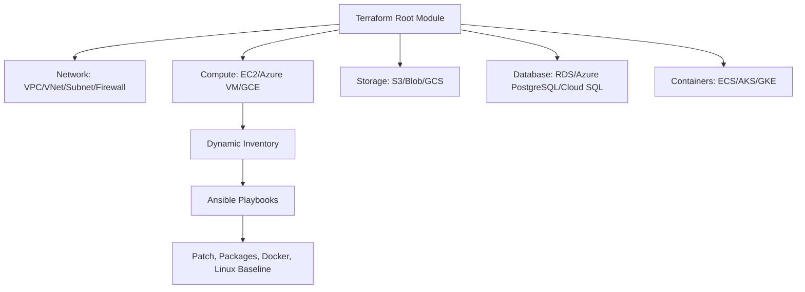

**What this covers:**

| Use case | Coverage |
| --- | --- |
| Automated Cloud Infrastructure Provisioning | Terraform provisions standard cloud infrastructure |
| Azure Infrastructure Provisioning Using Terraform | Azure stack covers resource group, VNet, VM, storage, database, container platform |
| AWS VPC Landing Zone Setup | AWS stack covers VPC, subnet, security group, storage, database, compute |
| Infrastructure Provisioning Using Terraform | Core project implementation |
| Server Configuration Automation Using Ansible | Ansible configures Linux hosts after provisioning |
| Linux Server Patch Automation | Ansible common role handles package baseline and can run patching |
| Infrastructure CI/CD Pipeline | Terraform plan/apply can be wired into Jenkins or GitHub Actions |
| Cloud Resource Tagging Automation | Terraform variables and common tags standardize ownership/cost metadata |
| Environment Creation and Decommissioning Automation | Terraform creates and destroys dev/QA/prod-style environments |
| Environment Standardization Across Dev/Test/Prod | Same modules and variables can drive multiple environments |
| Compute, Storage, Database, Network Automation | Covered across all cloud stacks |
| Automated Infrastructure Provisioning for SRE | Provides repeatable platform foundations for SRE workflows |

## Project 3: Enterprise Kubernetes Platform with GitOps

**Purpose:** Build a standardized container platform for application teams.

**Main tools:** Kubernetes, AKS/EKS/GKE, Helm, Argo CD or Flux CD, Kustomize, ingress controller, OPA Gatekeeper or Kyverno.

**Architecture:**

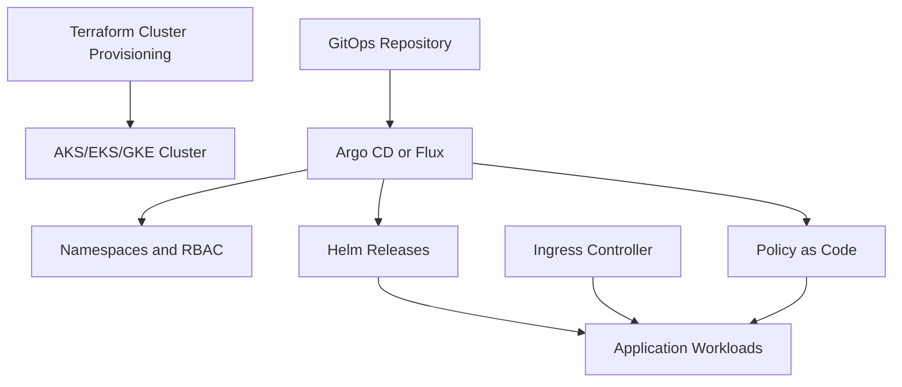

**What this covers:**

| Use case | Coverage |
| --- | --- |
| AKS/EKS/GKE Cluster Provisioning Automation | Terraform creates managed Kubernetes clusters |
| Automated Kubernetes Cluster Provisioning | Standard cluster builds across providers |
| Kubernetes Application Deployment | Helm/Kustomize deploy application workloads |
| Automated Deployment to Kubernetes | CI/CD or GitOps handles deployment |
| GitOps-Based Kubernetes Application Delivery | Argo CD or Flux syncs desired state from Git |
| Kubernetes Security Baseline Implementation | Policies enforce pod and namespace standards |
| Kubernetes Security Policy Enforcement | OPA Gatekeeper/Kyverno blocks unsafe workloads |
| Kubernetes Policy-as-Code Governance | Cluster rules are version-controlled |
| Ingress and Traffic Management Standardization | Common ingress, TLS, DNS, and routing pattern |
| Kubernetes Autoscaling and Cost Optimization | HPA, VPA, cluster autoscaler, and resource requests |
| Container Registry and Image Supply Chain Security | Trusted registries and image scanning controls |
| Kubernetes Backup and Disaster Recovery | Velero-style backup and restore pattern |
| Multi-Cluster Operations and Upgrade Management | Standard lifecycle process across clusters |

## Project 4: Enterprise Observability and SRE Reliability Platform

**Purpose:** Monitor applications, infrastructure, and Kubernetes platforms so incidents can be detected and resolved faster.

**Main tools:** Prometheus, Grafana, Loki, Tempo, OpenTelemetry, Alertmanager,
a three-node Elastic Stack, standalone Splunk Enterprise, and cloud monitoring
services.

**Architecture:**

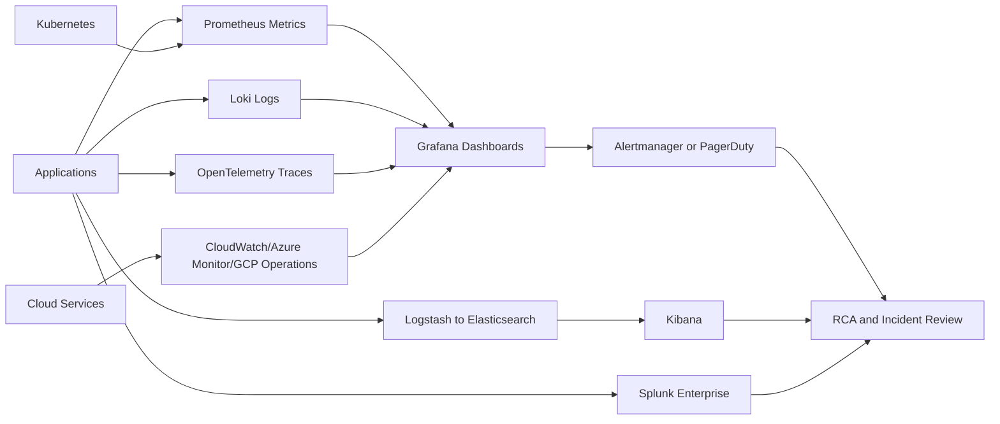

The three observability paths are intentional: the Grafana stack demonstrates
cloud-native open-source operations, Elastic demonstrates clustered log
search, and Splunk demonstrates a licensed enterprise platform. The Elastic
and Splunk VMs are provisioned-only until their AWX runbooks complete.

**What this covers:**

| Use case | Coverage |
| --- | --- |
| Kubernetes Cluster Health Monitoring | Dashboards for pods, nodes, namespaces, restarts, and capacity |
| Application Performance Monitoring | Latency, throughput, dependency, and error tracking |
| Centralized Log Management | Logs from pods, VMs, and services collected centrally |
| Distributed Tracing for Microservices | OpenTelemetry traces show request path and bottlenecks |
| Alerting and On-Call Notification | Alerts route to incident channels or PagerDuty-style tools |
| SLO and Error Budget Monitoring | Dashboards track availability, latency, and error budget |
| Production Incident Troubleshooting Dashboard | Single triage view for incidents |
| Deployment Monitoring and Release Validation | Health checks before and after deployment |
| API Error Rate Monitoring | Tracks 4xx, 5xx, timeout, and dependency failures |
| Database Performance Monitoring | Database health and query symptoms can be dashboarded |
| Infrastructure Capacity Monitoring | CPU, memory, disk, cluster, and VM utilization trends |
| Synthetic Monitoring | External checks validate user-facing availability |
| Cloud-Native Monitoring | Cloud-managed services included in dashboards |
| Root Cause Analysis Automation | Incident data collection supports RCA |
| Monitoring as Code | Dashboards and alerts stored as code |
| Multi-Cloud Observability | AWS, Azure, GCP, and Kubernetes visibility in one model |

## Project 5: Enterprise Cloud Governance and Operations Automation

**Purpose:** Enforce security, compliance, cost, backup, certificate, and operational controls across cloud and Kubernetes environments.

**Main tools:** Terraform, Ansible, Checkov/tfsec, cloud IAM, Azure Key Vault/AWS Secrets Manager/GCP Secret Manager, policy as code, backup services, cost tools, automation scripts.

**Architecture:**

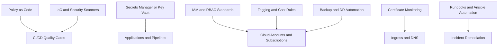

**What this covers:**

| Use case | Coverage |
| --- | --- |
| Secrets Management Automation | Centralize application and pipeline secrets |
| Secure Secrets Management for Applications | Runtime secret injection avoids hardcoded credentials |
| Cloud IAM and RBAC Standardization | Least-privilege roles and access patterns |
| Secrets Management with Key Vault | Azure-focused secrets implementation path |
| Compliance Automation and Audit Readiness | Automated checks produce evidence for audit |
| Automated Compliance Scanning | Checkov/tfsec/policy checks run in pipelines |
| Infrastructure Security Hardening | Enforces baseline cloud and Linux controls |
| Private Endpoint Implementation | Restricts service access to private networks |
| DNS and Certificate Management | Standardizes DNS and certificate lifecycle |
| Certificate Expiry Monitoring | Alerts before certificate expiration |
| Backup and Disaster Recovery Implementation | Backup policies and recovery workflow |
| Automated Backup and Recovery Validation | Restore validation verifies backup readiness |
| Disaster Recovery Automation | Recovery steps are scripted and repeatable |
| Disaster Recovery Validation | RTO/RPO validation becomes measurable |
| Cloud Cost Optimization | Finds idle, oversized, and unused resources |
| Cost Optimization Automation | Tagging, reporting, cleanup, and rightsizing workflows |
| Cloud Cost and Resource Optimization | FinOps controls across cloud and Kubernetes |
| Incident Remediation Automation | Automates repeated operational fixes |
| Toil Reduction Through Automation | Reduces manual restart, cleanup, log collection, and validation work |

## Project 6: Enterprise Linux Systems Engineering Platform

**Status:** Planned.

**Purpose:** Standardize the lifecycle and operation of enterprise Linux,
virtualization, storage, network services, and system software.

**Candidate tools:** Ubuntu, Rocky Linux, KVM/libvirt, cloud-init, Ansible,
AWX, systemd, SELinux, firewalld, BIND, NGINX, LVM and XFS.

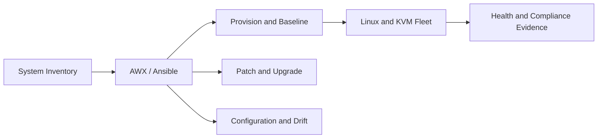

| Use case | Coverage target |
| --- | --- |
| Ubuntu and Rocky Linux Installation Standards | Reproducible supported operating-system builds |
| KVM and libvirt Virtualization | Managed hypervisor, network, storage-pool and domain lifecycle |
| VM Provisioning with cloud-init | Repeatable identity, network and SSH bootstrap |
| Server Build and Retirement | Approved creation, handoff, backup and decommission workflow |
| AWX and Ansible Configuration Management | Idempotent configuration through version-controlled roles |
| Operating-System Patching | Assessed, scheduled and evidenced security updates |
| Kernel and Major-Version Upgrades | Rehearsed upgrade and rollback workflow |
| SELinux and Firewall Management | Enforced host security controls |
| systemd Service Management | Standard service ownership, health and recovery |
| Filesystem, LVM and Storage Management | Capacity, mount, ownership and recovery standards |
| DNS, NTP and Host Networking | Consistent infrastructure service configuration |
| SSH, sudo and Service Accounts | Least-privilege administrative access |
| Package Repository Management | Approved and pinned software sources |
| Performance and Capacity Troubleshooting | CPU, memory, disk and network diagnosis |
| Configuration-Drift Detection | Desired-state comparison and remediation |
| Server Compliance Evidence | Auditable operating-system and service posture |
| Break-Glass Recovery | Console, boot, filesystem and access recovery |

## Project 7: Enterprise Database Engineering and Reliability Platform

**Status:** Planned. PostgreSQL installation remains gated behind AWX.

**Purpose:** Operate database platforms as reliable, secure, recoverable and
performance-managed enterprise services.

**Candidate tools:** PostgreSQL, PgBouncer, Ansible/AWX, pgBackRest, SQL
migration tools, Prometheus exporters, Grafana and Vault.

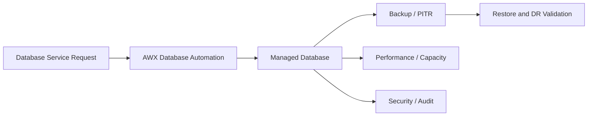

| Use case | Coverage target |
| --- | --- |
| PostgreSQL Installation Through AWX | Versioned and repeatable installation |
| Database and Role Provisioning | Approved service onboarding |
| Schema Migration Automation | Ordered, tested and reversible changes |
| Backup and Point-in-Time Recovery | Defined recovery points and retention |
| Automated Restore Validation | Evidence that backups are usable |
| Major-Version Upgrade Automation | Rehearsed upgrade using supported methods |
| Minor Patching | Controlled maintenance with health validation |
| Database Performance Monitoring | Availability, latency, throughput and saturation |
| Slow-Query Analysis | Query diagnosis and remediation evidence |
| Index and Statistics Maintenance | Controlled database optimization |
| Connection Pooling | PgBouncer lifecycle and capacity controls |
| TLS and Credential Rotation | Encrypted access and managed identities |
| Database Auditing | Privileged and sensitive activity evidence |
| Capacity Forecasting | Storage, connection and workload growth |
| Replication and Failover Exercises | Explicit cluster-only reliability testing |
| RPO and RTO Validation | Measured recovery objectives |
| Application Database Onboarding | Ownership, access, SLO and backup contract |
| Data Retention and Archival | Policy-driven lifecycle management |
| Database Incident Runbooks | Repeatable diagnosis, escalation and recovery |

## Project 8: Enterprise Resilience and Service Operations Platform

**Status:** Planned.

**Purpose:** Turn observability signals into reliable service operations,
incident response, performance engineering and tested recovery.

**Candidate tools:** Prometheus, Alertmanager, Grafana, Loki, Tempo,
OpenTelemetry, Elastic, Splunk, AWX, k6, JMeter, Litmus or Chaos Mesh.

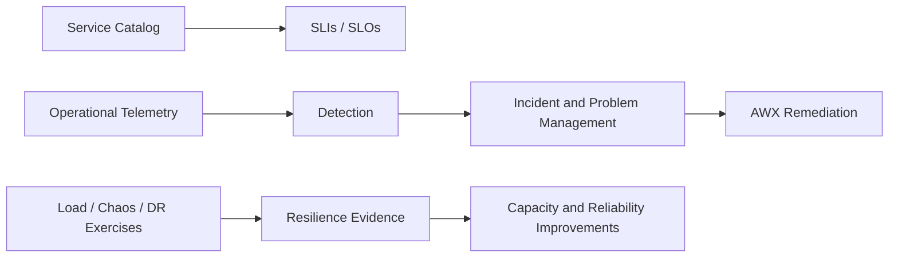

| Use case | Coverage target |
| --- | --- |
| SLI and SLO Governance | Standard service-level objectives |
| Error-Budget Management | Release and reliability decisions based on risk |
| Incident Detection and Classification | Consistent severity and ownership |
| On-Call and Escalation Workflows | Defined response routing |
| Automated Incident Evidence Collection | Logs, metrics, traces and changes captured |
| Post-Incident Review | Blameless corrective-action tracking |
| Problem Management | Recurring failure elimination |
| Service Ownership | Named technical and business accountability |
| Dependency Mapping | Runtime and service relationship visibility |
| Synthetic Monitoring | User-path availability testing |
| Capacity and Saturation Testing | Resource-limit discovery |
| Load and Performance Testing | Repeatable workload validation |
| Chaos and Failure Exercises | Controlled dependency and component failures |
| Backup and Recovery Orchestration | Coordinated service recovery |
| Disaster-Recovery Exercises | Full workflow rehearsal |
| RTO and RPO Measurement | Evidence-based recovery objectives |
| Certificate and Secret Expiry Response | Proactive and automated renewal response |
| AWX Automated Remediation | Guarded, auditable operational fixes |
| Maintenance-Window Management | Planned service-impact coordination |
| Operational Readiness Reviews | Production-readiness scorecards and gates |

## Project 9: Enterprise Data Engineering and Integration Platform

**Status:** Planned.

**Purpose:** Provide governed batch, streaming, transformation, quality,
lineage and data-serving capabilities for enterprise data products.

**Candidate tools:** Airflow, Kafka, Debezium, Apicurio or Schema Registry,
dbt, Spark or Flink, MinIO/S3, Iceberg, Trino, OpenMetadata or DataHub.

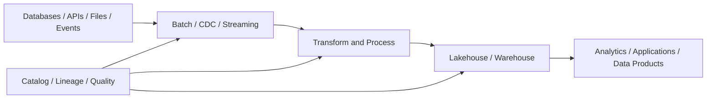

| Use case | Coverage target |
| --- | --- |
| Batch Data Ingestion | Scheduled and recoverable source ingestion |
| Streaming Data Ingestion | Durable event-driven data movement |
| Change-Data Capture | Database changes published without application coupling |
| ETL and ELT Pipelines | Standard extract, load and transform patterns |
| Workflow Orchestration | Dependency, retry and scheduling control |
| Data Quality Validation | Automated completeness, validity and freshness checks |
| Schema Registry and Evolution | Compatible event and dataset contracts |
| Event-Contract Management | Ownership and versioning of event interfaces |
| dbt Data Transformation | Tested SQL transformation and documentation |
| Distributed Data Processing | Scalable batch or stream computation |
| Data Lake and Lakehouse Storage | Governed object and table storage |
| Data Warehouse Integration | Controlled analytical serving |
| Metadata Catalog and Discovery | Searchable datasets and ownership |
| Data Lineage | Source-to-consumer traceability |
| Data Classification | Sensitivity and regulatory metadata |
| PII Controls | Restricted handling of personal data |
| Data Retention and Archival | Policy-driven dataset lifecycle |
| Pipeline Monitoring and Alerting | Freshness, failure and latency signals |
| Pipeline Retry and Backfill | Safe historical reprocessing |
| Dead-Letter Queues and Replay | Recoverable event-processing failures |
| Data Reconciliation | Source and target correctness validation |
| Dataset Ownership | Data-product accountability and support |
| Data Access Governance | Approved, auditable consumer access |
| Data-Pipeline Disaster Recovery | Restored orchestration, state and data |
| Data Performance and Cost Optimization | Efficient compute, storage and retention |

## Project 10: Enterprise Network Engineering and Automation Platform

**Status:** Planned.

**Purpose:** Establish network source of truth, automation, segmentation,
connectivity, observability and safe change across on-prem and cloud.

**Candidate tools:** NetBox or Nautobot, Ansible network collections, BIND,
Kea, FRRouting or VyOS, containerlab/EVE-NG, Cilium/Hubble, MetalLB, WireGuard,
Prometheus, Blackbox Exporter, SNMP Exporter, Elastic and Splunk.

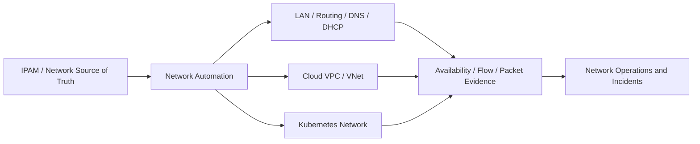

| Use case | Coverage target |
| --- | --- |
| Enterprise IP Address Management | Governed address and prefix allocation |
| VLAN and Subnet Design | Standard segmentation and routing domains |
| DHCP Reservation Management | Controlled address-to-MAC assignments |
| Authoritative and Recursive DNS | Managed internal name resolution |
| Forward and Reverse DNS Automation | Synchronized A/PTR lifecycle |
| Router and Switch Configuration Backup | Recoverable network state |
| Network Configuration Automation | Version-controlled Ansible changes |
| Network Configuration-Drift Detection | Desired versus running-state comparison |
| Layer 2 Bridge Management | Host and virtualization switching |
| Layer 3 Routing | Static and dynamic route control |
| Firewall Policy Management | Reviewed least-privilege traffic policy |
| NAT and Egress Management | Controlled outbound and translation paths |
| Load Balancer and Reverse Proxy Configuration | Standard application entry points |
| VPN and Remote Access | Managed encrypted administration connectivity |
| Cloud VPC and VNet Networking | Reusable cloud network foundations |
| Hybrid-Cloud Connectivity | Routed and secured environment integration |
| Kubernetes Networking | Cluster dataplane and service networking |
| CNI Policy and Troubleshooting | Cilium/Hubble policy and visibility |
| Ingress and Egress Controls | Governed workload traffic paths |
| MetalLB Address Management | Controlled service address pools |
| Network Segmentation | Environment and trust-zone isolation |
| Private Endpoint and Private DNS | Non-public managed-service access |
| Certificate and TLS Routing | Trusted encrypted service entry |
| Network Performance Monitoring | Latency, loss, throughput and saturation |
| Flow-Log Analysis | Traffic behavior and security investigation |
| Packet Capture and Troubleshooting | Evidence-based protocol diagnosis |
| Network Availability Testing | Synthetic and blackbox validation |
| Network Configuration Compliance | Auditable device and service standards |
| Network Incident Response | Repeatable diagnosis and restoration |
| Capacity and Bandwidth Planning | Forecasted network growth |
| Network Change Validation and Rollback | Pre/post checks and safe recovery |

## How the Ten Projects Cover the Role Families

| Role family | Best matching projects |
| --- | --- |
| DevOps Engineer | Projects 1, 2, 3, 6 |
| Site Reliability Engineer | Projects 3, 4, 7, 8 |
| Database Engineer | Projects 7, 8, 9 |
| Linux/System Engineer | Projects 2, 4, 6, 8 |
| Data Engineer | Projects 7, 9 |
| Network Engineer | Projects 2, 3, 6, 10 |
| DevSecOps Engineer | Projects 1, 3, 5 |
| Cloud Infrastructure Engineer | Projects 2, 6, 10 |
| Kubernetes Platform Engineer | Projects 3, 4, 10 |
| Platform Engineer | Projects 1, 2, 3, 4, 6 |
| Security/Governance Engineer | Projects 1, 5, 6, 7, 9, 10 |

## Portfolio Use-Case Count

| Project | Use cases |
| --- | ---: |
| 1. DevSecOps Delivery | 15 |
| 2. Multi-Cloud Infrastructure | 12 |
| 3. Kubernetes with GitOps | 13 |
| 4. Observability and SRE | 16 |
| 5. Governance and Operations | 19 |
| 6. Linux Systems Engineering | 17 |
| 7. Database Engineering and Reliability | 19 |
| 8. Resilience and Service Operations | 20 |
| 9. Data Engineering and Integration | 25 |
| 10. Network Engineering and Automation | 31 |
| **Total** | **187** |

## Portfolio Decision Record

| Date | Decision | Rationale | Operational effect |
| --- | --- | --- | --- |
| 2026-07-27 | Expand the architecture from five active projects to a ten-project enterprise portfolio | Give DevOps, SRE, database, systems, data and network engineers complete specialist capability domains rather than organizing the program around the MAAS workload | Projects 6–10 are approved target architecture only. No repository, VM, IP, product, capacity commitment or implementation-completion claim is created by this decision. |

## Recommended Implementation Order

1. Continue Projects 1–5 until the existing on-prem control plane is accepted.
2. Start Project 6 using the existing Linux, KVM, BIND and NGINX automation;
   avoid new VMs initially.
3. Start Project 7 only after AWX is operational and assume ownership of the
   paused PostgreSQL lifecycle.
4. Start Project 10 with source-of-truth/IPAM design before changing DHCP,
   routing or the physical network.
5. Start Project 8 by consuming existing observability signals and incident
   records.
6. Start Project 9 after database, network and Kubernetes foundations are
   stable; deploy processing workloads to Kubernetes where practical.

This order avoids treating products as projects, keeps MAAS as one optional
reference workload, and builds reusable enterprise capabilities for the six
target engineering role families.
