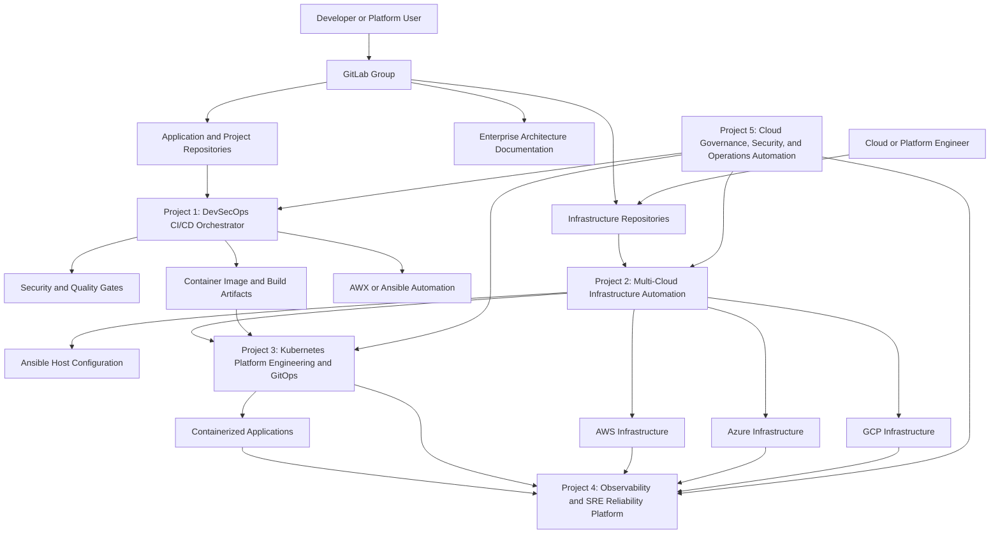
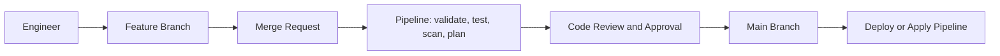
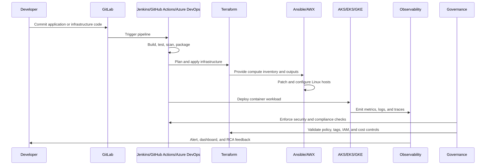
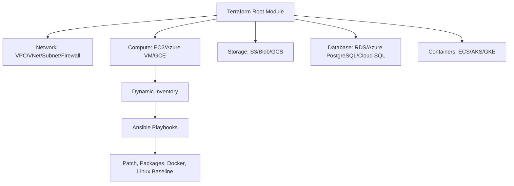
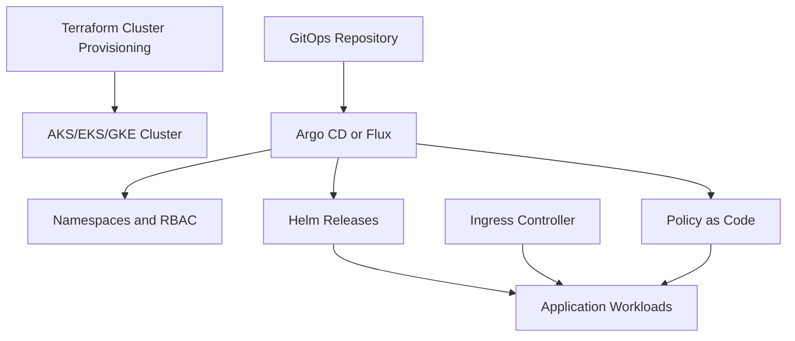
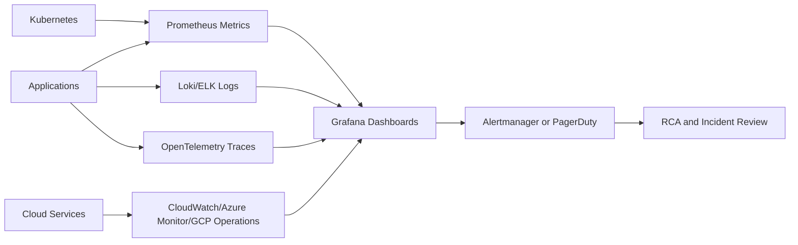
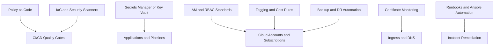

```mermaid
flowchart LR
    repo[Application Repository] --> jenkins[Jenkins Pipeline]
    jenkins --> build[Build and Unit Tests]
    build --> quality[Code Quality Gate]
    quality --> security[Secrets, Dependency, and Image Scans]
    security --> image[Docker Image Build]
    image --> registry[Container Registry]
    registry --> awx[AWX Job Template]
    awx --> ansible[Ansible Deployment]
    ansible --> env[Target Environment]
```

# Enterprise Project Architecture and Use Case Coverage

This document explains how the five enterprise reference implementation projects work together and which real-world use cases each project covers from the MAAS Marketing Roles Concepts document.

The goal is to replicate enterprise cloud, DevOps, DevSecOps, platform engineering, and SRE delivery patterns that engineers can explain in interviews as real client-style implementation work.

These projects are not positioned as classroom exercises. They are structured as enterprise engineering reference projects with GitLab repositories, CI/CD controls, environment separation, change approval, security checks, documentation, and operational runbooks.

## Enterprise Architecture



## GitLab Repository Model

All projects and documentation should be stored in GitLab so the implementation follows a real enterprise delivery model.

For the standard branch naming, merge request, protected branch, environment, and rollback model, see [Enterprise Branching Strategy](branching-strategy.md).

Recommended GitLab group:

```text
maas-enterprise-cloud-platform/
```

Recommended repositories:

| GitLab repository | Purpose |
| --- | --- |
| `enterprise-architecture-docs` | Architecture diagrams, use case mapping, implementation roadmap, engineer interview narratives |
| `devsecops-cicd-orchestrator` | Jenkins/GitLab CI pipeline, security gates, Docker build, AWX/Ansible deployment |
| `cloud-infra-automation-platform` | Terraform and Ansible automation for AWS, Azure, and GCP infrastructure |
| `kubernetes-platform-gitops` | AKS/EKS/GKE platform, Helm, Argo CD/Flux, ingress, policy, autoscaling |
| `observability-sre-platform` | Prometheus, Grafana, logs, traces, alerts, SLOs, incident dashboards |
| `cloud-governance-ops-automation` | IAM/RBAC, secrets, compliance, backup, DR, cost, certificate, remediation automation |
| `jenkins-jobs` | Jenkins Job DSL seed jobs and managed pipeline definitions |
| `jenkins-shared-library` | Reusable Jenkins pipeline steps, including AWX launch helper |

Recommended GitLab flow:



This makes GitLab the source of truth for code, infrastructure, documentation, merge requests, approvals, and CI/CD evidence.

## Enterprise Delivery Standards

Each project should include these enterprise controls:

| Standard | Expected implementation |
| --- | --- |
| Repository ownership | Clear README, maintainers, protected branches, merge request approvals |
| Environment separation | `dev`, `qa`, `stage`, and `prod` folders or variables |
| CI/CD governance | Validate, test, scan, plan, approval, deploy stages |
| Security controls | Secrets scanning, dependency scanning, IaC scanning, image scanning |
| Change management | Merge requests, approval gates, deployment evidence, rollback notes |
| Operational readiness | Runbooks, troubleshooting guide, smoke tests, dashboards, alerts |
| Compliance evidence | Policy results, scan reports, tagging, IAM reviews, backup validation |
| Cost management | Required tags, resource sizing variables, scheduled cleanup where applicable |

## End-to-End Flow



## Project 1: Enterprise DevSecOps Delivery Platform

**Purpose:** Automate application delivery from source code commit to secure deployment.

**Main tools:** GitLab, Jenkins, Docker, pytest, Trivy or similar scanners, AWX, Ansible.

**Architecture:**



**Use cases covered:**

| Use case | Coverage |
| --- | --- |
| End-to-End CI/CD Pipeline Setup | Implemented through Jenkins pipeline stages from checkout to deployment |
| Automated Build Pipeline | Build process runs in pipeline instead of local machines |
| Automated Unit Testing in CI | Tests run before package/deploy stages |
| Code Quality Gate Integration | Pipeline has a place for quality scans and gating |
| Artifact Management Automation | Build outputs and Docker images can be versioned and published |
| Docker Image Build and Registry Push | Pipeline builds container images and can push to registry |
| Environment-Based Release Promotion | Pipeline supports environment variables and promotion gates |
| Rollback Automation | Deployment stage can be extended with rollback/health check logic |
| Pipeline Template Standardization | Jenkins shared library and job DSL standardize pipelines |
| Secure CI/CD Pipeline Implementation | Security checks are embedded into delivery workflow |
| Secrets Detection in Source Code | Pipeline can run Gitleaks/TruffleHog-style checks |
| Container Image Vulnerability Scanning | Pipeline can scan images before deployment |
| Dependency Vulnerability Management | Dependency scanning fits before image build/deploy |
| Infrastructure as Code Security Scanning | Terraform scanning can be added before infrastructure apply |
| CI/CD Pipeline Reliability | Health checks and gated stages reduce failed deployments |

## Project 2: Enterprise Multi-Cloud Infrastructure Platform

**Purpose:** Provision cloud infrastructure consistently using Terraform and configure compute with Ansible.

**Main tools:** Terraform, Ansible, AWS, Azure, GCP, cloud CLIs, managed PostgreSQL, object storage, VM compute, container platforms.

**Architecture:**



**Use cases covered:**

| Use case | Coverage |
| --- | --- |
| Automated Cloud Infrastructure Provisioning | Terraform provisions standard cloud infrastructure |
| Azure Infrastructure Provisioning Using Terraform | Azure stack covers resource group, VNet, VM, storage, database, container platform |
| AWS VPC Landing Zone Setup | AWS stack covers VPC, subnet, security group, storage, database, compute |
| Infrastructure Provisioning Using Terraform | Core project implementation |
| Server Configuration Automation Using Ansible | Ansible configures Linux hosts after provisioning |
| Linux Server Patch Automation | Ansible common role handles package baseline and can run patching |
| Infrastructure CI/CD Pipeline | Terraform plan/apply can be wired into Jenkins or GitHub Actions |
| Cloud Resource Tagging Automation | Terraform variables and common tags standardize ownership/cost metadata |
| Environment Creation and Decommissioning Automation | Terraform creates and destroys dev/QA/prod-style environments |
| Environment Standardization Across Dev/Test/Prod | Same modules and variables can drive multiple environments |
| Compute, Storage, Database, Network Automation | Covered across all cloud stacks |
| Automated Infrastructure Provisioning for SRE | Provides repeatable platform foundations for SRE workflows |

## Project 3: Enterprise Kubernetes Platform with GitOps

**Purpose:** Build a standardized container platform for application teams.

**Main tools:** Kubernetes, AKS/EKS/GKE, Helm, Argo CD or Flux CD, Kustomize, ingress controller, OPA Gatekeeper or Kyverno.

**Architecture:**



**Use cases covered:**

| Use case | Coverage |
| --- | --- |
| AKS/EKS/GKE Cluster Provisioning Automation | Terraform creates managed Kubernetes clusters |
| Automated Kubernetes Cluster Provisioning | Standard cluster builds across providers |
| Kubernetes Application Deployment | Helm/Kustomize deploy application workloads |
| Automated Deployment to Kubernetes | CI/CD or GitOps handles deployment |
| GitOps-Based Kubernetes Application Delivery | Argo CD or Flux syncs desired state from Git |
| Kubernetes Security Baseline Implementation | Policies enforce pod and namespace standards |
| Kubernetes Security Policy Enforcement | OPA Gatekeeper/Kyverno blocks unsafe workloads |
| Kubernetes Policy-as-Code Governance | Cluster rules are version-controlled |
| Ingress and Traffic Management Standardization | Common ingress, TLS, DNS, and routing pattern |
| Kubernetes Autoscaling and Cost Optimization | HPA, VPA, cluster autoscaler, and resource requests |
| Container Registry and Image Supply Chain Security | Trusted registries and image scanning controls |
| Kubernetes Backup and Disaster Recovery | Velero-style backup and restore pattern |
| Multi-Cluster Operations and Upgrade Management | Standard lifecycle process across clusters |

## Project 4: Enterprise Observability and SRE Reliability Platform

**Purpose:** Monitor applications, infrastructure, and Kubernetes platforms so incidents can be detected and resolved faster.

**Main tools:** Prometheus, Grafana, Loki or ELK/OpenSearch, OpenTelemetry, Jaeger or Tempo, Alertmanager, cloud monitoring services.

**Architecture:**



**Use cases covered:**

| Use case | Coverage |
| --- | --- |
| Kubernetes Cluster Health Monitoring | Dashboards for pods, nodes, namespaces, restarts, and capacity |
| Application Performance Monitoring | Latency, throughput, dependency, and error tracking |
| Centralized Log Management | Logs from pods, VMs, and services collected centrally |
| Distributed Tracing for Microservices | OpenTelemetry traces show request path and bottlenecks |
| Alerting and On-Call Notification | Alerts route to incident channels or PagerDuty-style tools |
| SLO and Error Budget Monitoring | Dashboards track availability, latency, and error budget |
| Production Incident Troubleshooting Dashboard | Single triage view for incidents |
| Deployment Monitoring and Release Validation | Health checks before and after deployment |
| API Error Rate Monitoring | Tracks 4xx, 5xx, timeout, and dependency failures |
| Database Performance Monitoring | Database health and query symptoms can be dashboarded |
| Infrastructure Capacity Monitoring | CPU, memory, disk, cluster, and VM utilization trends |
| Synthetic Monitoring | External checks validate user-facing availability |
| Cloud-Native Monitoring | Cloud-managed services included in dashboards |
| Root Cause Analysis Automation | Incident data collection supports RCA |
| Monitoring as Code | Dashboards and alerts stored as code |
| Multi-Cloud Observability | AWS, Azure, GCP, and Kubernetes visibility in one model |

## Project 5: Enterprise Cloud Governance and Operations Automation

**Purpose:** Enforce security, compliance, cost, backup, certificate, and operational controls across cloud and Kubernetes environments.

**Main tools:** Terraform, Ansible, Checkov/tfsec, cloud IAM, Azure Key Vault/AWS Secrets Manager/GCP Secret Manager, policy as code, backup services, cost tools, automation scripts.

**Architecture:**



**Use cases covered:**

| Use case | Coverage |
| --- | --- |
| Secrets Management Automation | Centralize application and pipeline secrets |
| Secure Secrets Management for Applications | Runtime secret injection avoids hardcoded credentials |
| Cloud IAM and RBAC Standardization | Least-privilege roles and access patterns |
| Secrets Management with Key Vault | Azure-focused secrets implementation path |
| Compliance Automation and Audit Readiness | Automated checks produce evidence for audit |
| Automated Compliance Scanning | Checkov/tfsec/policy checks run in pipelines |
| Infrastructure Security Hardening | Enforces baseline cloud and Linux controls |
| Private Endpoint Implementation | Restricts service access to private networks |
| DNS and Certificate Management | Standardizes DNS and certificate lifecycle |
| Certificate Expiry Monitoring | Alerts before certificate expiration |
| Backup and Disaster Recovery Implementation | Backup policies and recovery workflow |
| Automated Backup and Recovery Validation | Restore validation verifies backup readiness |
| Disaster Recovery Automation | Recovery steps are scripted and repeatable |
| Disaster Recovery Validation | RTO/RPO validation becomes measurable |
| Cloud Cost Optimization | Finds idle, oversized, and unused resources |
| Cost Optimization Automation | Tagging, reporting, cleanup, and rightsizing workflows |
| Cloud Cost and Resource Optimization | FinOps controls across cloud and Kubernetes |
| Incident Remediation Automation | Automates repeated operational fixes |
| Toil Reduction Through Automation | Reduces manual restart, cleanup, log collection, and validation work |

## How the Five Projects Cover the Role Families

| Role family | Best matching projects |
| --- | --- |
| CI/CD Engineer | Project 1 |
| DevOps Engineer | Projects 1, 2, 3 |
| DevSecOps Engineer | Projects 1, 3, 5 |
| Cloud Automation Engineer | Projects 2, 5 |
| Cloud Infrastructure Engineer | Projects 2, 5 |
| Kubernetes Platform Engineer | Project 3 |
| Observability Engineer | Project 4 |
| Site Reliability Engineer | Projects 3, 4, 5 |
| Platform Engineer | Projects 2, 3, 4, 5 |

## Recommended Implementation Order

1. Build Project 2 first to create cloud infrastructure foundations.
2. Build Project 1 next to automate build, test, scan, and deployment workflows.
3. Build Project 3 to deploy workloads into Kubernetes with GitOps.
4. Build Project 4 to observe, alert, troubleshoot, and validate reliability.
5. Build Project 5 to add governance, compliance, secrets, backup, cost, and remediation controls.

This order tells a strong interview story: first provision the platform, then deliver applications, then standardize Kubernetes, then monitor reliability, then mature the platform with security and governance.
