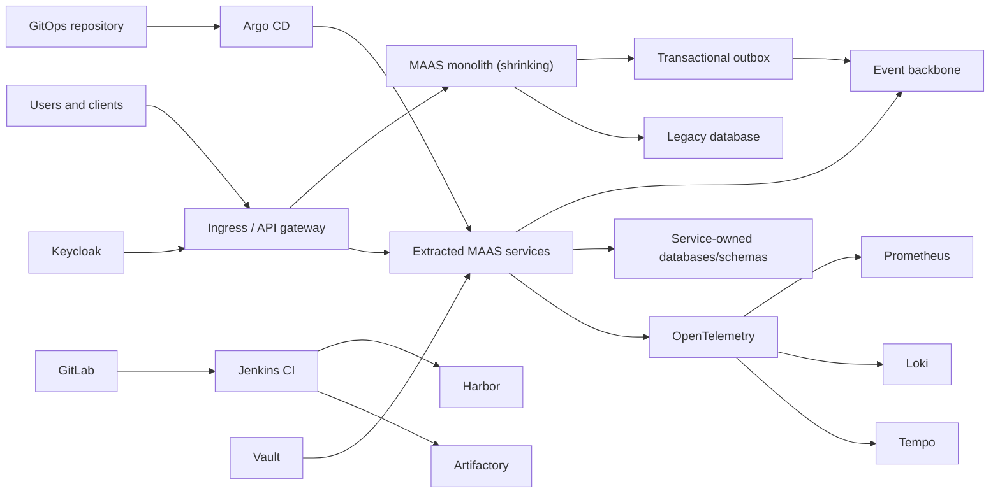

# MAAS Monolith-to-Microservices Modernization

## Goal

Move the current MAAS monolithic application deployed in AWS toward
independently deployable microservices without a big-bang rewrite.

The first implementation target is the on-premises KVM/Kubernetes lab. AWS
EKS/ECR validation is deferred until the on-prem migration path is stable.

## Migration Principles

1. Use the strangler pattern; do not rewrite the complete application at once.
2. Make the monolith modular before extracting services.
3. Extract by business capability, not by technical layer.
4. Give each extracted service one owning team and one explicit data owner.
5. Prefer asynchronous events where immediate consistency is unnecessary.
6. Preserve synchronous APIs where the user request requires an immediate
   answer.
7. Never let services write directly into another service's database.
8. Make every extraction reversible through routing and feature flags.
9. Add observability before redirecting production traffic.
10. Measure migration success with delivery, reliability, and business metrics.

## Current-State Discovery

Before deciding service boundaries, capture:

- source modules and dependency graph
- public and internal endpoints
- database tables, ownership, joins, procedures, and migration tooling
- scheduled and background jobs
- AWS compute, database, object storage, cache, messaging, DNS, certificates,
  IAM, secrets, and monitoring
- inbound and outbound integrations
- authentication and authorization behavior
- peak traffic, latency, errors, and resource consumption
- release frequency, lead time, failure rate, and recovery time

The exact current AWS hosting model must be verified. The migration documents
must not assume EC2, ECS, EKS, Lambda, or a specific database until the
inventory confirms it.

## Provisional Domain Boundaries

These are discovery candidates, not final service names:

| Candidate capability | Reason to consider extraction | Suggested order |
| --- | --- | --- |
| Notifications | Asynchronous, replaceable, low transactional coupling | Early |
| Document/media processing | Clear workload and scaling boundary | Early |
| Reporting and exports | Read-heavy, asynchronous, operationally separable | Early |
| Search/indexing | Derived data and independent scaling | Early |
| Interview/content catalog | Clear content ownership if dependencies permit | Middle |
| Assessment/workflow | Business process requiring contract analysis | Middle |
| User profile and organization | Sensitive data and broad dependencies | Late |
| Authentication | Prefer Keycloak integration over custom extraction | Platform |
| Matching/recommendation core | High business value and likely high coupling | Late |
| Billing/subscription | Strong consistency and compliance requirements | Late |

Run event storming and dependency analysis before approving these boundaries.

## Target Architecture

## Migration Waves

### Wave 0: Baseline the Monolith

- reproduce the current build
- add unit, integration, contract, and smoke tests
- containerize the application
- externalize configuration and secrets
- add health probes and graceful shutdown
- instrument logs, metrics, and traces
- establish a repeatable database migration
- deploy the unchanged monolith through the new pipeline

Exit criterion: the same monolith can be built, deployed, observed, and rolled
back consistently.

### Wave 1: Create Seams

- identify bounded contexts
- remove cross-module cycles
- introduce internal interfaces
- create an API compatibility policy
- add a transactional outbox
- introduce feature flags
- place ingress/API routing in front of the monolith
- separate database schemas and access accounts

Exit criterion: selected capabilities can be routed outside the monolith
without changing clients.

### Wave 2: Extract Low-Risk Services

Start with notifications, document processing, reporting, or search after
discovery confirms the boundary.

For each service:

1. define API and event contracts
2. create its repository or clearly owned source directory
3. create its pipeline, image, deployment, SLO, dashboard, and runbook
4. backfill or project required data
5. shadow traffic and compare results
6. enable a small traffic percentage
7. increase traffic while monitoring
8. retain a routing rollback to the monolith

### Wave 3: Extract Business Workflows

- introduce saga/process-manager patterns for multi-service workflows
- replace shared transactions with explicit state transitions
- use idempotency keys and retry policies
- implement dead-letter handling and replay
- migrate data ownership one bounded context at a time

Exit criterion: the extracted workflow can deploy and recover independently.

### Wave 4: Shrink and Retire the Monolith

- stop writes to migrated tables
- remove dead code and unused integrations
- archive or migrate remaining data
- maintain compatibility redirects for an approved period
- execute final recovery and rollback tests
- decommission the monolith only after traffic and dependency evidence reaches
  zero

## Data Migration Patterns

| Situation | Pattern |
| --- | --- |
| New service needs legacy data read-only | API or change-data-capture projection |
| Both systems need writes temporarily | Single writer plus events; avoid dual writes |
| Immediate cutover is possible | Maintenance window and verified bulk migration |
| Long-running coexistence | Outbox/CDC, reconciliation, and ownership ledger |
| Cross-service business transaction | Saga with compensating actions |
| Reporting across services | Event-fed analytical/read model |

Do not create a distributed monolith by retaining a single writable database
shared by every service.

## Repository and Pipeline Standard

Every MAAS service must provide:

- README and architecture decision records
- API specification and event schemas
- unit, integration, contract, and migration tests
- Dockerfile running as non-root
- SBOM, dependency scan, secret scan, and image scan
- immutable Harbor image reference
- Kubernetes base and environment overlays
- Argo CD Application or ApplicationSet
- resource requests/limits, probes, disruption and network policies
- dashboard, alerts, SLO, and runbook
- rollback and data-recovery procedure

## On-Premises Validation

Use OpenTelemetry as the application instrumentation contract.
Prometheus/Grafana/Loki/Tempo are the default cloud-native SRE path; Elastic
Stack and standalone Splunk provide comparative enterprise log ingestion and
search. Applications must not embed a vendor-specific logging SDK when the
same signal can be emitted through structured logs or OpenTelemetry. The
Elastic/Splunk products remain pending until their AWX workflows pass
acceptance.

The on-prem lab must demonstrate:

- monolith and extracted service running simultaneously
- ingress routing between old and new implementations
- feature-flag rollback
- event delivery, retry, idempotency, and dead-letter handling
- database backfill and reconciliation
- per-service deployment and scaling
- trace continuity across monolith and services
- policy rejection of unsafe workloads
- backup and restore of service-owned data

## Later AWS Validation

After on-prem acceptance:

- provision EKS/ECR through AWX and Terraform/OpenTofu
- push the same immutable service images to ECR
- apply the same GitOps model to EKS
- map local storage, ingress, identity, secrets, and observability to approved
  AWS services
- run performance, resilience, security, cost, and teardown tests

The application contracts remain portable; cloud-specific behavior stays in
infrastructure and environment configuration.

## Success Measures

| Measure | Desired direction |
| --- | --- |
| Deployment frequency | Increase |
| Lead time for one capability | Decrease |
| Change failure rate | Decrease |
| Mean time to restore | Decrease |
| Full-application releases | Decrease |
| Independent service releases | Increase |
| Cross-domain database writes | Reach zero |
| Trace coverage | Increase |
| SLO compliance | Meet defined objectives |
| Infrastructure and cloud cost per transaction | Measured and controlled |
