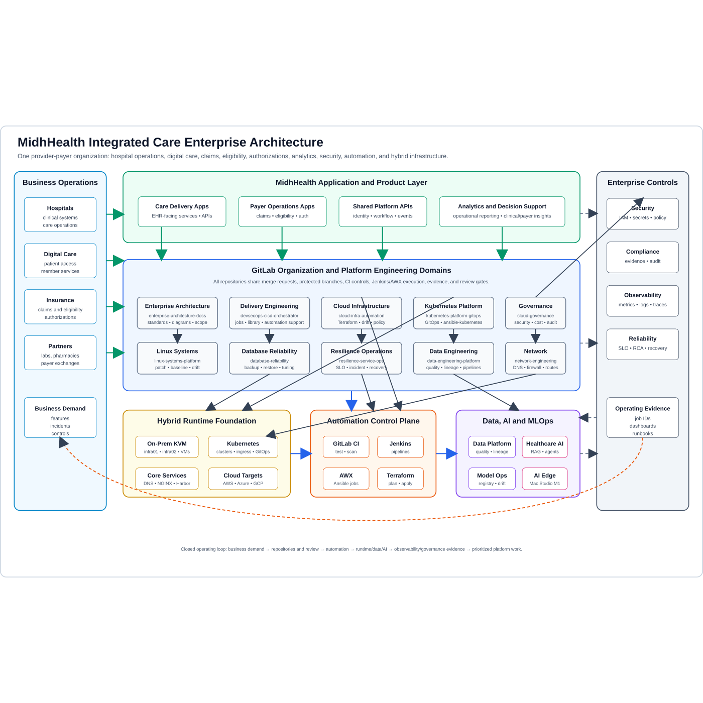

# MidhHealth Platform Briefing for New Engineers

Last verified: 2026-08-13

## Start with the reason it exists

MidhHealth Integrated Care represents one organization spanning care delivery
and health-insurance operations. Its engineering platform is meant to give
separately owned applications a common, dependable way to be built, deployed,
secured, observed and recovered.

The platform is not twelve unrelated technology demonstrations. It is one
operating system for engineering work, divided into twelve ownership domains so
the boundaries remain clear. An application team owns its software and
business outcome. Platform teams provide reusable contracts for source,
infrastructure, runtime, data, security and operations. Git history, pipeline
results and runtime evidence connect the work.

## The short explanation

### In one sentence

> MidhHealth is a hybrid enterprise platform where application and platform
> projects remain independently owned, while GitLab, Jenkins, AWX, Kubernetes,
> observability and governance connect every reviewed change to a secure
> runtime outcome and a recoverable operating record.

### In about 30 seconds

> We designed MidhHealth around one question: how can different healthcare
> applications move safely from source code to an operated service without
> every team rebuilding the delivery and control path? GitLab is the reviewed
> source of truth, Jenkins coordinates builds and releases, AWX and Ansible own
> host configuration, Kubernetes is the shared container runtime, and the
> observability and governance layers decide whether a change is healthy and
> compliant. Twelve platform domains own different pieces, but they exchange
> versioned contracts and evidence. The active lab is on premises; AWS, Azure
> and GCP remain governed extension designs until they are approved and proven.

### In about two minutes

> I describe it as a provider-payer engineering platform, not as a collection
> of tools. A change begins in an independently owned GitLab repository. Fast
> source checks run before merge. Jenkins then selects a dedicated execution
> path for the longer build, security, packaging, promotion and verification
> work. If a host must change, Jenkins invokes an approved AWX job and Ansible
> converges that host. If a Kubernetes component or application is released,
> Helm currently owns the reviewed release until a specific resource set is
> handed to Argo CD; we avoid two reconcilers managing the same object.
>
> Under that delivery path, infrastructure, Linux, network, database and
> Kubernetes teams provide the runtime contracts. Above it, observability joins
> metrics, logs, traces, synthetic checks and release identity, while resilience
> owns incident and recovery decisions. Governance supplies identity, secret,
> policy, cost and evidence boundaries. Data engineering, healthcare AI and
> MLOps add governed information and model lifecycles without bypassing those
> controls.
>
> The practical discipline is as important as the architecture: documentation
> is not implementation, a running VM is not an installed product, and a green
> pipeline is not runtime acceptance. We preserve the exact revision, executor,
> target, health result and rollback evidence before calling a capability done.

## Follow one change through the platform

A new employee can understand most of the design by following a single
application release:

1. **Register the application.** Name its repository, owner, business purpose,
   consumers, data class and target platform. The application stays a separate
   project from the platform repositories.
2. **Review the source.** GitLab protects the branch and runs quick tests,
   schema checks, policy checks and secret detection against an immutable
   revision.
3. **Build once.** Jenkins uses a dedicated agent and versioned shared-library
   logic to test and package the selected revision. Promotion reuses the same
   artifact; environments do not rebuild different bits.
4. **Prepare the target.** Terraform represents infrastructure when an approved
   target exists. AWX and Ansible own the operating-system configuration.
   Neither silently takes ownership of application or Kubernetes state.
5. **Release to the runtime.** The Kubernetes contract supplies namespace,
   identity, image, resource, network, storage, health and rollback decisions.
6. **Judge operation.** Prometheus, logs, traces and synthetic checks carry the
   service and release identity. A health gate can stop promotion, but a human
   retains authority where evidence is ambiguous or service risk is material.
7. **Recover and learn.** The service record connects the owner, dependencies,
   SLO, previous release, runbook, backup and incident evidence. Recovery is
   verified from the user and data paths—not from a successful command alone.

That path forms a closed loop: operating evidence and incidents become the
next reviewed platform or application change.

## The twelve domains in plain language

| Domain | What it owns | What it hands to the next team |
| --- | --- | --- |
| [DevSecOps delivery](projects/devsecops-delivery.md) | The reviewed path from commit through build, security, artifact, approval, release and rollback | An immutable release identity and evidence manifest |
| [Multi-cloud infrastructure](projects/multi-cloud-infrastructure.md) | Terraform modules, environment roots, plan/state integrity, drift, placement, capacity and cost decisions | A named target, plan/state lineage and resource-to-service map |
| [Kubernetes platform](projects/kubernetes-platform.md) | Cluster components and the namespace, identity, image, resource, network, storage and rollout contract | Accepted desired state, runtime identity, route, health and rollback evidence |
| [Observability and SRE](projects/observability-sre.md) | Metrics, logs, traces, synthetic checks, dashboards, SLO rules and actionable alerting | Release-aware health and incident evidence |
| [Governance and operations](projects/governance-operations.md) | Identity, secrets, policy, compliance evidence, exceptions, cost decisions and bounded remediation | A control decision with scope, owner and expiry |
| [Linux systems](projects/linux-systems.md) | VM/host lifecycle, operating-system baseline, services, patching, access and recovery | A converged, observable host with job and recovery evidence |
| [Database reliability](projects/database-reliability.md) | Database identity, schema-change safety, performance, backup, restore and recovery objectives | A recoverable data-service contract |
| [Resilience operations](projects/resilience-service-operations.md) | Service ownership, readiness, incident command, recovery exercises and learning | A service decision grounded in user, dependency and data outcomes |
| [Data engineering](projects/data-engineering.md) | Ingestion, schema, quality, lineage, reconciliation, privacy, replay and data-product ownership | A versioned dataset or event contract with quality evidence |
| [Network engineering](projects/network-engineering.md) | DNS, addressing, routing, firewall, proxy, Kubernetes and hybrid connectivity paths | A tested producer-to-consumer path and reversal record |
| [Healthcare AI](projects/healthcare-ai.md) | Governed retrieval, assistants, tools, evaluation, safety and human-review boundaries | A cited, evaluated AI workflow whose limitations remain visible |
| [MLOps](projects/mlops-model-platform.md) | Reproducible data/feature/training/model identities, promotion, serving, drift and rollback | An approved model artifact and lifecycle evidence |

No domain is complete by itself. For example, Kubernetes can run a pod but
cannot decide whether its database migration is safe. Jenkins can deploy a
release but cannot define the application's SLO. Observability can detect a
symptom but does not own the service recovery decision. The handoffs prevent a
tool from quietly becoming an owner.

## What is real today and what is still a design

### Active and evidenced foundations

- KVM/libvirt hosts and the documented Rocky Linux VM fleet.
- GitLab CE, Jenkins with a dedicated agent, AWX and the accepted AWX execution
  boundary.
- BIND DNS, NGINX paths and the four-node kubeadm cluster.
- Private ingress-nginx and worker-only Longhorn storage on the current
  Kubernetes cluster.
- Prometheus, Alertmanager, Grafana, Loki, Tempo, OpenTelemetry, MinIO and the
  Elastic Stack, with bounded metrics, fleet logging and trace/log evidence.
- PostgreSQL 18 and Vault on their documented accepted paths.

### Planned or conditional capabilities

- Harbor, Artifactory, SonarQube, Keycloak and Splunk product operation.
- Argo CD beyond its separately controlled bootstrap and ownership handoff.
- Elastic Jenkins cloud agents, managed Kubernetes and live AWS/Azure/GCP
  execution.
- A deployed data-platform product stack, model registry, feature store or AI
  serving platform.
- Production healthcare applications and protected-data AI workflows.

This distinction is part of the platform design. In an interview, say “the
architecture defines” or “the repository can validate” for planned work. Say
“the lab accepted” only when the documentation contains runtime and recovery
evidence.

## How to explain your contribution honestly

Use the level of evidence you actually have:

| Evidence level | Defensible language |
| --- | --- |
| Architecture only | “I designed the contract and the failure boundaries.” |
| Implemented in source | “I implemented and tested it in the repository with fixtures.” |
| Runtime verified | “I ran it against the bounded lab target and captured the result.” |
| Accepted | “We exercised success, failure, recovery and repeat convergence, then recorded acceptance.” |

Do not turn a lab exercise into a fictional production incident. You can still
give a strong answer: explain the realistic trigger, the architecture you
chose, the failure you injected, the signals you followed, the recovery you
proved, and what would change for a production environment.

## A useful interview answer shape

For a platform or use-case question, answer in this order:

1. **Outcome:** What user, service or operator result are we protecting?
2. **Boundary:** What does this domain own, and which teams own the handoffs?
3. **Design:** What are the main components and why are they separated?
4. **Control:** How do identity, review, secrets, policy and approvals work?
5. **Failure:** What breaks, how is blast radius limited, and who can stop it?
6. **Evidence:** Which revision, job, metric, test and recovery result prove it?
7. **Trade-off:** What simpler or faster alternative was rejected, and why?
8. **Current truth:** Is this designed, source-implemented, runtime-verified or
   accepted in the lab?

This sounds more natural than reciting a tool list because it follows the way
engineers make and defend decisions.

## Example: explaining a Kubernetes application release

> The goal is not merely to apply YAML; it is to release one reviewed artifact
> through a path we can observe and reverse. GitLab owns source review, Jenkins
> selects the immutable revision and invokes the release workflow, and Helm is
> the current release owner for that component. AWX configures only host
> prerequisites. The Kubernetes team supplies the namespace, service account,
> image, resources, route, storage and probes. We verify the external DNS and
> ingress path, rollout, telemetry and negative port exposure, then exercise a
> rollback to the previous digest. The main trade-off is that this creates more
> evidence than a direct `kubectl apply`, but it prevents hidden state and makes
> recovery attributable. In the current lab, the cluster, ingress and Longhorn
> foundations are accepted; an application release remains documentation until
> its own runtime evidence is completed.

## Where to go next

- Start with the [platform domain index](projects/README.md), then read the page
  for the domain you will own.
- Use the [enterprise portfolio](enterprise-project-portfolio-and-usecases.md)
  to see why that domain exists and which use cases it owns.
- Use the [use-case interview question bank](use-case-interview-question-bank.md)
  to practice architecture, implementation, troubleshooting and evidence
  conversations.
- Verify claims in [Current Environment State](current-environment-state.md)
  and [Use-Case Implementation Status](use-case-implementation-status.md).
- Before implementing anything, read the selected detailed use-case page and
  its dependency handoffs, planned source locations, stories and acceptance
  decision.
