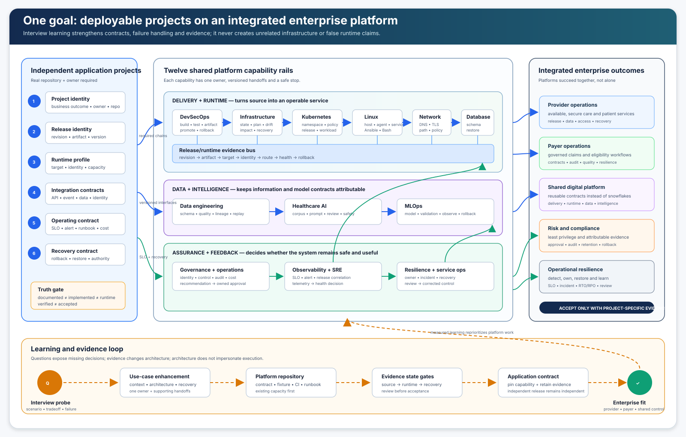

# Platform and Use-Case Learning Enhancement Plan

Last verified: 2026-08-13

## Goal that governs every decision

Make independently owned application projects deployable through the MidhHealth
platforms, and make the platforms operate as one enterprise architecture for
provider, payer and shared-service outcomes.

Interview learning is an input to that goal, not a new portfolio. A new
question, exercise or technology detail is accepted only when it strengthens
one of these outcomes:

1. an application can satisfy a clearer platform onboarding contract;
2. a platform can deliver, run, secure, observe or recover that application
   more predictably;
3. a cross-platform handoff becomes versioned, testable and attributable; or
4. enterprise evidence becomes more truthful and useful for release or
   operating decisions.

This plan does not deploy an application, authorize implementation, create
infrastructure, add a product, or turn an interview scenario into a claim of
production experience.

## Non-negotiable scope rules

- Keep application projects, platform implementation projects and runtime
  products as separate inventories.
- Do not invent provider or payer applications. Register a project only after
  its real repository, owner and business outcome are known.
- Reuse the current GitLab, runners, Jenkins, AWX, Kubernetes cluster,
  observability services, PostgreSQL, DNS, NGINX and VM fleet for every first
  slice.
- Treat AWS, Azure, GCP, managed Kubernetes, elastic cloud agents and other
  unavailable targets as designs or fixture exercises until separately
  approved and evidenced.
- Preserve one primary owner for every use case. Supporting platforms exchange
  artifacts; they do not dilute accountability.
- A documented design is not implemented, an implemented repository is not
  runtime verified, and runtime verification is not acceptance.
- Never add a learning exercise that cannot name the application or platform
  decision it improves.

## The operating model

Every deployable application project moves through the same six questions,
while the exact use-case chains vary by project:

| Question | Owning platform contribution | Required application evidence |
| --- | --- | --- |
| What is being released? | DevSecOps binds source, tests, artifact and promotion. | Repository, immutable revision, artifact digest and release owner. |
| Where and under which identity does it run? | Infrastructure, Kubernetes, Linux, network, database and governance define the approved target and trust boundary. | Runtime profile, service identity, secret references, network/data contracts and capacity envelope. |
| How do other projects interact with it? | Network, data, database, AI and MLOps publish versioned interfaces. | Producer, consumer, schema/API version, compatibility and failure behavior. |
| How do we know it is healthy? | Observability and application-owned SLOs join telemetry to release identity. | Metrics, logs, traces, synthetic check, dashboard, alert route and SLO intent. |
| How do we stop or recover it safely? | DevSecOps, database and resilience provide rollback, restore and incident authority. | Previous release, rollback/restore procedure, recovery owner and verification. |
| How does it support MidhHealth? | Enterprise traceability connects the service to provider, payer, compliance or shared-platform outcomes. | Business capability, accountable owner and measurable acceptance result. |

An application is deployable on paper only when all six have answers. It is
deployable in practice only after the relevant platform contracts are
implemented and accepted against the intended target.

## Interview learning translated into platform work

| Interview learning | Architecture enhancement | Use-case effect | Application-deployability result |
| --- | --- | --- | --- |
| Terraform modules, remote state, logging and drift | Separate reusable modules from environment roots; define backend identity, locking, lineage, recovery and read-only drift evidence. | Deepen `UC-INFRA-001`, `UC-INFRA-009` and `UC-CICD-014`; connect impact analysis before remediation. | An application environment cannot plan or apply against another project or environment’s state. |
| Choosing pipeline tools and Jenkins job structures | Record why GitLab CI, Jenkins, AWX, Helm and a future GitOps reconciler own different decisions; define multibranch, declarative, shared-library, Job DSL and legacy exception boundaries. | Deepen `UC-CICD-001`, `002`, `009` and related delivery gates. | An application receives one understandable release path without overlapping reconcilers or hidden host mutation. |
| Fast releases without breaking production | Order cheap source gates before immutable promotion; bind approval, deployment health, rollback and evidence to one revision. | Strengthen the delivery spine and continuous verification. | Release speed is measured with safety and recovery, not by bypassing gates. |
| Autoscaling Jenkins agents and concurrent builds | Define workload classes, labels, concurrency ceilings, ephemeral cleanup, credential scope and degraded behavior; retain the verified static-agent baseline. | Deepen `UC-CICD-002`, `009`, `015`; connect Kubernetes capacity, Linux agent configuration and observability. | Application builds can queue and scale predictably without running work on the controller or leaking state between projects. |
| C/C++ build experience | Add a native-build profile with pinned compiler/CMake, CTest, sanitizers, dependency cache, binary provenance, SBOM and reproducibility evidence. | Strengthen `UC-CICD-002`, `003`, `005` and artifact policy. | A native application project can use the delivery platform without being forced into a container-only example. |
| Boto3 multi-account S3 audit | Specify Organizations pagination, bounded STS role assumption, read-only control calls, partial-access reporting and fixture-first tests. | Deepen `UC-GOV-004`, `006`; connect infrastructure ownership and evidence retention. | Cloud-connected projects have an auditable storage-control contract without granting application pipelines broad cloud access. |
| Real cost-overrun remediation | Join baseline, anomaly, ownership, change, options, approval, bounded mitigation, service validation and realized savings; label Kubernetes showback separately from provider billing. | Deepen `UC-GOV-013`, `016`, `017`, `UC-K8S-010`, `013`, `UC-DATA-025` and service ownership. | Project cost signals become actionable without allowing cost automation to interrupt critical services. |
| Production incident experience | Practice incident declaration, roles, dependency diagnosis, change correlation, evidence capture, mitigation, recovery and learning in bounded lab scenarios. | Deepen `UC-OBS-007`, `014` and `UC-RSO-004` through `009`, `014`, `019`. | Every deployed project inherits a usable incident and recovery contract rather than a generic runbook. |
| Ansible and Bash depth | Make inventory limits, check/idempotence evidence, shell safety, structured results and rollback visible in the use cases that invoke AWX or scripts. | Strengthen Linux, network, database, observability and governance automation pages. | Application dependencies can be changed through bounded platform workflows instead of manual server access. |
| AWS, GCP and database questions | Document provider-neutral contracts first, then provider-specific differences only where verified; bind database identity, migration, performance and recovery to the application release. | Strengthen cloud provisioning, database onboarding and cross-cloud decision records. | Applications keep stable platform contracts while targets vary, without pretending untested clouds are equivalent. |
| Greenfield design and multi-project work | Use one application deployment record, dependency contract and evidence manifest per project; prioritize by enterprise workflow and blocked handoff. | Strengthen project registration, service ownership and portfolio sequencing. | Separate repositories remain independently releasable while contributing to one provider-payer workflow. |
| Secure Azure healthcare design | Start with data, identity, network, key, policy, telemetry and recovery requirements; keep AKS/VM/managed-service selection behind a workload decision. | Deepen `UC-INFRA-002` and its governance, network, database, observability and resilience handoffs. | A future Azure application receives the same enterprise contract as on-prem applications without implying that Azure is currently deployed. |
| Kubernetes clusters at scale | Standardize fleet inventory, lifecycle, tenancy, policy, release ownership, upgrade rings, capacity, cost and recovery while preserving one accepted current cluster. | Deepen `UC-K8S-002`, `004`, `005`, `006`, `009`, `010`, `012`, `013`. | Application teams consume a stable workload contract instead of learning cluster-specific exceptions. |
| Kubernetes production troubleshooting | Diagnose from user path through DNS/TLS, ingress, service/endpoints, pods, nodes, storage and dependencies; correlate recent change and verify recovery. | Deepen `UC-OBS-002`, `007`, `012`, `014`, network troubleshooting and incident operations. | Every application deployment record gains an executable diagnosis and recovery path. |
| Azure and Kubernetes observability | Join provider, cluster and application signals with common service/release identity, SLOs, alert ownership, retention and cost controls. | Deepen `UC-OBS-002`, `003`, `004`, `006`, `011`, `013`, `014`, `016`. | A project keeps one operating story across runtime targets rather than disconnected monitoring consoles. |
| Technical leadership, disagreement and mentoring | Turn requirements into measurable contracts; compare options through shared criteria; record decisions; teach through bounded ownership and automated guardrails. | Strengthen project domain pages, architecture decisions, the training standard and operational-readiness reviews. | Teams can evolve shared platforms without bypassing security or creating application-specific forks. |
| AI-assisted pipeline and dependency analysis | Define developer-feedback clocks, validate pipeline structure, normalize manifest/lock evidence and treat AI output as untrusted assistance until deterministic tests and review pass. | Deepen `UC-CICD-002`, `004`, `009`, `013` and the engineer training standard. | Application teams receive faster, measurable feedback and consistent dependency evidence on the existing GitLab/Jenkins platform without adding Buildkite. |

The detailed exercises and questions are maintained in the
[Platform Engineering Interview Learning Labs](platform-engineering-interview-learning-labs.md).

## Platform-by-platform enhancement plan

### 1. DevSecOps delivery

**Enhance next:** turn the delivery spine into an explicit application
onboarding contract. Add workload-class selection, native build support,
multibranch/Job DSL decisions, immutable promotion, concurrency behavior and
delivery-system health to the relevant use-case pages.

**Contract emitted:** source revision, test/security results, artifact digest,
template/library revision, agent identity, approval, deployment result and
rollback reference.

**Enterprise dependency:** governance approves identity and policy; runtime
platforms consume the artifact; observability and resilience return health and
incident evidence.

**First proof:** the registered `podinfo` project traverses the documented
delivery contract with fixture and source evidence before any deployment is
authorized. A future native fixture proves the C/C++ path separately.

### 2. Multi-cloud infrastructure

**Enhance next:** make module composition, environment roots, backend identity,
state locking, state recovery, drift and impact analysis one coherent lifecycle.
Provider comparison belongs in an architecture decision, not in duplicated
modules.

**Contract emitted:** target identity, plan digest, state lineage/serial,
resource-to-service map, policy result, decision and recovery reference.

**Enterprise dependency:** application and runtime owners declare demand;
governance supplies identity/policy; observability supplies impact signals.

**First proof:** fixture-based plan, lock-contention and drift reports in the
existing repository. Real AWS, Azure or GCP execution remains deferred.

### 3. Kubernetes platform

**Enhance next:** define the namespace onboarding package every application
must supply: owner, service account, image trust, resource envelope, ingress,
network policy, telemetry, SLO, rollback and cost-allocation labels. Add the
conditional ephemeral Jenkins-agent design as a platform workload, not as
untracked Jenkins configuration.

**Contract emitted:** namespace/workload identity, desired-state revision,
image digest, policy results, route, health, allocation and rollback evidence.

**Enterprise dependency:** DevSecOps promotes the release; network exposes the
approved path; governance supplies controls; observability and resilience
judge operation.

**First proof:** complete the `podinfo` documentation and source checks against
the existing four-node application cluster boundary. Do not claim Argo CD,
elastic agents or the `podinfo` namespace as installed.

### 4. Observability and SRE

**Enhance next:** standardize a release-aware telemetry pack for each project:
service/release labels, golden signals, dependency panels, deployment markers,
SLO, alert ownership and incident workspace. Include Jenkins queue/agent health
and cost signals where they affect delivery decisions.

**Contract emitted:** dashboard/rule revision, queries, SLO window, alert route,
release health score and evidence links.

**Enterprise dependency:** every application and platform emits identity-rich
telemetry; resilience owns response; DevSecOps consumes release feedback.

**First proof:** generate and validate fixture rules and dashboards for the
registered application and one delivery-platform service using existing
Prometheus/Grafana/telemetry paths.

### 5. Governance and operations automation

**Enhance next:** connect identity, secrets, policy, cloud audit, cost anomaly
and human approval through one evidence model. Add the fixture-first Boto3 S3
audit and the complete cost-overrun decision record without creating cloud
accounts or billable resources.

**Contract emitted:** principal, permitted action, control observation,
coverage gap, recommendation, approval/expiry, execution reference and audit
retention.

**Enterprise dependency:** all platforms request bounded identities and return
evidence; service owners retain decision authority.

**First proof:** mocked-client S3 audit cases and Kubernetes showback fixtures;
label both as non-production and distinguish forecast from realized savings.

### 6. Linux systems engineering

**Enhance next:** make every AWX/Ansible and Bash use case demonstrate inventory
scope, check or preview behavior, idempotence, shell failure handling,
structured output, service health and reversal. Map Jenkins/AWX agents and
product services to source-managed roles.

**Contract emitted:** inventory limit, role/playbook revision, credential class,
job ID, before/after state, idempotence result and recovery task.

**Enterprise dependency:** runtime products depend on the Linux foundation;
governance bounds access; observability verifies services; resilience governs
recovery.

**First proof:** pass repository CI on the accepted runner path, then collect a
bounded AWX execution and idempotence record before promotion beyond
`implemented in code`.

### 7. Database reliability

**Enhance next:** turn application database onboarding into a release-linked
contract: separate service identity, schema ownership, migration compatibility,
connection budget, performance baseline, backup, restore, credential rotation,
RTO and RPO.

**Contract emitted:** database/service identity, schema and migration revision,
performance/connection evidence, backup ID, restore result and recovery owner.

**Enterprise dependency:** applications own schema compatibility; governance
owns secrets/access; observability reports health; resilience measures recovery.

**First proof:** synthetic application schema and guarded restore validation on
the approved existing PostgreSQL path. No anonymous shared schema qualifies.

### 8. Resilience and service operations

**Enhance next:** make the service record the enterprise join point for owner,
dependencies, SLO, on-call, runbook, cost owner, release history and recovery
authority. Run the three documented incident scenarios only after their bounded
lab changes are approved.

**Contract emitted:** service record, incident timeline, evidence pack,
mitigation/recovery result, review actions and repeat-exercise result.

**Enterprise dependency:** every platform publishes ownership and recovery
hooks; observability supplies signals; governance and business owners approve
risk.

**First proof:** validate service records and incident fixtures for the
registered application, Jenkins delivery path and one shared dependency.

### 9. Data engineering and integration

**Enhance next:** connect application producer/consumer contracts to schema,
classification, lineage, quality, retry/replay, reconciliation and cost. Apply
pipeline-tool selection to orchestration without naming an uninstalled data
platform.

**Contract emitted:** dataset/event version, producer, consumer, classification,
quality result, lineage, replay boundary, reconciliation and cost attribution.

**Enterprise dependency:** provider and payer applications exchange data;
governance controls access; database supplies source integrity; AI/MLOps consume
only approved contracts.

**First proof:** synthetic feeds and repository CI on the existing runner and
approved PostgreSQL/evidence paths. Kafka, Airflow and lakehouse remain
unapproved design options.

### 10. Network engineering and automation

**Enhance next:** create one service-path record per application and platform
dependency, including DNS, TLS, ingress/egress, source/destination identity,
allowed and denied tests, monitoring and rollback. Include Jenkins agent and
cloud API reachability only for verified or explicitly future targets.

**Contract emitted:** versioned path, DNS/TLS identity, policy/rule reference,
positive test, denied-path test, owner and recovery action.

**Enterprise dependency:** every runtime and integration relies on the path;
governance owns policy intent; observability and resilience verify availability.

**First proof:** read-only validation of existing BIND, NGINX, Kubernetes and
VM paths. Do not invent endpoints for cloud exercises.

### 11. Healthcare AI platform

**Enhance next:** make each AI workflow an application-linked contract with an
approved corpus, de-identification boundary, retrieval/prompt revision,
evaluation, human review, access control, telemetry and safe failure. Pipeline
and incident lessons apply to evaluation and rollback, not to an invented model
service.

**Contract emitted:** corpus manifest, prompt/retrieval revision, evaluation
result, reviewer decision, access evidence and response trace.

**Enterprise dependency:** data provides governed inputs; MLOps governs model
artifacts; DevSecOps delivers code; governance, observability and resilience
bound operation.

**First proof:** offline evaluation with approved synthetic or de-identified
content on the existing runner. Name a real consuming application before
runtime deployment planning.

### 12. MLOps model platform

**Enhance next:** connect training and model evidence to one consuming
application release. Apply reproducible-build lessons to environments and
artifacts, pipeline decisions to CI/CT/CD, cost controls to training demand and
incident practice to model degradation and rollback.

**Contract emitted:** dataset/code/environment revision, model digest, metrics,
validation and governance decision, consuming application, deployment profile,
observability and rollback target.

**Enterprise dependency:** data and AI provide governed inputs and use;
DevSecOps handles promotion; runtime platforms host only approved profiles;
governance and resilience control risk.

**First proof:** synthetic model-package fixtures and CI validation on the
existing runner. No registry service, feature store, serving platform or cloud
ML environment is implied.

## Use-case enhancement method

Apply this method to the 226-page portfolio in dependency order rather than
rewriting every page at once.

1. **Identify the application decision.** Name the deployment or operating
   decision the page enables. If none exists, reassess the page’s platform fit.
2. **Add the interview learning.** Convert the question into architecture,
   workflow, failure and recovery detail—not a memorized answer.
3. **Name exchanged artifacts.** State what the primary platform receives and
   emits, which supporting use case owns the handoff and what happens when it is
   missing or stale.
4. **Keep the current-environment boundary.** Separate verified capability,
   fixture exercise, conditional design and future target.
5. **Add evidence-driven questions.** Include a scenario question, a failure or
   tradeoff probe and a request to show evidence. The answer guidance must never
   manufacture personal production experience.
6. **Update implementation stories.** Point to the owning GitLab repository and
   exact contract, fixture, CI, result-schema and runbook paths.
7. **Preserve acceptance truth.** Change implementation status only when code,
   runtime, recovery and review evidence satisfy the status model.

### Buildability checkpoint

Every enhancement must update the use-case page’s existing six-part
implementation design: contract, executable, result schema, fixtures, CI and
runbook. It also names an existing target, deployment mechanism, independent
post-check and rollback or safe stop. This requirement applies equally to a
pipeline, policy, dashboard, evidence collector and mutating automation.

If a design can be source-built but its target does not exist—such as Azure,
managed Kubernetes or a real multi-account AWS organization—the plan records
`source and fixture deployable; runtime blocked`. It does not remove the
enhancement, create the missing target or misreport runtime readiness.

## Sequenced delivery waves

### Wave 0 — guardrails and traceability

- Approve this goal and the acceptance scorecard.
- Add `application decision`, `contract emitted`, `interview probes` and
  `current claim boundary` to the detailed-page standard.
- Audit all 226 pages for an application/platform decision and flag pages with
  no deployability or enterprise trace.
- Keep the canonical scope deliberate. The interview review added only
  `UC-CICD-016` and `UC-RSO-021`, where no existing page owned the full
  cross-project compatibility or dependency-containment outcome. All other
  learnings deepen existing pages rather than creating duplicates.

**Exit gate:** every page remains owned by one platform and every proposed
enhancement maps to a reusable chain or named enterprise capability.

### Wave 1 — one complete application path

- Finish the `podinfo` documentation contract across delivery, identity,
  Kubernetes, network, observability and resilience.
- Add fixture evidence for pipeline selection, release correlation, service
  ownership and rollback decisions.
- Resolve documentation gaps without deploying the application.

**Exit gate:** a reviewer can trace the application from source to intended
runtime and recovery, with no unnamed handoff or false deployment claim.

### Wave 2 — strengthen shared delivery and runtime foundations

- Implement the approved source work for Jenkins job/template decisions,
  native builds, Terraform state/drift, bounded Ansible/Bash and database
  onboarding in their owning repositories.
- Treat elastic Jenkins agents as conditional until capacity, security and
  change review approve the existing-cluster design.
- Return repository evidence to the detailed pages.

**Exit gate:** the shared chains have passing source/fixture evidence and no
platform claims runtime acceptance without target evidence.

### Wave 3 — connect operation, cost and recovery

- Add release-aware telemetry, service records and incident fixtures.
- Exercise cost anomaly/showback decisions with synthetic data.
- Rehearse incident scenarios only in approved bounded lab scope.
- Record post-exercise changes back into the owning use cases.

**Exit gate:** one application and its platform dependencies can be diagnosed,
cost-attributed and recovered on paper and in fixtures; runtime claims remain
separately evidenced.

### Wave 4 — onboard real provider and payer projects

- Add separate application records only when real repositories and owners are
  supplied.
- Classify all use cases for each application and attach only the required
  chains.
- Define APIs, events, data and identity contracts between the separate
  projects.
- Plan implementation and deployment through the accepted platform contracts.

**Exit gate:** at least one real provider workflow and one real payer workflow
can be traced across independently versioned projects and all required
platforms without an unnamed interface.

### Wave 5 — accept platform capabilities by evidence

- Promote use cases one state at a time: defined, scaffolded, implemented in
  code, runtime verified and accepted.
- Accept an application only from its own release, runtime, rollback and owner
  evidence—not from the health of a shared platform.
- Use incident, cost and compatibility evidence to reprioritize future work.

**Exit gate:** the application register, platform repository register and
use-case status register agree, and the enterprise workflow is supported by
accepted contracts rather than architecture-only claims.

## Prioritization rule

Score proposed work in this order:

1. blocks a registered application’s required platform chain;
2. closes a security, recovery or data-integrity gap in that chain;
3. removes an ambiguous cross-platform handoff;
4. adds missing evidence for an already implemented capability;
5. improves repeatability, capacity, cost or interview depth; then
6. explores a future provider or product not yet required by a real project.

The sixth category stays documented and deferred. It cannot displace a known
application onboarding or enterprise-control gap.

## Acceptance scorecard

| Level | Platform acceptance question | Application acceptance question |
| --- | --- | --- |
| Architecture | Does the capability have one owner, enterprise fit, contracts, controls, failure behavior and recovery? | Does the project name every required platform chain and cross-project dependency? |
| Source | Do contracts, fixtures, automation and CI checks exist in the named platform repository? | Does the application consume pinned platform contract versions and produce an immutable release? |
| Runtime | Did the platform capability run on the intended existing target with bounded identity and current evidence? | Did this application—not a substitute—run through its intended platform path? |
| Recovery | Did rollback, restore, safe stop or degraded behavior work without changing unrelated scope? | Can the application return to a known service state with its data and dependencies intact? |
| Enterprise | Does evidence support provider, payer, shared-platform, compliance or resilience outcomes? | Can the project be traced through the enterprise workflow with an accountable business and technical owner? |

## Measures that show the plan is working

- registered applications with complete deployment records;
- required application-to-platform contracts defined, source-validated,
  runtime-verified and accepted;
- cross-project interfaces with named producers, consumers, owners and failure
  behavior;
- use cases whose implementation status is backed by current evidence;
- releases with immutable artifact, health, rollback and incident correlation;
- services with ownership, SLO, alert, cost and recovery records;
- repeated incident or failure exercises that demonstrate a corrected control;
  and
- unresolved work that requires new infrastructure, kept visibly deferred
  behind an architecture decision.

Counts must be derived from the machine-readable application and use-case
registers. Targets and dates require owner review; this plan does not invent
them.

## Change-control test

Before accepting any enhancement, answer all five questions:

1. Which registered application or reusable platform contract benefits?
2. Which of the 12 platforms owns it, and which platforms only support it?
3. Which provider, payer, shared-platform, compliance or resilience outcome
   improves?
4. Can the first slice use the verified environment without new infrastructure?
5. What evidence will distinguish design, code, runtime verification and
   acceptance?

If the first three answers are unclear, the work does not belong in this plan.
If the fourth answer is no, stop at design and open a separate architecture
decision. If the fifth answer is unclear, the work is not ready to implement.
