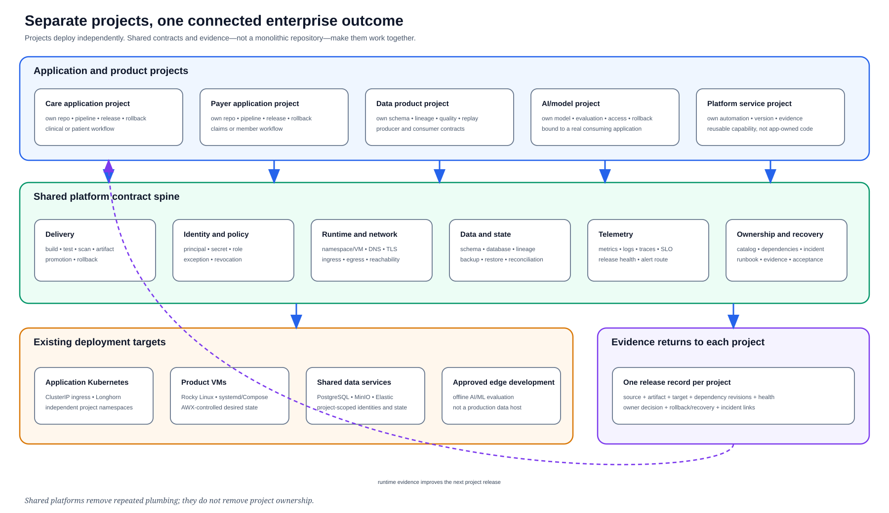

# Application Architecture Record: `<project-name>`

Last verified: `YYYY-MM-DD`

Copy this file once for each real application project. Replace every angle-
bracketed value with verified information from that project's repository and
owners. A portfolio label is not a project, and a shared platform pipeline is
not application evidence.

This template creates documentation, not a deployment request. Describe the
future implementation precisely, but keep implementation authority and runtime
state separate from documentation readiness.

## Why this project exists

Describe the human or operational outcome in a few sentences. Name who uses
the application, what they are trying to accomplish and what the organization
loses when the application is unavailable or wrong.

| Field | Verified value |
| --- | --- |
| Project repository | `<full GitLab path>` |
| Business capability | `<care, payer, shared service, data or AI outcome>` |
| Accountable owner | `<person or team>` |
| Operational owner | `<on-call team>` |
| Data owner | `<person or team, or not applicable with reason>` |
| Documented runtime target | `<existing Kubernetes or VM platform, if verified>` |
| Documentation state | `<inventory / drafting / detailed-and-linked / reviewed>` |
| Implementation authorization | `<not granted unless a separate decision exists>` |
| Runtime state | `<not-deployed / deployed / accepted>` |
| Current runtime revision | `<immutable identifier, or not deployed>` |
| Criticality | `<decision and approver>` |

## What this project connects to

Describe the journey across projects in plain language before listing the
technical contracts. Include the caller, the result it needs, the project that
provides it and what the user experiences when the dependency is unavailable.

| Direction | Other project | Versioned contract | Identity and data crossing the boundary | Timeout or failure behavior | Owner |
| --- | --- | --- | --- | --- | --- |
| Upstream | `<project>` | `<API, event, file or job contract and revision>` | `<principal and data class>` | `<bounded behavior>` | `<owner>` |
| Downstream | `<project>` | `<API, event, file or job contract and revision>` | `<principal and data class>` | `<bounded behavior>` | `<owner>` |

## Platform path

Select the required chains from the
[application project deployment register](../application-project-deployment-register.md)
and explain why each one is needed. Do not copy the entire platform backlog.

| Required chain | Planned project relationship | Platform contract revision | Future acceptance evidence |
| --- | --- | --- | --- |
| Delivery spine | `<pipeline entry point and release flow>` | `<revision>` | `<pipeline, artifact and rollback links>` |
| `<additional chain>` | `<how this application consumes it>` | `<revision>` | `<evidence link>` |

## Documented deployment shape

Draw the application-specific request, data and control paths. Show the real
project boundaries, identities, protocols, stores, asynchronous handoffs,
telemetry return and recovery path. Do not substitute the enterprise overview
or a generic sequence of boxes for this view.

The image above is a temporary orientation reference. Replace it with an SVG
owned by this project record before the architecture can be called detailed.
The diagram must label proposed components as planned and must not make them
look deployed.

| Concern | Project decision |
| --- | --- |
| Packaging | `<image, package or configuration artifact>` |
| Namespace or service boundary | `<existing target and isolation>` |
| Ingress and egress | `<DNS, TLS, source and destination>` |
| Service identity and secrets | `<principal, secret references and rotation owner>` |
| Persistence | `<store, schema, backup and restore ownership>` |
| Resource limits | `<measured request, limit or host boundary>` |
| Availability and scaling | `<replicas, failure domain and capacity decision>` |

## Intended release conversation

Tell the release story as a sequence of accountable decisions, not tool names:

1. `<Who requests the change and what result they expect.>`
2. `<What automated and human evidence makes the revision promotable.>`
3. `<How the platform deploys only the approved artifact.>`
4. `<How users and operators know the new revision is healthy.>`
5. `<Who stops, rolls back or recovers it when the evidence turns bad.>`

## Operability and recovery

| Question | Verified answer and evidence |
| --- | --- |
| What tells us users are succeeding? | `<SLI, query and dashboard>` |
| What wakes a human? | `<alert, threshold and route>` |
| How is a release identified in telemetry? | `<labels and correlation fields>` |
| What is the rollback trigger? | `<decision threshold and authority>` |
| What state must be recovered? | `<data/configuration scope>` |
| Has restore or recovery been exercised? | `<evidence, date and measured RTO/RPO>` |
| Where is the runbook? | `<versioned repository path>` |

## Security and data boundaries

Record data classification, least-privilege roles, encryption boundaries,
audit events, retention and credential revocation. If protected healthcare or
production data is not authorized in the lab, name the synthetic or sanitized
substitute and stop the release when that boundary cannot be preserved.

## Evidence plan and historical facts

| Evidence | Link or immutable identifier | Result | Owner |
| --- | --- | --- | --- |
| Reviewed source revision | `<link>` | `<pass/fail>` | `<owner>` |
| Build and test | `<link>` | `<pass/fail>` | `<owner>` |
| Security and policy gates | `<link>` | `<pass/fail>` | `<owner>` |
| Artifact provenance | `<link>` | `<pass/fail>` | `<owner>` |
| Deployment verification | `<future evidence; do not imply it exists>` | `<pending unless verified>` | `<owner>` |
| Dependency contract tests | `<link>` | `<pass/fail>` | `<owner>` |
| Observability and SLO | `<link>` | `<pass/fail>` | `<owner>` |
| Rollback or recovery exercise | `<link>` | `<pass/fail>` | `<owner>` |

## Decision

Documentation status: **Inventory / Drafting / Detailed and linked / Reviewed**

Runtime status: **Not deployed / Deployed / Accepted / Blocked**

Implementation authorization: **Not granted / Separately approved**

State who made the decision, when it was made, which release it covers and
which unresolved risk remains. Documentation readiness is not implementation
authorization, and `Deployed` is not the same as `Accepted`.
