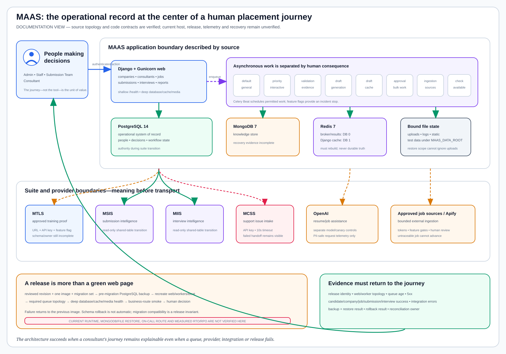

# Application Architecture Record: MAAS

Last verified: 2026-08-13

## Why MAAS exists

MAAS is where the workforce and placement journey becomes operational. Staff
use it to connect consultants, companies, jobs, submissions and interviews;
consultants see the work that belongs to them; administrators govern the
cross-workspace controls. If MAAS is wrong, the damage is not merely a broken
page: a person may be matched to the wrong role, a weak company or job may be
treated as suitable, a submission may stall, or interview learning may never
reach the next decision.

The repository describes four distinct personas—Admin, Staff, Submission Team
and Consultant—and a deliberate boundary with the surrounding intelligence
applications. MAAS remains the operational record while specialized projects
take responsibility for candidate intake, training proof, company judgment,
job judgment, submission analysis, interview analysis and support.

This page documents that architecture. It does not verify a running
environment or authorize a release.

| Field | Verified value |
| --- | --- |
| Repository | [`MIDHTECH/maas`](https://github.com/MIDHTECH/maas) |
| Source evidence revision | `759aee703ce199caa1d6ed8bae038db8511a3e0c` on observed `development`; GitHub remote matched at inventory time |
| Business capability | Workforce and placement operations |
| Product owner | Not named in repository evidence; decision required |
| Operational owner | Not named in repository evidence; decision required |
| Data owner | Not named in repository evidence; separate owners are required for consultant, company, job, submission and interview data |
| Documented runtime style | Docker Compose application stack described by source; current host and environment remain unverified here |
| Documentation state | `detailed-and-linked` |
| Implementation authorization | Not granted |
| Runtime state | `not-verified-by-this-documentation` |

## Read the architecture as a human journey

A staff member is not “using Django.” They are making a chain of decisions
about a real consultant. The web application coordinates those decisions, but
the durable promise lives in the records and evidence behind them.

The source-defined stack gives different work different treatment:

- PostgreSQL is the operational system of record for the core relational
  workflow.
- MongoDB is configured as the knowledge store, not as a substitute owner for
  operational records.
- Redis separates the Celery broker/result path from the Django cache path.
- Dedicated workers isolate priority actions, validation, draft generation,
  draft caching, draft approvals, source ingestion and availability checks
  instead of putting every task into one anonymous queue.
- Celery Beat schedules permitted recurring work; feature flags can stop broad
  periodic execution during an incident.
- Uploads, logs, static files and test data are bound beneath the configured
  MAAS data root and therefore belong in recovery planning alongside databases.

The exact topology is source evidence, not runtime evidence. A Compose file
can tell us what should start; it cannot prove what is currently running.

## What MAAS connects to

| Direction | Project or service | Promise observed in source | Boundary and failure behavior |
| --- | --- | --- | --- |
| Upstream | MTAS | Candidate identity, intake and role context begin the workforce journey. | The relationship is named, but the canonical interface and schema are not; incomplete intake must not appear as market readiness. |
| Upstream | MTLS | Approved training evidence informs market positioning; MAAS exposes `MTLS_BASE_URL`, `MTLS_API_KEY` and a feature switch. | The client fails closed when configuration is absent; draft training content must never be represented as approved evidence. |
| Upstream | MCIS | Company placement suitability precedes the job and submission decision. | Repository docs name the responsibility, but the versioned handoff is missing. A negative or unresolved company decision must remain visible. |
| Upstream | MJIS | Reviewed job identity, provenance and decision enter MAAS for operational use. | Transition docs retain MAAS compatibility; rejected or stale jobs must not silently enter submissions. |
| Downstream | MSIS | Submission records are observed for queue, rejection and outcome intelligence. | MSIS currently describes read-only mappings to MAAS tables. It must not become a writer without an explicit authority transfer. |
| Downstream | MIIS | Interview records are observed for schedule, feedback and preparation intelligence. | MIIS currently describes read-only mappings to MAAS tables. Interview record authority remains in MAAS until deliberately transferred. |
| Downstream | MCSS | Authenticated users can send bounded support issue payloads through a ten-second HTTP client timeout. | Missing URL/key, disabled integration, network error or non-success response returns failure; MAAS must not say an issue was created. |
| External | OpenAI and approved job-source providers | Optional AI and ingestion work is controlled by feature flags, queue boundaries, tokens and provider configuration. | Disabled/missing configuration stops the feature. Prompt/response content must not enter PII-safe request telemetry. |

The suite-level relationships and their unresolved interface states are in the
[workforce application inventory](../../workforce-placement-application-inventory.json).

## Platform-use-case path

MAAS needs more than the generic “deploy an app” chain. It is a stateful,
asynchronous, data-producing and AI-assisted operational service. The selected
pages are requirements for a future implementation and evidence plan; they are
not claims that the controls currently run.

| Chain | Why MAAS needs it | Direct detailed pages |
| --- | --- | --- |
| Delivery spine | One reviewed revision, image and migration set must travel together; a failed release returns to the previous image without hiding schema risk. | [UC-CICD-001](../../use-cases/devsecops/UC-CICD-001-end-to-end-cicd-pipeline.md), [002](../../use-cases/devsecops/UC-CICD-002-automated-build-pipeline.md), [003](../../use-cases/devsecops/UC-CICD-003-automated-unit-testing-in-ci.md), [004](../../use-cases/devsecops/UC-CICD-004-code-quality-gate-integration.md), [005](../../use-cases/devsecops/UC-CICD-005-artifact-management-automation.md), [007](../../use-cases/devsecops/UC-CICD-007-environment-based-release-promotion.md), [008](../../use-cases/devsecops/UC-CICD-008-automated-rollback-controller.md), [010](../../use-cases/devsecops/UC-CICD-010-secure-ci-cd-pipeline-implementation.md) |
| Identity and secrets | Staff/admin bridge tokens, Django secrets, database credentials, provider tokens and MCSS/MTLS credentials require bounded purpose, rotation and revocation. | [UC-GOV-002](../../use-cases/governance/UC-GOV-002-secrets-management-automation.md), [003](../../use-cases/governance/UC-GOV-003-secure-secrets-management-for-applications.md), [004](../../use-cases/governance/UC-GOV-004-cloud-iam-and-rbac-standardization.md), [UC-RSO-018](../../use-cases/resilience/UC-RSO-018-certificate-and-secret-expiry-response.md) |
| Network and service access | Browser, suite, provider and datastore paths need named DNS/TLS ownership and explicit denied paths. | [UC-NET-005](../../use-cases/network/UC-NET-005-authoritative-and-recursive-dns.md), [020](../../use-cases/network/UC-NET-020-ingress-and-egress-controls.md), [024](../../use-cases/network/UC-NET-024-certificate-and-tls-routing.md), [028](../../use-cases/network/UC-NET-028-network-availability-testing.md) |
| Operational readiness | The business funnel needs service ownership, dependency mapping, SLO intent, escalation and a human readiness decision. | [UC-RSO-001](../../use-cases/resilience/UC-RSO-001-operational-readiness-review.md), [002](../../use-cases/resilience/UC-RSO-002-sli-and-slo-governance.md), [005](../../use-cases/resilience/UC-RSO-005-on-call-and-escalation-workflows.md), [009](../../use-cases/resilience/UC-RSO-009-service-ownership.md), [010](../../use-cases/resilience/UC-RSO-010-dependency-mapping.md) |
| Telemetry and release feedback | Web errors, worker topology, queue delay and business-flow health must point to the exact change and owner. | [UC-OBS-003](../../use-cases/observability/UC-OBS-003-opentelemetry-auto-instrumentation.md), [004](../../use-cases/observability/UC-OBS-004-centralized-log-management.md), [006](../../use-cases/observability/UC-OBS-006-alerting-and-on-call-notification.md), [008](../../use-cases/observability/UC-OBS-008-deployment-health-scoring.md), [014](../../use-cases/observability/UC-OBS-014-change-to-incident-correlation.md) |
| VM or native service | The documented Compose target depends on host identity, configuration, service lifecycle, drift detection and host-level incident evidence. | [UC-LNX-005](../../use-cases/linux/UC-LNX-005-awx-ansible-configuration-management.md), [009](../../use-cases/linux/UC-LNX-009-systemd-service-management.md), [012](../../use-cases/linux/UC-LNX-012-ssh-sudo-service-accounts.md), [015](../../use-cases/linux/UC-LNX-015-configuration-drift-detection.md), [019](../../use-cases/linux/UC-LNX-019-linux-monitoring-incident-operations.md) |
| Stateful application | PostgreSQL, MongoDB and file state require onboarding, credential/TLS ownership, performance visibility, backups and measured recovery. | [UC-DB-017](../../use-cases/database/UC-DB-017-application-database-onboarding.md), [012](../../use-cases/database/UC-DB-012-tls-and-credential-rotation.md), [008](../../use-cases/database/UC-DB-008-database-performance-monitoring.md), [005](../../use-cases/database/UC-DB-005-backup-and-point-in-time-recovery.md), [UC-RSO-017](../../use-cases/resilience/UC-RSO-017-rto-and-rpo-measurement.md) |
| Data-producing or consuming application | Shared-table transition, ingestion and suite outputs need schema ownership, lineage, classification, reconciliation and access governance. | [UC-DATA-007](../../use-cases/data/UC-DATA-007-schema-registry-and-evolution.md), [014](../../use-cases/data/UC-DATA-014-data-lineage.md), [015](../../use-cases/data/UC-DATA-015-data-classification.md), [021](../../use-cases/data/UC-DATA-021-data-reconciliation.md), [023](../../use-cases/data/UC-DATA-023-data-access-governance.md) |
| AI or model-enabled application | Resume/job assistance needs model identity, evaluation, responsible-use rules, access control, telemetry and rollback independent of the global model. | [UC-AI-007](../../use-cases/healthcare-ai/UC-AI-007-ai-prompt-and-response-evaluation.md), [008](../../use-cases/healthcare-ai/UC-AI-008-responsible-ai-controls.md), [011](../../use-cases/healthcare-ai/UC-AI-011-ai-security-and-access-control.md), [UC-MLOPS-001](../../use-cases/mlops/UC-MLOPS-001-model-registry-versioning.md), [004](../../use-cases/mlops/UC-MLOPS-004-model-validation-gates.md), [008](../../use-cases/mlops/UC-MLOPS-008-model-observability.md), [011](../../use-cases/mlops/UC-MLOPS-011-model-rollback.md) |

## Documented deployment shape

The source describes one application image reused by the web and worker
processes. PostgreSQL, MongoDB and Redis are separate containers; database,
cache and broker ports bind to loopback in the Compose file. Web is exposed on
port 8000, while the public proxy, host, DNS and certificate are outside this
repository view and must be verified separately.

Environment-specific configuration stays outside the image. The documented
branch strategy maps `development` to dev/staging and `main` to production,
with the same image and code path promoted through environment values. This
architecture record does not verify that the branch or image currently runs on
any host.

The eight worker queues are meaningful fault boundaries:

| Queue or process | Human reason for separation | Degraded behavior to document |
| --- | --- | --- |
| `default` | General background work | Noncritical work may wait without hiding priority activity. |
| `priority` | User-triggered job normalization and assessment | The user receives a bounded pending/failure state rather than a frozen request. |
| `validation` | Final resume validation | A draft cannot be presented as validated when this queue is absent. |
| `draft_generation` | Consultant draft generation | Submission work remains visible as incomplete; duplicate generation is prevented. |
| `draft_cache` | Read-model and shortlist refresh | Stale cache is detectable and cannot become system-of-record truth. |
| `draft_generation_approvals` | Approval-driven bulk generation | Approval work must not starve interactive actions. |
| `ingestion` | ATS and external source collection | Stale/failed sources are marked; untraceable jobs do not advance. |
| `availability_check` | Source posting availability | Unknown availability remains unknown, not automatically active. |
| Celery Beat | Permitted schedules and watchdogs | Operators can hard-disable periodic work while keeping the service diagnosable. |

## Intended release conversation

1. The owner chooses one reviewed revision and records its migration set,
   application image and environment target.
2. CI proves configuration, migration consistency, focused behavior and the
   production-shaped Compose topology without exposing environment secrets.
3. Before migration, the release captures a non-empty PostgreSQL backup. The
   same immutable image is used by web and every Celery process.
4. The target recreates the complete application-service set, verifies required
   queue coverage and calls `/health/?deep=1` for database, cache and media.
5. A human checks the consultant, company, job, submission, interview and
   intelligence surfaces—not merely the root page.
6. Failure restores the previous image. Schema is not automatically reversed;
   migrations must be backward-compatible, and data restore is an explicit
   operator decision.

## Security and data boundaries

- Production requires a strong Django secret, explicit allowed hosts, disabled
  debug, secure cookies, HTTPS redirect and HSTS.
- The internal staff-auth token is mandatory in production and must be compared
  without leaking its value. It authenticates suite staff/admin access, not
  consultant accounts.
- PostgreSQL carries operational personal and workflow records. MongoDB carries
  knowledge data. Redis is broker, result backend and cache—not durable truth.
- Uploaded resumes and other protected files belong to the data classification,
  retention and restore plan; a database-only backup is incomplete recovery.
- MCSS receives a bounded issue payload with source, type, severity, team,
  context and evidence URL through an API key. Credentials never belong in that
  payload.
- AI telemetry may retain model, task, token, cost, latency, cache metadata and
  allowlisted object identifiers; source documentation explicitly excludes
  prompt and response content.
- External job ingestion and AI are feature-gated. A missing token or disabled
  feature is a safe stop, not permission to bypass governance.

## Operability and recovery

| Question | Documented answer | Evidence still needed |
| --- | --- | --- |
| Is the process answering? | `/health/` returns shallow process health. | Current environment, release and sampled response evidence |
| Can the application use its core state? | `/health/?deep=1` checks PostgreSQL, Redis cache and media read/write. | MongoDB health, worker/Beat topology and external dependency checks must join the score |
| Are business users succeeding? | Source names critical company, consultant, job, submission, interview and report surfaces. | Owner-approved SLIs for journey completion, queue age, errors and data freshness |
| What wakes a human? | Source calls for 5xx, Celery queue/heartbeat and release failure alerts. | Named on-call route, thresholds and an alert exercise |
| What can be rolled back safely? | Previous application image, assuming backward-compatible migrations. | A recorded rollback exercise joined to the release and deep health |
| What data must be recovered? | PostgreSQL, MongoDB, uploads and required configuration; Redis must rebuild safely. | Backup policy, off-host protection, restore order and measured RTO/RPO for every state class |
| How is a failed suite handoff reconciled? | Current clients fail visibly when configuration or requests fail. | Versioned idempotency keys, retry policy, dead-letter/reconciliation rules and business owner |

The repository currently documents a PostgreSQL pre-migration backup, but its
hardening plan still lists Mongo backup, file retention and staging restore as
open work. That is why this page does not claim recoverability.

## Evidence plan and historical facts

| Evidence | Current documentation finding | State |
| --- | --- | --- |
| Repository identity | GitHub remote and observed `development` revision `759aee703ce199caa1d6ed8bae038db8511a3e0c` | Verified source fact |
| Application topology | Compose defines web, PostgreSQL, MongoDB, Redis, eight worker queues and Beat | Verified source fact |
| Health contract | Source implements shallow and deep database/cache/media checks | Verified source fact |
| Release and rollback design | Release checklist and unattended delivery docs require immutable image, backup, topology, deep health and previous-image rollback | Documented design; execution not verified here |
| Suite interfaces | MTLS client configuration and MCSS HTTP client exist; broader suite relationships are named in repository docs | Partially evidenced; schemas and owners incomplete |
| Current deployed revision | No runtime inspection performed in this documentation task | Unverified |
| Current telemetry/SLO | No runtime inspection or owner-approved threshold record | Unverified |
| Current restore/RTO/RPO | Source hardening plan lists gaps; no complete restore evidence reviewed | Unverified |

## Decision

Documentation status: **Detailed and linked**

Implementation authorization: **Not granted**

Runtime status: **Not verified by this documentation**

MAAS is ready for contract review, not deployment. The next documentation work
is to name its product, operational and data owners; version the MTAS, MTLS,
MCIS, MJIS, MSIS and MIIS handoffs; finish the MCSS callback/issue contract;
and define complete PostgreSQL, MongoDB and file recovery expectations. No
runtime claim should be made until those decisions and separate evidence exist.
