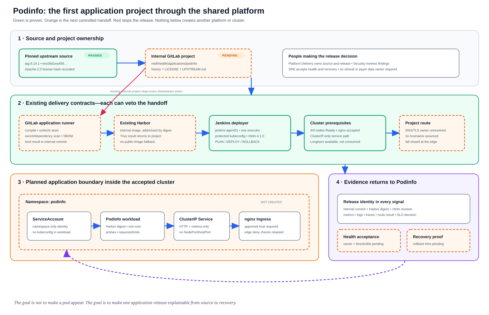

# Application Deployment Record: Podinfo

Last verified: 2026-08-13

## Why this project exists

Podinfo is the first honest test of whether MidhHealth's separate platform
projects can deliver and operate one application together. It is not a care or
payer product. It is a deliberately small, non-PHI reference workload whose
health endpoints, metrics, traces and fault controls let engineers prove the
whole path before a business application depends on it.

| Field | Verified value |
| --- | --- |
| Project repository | `midhhealth/applications/podinfo` — private GitLab project ID `29`; `main` protected |
| Business capability | Shared platform delivery validation |
| Accountable owner | Platform Delivery team |
| Operational owner | Platform Delivery with SRE acceptance |
| Data owner | Not applicable; no clinical, payer, PHI or production data |
| Primary runtime | Existing application Kubernetes cluster; planned namespace `podinfo` |
| Source revision | Upstream tag `6.14.1`, commit `eec06d1ea459af4cb4e10e806f8be7c7bd58b361` |
| Internal revision | `b8dceac72494313eca3ab388a20ad06867675224`; pipeline `653` |
| Current state | **Internal project and initial CI passed; Harbor publication and runtime deployment pending** |
| Machine state | `internal-ci-passed` |

## What this project connects to

The project starts with reviewed upstream source, but no running component may
pull from the public repository. GitLab becomes the internal source of truth;
the project pipeline produces a versioned image in Harbor; Jenkins deploys the
reviewed chart revision through its dedicated agent; ingress carries only the
approved application route; and observability returns release-specific health
to the same project record. A failed handoff keeps the prior release in place.

| Direction | Project or service | Contract | Failure behavior |
| --- | --- | --- | --- |
| Source | `stefanprodan/podinfo` | Tag `6.14.1`, commit and Apache-2.0 license recorded in [APP-PODINFO-001](../../evidence/APP-PODINFO-001-source-review.md) | A moving branch, changed license or unreviewed commit blocks import. |
| Build | `midhhealth/applications/podinfo` with the existing GitLab application runner | Internal commit produces tests, scan results, SBOM/provenance and one immutable image reference | Source policy and tests pass; missing image scan/SBOM or mutable tag still blocks publication. |
| Artifact | Existing `harbor.example.com` | Internally built image digest; Trivy result attached to the release | Public-image fallback or missing digest blocks Helm PLAN. |
| Release | `jenkins-jobs`, `jenkins-shared-library`, `ansible-jenkins` | Manual PLAN/DEPLOY/ROLLBACK on `jenkins-agent01` with the protected kubeconfig | Wrong executor, missing confirmation or inaccessible revision fails closed. |
| Runtime | `ansible-kubernetes`, `kubernetes-platform-gitops` and the existing four-node cluster | Namespace, ServiceAccount, ClusterIP Service, resource limits, probes and nginx Ingress | Wrong cluster identity, NodePort/hostPort or unauthorized cluster add-on blocks deployment. |
| Access | `network-engineering-platform` | Approved DNS/TLS name, source path and worker-local edge route | No hostname is assumed; traffic remains unavailable until the route is approved and tested. |
| Operations | `observability-sre-platform` and `resilience-service-operations` | Release-labeled metrics/logs/traces, SLO, alert owner, dependency and rollback evidence | Missing release identity, owner, alert route or recovery proof prevents acceptance. |

## Platform path

| Required chain | What Podinfo must prove | Current state |
| --- | --- | --- |
| Delivery spine | Internal source → tested/scanned build → Harbor digest → manual promotion → rollback | Internal project, source policy, unit tests, vet and binary packaging pass; image, promotion and rollback remain pending. |
| Identity and secrets | Project-scoped GitLab/Harbor identity and read-only Jenkins SCM plus protected kubeconfig | GitLab project authorization is active; Harbor and Jenkins application authorization have not been attached or proven. |
| Network and service access | ClusterIP-only service and an explicitly approved nginx route | Shared ingress is accepted; the Podinfo hostname, DNS, TLS and route are unresolved. |
| Operational readiness | Owner, dependency map, SLO, runbook and acceptance decision | Owner and dependencies are named here; thresholds, runbook exercise and acceptance are pending. |
| Telemetry and release feedback | Metrics, logs and traces carry the Podinfo commit, image digest and Helm revision | Platform services exist; application signal delivery has not been tested. |
| Kubernetes workload | Bounded namespace, non-root image, probes, requests/limits, rollout and rollback | Namespace and application resources do not yet exist. |

## Deployment shape

- Planned namespace: `podinfo` on `kubernetes-admin@kubernetes`, after the
  four expected node names and API version are checked.
- Packaging: build the supplied Dockerfile from the internal commit. The chart
  must use the resulting Harbor digest, never its public default image.
- Service exposure: ClusterIP only. NodePort, hostPort and direct backend
  firewall admissions are prohibited.
- Ingress: no hostname is selected yet. The release remains internal until DNS,
  TLS ownership and the worker-local edge path are reviewed together.
- State: stateless. Redis and persistent volumes remain disabled for this first
  slice; Longhorn is an accepted platform capability, not a Podinfo dependency.
- Identity: use a namespace ServiceAccount with no cluster-wide role. The
  application itself receives no kubeconfig or infrastructure credential.
- Capacity: begin with one replica for the bounded proof, then set requests,
  limits and scaling decisions from measured behavior rather than arbitrary
  production claims.

## Release conversation

1. The Platform Delivery owner imported the reviewed commit with its history,
   license and provenance into the protected internal project.
2. The project's GitLab pipeline now validates, compiles and tests the source.
   Its next responsibility is to scan and publish one Harbor image identified
   by digest and internal commit.
3. Jenkins PLAN renders the project-owned values and proves target identity,
   policy and server-side validity without changing the cluster.
4. An explicit deployment decision installs the same digest atomically in the
   `podinfo` namespace and verifies probes, rollout and the approved route.
5. Metrics, logs and traces show which source, image and Helm revision served
   the request; a failed health decision triggers the controlled rollback.
6. The owner accepts only after rollback and restore are timed and the prior
   healthy behavior is visible through the same route and telemetry.

## Operability and recovery

| Question | Required evidence |
| --- | --- |
| Are users reaching a healthy revision? | HTTP success and latency at the approved route, joined to commit, digest and Helm revision. |
| Is the application actually ready? | Kubernetes readiness/availability plus Podinfo `/readyz` and `/healthz` checks. |
| Can an operator diagnose it? | Structured logs, Prometheus metrics and an OpenTelemetry trace visible in the existing services with the release identity. |
| What wakes a human? | An owned alert tied to the approved SLO; thresholds remain an owner decision before deployment. |
| What is recovered? | The prior immutable image/chart revision; this stateless slice has no application data restore. |
| What proves recovery? | Jenkins rollback ID, Helm history, before/after route result, recovered telemetry and measured recovery time. |

## Security and data boundaries

No PHI, PII, clinical record, payer record or production credential may enter
this application. The build consumes public source only during the controlled
import/update process. Runtime pulls only from existing Harbor. The container
runs without a cluster credential, the service remains ClusterIP-only, and
evidence excludes tokens, private keys and kubeconfig content.

## Acceptance record

| Gate | Evidence | Result |
| --- | --- | --- |
| Upstream source and license | [APP-PODINFO-001](../../evidence/APP-PODINFO-001-source-review.md) | **Passed** |
| Internal GitLab project and provenance | [APP-PODINFO-002](../../evidence/APP-PODINFO-002-internal-project-ci.md) | **Passed** |
| Build and test | Pipeline `653`, source-policy job `1943`, unit-test job `1944`, binary job `1945` | **Passed** |
| Scan, SBOM and Harbor provenance | GitLab reports, image digest and Harbor scan | Pending |
| Existing Jenkins executor | [CHG-2026-002](../../evidence/CHG-2026-002-jenkins-agent-acceptance.md) | **Platform prerequisite passed** |
| Existing Kubernetes ingress | [CHG-2026-009](../../evidence/CHG-2026-009-kubernetes-ingress-acceptance.md) | **Platform prerequisite passed** |
| Existing persistent storage | [CHG-2026-010](../../evidence/CHG-2026-010-kubernetes-persistent-storage-acceptance.md) | Available but deliberately not consumed |
| Podinfo Helm PLAN and deployment | Jenkins builds, Helm status and Kubernetes verification | Pending |
| Telemetry and SLO | Prometheus/Grafana/Loki/Tempo evidence with release identity | Pending |
| Rollback and recovery | Jenkins rollback, Helm history, route recovery and measured time | Pending |

## Decision

Status: **Internal CI passed**

The application is not deployed or accepted. The next allowed state change is
publication of a scanned, immutable image in the existing Harbor service.
Cluster, DNS and ingress changes remain blocked until that digest exists and
the application-specific Jenkins PLAN can reference it.
