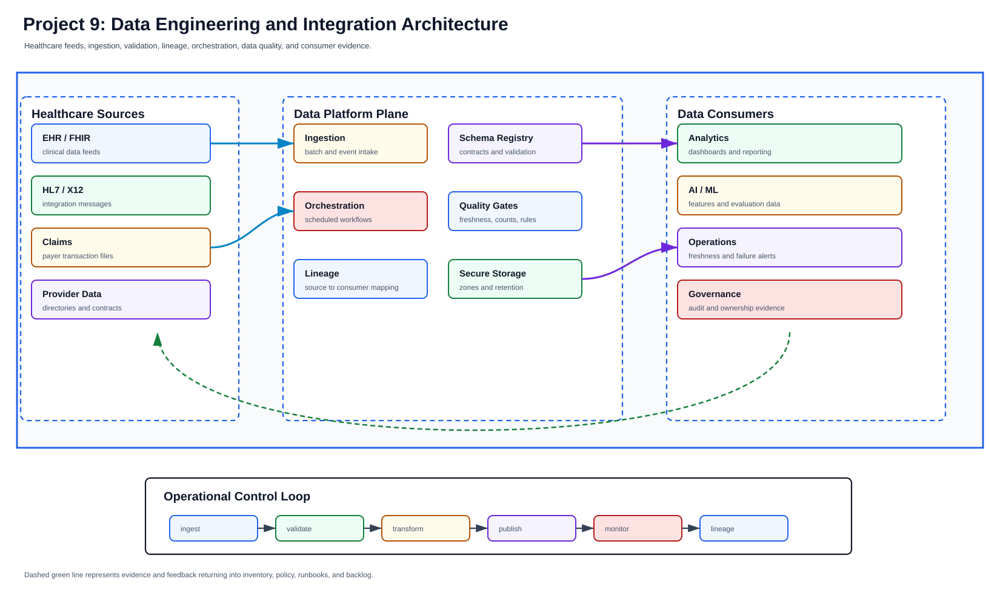

# Data Engineering and Integration Domain

**Repository:** `midhhealth/data-and-integration/data-engineering-platform`  
**Team size:** 6 engineers

## Team Responsibilities

The data engineering team owns governed movement, transformation, quality,
lineage, and serving of provider and payer data products.

| Team member | Primary responsibility |
| --- | --- |
| Data Platform Lead | Owns data platform roadmap, ownership model, domain contracts, and governance alignment. |
| Ingestion Engineer | Builds batch, streaming, CDC, retry, replay, and source onboarding workflows. |
| Orchestration Engineer | Maintains Airflow-style scheduling, dependencies, backfills, retries, and operational evidence. |
| Transformation Engineer | Owns dbt/SQL transformations, tests, documentation, and dataset versioning. |
| Data Quality and Lineage Engineer | Maintains quality checks, freshness, reconciliation, metadata catalog, lineage, and classifications. |
| Data Access Engineer | Owns dataset access approvals, PII controls, retention, archival, and consumer contracts. |

## Connected Teams

- Consumes source data from databases, applications, partner feeds, and events.
- Provides curated data and features to analytics, healthcare AI, and MLOps.
- Sends quality, lineage, freshness, and access evidence to governance and SRE.

## Executable Use-Case Scope

- Batch ingestion, streaming ingestion, CDC, ETL/ELT, workflow orchestration, and schema evolution.
- Data quality, reconciliation, metadata catalog, lineage, classification, PII controls, and access governance.
- Pipeline monitoring, retry/backfill, dead-letter replay, lakehouse storage, warehouse integration, and DR.

## The data-product promise

Data engineering moves provider, payer and shared-platform information without
losing who owns it, what it means, when it was produced, or whether consumers
can trust it. The platform does not treat a successful file copy or completed
job as proof that a dataset is correct.

No data-platform product stack is installed in the current lab. The first
implementation slices therefore use repository code, schemas, synthetic
healthcare-shaped fixtures, database/object-storage interfaces already
approved for the lab, and pipeline evidence. Airflow, dbt, Kafka, lakehouse or
warehouse references describe portable roles until a product and placement
change is approved.

## Data-product contract

| Contract area | Required content |
| --- | --- |
| Ownership | Producer, data steward, platform operator, consumers and escalation route |
| Meaning | Dataset/event purpose, field definitions, schema version and compatibility policy |
| Delivery | Batch window or event expectation, watermark, ordering, duplicate and late-data behavior |
| Quality | Completeness, validity, uniqueness, reconciliation and freshness checks with owners |
| Privacy | Classification, minimum necessary fields, approved use, access and retention |
| Lineage | Source, transforms, versions, destinations and consumer dependency links |
| Recovery | Retry boundary, dead-letter handling, replay/backfill rules, RPO/RTO intent and reconciliation |

FHIR, HL7, X12 or claims terminology is used only when an actual registered
source contract warrants it. Synthetic fixtures are clearly labeled and must
not be mistaken for clinical or payer records.

## Movement through the platform

1. Register the source, owner, data classification and consumer outcome.
2. Land data immutably where possible and attach arrival identity, checksum,
   schema and ingestion revision.
3. Validate structural and domain rules before publication. Quarantine invalid
   records without silently dropping them.
4. Transform with versioned code and record input/output lineage.
5. Reconcile counts, totals or keys appropriate to the business meaning.
6. Publish a versioned dataset/event contract and a freshness/quality result.
7. Monitor consumer-visible delay and failures; restore through bounded replay
   or backfill without duplicating already accepted work.

## Retry, replay and schema safety

Retries are for transient operations and are bounded with backoff. A poisonous
record moves to a dead-letter boundary with reason and ownership rather than
blocking an entire stream forever. Replay uses an immutable source range,
idempotency key and destination reconciliation. Backfills declare time range,
expected volume, capacity impact and consumer communication.

Compatible schema evolution adds fields or versions consumers can tolerate.
Breaking changes require a parallel version and explicit consumer migration.
The registry role can initially be a repository schema plus validation tool;
it does not require installing a registry product to prove the contract.

## Failure behavior

| Failure | Safe response |
| --- | --- |
| Source arrives late or incomplete | Mark freshness/coverage failed and prevent trusted publication |
| Schema is unknown | Quarantine and notify the producer; do not coerce fields silently |
| Partial transform succeeds | Keep output uncommitted or versioned as failed; replay from the recorded boundary |
| Consumer is unavailable | Buffer within the stated limit, expose lag and stop before storage exhaustion |
| Duplicate or out-of-order records | Apply contract keys/watermarks and reconcile rather than deleting unexplained data |
| Sensitive field appears unexpectedly | Restrict the dataset, stop propagation and open a privacy/security review |

## Build and acceptance

The repository first proves parsers, schema evolution, quality rules,
idempotency, lineage and reconciliation with deterministic fixtures. A pipeline
then produces a data evidence manifest containing source/checksum, schema and
code revisions, counts, quality/freshness results, rejected records, lineage,
runtime, owner and replay reference. Runtime acceptance later adds scheduler,
storage, access, telemetry and recovery evidence. Detailed scenarios remain in
the [data use-case index](../use-cases/data/README.md).
