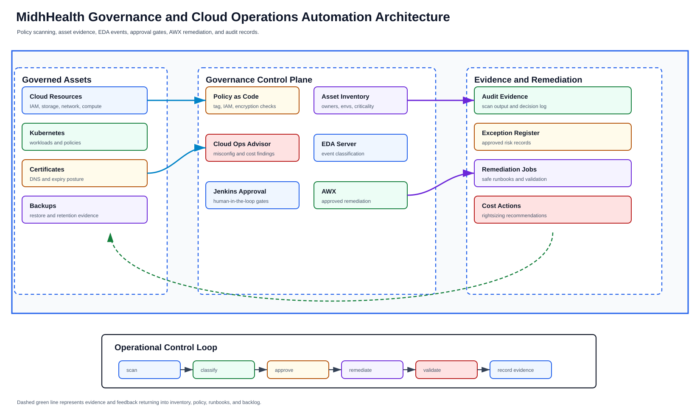

# Governance and Operations Automation Domain

**Repository:** `midhhealth/security-governance/cloud-governance-ops-automation`  
**Team size:** 5 engineers

## Team Responsibilities

The governance team turns security, compliance, cost, backup, certificate,
identity, and operational policy into executable controls.

| Team member | Primary responsibility |
| --- | --- |
| Governance Automation Lead | Owns policy roadmap, audit posture, exception process, and cross-domain controls. |
| IAM and Secrets Engineer | Maintains RBAC, service accounts, vault/key management, rotation, and access reviews. |
| Compliance Evidence Engineer | Collects control evidence, scan results, backup proof, audit artifacts, and exception records. |
| Cloud Risk Engineer | Owns cloud misconfiguration detection, private endpoints, encryption, tagging, and exposure review. |
| Remediation Automation Engineer | Builds event-driven, human-approved, and closed-loop remediation workflows. |

## Connected Teams

- Places policy gates in GitLab CI, Jenkins, Terraform, AWX, and Kubernetes admission.
- Consumes evidence from observability, infrastructure, Linux, database, network, data, AI, and MLOps.
- Provides operating controls for provider and payer workloads.

## Executable Use-Case Scope

- Cloud misconfiguration detection, compliance scanning, IAM/RBAC standardization, and secrets controls.
- Runbook automation, event-driven remediation, human-in-the-loop remediation, and closed-loop automation.
- Backup, DR, certificate, cost anomaly, and right-sizing governance.
- Automated root-cause analysis and alert deduplication with SRE.

## Governance as an execution boundary

Governance here is not a review board that appears at the end of a project. It
supplies machine-checkable constraints early, then preserves the human
decision where service risk, patient/member impact, cost or an exception
cannot be decided by code alone.

## Control model

Every control has five parts: the intent it protects, the assets and identities
in scope, the observation or test, the owner who decides the result, and the
evidence/retention rule. A scanner finding without scope or ownership is not a
control. A green dashboard without negative tests is not proof of enforcement.

| Control point | Example decision | Where it runs |
| --- | --- | --- |
| Source | Secrets, prohibited configuration, policy and dependency checks | GitLab CI before merge |
| Delivery | Approved artifact, credential class, promotion authority and exception expiry | Jenkins/shared library |
| Infrastructure | Tags, network exposure, encryption, identity and cost envelope | Terraform plan policy |
| Host automation | Inventory limit, privilege, check result and approved mutation | AWX job template |
| Kubernetes | Namespace, RBAC, image, workload and network constraints | CI and future admission enforcement |
| Runtime | Access review, certificate/secret age, backup proof, exposure and compliance state | Scheduled read-only collection |

## Current-state truth

Vault is installed, initialized, unsealed and reachable through the accepted
NGINX path. GitLab, Jenkins and AWX use scoped service identities in the
documented delivery path. Several governance products and controls remain
designs: Keycloak requires revalidation before use, cloud accounts are not part
of the active lab boundary, and Kubernetes admission-policy enforcement has not been
accepted. Pages must distinguish a repository check, a live observation and an
enforced runtime control.

## Identity, secrets and exceptions

Human, pipeline and workload identities are separate. Pipelines receive the
least-capable credential for one stage and must not print or archive it.
Workloads consume secret references, not copied values. Rotation includes
consumer verification and reversal, because changing a value in Vault does not
prove that every consumer recovered.

An exception names the control, asset, owner, reason, compensating measures,
approval and expiry. Expired exceptions fail the next evaluation. Emergency
access is time-bound, logged, reviewed afterward and cannot become a permanent
pipeline credential.

## Evidence model

Evidence records the control revision, observation time, target identity,
collector identity, result, coverage gaps, decision, exception and source
artifact. Secrets and protected data are redacted before storage. Evidence is
linked to the change or incident rather than copied into unrelated documents,
so later review can reproduce the exact decision.

## Safe automation and remediation

Detection and mutation remain distinct steps. Read-only automation may collect
configuration, policy, cost and access findings on a schedule. Remediation
needs bounded scope, an idempotent runbook, service-owner approval where impact
is possible, pre/post health checks, and a recovery action. Closed-loop action
is permitted only after the same correction has been proven repeatedly and a
stop condition is explicit.

The cloud storage audit learning slice uses mocked Boto3 clients and recorded
fixtures first: Organizations pagination, STS role-assumption outcomes, S3
public-access, encryption, versioning, logging and partial-access reporting.
It does not require or imply access to real accounts.

## Cost anomaly decision path

1. Establish the billing period, baseline and magnitude of the anomaly.
2. Attribute it to tags, accounts, services and an accountable service owner;
   record unattributed spend as a governance failure.
3. Correlate recent deployments, infrastructure changes, retention and demand.
4. Compare remediation options for saving, availability and reversibility.
5. Obtain approval before an action that can interrupt a service.
6. Validate service health immediately and actual savings in a later billing
   window. Keep estimates and realized savings as different fields.

## Failure and escalation behavior

| Situation | Required response |
| --- | --- |
| Collector cannot reach part of scope | Report partial coverage; never convert “not observed” to compliant |
| Policy version is unavailable | Fail a mutating gate closed and route ownership to governance |
| Secret appears in logs or evidence | Stop publication, revoke/rotate, restrict the artifact and open an incident |
| Automated repair repeats or worsens health | Trip the stop condition, disable the loop and hand control to the incident owner |
| Exception expires | Block the next governed change and notify the named owner |
| Cost action threatens an SLO | Preserve service safety and require a human trade-off decision |

## Build and acceptance sequence

Implement control schemas and fixtures, then deterministic checks, then CI
gates, then read-only live collection, and only then a separately approved
remediation path. Acceptance includes positive, negative and inaccessible-scope
cases; identity and policy revisions; sanitized evidence; exception expiry;
repeated convergence; recovery; and the accountable owner's decision. The
detailed backlog remains in the
[governance use-case index](../use-cases/governance/README.md).
