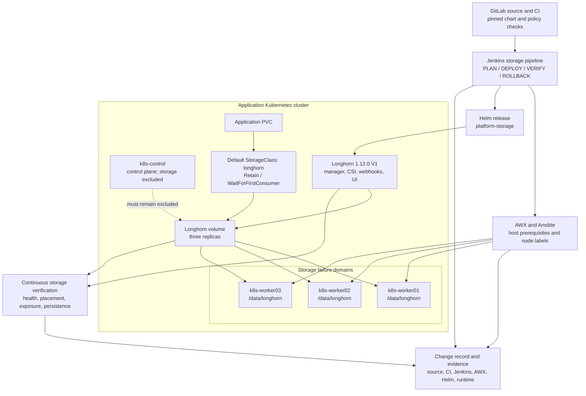
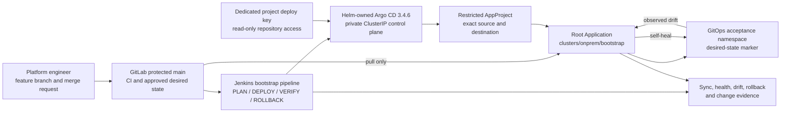

# Kubernetes Platform Domain

**Repository:** `midhhealth/platform-engineering/kubernetes-platform-gitops`  
**Team size:** 6 engineers

## Team Responsibilities

The Kubernetes team owns the application runtime platform for containerized
care, payer, platform, data, AI, and observability workloads.

| Team member | Primary responsibility |
| --- | --- |
| Kubernetes Platform Lead | Owns cluster standards, roadmap, availability posture, upgrade policy, and platform adoption. |
| GitOps Engineer | Maintains Argo CD or Flux patterns, environment overlays, sync policies, and reconciliation evidence. |
| Cluster Operations Engineer | Owns cluster lifecycle, node pools, upgrades, ingress, storage, DNS, and backup patterns. |
| Platform Security Engineer | Maintains RBAC, namespace controls, admission policies, image trust, and workload baseline rules. |
| Release Reliability Engineer | Implements progressive delivery, automated rollback, continuous verification, and deployment health gates. |
| Resource Optimization Engineer | Handles right-sizing, autoscaling, capacity reports, and Kubernetes cost allocation. |

## Connected Teams

- Receives infrastructure and network foundations from platform engineering.
- Publishes workload runtime patterns to delivery, observability, governance, data, AI, and MLOps.
- Sends runtime telemetry to SRE and operational evidence to governance.

## Executable Use-Case Scope

- Kubernetes configuration drift monitoring and GitOps reconciliation.
- Progressive delivery, canary/blue-green rollout, continuous verification, and automated rollback.
- Policy enforcement for namespace, workload, image, and security controls.
- Workload right-sizing, event-driven autoscaling, and cost allocation.
- Cluster configuration validation and runtime readiness checks.

## Longhorn Persistent-Storage Component

Longhorn is the Kubernetes platform's persistent block-storage component. It
is not a separate platform or an application-team-managed service. The
Kubernetes platform team owns its topology, release lifecycle, capacity,
security boundary, recovery procedures, and evidence. Application teams
consume only the approved `longhorn` StorageClass through PVCs.

The current runtime target is the existing four-node kubeadm application
cluster. Managed AKS, EKS, and GKE implementations remain portable reference
patterns; they do not replace or duplicate this accepted on-premises target.

The initial release is a Jenkins-managed Helm bootstrap. AWX and Ansible own
only the worker operating-system prerequisites, `/data/longhorn` directories,
and storage-node labels. Jenkins owns Helm planning, deployment, verification,
rollback, and restore until a separately reviewed change transfers ownership
to Argo CD. Jenkins and Argo CD must never reconcile the Longhorn release at
the same time. Detailed implementation and acceptance gates are tracked in
[CHG-2026-010](../change-records/CHG-2026-010-kubernetes-persistent-storage.md).

### Architecture and evidence flow

### Design decisions

| Concern | Platform decision |
| --- | --- |
| Release | Longhorn `1.12.0`, official Helm chart pinned by SHA-256 digest; V1 Data Engine only |
| Storage nodes | `k8s-worker01`, `k8s-worker02`, and `k8s-worker03`; the control plane is explicitly excluded |
| Data path | `/data/longhorn` on each worker's dedicated 150 GiB XFS `ftype=1` disk; root filesystems are prohibited |
| Replica placement | Three replicas on three distinct worker nodes to avoid a single worker or disk failure domain |
| Consumer contract | Default `longhorn` StorageClass, `Retain`, `WaitForFirstConsumer`, ext4, best-effort locality |
| Capacity guardrails | Reserve 20 percent of each default disk and stop new scheduling before free capacity falls below the 25-percent minimum |
| Network boundary | All Longhorn Services remain ClusterIP-only; no Ingress, NodePort, LoadBalancer, hostPort, or VM listener |
| Management boundary | The Longhorn UI and APIs are platform-internal; application teams receive PVC access, not storage administration |
| Backup boundary | The backup target remains unset; local replicas are high-availability copies, not an off-cluster backup |
| Change ownership | Jenkins owns the bootstrap release until an explicit Argo CD handoff; only one reconciler may own it |

### Availability, capacity, and failure behavior

- A healthy volume has one running replica on each storage worker. A single
  worker or disk failure can leave the volume available while Longhorn reports
  the degraded state and rebuilds after an eligible failure domain returns or
  replacement capacity is approved.
- Two concurrent worker or disk failures can make a volume unavailable. The
  platform therefore treats replica health, rebuild progress, node
  schedulability, and free capacity as operational alerts rather than relying
  on Kubernetes pod health alone.
- Three replicas consume approximately three times the application data before
  filesystem and snapshot overhead. Capacity planning uses schedulable
  Longhorn capacity after reservation and minimum-free-space guardrails, not
  the workers' raw 450 GiB total.
- `WaitForFirstConsumer` delays binding until Kubernetes selects a workload
  location. `Retain` prevents automatic destruction of the backing volume when
  a claim is removed; release or data deletion requires a separate reviewed
  operation.

### Security and recovery contract

- SELinux remains enforcing. V1 engine prerequisites, including active
  `iscsid`, are installed and converged only through the reviewed AWX path.
- Storage scheduling is label- and path-constrained to the three workers.
  Negative acceptance checks must prove that the control-plane `/data` disk,
  all root disks, public service types, ingress, and host ports are absent.
- After the acceptance PVC contains data, recovery must not uninstall
  Longhorn, remove its CRDs, delete `/data/longhorn`, or delete the PVC. Use a
  known-good Helm rollback through Jenkins, preserve the volume, and stop for
  incident handling if controller or replica health is not restored.
- Remote backup, credential scope, encryption policy, retention schedules,
  and restore objectives require a separate reviewed backup design. Until
  that change is accepted, this component provides node-level replication but
  does not claim disaster-recovery protection.

### Operational evidence

Every storage change must preserve the exact Git revision and chart digest,
branch and main CI results, Jenkins build numbers, AWX job IDs and convergence
results, Helm history, node and disk placement, StorageClass state, PVC/PV and
volume identity, replica health, Kubernetes events, pod restarts, capacity,
and negative network-exposure checks. Acceptance also requires marker data to
survive pod recreation, repeated deployment, a known-good rollback, and
restoration of the accepted release. This evidence closes the component
before the platform queue advances to GitOps, policy, supply-chain,
autoscaling, right-sizing, or cost-allocation work.

## Argo CD GitOps Control-Plane Component

Argo CD is the platform's pull-based desired-state reconciler. Jenkins owns
the controller's Helm bootstrap, rollback, and restore; Argo CD owns only the
resources explicitly delegated through a restricted AppProject and
Application. GitLab CI validates desired state but cannot deploy it. This
separation prevents Jenkins, GitLab CI, and Argo CD from reconciling the same
resource concurrently.

CHG-2026-011 first limits live ownership to an isolated reconciliation canary.
Ingress-nginx, Longhorn, Headlamp, application workloads, policies, secrets,
backup, autoscaling, and cluster lifecycle remain outside Argo CD until later
component-specific handoffs. See the
[change record](../change-records/CHG-2026-011-argocd-gitops-bootstrap.md).

### Control and reconciliation flow

### Design decisions

| Concern | Platform decision |
| --- | --- |
| Version | Argo CD `3.4.6`; official chart `10.2.2` pinned by SHA-256 digest |
| Availability | Non-HA lab deployment aligned with the single-control-plane cluster; later HA requires a separate capacity and failure-domain change |
| Exposure | ClusterIP-only with no ingress, NodePort, LoadBalancer, hostPort, LAN listener, or public DNS during bootstrap |
| Repository access | Dedicated project-scoped read-only SSH deploy key to canonical GitLab; no human or write-capable identity |
| Authorization | Dedicated AppProject with one exact repository and one isolated destination; no wildcard source, cluster, namespace, or resource ownership |
| Initial desired state | `clusters/onprem/bootstrap` contains only a reconciliation marker and its bounded namespace |
| Reconciliation | Automated self-heal and prune are enabled only within the canary boundary and tested through a controlled drift action |
| Bootstrap owner | Jenkins manages the controller release, repository Secret, AppProject, and root registration |
| Expansion | Each platform or application component requires its own explicit ownership handoff after source, rollback, and acceptance gates |

### Credential, rollback, and evidence contract

The private deploy key must never enter Git, Helm values, job parameters,
console output, or evidence. Jenkins injects it from a scoped credential into
the Kubernetes repository Secret and destroys temporary material. Validation
must prove GitLab grants read-only access to only the GitOps project and that
Argo CD records a successful repository connection.

The first deployment, repeat convergence, known-good Helm rollback, accepted
source restore, and post-restore reconciliation must all pass before ownership
can expand. Evidence includes exact Git/chart revisions, CI and Jenkins
results, Helm history, controller image/version, pod readiness and restarts,
private exposure checks, AppProject permissions, Application revision/sync
health, controlled drift restoration time, and negative proof that accepted
ingress and storage resources remain unmanaged.
