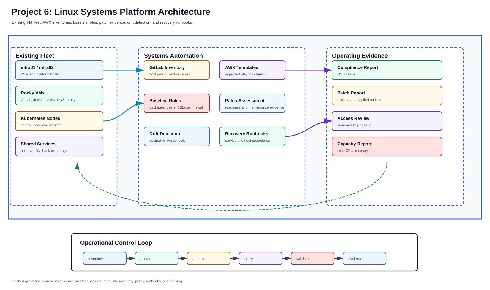

# Linux Systems Engineering Domain

**Repository:** `midhhealth/platform-engineering/linux-systems-platform`  
**Team size:** 5 engineers

## Team Responsibilities

The Linux systems team owns the operating-system and VM lifecycle for the
existing on-prem fleet. Its current implementation is an active first slice
against existing VMs, not an approval to create new VMs or install new product
stacks.

| Team member | Primary responsibility |
| --- | --- |
| Linux Platform Lead | Owns Linux standards, patch policy, operational readiness, and VM lifecycle decisions. |
| Ansible Systems Engineer | Builds idempotent roles, playbooks, Bash/Python tooling, CI validation, drift controls, and evidence. |
| Virtualization Engineer | Maintains KVM/libvirt and broader VM patterns, cloud-init and image pipelines, storage pools, host networking, and container-host standards. |
| Security Baseline Engineer | Owns SELinux, firewalld, SSH, sudo, LDAP/Kerberos/AD integration, package sources, vulnerability remediation, and compliance checks. |
| Operations Recovery Engineer | Maintains monitoring, on-call triage, RCA, backup/restore, HA/DR, break-glass, boot, filesystem, service recovery, and capacity runbooks. |

## Connected Teams

- Supports Jenkins, AWX, GitLab, Kubernetes, observability, database, cloud, and network runtime foundations.
- Consumes network/DNS standards and governance access policies.
- Sends patch, drift, capacity, and compliance evidence to SRE and governance.

## Canonical Use-Case Scope

The complete Linux use-case list, market-calibration decision, coverage
targets, and authoritative count are maintained only in the
[Enterprise Linux Systems Engineering Platform](../enterprise-project-portfolio-and-usecases.md#enterprise-linux-systems-engineering-platform)
section of the enterprise portfolio. This domain page links to that source
instead of maintaining a second list.

Portfolio definition does not promote a use case to runtime verified or
accepted, and it does not authorize new VMs, products, cloud resources, or
production capacity.

## End-to-End IaC Delivery Contract

Every detailed Linux use-case page follows the same controlled path:

| Stage | Required ownership and evidence |
| --- | --- |
| Source | GitLab merge request, protected branch, immutable revision, schemas, lint, tests, policy and secret checks |
| Plan | Terraform plan or Ansible check mode with exact inventory, variables, target limit and change impact |
| Approval | Jenkins selects PLAN/CHECK/APPLY/ROLLBACK; mutation requires explicit confirmation and an approved change |
| Infrastructure | Terraform and image/cloud-init automation own VM, image, volume and network lifecycle |
| Operating system | AWX and Ansible own Linux desired state, serial/canary rollout and per-host execution events |
| Runtime | Service health, logs, metrics, alerts, security posture and consumer access are verified |
| Acceptance | Identical second convergence, exercised rollback/recovery, sanitized artifacts, incident links and owner/SRE sign-off |

The [Linux detailed-page standard](../use-cases/README.md#linux-end-to-end-iac-contract)
enforces this content. The canonical portfolio table links to each page without
creating another use-case list here.

## The operating-system boundary

Linux engineering owns the layer between provisioned compute and the product
or Kubernetes process that consumes it. That includes bootability, package
sources, filesystems, time, name resolution, host firewall, SELinux, local
identity integration, service supervision, logging, patching and recovery. It
does not own an application's schema, a Kubernetes workload manifest, or a
network team's routing policy.

## What exists in the lab

The managed fleet consists of the current Rocky Linux VMs on the KVM/libvirt
hosts plus the documented Linux hypervisor responsibilities. Node Exporter is
present on managed platform hosts, and Filebeat sends the accepted Rocky Linux
fleet log classes through encrypted Logstash. AWX is the change execution
plane; direct SSH is for diagnosis or approved break-glass work, not a second
configuration system.

The systems repository's first slice may inspect and converge existing hosts.
It may not allocate a VM, repurpose a data disk, expose a port, or install a new
product merely because an Ansible role can do so.

## Host lifecycle

| Phase | Systems decision |
| --- | --- |
| Image | Pin the Rocky Linux base, verify provenance, remove machine identity and record package baseline |
| Provision | Infrastructure supplies CPU, memory, disks and networks; cloud-init performs only bootstrap needed to reach AWX management |
| Enroll | Establish DNS, time, repository access, service identity, monitoring, logging and inventory ownership |
| Converge | AWX applies roles through inventory limits, check mode where meaningful, serial rollout and health checks |
| Operate | Detect configuration drift, patch by ring, watch filesystems/services and preserve support evidence |
| Recover | Use console/boot, filesystem, service or restore runbooks according to the failed layer |
| Retire | Confirm consumers, archive evidence, revoke identity, remove DNS/monitoring and hand resource deletion to infrastructure |

## Automation design

Roles express one operating concern and expose defaults without hiding unsafe
changes. Inventories identify environment and ownership; they do not contain
secrets. Playbooks compose roles for a bounded outcome. A Jenkins job selects a
reviewed revision and AWX template, while AWX applies credentials, inventory
and target limits. Bash helpers use strict error handling and structured output
when a native module is not practical; they do not conceal a failed command in
a successful play.

Idempotence is evaluated as an operating property: the second run should
report no unexplained change, and services should remain healthy. Package
updates, certificate renewal and rotating data naturally change; their rules
must explain why.

## Security and service safety

- SELinux remains enforcing. A denial is diagnosed and corrected through
  labeling or policy rather than disabling enforcement.
- Firewall openings name the consumer, source, destination, protocol and
  removal condition; listening locally is not approval for network exposure.
- Administrative access uses individual identity and sudo where available.
  Service accounts are non-interactive and scoped to their process.
- Root-owned credentials remain outside repositories, job output and evidence.
- Kernel, bootloader, filesystem and authentication changes use canaries and
  require an out-of-band recovery route before fleet rollout.

## Failure playbook

| Symptom | First boundary to verify | Safe response |
| --- | --- | --- |
| Host unreachable | Hypervisor, power, bridge, IP, route and firewall | Preserve console evidence; do not repeatedly reboot |
| Boot failure | Last kernel, initramfs, mounts and filesystem health | Use known-good boot entry or rescue procedure |
| Service down | Unit status, journal, dependency, port and resource pressure | Restore known configuration or package version |
| Disk pressure | Mount, inode/block use, writer and retention owner | Stop unbounded growth; do not delete unknown data |
| Fleet change failing | Inventory scope, batch, role task and common dependency | Stop the serial rollout and recover the canary |
| Authentication failure | Time, directory/DNS, local account and sudo path | Preserve break-glass access and audit its use |

## Implementation and acceptance

Each first slice starts read-only, emits a structured fleet report, and proves
partial failure handling. A mutating version then adds check output, a canary,
serial execution, pre/post service checks and reversal. Acceptance retains the
Git revision, Jenkins and AWX IDs, inventory limit, host-by-host result,
idempotence run, telemetry, security posture and recovery result. That evidence
promotes one use case; it does not declare the entire fleet compliant.
