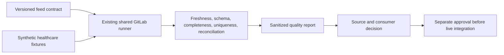

# UC-DATA-001: Healthcare Feed Quality Validation

Last verified: 2026-08-13

## Use-case record

| Field | Value |
| --- | --- |
| Canonical portfolio use case | Data Quality Validation |
| Primary platform | Enterprise Data Engineering and Integration Platform |
| Enterprise alignment | Provider operations, payer operations, risk and compliance |
| Enterprise outcome | Detect late, malformed, incomplete, or duplicated healthcare feeds before downstream decisions use them |
| Supporting platforms | Database, observability, governance, resilience operations |
| Jira epic | `EPIC-DATA-001` — Validate one sanitized healthcare feed contract |
| Change record | Not required for fixture-only CI; required before a live source is connected |
| Target | Existing data-engineering GitLab project and accepted shared runner; sanitized repository fixtures only |
| Current state | **Planned — evidence playbooks exist; no data-platform product is installed** |
| Infrastructure boundary | No Kafka, Airflow, lakehouse, VM, database, bucket, or live healthcare integration is created |
| Owner | Data Engineering and Integration team |

## Purpose

Data engineers need an executable contract for healthcare feed arrival,
schema, required fields, uniqueness, and reconciliation. The first slice runs
entirely in GitLab CI against sanitized synthetic fixtures.

## Expected outcome

A versioned feed contract and validator accept a good fixture, reject late or
invalid fixtures, classify failures, identify the feed owner and consumers,
and publish a report with no protected health information. The pattern can be
promoted to a live source only through a separate approved integration change.

## Platform and enterprise fit

| Relationship | Detailed fit |
| --- | --- |
| Owning platform | **Healthcare Feed Quality Validation** belongs to the Enterprise Data Engineering and Integration Platform because that platform turns versioned data contracts and pipelines into quality, lineage, replay, reconciliation, and governed consumption. |
| Enterprise consumers | The capability supports provider, payer, analytics, AI, and shared-platform data flows. |
| Enterprise outcome | Its planned result advances: Detect late, malformed, incomplete, or duplicated healthcare feeds before downstream decisions use them. |
| Control contribution | The design adds data ownership, protected-data boundaries, traceability, failure isolation, and recoverable processing. |
| Cross-platform handoff | Supporting platforms consume a reviewed result or evidence artifact; they do not take ownership away from the primary platform. |
| Infrastructure boundary | Fit is achieved by reusing documented existing repositories, control planes, services, and targets—not by inventing capacity or treating planned products as available. |

The platform fit is therefore based on ownership and a reusable decision, not
on the presence of a particular tool. Enterprise fit requires evidence that the
named outcome was observed for the bounded scope; completing documentation or
running an isolated technology demonstration is insufficient.

## Trigger and actors

| Item | Definition |
| --- | --- |
| Trigger | Merge request, scheduled fixture pipeline, or proposed feed-contract change |
| Source owner | Defines delivery and schema expectations |
| Data engineer | Implements validator and failure handling |
| Data consumer | Defines downstream impact and reconciliation tolerance |
| Governance reviewer | Reviews classification, retention, and protected-data boundary |

## Preconditions

- Fixtures are synthetic and contain no real patient, member, claim, or
  provider records.
- `gitlab-runner-shared01` remains accepted for validation jobs.
- The contract names one provider or payer workflow and its downstream owner.
- No runtime connection string, secret, or endpoint is committed.

## Scope and exclusions

In scope are contract schema, synthetic CSV/JSON/FHIR-like fixtures, freshness,
schema, required-field, uniqueness, count, and reconciliation checks. Live EHR,
FHIR, HL7, X12, claims, eligibility, Kafka, CDC, Airflow, object storage, and
production data are excluded.

## End-to-end execution flow

## Code and configuration map

| Repository | Planned path | Responsibility |
| --- | --- | --- |
| `data-engineering-platform` | `contracts/sample-healthcare-feed.yml` | Owner, cadence, schema, quality rules, consumers, and classification |
| same | `schemas/feed-contract.schema.json` | Contract validation |
| same | `fixtures/sample-healthcare-feed/` | Synthetic positive and negative data only |
| same | `scripts/validate-feed.py` | Deterministic quality checks and exit codes |
| same | `schemas/feed-quality-report.schema.json` | Machine-readable result contract |
| `enterprise-architecture-docs` | `docs/documentation-standard.md` | Protected-data and evidence requirements |

## Jira breakdown

### STORY-DATA-001: Define a feed-to-enterprise contract

**Description:** Source and consumer owners need one contract that explains how
a sanitized feed supports a provider or payer workflow and what makes delivery
usable.

**Status:** Planned.

**Acceptance criteria:** The contract names source owner, consumer, business
workflow, cadence, schema version, required fields, uniqueness key, count
tolerance, data class, retention, and escalation route.

**Implementation steps:** Select a synthetic claims, eligibility, or care-event
shape, write the contract, validate its schema, and review with both owners.

**Completed work:** Required enterprise traceability is documented; no feed
contract is implemented.

**Validation and rollback:** Run schema checks. Revert unsupported fields or
claims rather than inventing a live source.

**Required attachments:** `ART-DATA-001A` validated contract.

### STORY-DATA-002: Validate positive and failure fixtures

**Description:** Data engineers need deterministic checks that make freshness,
schema, completeness, duplication, and reconciliation failures visible in CI.

**Status:** Planned.

**Acceptance criteria:** Good fixture passes; late, incompatible, missing-field,
duplicate-key, and count-mismatch fixtures fail with distinct codes; output has
no record payloads.

**Implementation steps:** Build fixtures, implement validator, add unit tests,
and publish only aggregate metrics and bounded sample identifiers.

**Completed work:** No validator or fixture suite is claimed.

**Validation and rollback:** Run the complete fixture matrix. Revert validator
changes when expected failure classes are not stable.

**Required attachments:** `ART-DATA-002A` CI fixture matrix.

### STORY-DATA-003: Produce an owned quality decision

**Description:** Source and consumer teams need a report that identifies impact
and a safe replay or stop decision without connecting to a live pipeline.

**Status:** Planned.

**Acceptance criteria:** Report includes contract revision, observed metrics,
failure class, owner, affected consumer, and recommended stop/replay/reject
decision; it never contains PHI or production identifiers.

**Implementation steps:** Generate schema-valid reports, test redaction, publish
expiring artifacts, and document the separate live-integration gate.

**Completed work:** Report fields are specified; no runtime artifact exists.

**Validation and rollback:** Validate report and redaction schemas. Remove
artifacts immediately if sensitive content appears.

**Required attachments:** `ART-DATA-003A` sanitized quality decision report.

## Evidence and screenshot register

| ID | Evidence | Source | Status |
| --- | --- | --- | --- |
| `ART-DATA-001A` | Feed contract validation | GitLab CI | Pending |
| `ART-DATA-002A` | Positive/negative fixture matrix | GitLab CI | Pending |
| `ART-DATA-003A` | Sanitized quality report | Protected CI artifact | Pending |

## Expected versus current result

| Measure | Expected | Current |
| --- | --- | --- |
| Enterprise traceability | Feed names business workflow and consumers | Specification only |
| Quality coverage | Six deterministic outcome classes | Pending |
| Protected data | Zero real healthcare records | Required; fixture review pending |

## Acceptance decision

**Planned.** Accept the fixture slice after contract review, full CI matrix,
report-schema validation, and protected-data review. Live source integration
remains a separate change.

## Operational, security, and follow-up notes

- Synthetic fixtures must be visibly artificial and independently reviewed.
- Do not add a live endpoint or credential to make the example appear real.
- Map failures to consumers before later orchestration or alerting work.
- Copy implementation stories to the data-engineering GitLab project and
  return CI evidence here.
