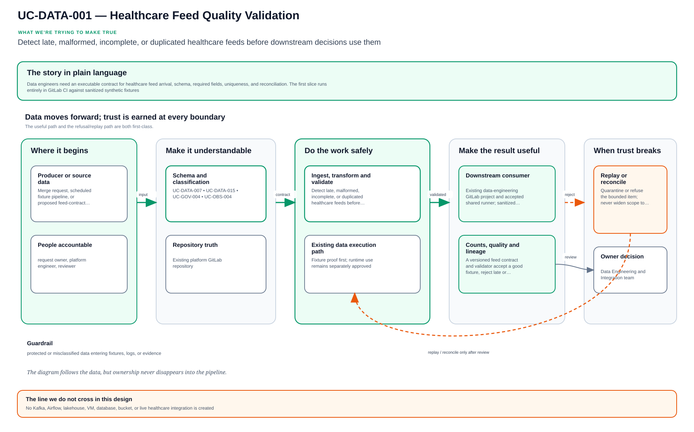

# UC-DATA-001: Healthcare Feed Quality Validation

Last verified: 2026-08-13

## Use-case record

| Field | Value |
| --- | --- |
| Canonical portfolio use case | Data Quality Validation |
| Primary platform | Enterprise Data Engineering and Integration Platform |
| Supporting use cases | [UC-DATA-007](UC-DATA-007-schema-registry-and-evolution.md), [UC-DATA-015](UC-DATA-015-data-classification.md), [UC-GOV-004](../governance/UC-GOV-004-cloud-iam-and-rbac-standardization.md), [UC-OBS-004](../observability/UC-OBS-004-centralized-log-management.md) |
| Enterprise alignment | Provider operations, payer operations, risk and compliance |
| Enterprise outcome | Detect late, malformed, incomplete, or duplicated healthcare feeds before downstream decisions use them |
| Supporting platforms | Database, observability, governance, resilience operations |
| Jira epic | `EPIC-DATA-001` — Validate one sanitized healthcare feed contract |
| Change record | Not required for fixture-only CI; required before a live source is connected |
| Target | Existing data-engineering GitLab project and accepted shared runner; sanitized repository fixtures only |
| Current state | **Planned — evidence playbooks exist; no data-platform product is installed** |
| Infrastructure boundary | No Kafka, Airflow, lakehouse, VM, database, bucket, or live healthcare integration is created |
| Owner | Data Engineering and Integration team |

## Purpose

Data engineers need an executable contract for healthcare feed arrival,
schema, required fields, uniqueness, and reconciliation. The first slice runs
entirely in GitLab CI against sanitized synthetic fixtures.

## Expected outcome

A versioned feed contract and validator accept a good fixture, reject late or
invalid fixtures, classify failures, identify the feed owner and consumers,
and publish a report with no protected health information. The pattern can be
promoted to a live source only through a separate approved integration change.

## Platform and enterprise fit

| Relationship | Detailed fit |
| --- | --- |
| Owning platform | **Healthcare Feed Quality Validation** belongs to the Enterprise Data Engineering and Integration Platform because that platform turns versioned data contracts and pipelines into quality, lineage, replay, reconciliation, and governed consumption. |
| Enterprise consumers | The capability supports provider, payer, analytics, AI, and shared-platform data flows. |
| Enterprise outcome | Its planned result advances: Detect late, malformed, incomplete, or duplicated healthcare feeds before downstream decisions use them. |
| Control contribution | The design adds data ownership, protected-data boundaries, traceability, failure isolation, and recoverable processing. |
| Cross-platform handoff | Supporting platforms consume a reviewed result or evidence artifact; they do not take ownership away from the primary platform. |
| Infrastructure boundary | Fit is achieved by reusing documented existing repositories, control planes, services, and targets—not by inventing capacity or treating planned products as available. |

The platform fit is therefore based on ownership and a reusable decision, not
on the presence of a particular tool. Enterprise fit requires evidence that the
named outcome was observed for the bounded scope; completing documentation or
running an isolated technology demonstration is insufficient.

## Trigger and actors

| Item | Definition |
| --- | --- |
| Trigger | Merge request, scheduled fixture pipeline, or proposed feed-contract change |
| Source owner | Defines delivery and schema expectations |
| Data engineer | Implements validator and failure handling |
| Data consumer | Defines downstream impact and reconciliation tolerance |
| Governance reviewer | Reviews classification, retention, and protected-data boundary |

## Preconditions

- Fixtures are synthetic and contain no real patient, member, claim, or
  provider records.
- `gitlab-runner-shared01` remains accepted for validation jobs.
- The contract names one provider or payer workflow and its downstream owner.
- No runtime connection string, secret, or endpoint is committed.

## Scope and exclusions

In scope are contract schema, synthetic CSV/JSON/FHIR-like fixtures, freshness,
schema, required-field, uniqueness, count, and reconciliation checks. Live EHR,
FHIR, HL7, X12, claims, eligibility, Kafka, CDC, Airflow, object storage, and
production data are excluded.

## Architecture context

Healthcare Feed Quality Validation is evaluated inside the existing enterprise lab and the owning
platform's current source-control and execution boundaries. The architectural
unit is the governed outcome—**Detect late, malformed, incomplete, or duplicated healthcare feeds before downstream decisions use them**—rather than a new product or
environment.

| Context element | Architecture statement |
| --- | --- |
| Business and operational setting | Enterprise consumers: Provider operations, payer operations, risk and compliance. The result must be explainable, repeatable, and owned. |
| Current state | **Planned — evidence playbooks exist; no data-platform product is installed** |
| Desired state | A reviewed contract drives a bounded result, machine-readable evidence, and a safe stop or recovery decision. |
| Existing target boundary | Existing data-engineering GitLab project and accepted shared runner; sanitized repository fixtures only |
| Infrastructure constraint | No Kafka, Airflow, lakehouse, VM, database, bucket, or live healthcare integration is created |
| Accountable platform owner | Data Engineering and Integration team; the consuming service, data, security, or workflow owner remains accountable for accepting business impact. |

The page owns the contract, control logic, evidence, and recovery behavior for
Healthcare Feed Quality Validation. It does not absorb the responsibilities of the dependency use cases
listed below.

## Architecture diagram

The solid paths show how reviewed demand becomes a bounded decision and evidence. The dashed return path makes recovery and owner acceptance part of the architecture, not an afterthought. Planned control logic remains separate from the existing execution and target boundaries.

## Dependencies and handoffs

Healthcare Feed Quality Validation remains accountable to its primary platform. The dependencies below
provide explicit contracts or assurance evidence; they do not become alternate owners.

| Relationship | Use case | Required handoff | Failure propagation |
| --- | --- | --- | --- |
| Required upstream contract | [UC-DATA-007: Schema Registry and Evolution](UC-DATA-007-schema-registry-and-evolution.md) | schema identity, compatibility mode, and consumer adoption window | Missing, stale, or failed evidence blocks promotion or runtime action. |
| Required upstream contract | [UC-DATA-015: Data Classification](UC-DATA-015-data-classification.md) | data classification and permitted handling rules | Missing, stale, or failed evidence blocks promotion or runtime action. |
| Coordinated assurance handoff | [UC-GOV-004: Cloud IAM and RBAC Standardization](../governance/UC-GOV-004-cloud-iam-and-rbac-standardization.md) | principal, role, resource, and approval policy | Missing, stale, or failed evidence blocks promotion or runtime action. |
| Coordinated assurance handoff | [UC-OBS-004: Centralized Log Management](../observability/UC-OBS-004-centralized-log-management.md) | sanitized log fields, source identity, and retention route | Missing, stale, or failed evidence blocks promotion or runtime action. |

Before Healthcare Feed Quality Validation is implemented, every handoff must resolve to an immutable
revision and machine-readable artifact. A URL, screenshot, or verbal approval
alone is not sufficient dependency evidence.

## Quality attributes

For Healthcare Feed Quality Validation, quality is measured against the bounded enterprise outcome—not
document length or a green job. Unapproved business thresholds remain explicit
decisions and must not be invented.

| Attribute | Required measure or invariant | Decision state |
| --- | --- | --- |
| Functional correctness | Every required input is validated; **Detect late, malformed, incomplete, or duplicated healthcare feeds before downstream decisions use them** is evaluated against positive, negative, missing-input, and unauthorized-scope cases. | Fixed design requirement |
| Performance and scale | Establish a baseline for freshness, completeness, throughput, reconciliation accuracy, and replay safety on existing capacity; the owner must approve warning and blocking thresholds before runtime promotion. | Thresholds `TBD` before implementation |
| Reliability | Missing prerequisites, stale dependencies, malformed evidence, and partial results fail closed without widening scope. | Fixed design requirement |
| Recovery | Record the maximum acceptable interruption and recovery time before runtime use; source-only validation must remain zero-change. | Owner decision required before runtime exercise |
| Observability | Emit use-case ID, revision, target, executor, start/end time, duration, decision, reason code, and recovery reference. | Required in the result schema |
| Evidence retention | Assign classification, retention period, and deletion owner before storing runtime evidence. | Security/compliance decision required |

Load, latency, availability, retention, RTO, and RPO values for Healthcare Feed Quality Validation become
requirements only after the named service or business owner approves them. Until
then, the implementation gate records them as unresolved instead of quietly
choosing defaults.

## Security and privacy architecture

The Healthcare Feed Quality Validation design separates source validation, privileged execution, target
access, and evidence review. Those boundaries remain in force even when one
engineer can access more than one system.

| Trust boundary | Allowed flow | Required control |
| --- | --- | --- |
| Contributor → GitLab | Reviewed source, contract, and synthetic/sanitized fixtures | Protected branch rules, peer review, secret scanning, and immutable commit identity |
| GitLab runner → result artifact | Read-only evaluation inputs and machine-readable output | No target-changing credential; pinned tool versions; artifact checksum and expiry |
| Approval plane → executor | Approved revision, target allowlist, mode, canary, and change reference | Separate authorization through the existing Jenkins/AWX or platform control path |
| Executor → existing target | Minimum commands or API operations required for Healthcare Feed Quality Validation | Least-privilege identity, explicit target limit, timeout, and stop condition |
| Target → evidence store | Sanitized metadata, measurements, decision, and recovery result | Exclude credentials, tokens, private keys, kubeconfigs, packet payloads, PHI, PII, and unrelated records |

For Healthcare Feed Quality Validation, the primary threat is **protected or misclassified data entering fixtures, logs, or evidence**. The mandatory response is
synthetic/de-identified fixtures, classification gates, field-level redaction, scoped identities, and metadata-only diagnostics. Authentication and authorization mappings must name
the existing identity source, principal or service account, permitted actions,
credential owner, rotation path, and emergency revocation procedure before a
runtime story can move beyond `Planned`.

## Architecture decisions and trade-offs

| Decision | Selected architecture | Alternative deferred or rejected | Rationale and status |
| --- | --- | --- | --- |
| First implementation slice | Contract, schema, fixtures, and read-only evidence on the existing GitLab runner | Product installation or broad runtime rollout | Proves behavior without expanding infrastructure; **approved design direction** |
| Runtime execution | Use only Approved existing data execution path when current inventory and change approval confirm it is available | Direct operator changes or credentials in CI | Preserves separation of duties; **conditional on implementation review** |
| Evidence | Machine-readable result is authoritative; screenshots are optional supporting material | Screenshot-only acceptance | Enables repeatable audit and automated gates; **approved design direction** |
| Failure handling | Fail closed, preserve bounded diagnostics, and recover only the named scope | Continue with partial or stale evidence | Prevents false success and hidden blast radius; **approved design direction** |
| New capacity or product | Stop and raise a separate architecture decision | Silently add a VM, service, cloud dependency, or cluster add-on | Maintains the existing-lab constraint; **mandatory** |

### Open decisions before implementation

| Open decision | Decision owner | Resolution gate |
| --- | --- | --- |
| Exact inventory object and first canary | Platform owner plus consuming service/data owner | Must resolve before the implementation story leaves `Planned` |
| Performance, scale, and reliability thresholds | Service owner and SRE | Must be recorded before a runtime acceptance run |
| Identity-to-action authorization matrix | Platform owner and security reviewer | Must be approved before target credentials are attached |
| Evidence classification and retention | Data/security owner | Must be approved before runtime artifacts are retained |

If any selected approach changes, record the rationale beside UC-DATA-001 in
the implementation repository before code review. A documentation edit alone
does not approve the new architecture.

## Implementation design

The first Healthcare Feed Quality Validation implementation is deliberately source-only. Its planned files live in the existing repository; none provisions infrastructure.

| Planned source responsibility | Exact planned location |
| --- | --- |
| Use-case contract and target allowlist | `midhhealth/data-and-integration/data-engineering-platform/contracts/uc-data-001.yaml` |
| Primary implementation | `midhhealth/data-and-integration/data-engineering-platform/src/use_cases/healthcare-feed-quality.py`; entry point: the `run_healthcare_feed_quality` evaluation entry point |
| Machine-readable result schema | `midhhealth/data-and-integration/data-engineering-platform/schemas/uc-data-001-result.schema.json` |
| Positive, negative, malformed, and recovery fixtures | `midhhealth/data-and-integration/data-engineering-platform/tests/fixtures/uc-data-001/` |
| GitLab source gate | `midhhealth/data-and-integration/data-engineering-platform/.gitlab/ci/uc-data-001.yml` |
| Operator diagnosis and recovery | `midhhealth/data-and-integration/data-engineering-platform/docs/runbooks/uc-data-001.md` |

### Delivery stages

1. **Contract:** add the contract, schema, owners, dependency revisions, target
   allowlist, modes, reason codes, and open-decision values.
2. **Source validation:** lint exact paths, validate schema compatibility, scan
   for sensitive content, and run every fixture on the existing runner.
3. **Read-only proof:** execute the `run_healthcare_feed_quality` evaluation entry point, publish a checksummed result, and
   prove that blocked cases cannot reach a mutating path.
4. **Bounded execution:** only after separate approval, pass the immutable
   revision, target, mode, canary, and change ID to Approved existing data execution path.
5. **Independent verification:** measure the expected result, confirm unrelated
   state is unchanged, run recovery or zero-change proof, and obtain owner
   review.

The implementation merge request must link this page, the dependency artifacts,
the decision values above, and the eventual pipeline/job/run identifiers. Code
completion alone cannot promote the page to runtime verified.

## Code and configuration map

| Repository | Planned path | Responsibility |
| --- | --- | --- |
| `data-engineering-platform` | `contracts/sample-healthcare-feed.yml` | Owner, cadence, schema, quality rules, consumers, and classification |
| same | `schemas/feed-contract.schema.json` | Contract validation |
| same | `fixtures/sample-healthcare-feed/` | Synthetic positive and negative data only |
| same | `scripts/validate-feed.py` | Deterministic quality checks and exit codes |
| same | `schemas/feed-quality-report.schema.json` | Machine-readable result contract |
| `enterprise-architecture-docs` | `docs/documentation-standard.md` | Protected-data and evidence requirements |

## Jira breakdown

### STORY-DATA-001: Define a feed-to-enterprise contract

**Description:** Source and consumer owners need one contract that explains how
a sanitized feed supports a provider or payer workflow and what makes delivery
usable.

**Status:** Planned.

**Acceptance criteria:** The contract names source owner, consumer, business
workflow, cadence, schema version, required fields, uniqueness key, count
tolerance, data class, retention, and escalation route.

**Implementation steps:** Select a synthetic claims, eligibility, or care-event
shape, write the contract, validate its schema, and review with both owners.

**Completed work:** Required enterprise traceability is documented; no feed
contract is implemented.

**Validation and rollback:** Run schema checks. Revert unsupported fields or
claims rather than inventing a live source.

**Required attachments:** `ART-DATA-001A` validated contract.

### STORY-DATA-002: Validate positive and failure fixtures

**Description:** Data engineers need deterministic checks that make freshness,
schema, completeness, duplication, and reconciliation failures visible in CI.

**Status:** Planned.

**Acceptance criteria:** Good fixture passes; late, incompatible, missing-field,
duplicate-key, and count-mismatch fixtures fail with distinct codes; output has
no record payloads.

**Implementation steps:** Build fixtures, implement validator, add unit tests,
and publish only aggregate metrics and bounded sample identifiers.

**Completed work:** No validator or fixture suite is claimed.

**Validation and rollback:** Run the complete fixture matrix. Revert validator
changes when expected failure classes are not stable.

**Required attachments:** `ART-DATA-002A` CI fixture matrix.

### STORY-DATA-003: Produce an owned quality decision

**Description:** Source and consumer teams need a report that identifies impact
and a safe replay or stop decision without connecting to a live pipeline.

**Status:** Planned.

**Acceptance criteria:** Report includes contract revision, observed metrics,
failure class, owner, affected consumer, and recommended stop/replay/reject
decision; it never contains PHI or production identifiers.

**Implementation steps:** Generate schema-valid reports, test redaction, publish
expiring artifacts, and document the separate live-integration gate.

**Completed work:** Report fields are specified; no runtime artifact exists.

**Validation and rollback:** Validate report and redaction schemas. Remove
artifacts immediately if sensitive content appears.

**Required attachments:** `ART-DATA-003A` sanitized quality decision report.

## Evidence and screenshot register

| ID | Evidence | Source | Status |
| --- | --- | --- | --- |
| `ART-DATA-001A` | Feed contract validation | GitLab CI | Pending |
| `ART-DATA-002A` | Positive/negative fixture matrix | GitLab CI | Pending |
| `ART-DATA-003A` | Sanitized quality report | Protected CI artifact | Pending |

## Expected versus current result

| Measure | Expected | Current |
| --- | --- | --- |
| Enterprise traceability | Feed names business workflow and consumers | Specification only |
| Quality coverage | Six deterministic outcome classes | Pending |
| Protected data | Zero real healthcare records | Required; fixture review pending |

## Acceptance decision

**Planned.** Accept the fixture slice after contract review, full CI matrix,
report-schema validation, and protected-data review. Live source integration
remains a separate change.

## Operational, security, and follow-up notes

- Synthetic fixtures must be visibly artificial and independently reviewed.
- Do not add a live endpoint or credential to make the example appear real.
- Map failures to consumers before later orchestration or alerting work.
- Copy implementation stories to the data-engineering GitLab project and
  return CI evidence here.
