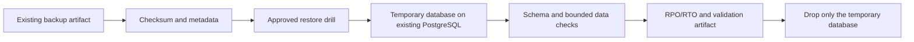

# UC-DB-001: Automated PostgreSQL Restore Validation

Last verified: 2026-08-13

## Use-case record

| Field | Value |
| --- | --- |
| Canonical portfolio use case | Automated Restore Validation |
| Primary platform | Enterprise Database Engineering and Reliability Platform |
| Enterprise alignment | Provider operations, payer operations, operational resilience |
| Enterprise outcome | Prove that a database backup supporting enterprise workflows is usable before an incident |
| Supporting platforms | Resilience operations, Linux systems, governance, observability |
| Jira epic | `EPIC-DB-001` — Prove PostgreSQL backup recoverability |
| Change record | Required before any live restore exercise |
| Target | Existing PostgreSQL 18 service, `backup.example.com`, MinIO, GitLab, Jenkins, and AWX paths |
| Current state | **Planned — PostgreSQL is active; restore acceptance is not claimed** |
| Infrastructure boundary | No VM, database server, storage system, or product is created |
| Owner | Database Reliability team |

## Purpose

Database and service owners need evidence that an existing PostgreSQL backup
can be restored, validated, and removed safely. Backup job success alone does
not prove recovery.

## Expected outcome

An approved workflow selects a backup by immutable identifier, verifies its
checksum and metadata, restores it into an isolated temporary database on the
existing PostgreSQL service, runs schema and bounded data checks, records
duration against RTO, and drops the temporary database after evidence capture.

## Platform and enterprise fit

| Relationship | Detailed fit |
| --- | --- |
| Owning platform | **Automated PostgreSQL Restore Validation** belongs to the Enterprise Database Engineering and Reliability Platform because that platform turns database policy and operations into read-only validation, approved automation, performance evidence, and recoverability. |
| Enterprise consumers | The capability supports transactional and operational data services supporting provider, payer, and shared applications. |
| Enterprise outcome | Its planned result advances: Prove that a database backup supporting enterprise workflows is usable before an incident. |
| Control contribution | The design adds data protection, least privilege, bounded workload, backup integrity, and recovery proof. |
| Cross-platform handoff | Supporting platforms consume a reviewed result or evidence artifact; they do not take ownership away from the primary platform. |
| Infrastructure boundary | Fit is achieved by reusing documented existing repositories, control planes, services, and targets—not by inventing capacity or treating planned products as available. |

The platform fit is therefore based on ownership and a reusable decision, not
on the presence of a particular tool. Enterprise fit requires evidence that the
named outcome was observed for the bounded scope; completing documentation or
running an isolated technology demonstration is insufficient.

## Trigger and actors

| Item | Definition |
| --- | --- |
| Trigger | Scheduled recovery drill or approved operator-started Jenkins/AWX workflow |
| Database engineer | Selects backup and owns restore procedure |
| Service/data owner | Supplies non-sensitive validation assertions |
| SRE | Reviews RTO/RPO and recovery evidence |
| Security reviewer | Verifies credential, access, and artifact boundaries |

## Preconditions

- `postgres.example.com` is the verified PostgreSQL 18 target.
- Backup location, format, retention, checksum, and encryption state are known.
- The temporary database name is generated under a strict allowlist and cannot
  match an application database.
- Credentials are injected through AWX/Jenkins and never printed.
- Capacity checks show enough space and connections for the bounded exercise.

## Scope and exclusions

In scope are backup discovery, integrity checks, isolated restore, schema/data
assertions, timing, cleanup, and evidence. Restoring over a live database,
creating a new server or VM, changing retention, production failover, and use
of protected healthcare data in artifacts are excluded.

## End-to-end execution flow

## Code and configuration map

| Repository | Planned path | Responsibility |
| --- | --- | --- |
| `database-reliability-platform` | `playbooks/validate-postgresql-restore.yml` | Preflight, restore, validate, and cleanup orchestration |
| same | `roles/postgresql_restore_validation/` | Guarded restore implementation |
| same | `config/restore-targets.yml` | Existing service, backup source, owner, RPO/RTO, and assertion set |
| same | `scripts/validate-restore-report.py` | Evidence schema and sensitive-data checks |
| `jenkins-jobs` | planned database restore-validation job | PLAN and confirmed DRILL interface |
| `enterprise-architecture-docs` | `docs/vm-inventory.md` and `docs/product-versions.md` | Canonical target and version boundary |

## Jira breakdown

### STORY-DB-001: Inventory backup and recovery contracts

**Description:** Database and service owners need each selected database mapped
to its backup source, retention, owner, validation assertions, RPO, and RTO.

**Status:** Planned.

**Acceptance criteria:** Only existing databases and backup sources are listed;
every entry has owner and non-sensitive assertions; unknown or stale backups
fail before restore.

**Implementation steps:** Build the target map, validate its schema, query
backup metadata read-only, and reconcile it with environment documentation.

**Completed work:** PostgreSQL and related lab services are documented; the
restore target map is pending.

**Validation and rollback:** Test valid, missing, expired, and checksum-failed
fixtures. Revert invalid mappings; no database mutation occurs.

**Required attachments:** `ART-DB-001A` backup readiness report.

### STORY-DB-002: Restore into a guarded temporary database

**Description:** Database engineers need a repeatable restore that cannot
overwrite or connect as owner to a live application database.

**Status:** Planned.

**Acceptance criteria:** PLAN shows backup, target, size, and temporary name;
DRILL requires explicit confirmation; denylist/allowlist guards block live
names; restore uses least privilege and records duration.

**Implementation steps:** Implement preflight and naming guards, restore the
selected artifact, capture server and backup versions, and stop on any mismatch.

**Completed work:** Safety contract is specified; no restore run is claimed.

**Validation and rollback:** Run unit fixtures before a canary drill. On
failure, terminate only drill sessions and drop only the generated temporary
database after evidence capture.

**Required attachments:** `ART-DB-002A` approved restore job and timing.

### STORY-DB-003: Validate recovery and prove cleanup

**Description:** Service owners and SRE need machine-readable proof that the
restored schema and bounded records meet expectations and cleanup succeeded.

**Status:** Planned.

**Acceptance criteria:** Assertions pass, RPO/RTO are calculated, no protected
row content is published, the temporary database is removed, and a second
inventory check proves no residue.

**Implementation steps:** Run schema/count checks, generate the report, drop
the drill database, verify absence, and link any incident or failed assertion.

**Completed work:** Evidence fields are defined; runtime proof is pending.

**Validation and rollback:** Validate report schema and cleanup queries. If
cleanup fails, stop subsequent drills and escalate using the database runbook.

**Required attachments:** `ART-DB-003A` validation report and
`ART-DB-003B` cleanup proof.

## Evidence and screenshot register

| ID | Evidence | Source | Status |
| --- | --- | --- | --- |
| `ART-DB-001A` | Backup readiness | AWX/Jenkins artifact | Pending |
| `ART-DB-002A` | Restore execution and duration | AWX job | Pending |
| `ART-DB-003A` | Schema/data assertion report | Protected artifact | Pending |
| `ART-DB-003B` | Temporary-database cleanup | PostgreSQL query artifact | Pending |

## Expected versus current result

| Measure | Expected | Current |
| --- | --- | --- |
| Backup integrity | Selected artifact checksum and metadata pass | Not measured here |
| Recovery | Isolated restore meets assertions and RTO | Not run |
| Cleanup | Temporary database absent after drill | Not run |

## Acceptance decision

**Planned.** PostgreSQL being active is not restore acceptance. Accept after a
controlled drill, assertion evidence, measured RPO/RTO, cleanup proof, and a
documented recovery path for drill failure.

## Operational, security, and follow-up notes

- Use synthetic or approved non-sensitive assertions; never publish row data.
- Separate backup read credentials from live database administration.
- Stop if version compatibility, capacity, or backup provenance is unclear.
- Copy implementation stories to the database GitLab project and return the
  accepted drill evidence here.
