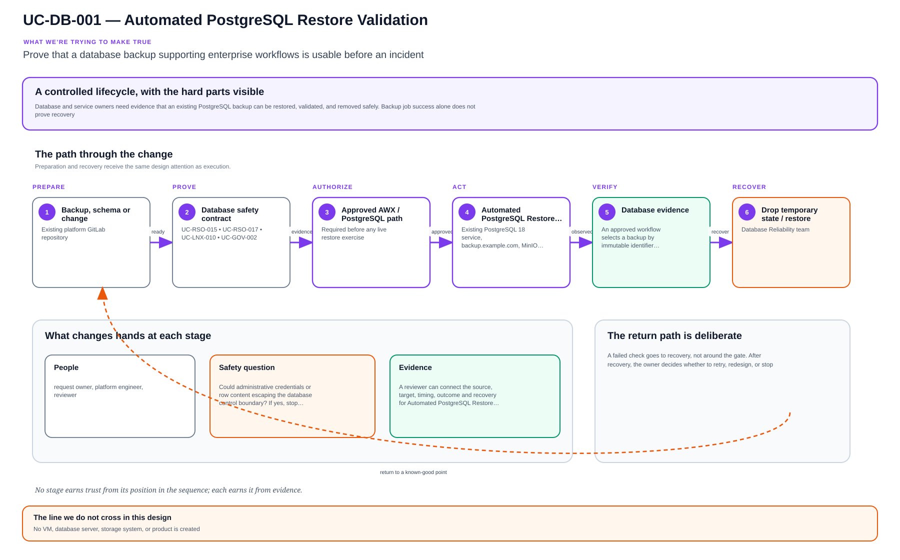

# UC-DB-001: Automated PostgreSQL Restore Validation

Last verified: 2026-08-13

## Use-case record

| Field | Value |
| --- | --- |
| Canonical portfolio use case | Automated Restore Validation |
| Primary platform | Enterprise Database Engineering and Reliability Platform |
| Supporting use cases | [UC-RSO-015](../resilience/UC-RSO-015-backup-and-recovery-orchestration.md), [UC-LNX-010](../linux/UC-LNX-010-filesystem-lvm-storage-management.md), [UC-RSO-017](../resilience/UC-RSO-017-rto-and-rpo-measurement.md), [UC-GOV-002](../governance/UC-GOV-002-secrets-management-automation.md) |
| Primary implementation repository | `midhhealth/data-and-integration/database-reliability-platform` |
| Enterprise alignment | Provider operations, payer operations, operational resilience |
| Enterprise outcome | Prove that a database backup supporting enterprise workflows is usable before an incident |
| Supporting platforms | Resilience operations, Linux systems, governance, observability |
| Jira epic | `EPIC-DB-001` — Prove PostgreSQL backup recoverability |
| Change record | Required before any live restore exercise |
| Target | Existing PostgreSQL 18 service, `backup.example.com`, MinIO, GitLab, Jenkins, and AWX paths |
| Current state | **Planned — PostgreSQL is active; restore acceptance is not claimed** |
| Infrastructure boundary | No VM, database server, storage system, or product is created |
| Owner | Database Reliability team |

## Purpose

Database and service owners need evidence that an existing PostgreSQL backup
can be restored, validated, and removed safely. Backup job success alone does
not prove recovery.

## Expected outcome

An approved workflow selects a backup by immutable identifier, verifies its
checksum and metadata, restores it into an isolated temporary database on the
existing PostgreSQL service, runs schema and bounded data checks, records
duration against RTO, and drops the temporary database after evidence capture.

## Platform and enterprise fit

| Relationship | Detailed fit |
| --- | --- |
| Owning platform | **Automated PostgreSQL Restore Validation** belongs to the Enterprise Database Engineering and Reliability Platform because that platform turns database policy and operations into read-only validation, approved automation, performance evidence, and recoverability. |
| Enterprise consumers | The capability supports transactional and operational data services supporting provider, payer, and shared applications. |
| Enterprise outcome | Its planned result advances: Prove that a database backup supporting enterprise workflows is usable before an incident. |
| Control contribution | The design adds data protection, least privilege, bounded workload, backup integrity, and recovery proof. |
| Cross-platform handoff | Supporting platforms consume a reviewed result or evidence artifact; they do not take ownership away from the primary platform. |
| Infrastructure boundary | Fit is achieved by reusing documented existing repositories, control planes, services, and targets—not by inventing capacity or treating planned products as available. |

The platform fit is therefore based on ownership and a reusable decision, not
on the presence of a particular tool. Enterprise fit requires evidence that the
named outcome was observed for the bounded scope; completing documentation or
running an isolated technology demonstration is insufficient.

## Trigger and actors

| Item | Definition |
| --- | --- |
| Trigger | Scheduled recovery drill or approved operator-started Jenkins/AWX workflow |
| Database engineer | Selects backup and owns restore procedure |
| Service/data owner | Supplies non-sensitive validation assertions |
| SRE | Reviews RTO/RPO and recovery evidence |
| Security reviewer | Verifies credential, access, and artifact boundaries |

## Preconditions

- `postgres.example.com` is the verified PostgreSQL 18 target.
- Backup location, format, retention, checksum, and encryption state are known.
- The temporary database name is generated under a strict allowlist and cannot
  match an application database.
- Credentials are injected through AWX/Jenkins and never printed.
- Capacity checks show enough space and connections for the bounded exercise.

## Scope and exclusions

In scope are backup discovery, integrity checks, isolated restore, schema/data
assertions, timing, cleanup, and evidence. Restoring over a live database,
creating a new server or VM, changing retention, production failover, and use
of protected healthcare data in artifacts are excluded.

## Design walkthrough

A useful way for a new engineer to understand Automated PostgreSQL Restore Validation is to
protect client compatibility and data correctness while the database state changes underneath
them. The result MidhHealth needs is to Prove that a database backup supporting enterprise
workflows is usable before an incident. Database Reliability team owns the platform decision,
while the consuming service or business owner still accepts the effect on its workflow.

Follow the object from creation through change, operation and retirement; every transition needs
an owner and a recoverable prior state. In this page, **UC-RSO-015: Backup and Recovery
Orchestration** contributes readiness or exercise result tied to observed service recovery;
**UC-LNX-010: Filesystem, LVM and Storage Management** contributes filesystem capacity, mount
identity, and recovery boundary. The first buildable boundary is Existing PostgreSQL 18 service,
backup.example.com, MinIO, GitLab, Jenkins, and AWX paths. The design stops at this rule: No VM,
database server, storage system, or product is created.

The walkthrough becomes useful when the happy path breaks. If a required dependency or
verification result is unavailable, the expected response is to stop before mutation, preserve
the evidence and return the decision to the accountable owner. The leading design threat is
administrative credentials or row content escaping the database control boundary; therefore a
green source job, screenshot or reachable endpoint is supporting evidence, not acceptance by
itself.

## Architecture context

Automated PostgreSQL Restore Validation is evaluated inside the existing enterprise lab and the owning
platform's current source-control and execution boundaries. The architectural
unit is the governed outcome—**Prove that a database backup supporting enterprise workflows is usable before an incident**—rather than a new product or
environment.

| Context element | Architecture statement |
| --- | --- |
| Business and operational setting | Enterprise consumers: Provider operations, payer operations, operational resilience. The result must be explainable, repeatable, and owned. |
| Current state | **Planned — PostgreSQL is active; restore acceptance is not claimed** |
| Desired state | A reviewed contract drives a bounded result, machine-readable evidence, and a safe stop or recovery decision. |
| Existing target boundary | Existing PostgreSQL 18 service, `backup.example.com`, MinIO, GitLab, Jenkins, and AWX paths |
| Infrastructure constraint | No VM, database server, storage system, or product is created |
| Accountable platform owner | Database Reliability team; the consuming service, data, security, or workflow owner remains accountable for accepting business impact. |

The page owns the contract, control logic, evidence, and recovery behavior for
Automated PostgreSQL Restore Validation. It does not absorb the responsibilities of the dependency use cases
listed below.

## Architecture diagram

Read the timeline as a controlled change, not a happy-path checklist. Preparation, authorization, verification, and recovery are peers, and failure returns to a known-good point.

## Dependencies and handoffs

Automated PostgreSQL Restore Validation remains accountable to its primary platform. The dependencies below
provide explicit contracts or assurance evidence; they do not become alternate owners.

| Relationship | Use case | Required handoff | Failure propagation |
| --- | --- | --- | --- |
| Required upstream contract | [UC-RSO-015: Backup and Recovery Orchestration](../resilience/UC-RSO-015-backup-and-recovery-orchestration.md) | readiness or exercise result tied to observed service recovery | Missing, stale, or contradictory handoff stops the dependent decision and is recorded for the accountable owner. |
| Required upstream contract | [UC-LNX-010: Filesystem, LVM and Storage Management](../linux/UC-LNX-010-filesystem-lvm-storage-management.md) | filesystem capacity, mount identity, and recovery boundary | Missing, stale, or contradictory handoff stops the dependent decision and is recorded for the accountable owner. |
| Coordinated assurance handoff | [UC-RSO-017: RTO and RPO Measurement](../resilience/UC-RSO-017-rto-and-rpo-measurement.md) | readiness or exercise result tied to observed service recovery | Missing, stale, or contradictory handoff stops the dependent decision and is recorded for the accountable owner. |
| Coordinated assurance handoff | [UC-GOV-002: Secrets Management Automation](../governance/UC-GOV-002-secrets-management-automation.md) | explainable compliance or remediation decision with expiry and recovery state | Missing, stale, or contradictory handoff stops the dependent decision and is recorded for the accountable owner. |

Before Automated PostgreSQL Restore Validation is implemented, every handoff must resolve to an immutable
revision and machine-readable artifact. A URL, screenshot, or verbal approval
alone is not sufficient dependency evidence.

## Quality attributes

For Automated PostgreSQL Restore Validation, quality is measured against the bounded enterprise outcome—not
document length or a green job. Unapproved business thresholds remain explicit
decisions and must not be invented.

| Attribute | Required measure or invariant | Decision state |
| --- | --- | --- |
| Functional correctness | Every required input is validated; **Prove that a database backup supporting enterprise workflows is usable before an incident** is evaluated against positive, negative, missing-input, and unauthorized-scope cases. | Fixed design requirement |
| Performance and scale | Establish a baseline for query or job duration, connection impact, recovery objectives, and data correctness on existing capacity; the owner must approve warning and blocking thresholds before runtime promotion. | Thresholds `TBD` before implementation |
| Reliability | Missing prerequisites, stale dependencies, malformed evidence, and partial results fail closed without widening scope. | Fixed design requirement |
| Recovery | Record owner-approved RTO/RPO and consistency point before a stateful drill; use `TBD` with owner and decision date until approved. | Owner decision required before runtime exercise |
| Observability | Emit use-case ID, revision, target, executor, start/end time, duration, decision, reason code, and recovery reference. | Required in the result schema |
| Evidence retention | Assign classification, retention period, and deletion owner before storing runtime evidence. | Security/compliance decision required |

Load, latency, availability, retention, RTO, and RPO values for Automated PostgreSQL Restore Validation become
requirements only after the named service or business owner approves them. Until
then, the implementation gate records them as unresolved instead of quietly
choosing defaults.

## Security and privacy architecture

The Automated PostgreSQL Restore Validation design separates source validation, privileged execution, target
access, and evidence review. Those boundaries remain in force even when one
engineer can access more than one system.

| Trust boundary | Allowed flow | Required control |
| --- | --- | --- |
| Contributor → GitLab | Reviewed source, contract, and synthetic/sanitized fixtures | Protected branch rules, peer review, secret scanning, and immutable commit identity |
| GitLab runner → result artifact | Read-only evaluation inputs and machine-readable output | No target-changing credential; pinned tool versions; artifact checksum and expiry |
| Approval plane → executor | Approved revision, target allowlist, mode, canary, and change reference | Separate authorization through the existing Jenkins/AWX or platform control path |
| Executor → existing target | Minimum commands or API operations required for Automated PostgreSQL Restore Validation | Least-privilege identity, explicit target limit, timeout, and stop condition |
| Target → evidence store | Sanitized metadata, measurements, decision, and recovery result | Exclude credentials, tokens, private keys, kubeconfigs, packet payloads, PHI, PII, and unrelated records |

For Automated PostgreSQL Restore Validation, the primary threat is **administrative credentials or row content escaping the database control boundary**. The mandatory response is
separate read/admin identities, database allowlists, temporary-object guards, encrypted credentials, and metadata-only evidence. Authentication and authorization mappings must name
the existing identity source, principal or service account, permitted actions,
credential owner, rotation path, and emergency revocation procedure before a
runtime story can move beyond `Planned`.

## Architecture decisions and trade-offs

| Decision | Selected architecture | Alternative deferred or rejected | Rationale and status |
| --- | --- | --- | --- |
| First implementation slice | Contract, schema, fixtures, and read-only evidence on the existing GitLab runner | Product installation or broad runtime rollout | Proves behavior without expanding infrastructure; **approved design direction** |
| Runtime execution | Use only Approved Jenkins/AWX database workflow when current inventory and change approval confirm it is available | Direct operator changes or credentials in CI | Preserves separation of duties; **conditional on implementation review** |
| Evidence | Machine-readable result is authoritative; screenshots are optional supporting material | Screenshot-only acceptance | Enables repeatable audit and automated gates; **approved design direction** |
| Failure handling | Fail closed, preserve bounded diagnostics, and recover only the named scope | Continue with partial or stale evidence | Prevents false success and hidden blast radius; **approved design direction** |
| New capacity or product | Stop and raise a separate architecture decision | Silently add a VM, service, cloud dependency, or cluster add-on | Maintains the existing-lab constraint; **mandatory** |

### Open decisions before implementation

| Open decision | Decision owner | Resolution gate |
| --- | --- | --- |
| Exact inventory object and first canary | Platform owner plus consuming service/data owner | Must resolve before the implementation story leaves `Planned` |
| Performance, scale, and reliability thresholds | Service owner and SRE | Must be recorded before a runtime acceptance run |
| Identity-to-action authorization matrix | Platform owner and security reviewer | Must be approved before target credentials are attached |
| Evidence classification and retention | Data/security owner | Must be approved before runtime artifacts are retained |

If any selected approach changes, record the rationale beside UC-DB-001 in
the implementation repository before code review. A documentation edit alone
does not approve the new architecture.

## Implementation design

The first Automated PostgreSQL Restore Validation implementation is deliberately source-only. Its planned files live in the existing repository; none provisions infrastructure.

| Planned source responsibility | Exact planned location |
| --- | --- |
| Use-case contract and target allowlist | `midhhealth/data-and-integration/database-reliability-platform/contracts/uc-db-001.yaml` |
| Primary implementation | `midhhealth/data-and-integration/database-reliability-platform/playbooks/backup-restore-validation.yml`; entry point: the `backup-restore-validation` database playbook and report validator |
| Machine-readable result schema | `midhhealth/data-and-integration/database-reliability-platform/schemas/uc-db-001-result.schema.json` |
| Positive, negative, malformed, and recovery fixtures | `midhhealth/data-and-integration/database-reliability-platform/tests/fixtures/uc-db-001/` |
| GitLab source gate | `midhhealth/data-and-integration/database-reliability-platform/.gitlab/ci/uc-db-001.yml` |
| Operator diagnosis and recovery | `midhhealth/data-and-integration/database-reliability-platform/docs/runbooks/uc-db-001.md` |

### Delivery stages

1. **Contract:** add the contract, schema, owners, dependency revisions, target
   allowlist, modes, reason codes, and open-decision values.
2. **Source validation:** lint exact paths, validate schema compatibility, scan
   for sensitive content, and run every fixture on the existing runner.
3. **Read-only proof:** execute the `backup-restore-validation` database playbook and report validator, publish a checksummed result, and
   prove that blocked cases cannot reach a mutating path.
4. **Bounded execution:** only after separate approval, pass the immutable
   revision, target, mode, canary, and change ID to Approved Jenkins/AWX database workflow.
5. **Independent verification:** measure the expected result, confirm unrelated
   state is unchanged, run recovery or zero-change proof, and obtain owner
   review.

The implementation merge request must link this page, the dependency artifacts,
the decision values above, and the eventual pipeline/job/run identifiers. Code
completion alone cannot promote the page to runtime verified.

## Code and configuration map

| Repository | Planned path | Responsibility |
| --- | --- | --- |
| `database-reliability-platform` | `playbooks/validate-postgresql-restore.yml` | Preflight, restore, validate, and cleanup orchestration |
| same | `roles/postgresql_restore_validation/` | Guarded restore implementation |
| same | `config/restore-targets.yml` | Existing service, backup source, owner, RPO/RTO, and assertion set |
| same | `scripts/validate-restore-report.py` | Evidence schema and sensitive-data checks |
| `jenkins-jobs` | planned database restore-validation job | PLAN and confirmed DRILL interface |
| `enterprise-architecture-docs` | `docs/vm-inventory.md` and `docs/product-versions.md` | Canonical target and version boundary |

## Jira breakdown

### STORY-DB-001: Inventory backup and recovery contracts

**Description:** Database and service owners need each selected database mapped
to its backup source, retention, owner, validation assertions, RPO, and RTO.

**Status:** Planned.

**Acceptance criteria:** Only existing databases and backup sources are listed;
every entry has owner and non-sensitive assertions; unknown or stale backups
fail before restore.

**Implementation steps:** Build the target map, validate its schema, query
backup metadata read-only, and reconcile it with environment documentation.

**Completed work:** PostgreSQL and related lab services are documented; the
restore target map is pending.

**Validation and rollback:** Test valid, missing, expired, and checksum-failed
fixtures. Revert invalid mappings; no database mutation occurs.

**Required attachments:** `ART-DB-001A` backup readiness report.

### STORY-DB-002: Restore into a guarded temporary database

**Description:** Database engineers need a repeatable restore that cannot
overwrite or connect as owner to a live application database.

**Status:** Planned.

**Acceptance criteria:** PLAN shows backup, target, size, and temporary name;
DRILL requires explicit confirmation; denylist/allowlist guards block live
names; restore uses least privilege and records duration.

**Implementation steps:** Implement preflight and naming guards, restore the
selected artifact, capture server and backup versions, and stop on any mismatch.

**Completed work:** Safety contract is specified; no restore run is claimed.

**Validation and rollback:** Run unit fixtures before a canary drill. On
failure, terminate only drill sessions and drop only the generated temporary
database after evidence capture.

**Required attachments:** `ART-DB-002A` approved restore job and timing.

### STORY-DB-003: Validate recovery and prove cleanup

**Description:** Service owners and SRE need machine-readable proof that the
restored schema and bounded records meet expectations and cleanup succeeded.

**Status:** Planned.

**Acceptance criteria:** Assertions pass, RPO/RTO are calculated, no protected
row content is published, the temporary database is removed, and a second
inventory check proves no residue.

**Implementation steps:** Run schema/count checks, generate the report, drop
the drill database, verify absence, and link any incident or failed assertion.

**Completed work:** Evidence fields are defined; runtime proof is pending.

**Validation and rollback:** Validate report schema and cleanup queries. If
cleanup fails, stop subsequent drills and escalate using the database runbook.

**Required attachments:** `ART-DB-003A` validation report and
`ART-DB-003B` cleanup proof.

## Evidence and screenshot register

| ID | Evidence | Source | Status |
| --- | --- | --- | --- |
| `ART-DB-001A` | Backup readiness | AWX/Jenkins artifact | Pending |
| `ART-DB-002A` | Restore execution and duration | AWX job | Pending |
| `ART-DB-003A` | Schema/data assertion report | Protected artifact | Pending |
| `ART-DB-003B` | Temporary-database cleanup | PostgreSQL query artifact | Pending |

## Expected versus current result

| Measure | Expected | Current |
| --- | --- | --- |
| Backup integrity | Selected artifact checksum and metadata pass | Not measured here |
| Recovery | Isolated restore meets assertions and RTO | Not run |
| Cleanup | Temporary database absent after drill | Not run |

## Acceptance decision

**Planned.** PostgreSQL being active is not restore acceptance. Accept after a
controlled drill, assertion evidence, measured RPO/RTO, cleanup proof, and a
documented recovery path for drill failure.

## Operational, security, and follow-up notes

- Use synthetic or approved non-sensitive assertions; never publish row data.
- Separate backup read credentials from live database administration.
- Stop if version compatibility, capacity, or backup provenance is unclear.
- Copy implementation stories to the database GitLab project and return the
  accepted drill evidence here.
