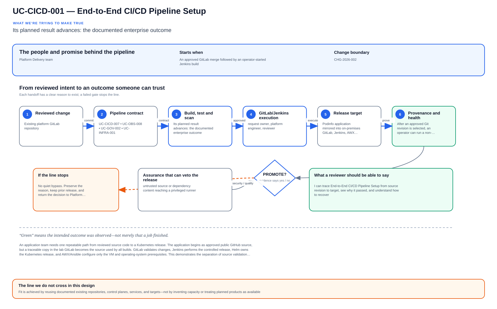
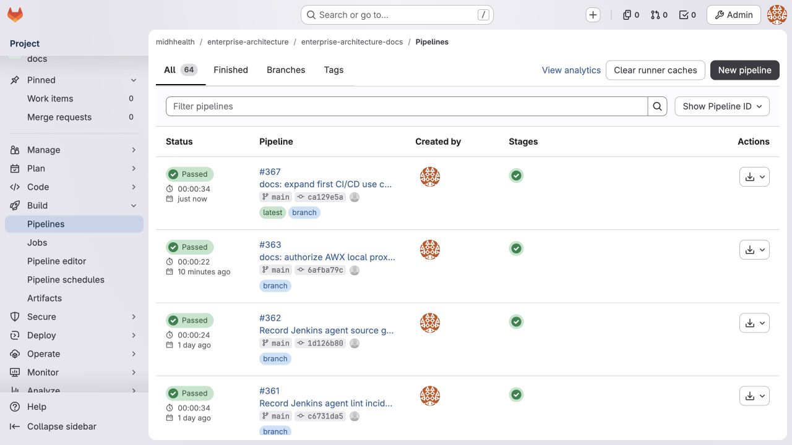

# UC-CICD-001: End-to-End CI/CD Pipeline Setup

Last verified: 2026-08-02

## Use-case record

| Field | Value |
| --- | --- |
| Portfolio | Enterprise DevSecOps Delivery Platform |
| Supporting use cases | [UC-CICD-007](UC-CICD-007-environment-based-release-promotion.md), [UC-OBS-008](../observability/UC-OBS-008-deployment-health-scoring.md), [UC-GOV-002](../governance/UC-GOV-002-secrets-management-automation.md), [UC-INFRA-001](../infrastructure/UC-INFRA-001-terraform-drift-detection.md) |
| Jira epic | `EPIC-CICD-001` — Deliver a controlled application release to Kubernetes |
| Primary roles | Application developer, DevOps engineer, platform engineer, SRE, security reviewer |
| Change record | `CHG-2026-002` |
| Target | Podinfo application mirrored into on-premises GitLab, Jenkins, AWX, dedicated Jenkins agent, and Kubernetes cluster |
| Current state | **In progress — source gates and the dedicated Jenkins agent are accepted; managed ingress-job runtime execution and rollback evidence remain pending** |
| Current blocker | The managed Jenkins ingress job and protected secret-file kubeconfig are not yet accepted; Helm PLAN must pass before deployment begins. |
| Owner | Platform Delivery team |

## Purpose

An application team needs one repeatable path from reviewed source code to a
Kubernetes release. The application begins as approved public GitHub source,
but a traceable copy in the lab GitLab becomes the source used by all builds.
GitLab validates changes, Jenkins performs the controlled
release, Helm owns the Kubernetes release, and AWX/Ansible configure only the
VM and operating-system prerequisites. This demonstrates the separation of
source validation, deployment authorization, configuration management, and
runtime release management expected in an enterprise environment.

## Expected outcome

After an approved Git revision is selected, an operator can run a non-mutating
Helm plan and then an explicitly confirmed deployment from Jenkins. The job
runs only on `jenkins-agent01`, uses a protected kubeconfig, installs the pinned
chart atomically, and proves that the release, rollout, IngressClass,
NodePorts, and Headlamp route are healthy. An operator can then roll the release
back to a known revision and prove service recovery.

The first application payload will be
[`stefanprodan/podinfo`](https://github.com/stefanprodan/podinfo), copied into a
new `midhhealth/applications/podinfo` GitLab project after its exact upstream
commit and Apache-2.0 license are recorded. Podinfo is small, has health and
readiness endpoints, structured logs, Prometheus and OpenTelemetry
instrumentation, fault injection, a Dockerfile, tests, and a Helm chart. Those
features let later SRE and observability stories reuse the same application
without making this first delivery story depend on a large demo platform.

Repositories and pipelines alone do not establish acceptance. Acceptance
requires Jenkins plan, deployment, health, rollback, second
convergence, and evidence attachments from the live environment.

## Platform and enterprise fit

| Relationship | Detailed fit |
| --- | --- |
| Owning platform | **End-to-End CI/CD Pipeline Setup** belongs to the the documented enterprise outcome because that platform turns reviewed source into controlled build, test, security, artifact, promotion, and recovery decisions. |
| Enterprise consumers | The capability supports provider, payer, and shared-platform software changes. |
| Enterprise outcome | Its planned result advances: the documented enterprise outcome. |
| Control contribution | The design adds traceable delivery evidence, separation of duties, and fail-closed gates. |
| Cross-platform handoff | Supporting platforms consume a reviewed result or evidence artifact; they do not take ownership away from the primary platform. |
| Infrastructure boundary | Fit is achieved by reusing documented existing repositories, control planes, services, and targets—not by inventing capacity or treating planned products as available. |

The platform fit is therefore based on ownership and a reusable decision, not
on the presence of a particular tool. Enterprise fit requires evidence that the
named outcome was observed for the bounded scope; completing documentation or
running an isolated technology demonstration is insufficient.

## Trigger and actors

| Item | Definition |
| --- | --- |
| Trigger | An approved GitLab merge followed by an operator-started Jenkins build |
| Developer | Submits code and resolves source validation failures |
| Security reviewer | Reviews dependency, secret, and policy findings where configured |
| DevOps engineer | Maintains pipeline, shared library, and Job DSL |
| Platform engineer | Owns Jenkins agent, kubeconfig, Helm chart, and cluster boundary |
| SRE | Reviews health evidence, rollback, observability, and incident links |
| Approver | Selects the reviewed Git ref and confirms mutating actions |

## Preconditions

- GitLab, Jenkins, AWX, and Kubernetes control planes are healthy.
- `jenkins-agent01.example.com` resolves to `192.168.1.138` and is reachable.
- The dedicated agent is registered with label `kubernetes-deployer`.
- Helm `4.1.0`, a Kubernetes `1.34` compatible `kubectl`, Java 21, and Git are
  installed by the `ansible-jenkins` role.
- Jenkins contains `gitlab-scm` and `kubernetes-production-kubeconfig`
  credentials with appropriate scope.
- The selected Git revision has passed GitLab CI and is protected by the
  repository review policy.
- The upstream Podinfo commit, license, and provenance record have been reviewed
  before the source is imported into GitLab.
- The edge proxy and the Kubernetes control plane allow only the documented
  ingress traffic path.

## Scope and exclusions

In scope are source validation, the managed Jenkins job, the dedicated
executor, Helm plan/deploy/rollback, and release acceptance evidence for the
single-replica on-premises ingress release.

The following are excluded from this documented capability:

- EKS/ECR and other public-cloud deployment;
- high availability for Jenkins or ingress;
- permanent builds on the Jenkins controller;
- application GitOps reconciliation with Argo CD or Flux;
- persistent storage and unrelated product installation; and
- using AWX or Ansible to install the Helm release.

## Public upstream source policy

Public GitHub projects are reference application code, not a trusted runtime
dependency. Builds and deployments must not clone the moving GitHub default
branch. Staff must:

1. review the upstream license and repository ownership;
2. select an immutable upstream commit or signed release tag;
3. scan source, dependencies, secrets, container definition, and license data;
4. import the full required source and license into a GitLab project under
   `midhhealth/applications`;
5. record `UPSTREAM.md` with upstream URL, branch/tag, commit SHA, import date,
   reviewer, local GitLab commit, and intentional local changes;
6. build only from the internal GitLab commit;
7. publish internally built images to Harbor rather than deploying an
   unreviewed public image; and
8. handle upstream refreshes as reviewed merge requests with repeatable tests
   and an explicit comparison from the previous upstream commit.

For this documented capability, the approved candidate is Podinfo. The selection is a design
decision; the import is not yet claimed as completed. Other public projects may
be selected for later use cases only after the current use case is accepted.

## Architecture context

End-to-End CI/CD Pipeline Setup is evaluated inside the existing enterprise lab and the owning
platform's current source-control and execution boundaries. The architectural
unit is the governed outcome—**Its planned result advances: the documented enterprise outcome.**—rather than a new product or
environment.

| Context element | Architecture statement |
| --- | --- |
| Business and operational setting | Enterprise consumers: Enterprise DevSecOps Delivery Platform. The result must be explainable, repeatable, and owned. |
| Current state | **In progress — source gates and the dedicated Jenkins agent are accepted; managed ingress-job runtime execution and rollback evidence remain pending** |
| Desired state | A reviewed contract drives a bounded result, machine-readable evidence, and a safe stop or recovery decision. |
| Existing target boundary | Podinfo application mirrored into on-premises GitLab, Jenkins, AWX, dedicated Jenkins agent, and Kubernetes cluster |
| Infrastructure constraint | Fit is achieved by reusing documented existing repositories, control planes, services, and targets—not by inventing capacity or treating planned products as available. |
| Accountable platform owner | Platform Delivery team; the consuming service, data, security, or workflow owner remains accountable for accepting business impact. |

The page owns the contract, control logic, evidence, and recovery behavior for
End-to-End CI/CD Pipeline Setup. It does not absorb the responsibilities of the dependency use cases
listed below.

## Architecture diagram

The solid paths show how reviewed demand becomes a bounded decision and evidence. The dashed return path makes recovery and owner acceptance part of the architecture, not an afterthought. Planned control logic remains separate from the existing execution and target boundaries.

## Dependencies and handoffs

End-to-End CI/CD Pipeline Setup remains accountable to its primary platform. The dependencies below
provide explicit contracts or assurance evidence; they do not become alternate owners.

| Relationship | Use case | Required handoff | Failure propagation |
| --- | --- | --- | --- |
| Required upstream contract | [UC-CICD-007: Environment-Based Release Promotion](UC-CICD-007-environment-based-release-promotion.md) | environment promotion contract and approval evidence | Missing, stale, or failed evidence blocks promotion or runtime action. |
| Required upstream contract | [UC-OBS-008: Deployment Health Scoring](../observability/UC-OBS-008-deployment-health-scoring.md) | deployment-health score and promotion/rollback signal | Missing, stale, or failed evidence blocks promotion or runtime action. |
| Coordinated assurance handoff | [UC-GOV-002: Secrets Management Automation](../governance/UC-GOV-002-secrets-management-automation.md) | approved secret reference, redaction rule, and rotation owner | Missing, stale, or failed evidence blocks promotion or runtime action. |
| Coordinated assurance handoff | [UC-INFRA-001: Terraform Drift Detection](../infrastructure/UC-INFRA-001-terraform-drift-detection.md) | desired/observed infrastructure identity and drift result | Missing, stale, or failed evidence blocks promotion or runtime action. |

Before End-to-End CI/CD Pipeline Setup is implemented, every handoff must resolve to an immutable
revision and machine-readable artifact. A URL, screenshot, or verbal approval
alone is not sufficient dependency evidence.

## Quality attributes

For End-to-End CI/CD Pipeline Setup, quality is measured against the bounded enterprise outcome—not
document length or a green job. Unapproved business thresholds remain explicit
decisions and must not be invented.

| Attribute | Required measure or invariant | Decision state |
| --- | --- | --- |
| Functional correctness | Every required input is validated; **Its planned result advances: the documented enterprise outcome.** is evaluated against positive, negative, missing-input, and unauthorized-scope cases. | Fixed design requirement |
| Performance and scale | Establish a baseline for pipeline duration, queue delay, reproducibility, and false-pass rate on existing capacity; the owner must approve warning and blocking thresholds before runtime promotion. | Thresholds `TBD` before implementation |
| Reliability | Missing prerequisites, stale dependencies, malformed evidence, and partial results fail closed without widening scope. | Fixed design requirement |
| Recovery | Record the maximum acceptable interruption and recovery time before runtime use; source-only validation must remain zero-change. | Owner decision required before runtime exercise |
| Observability | Emit use-case ID, revision, target, executor, start/end time, duration, decision, reason code, and recovery reference. | Required in the result schema |
| Evidence retention | Assign classification, retention period, and deletion owner before storing runtime evidence. | Security/compliance decision required |

Load, latency, availability, retention, RTO, and RPO values for End-to-End CI/CD Pipeline Setup become
requirements only after the named service or business owner approves them. Until
then, the implementation gate records them as unresolved instead of quietly
choosing defaults.

## Security and privacy architecture

The End-to-End CI/CD Pipeline Setup design separates source validation, privileged execution, target
access, and evidence review. Those boundaries remain in force even when one
engineer can access more than one system.

| Trust boundary | Allowed flow | Required control |
| --- | --- | --- |
| Contributor → GitLab | Reviewed source, contract, and synthetic/sanitized fixtures | Protected branch rules, peer review, secret scanning, and immutable commit identity |
| GitLab runner → result artifact | Read-only evaluation inputs and machine-readable output | No target-changing credential; pinned tool versions; artifact checksum and expiry |
| Approval plane → executor | Approved revision, target allowlist, mode, canary, and change reference | Separate authorization through the existing Jenkins/AWX or platform control path |
| Executor → existing target | Minimum commands or API operations required for End-to-End CI/CD Pipeline Setup | Least-privilege identity, explicit target limit, timeout, and stop condition |
| Target → evidence store | Sanitized metadata, measurements, decision, and recovery result | Exclude credentials, tokens, private keys, kubeconfigs, packet payloads, PHI, PII, and unrelated records |

For End-to-End CI/CD Pipeline Setup, the primary threat is **untrusted source or dependency content reaching a privileged runner**. The mandatory response is
protected refs, isolated build context, pinned dependencies, least-privilege credentials, and artifact provenance. Authentication and authorization mappings must name
the existing identity source, principal or service account, permitted actions,
credential owner, rotation path, and emergency revocation procedure before a
runtime story can move beyond `Planned`.

## Architecture decisions and trade-offs

| Decision | Selected architecture | Alternative deferred or rejected | Rationale and status |
| --- | --- | --- | --- |
| First implementation slice | Contract, schema, fixtures, and read-only evidence on the existing GitLab runner | Product installation or broad runtime rollout | Proves behavior without expanding infrastructure; **approved design direction** |
| Runtime execution | Use only Jenkins shared-library workflow when current inventory and change approval confirm it is available | Direct operator changes or credentials in CI | Preserves separation of duties; **conditional on implementation review** |
| Evidence | Machine-readable result is authoritative; screenshots are optional supporting material | Screenshot-only acceptance | Enables repeatable audit and automated gates; **approved design direction** |
| Failure handling | Fail closed, preserve bounded diagnostics, and recover only the named scope | Continue with partial or stale evidence | Prevents false success and hidden blast radius; **approved design direction** |
| New capacity or product | Stop and raise a separate architecture decision | Silently add a VM, service, cloud dependency, or cluster add-on | Maintains the existing-lab constraint; **mandatory** |

### Open decisions before implementation

| Open decision | Decision owner | Resolution gate |
| --- | --- | --- |
| Exact inventory object and first canary | Platform owner plus consuming service/data owner | Must resolve before the implementation story leaves `Planned` |
| Performance, scale, and reliability thresholds | Service owner and SRE | Must be recorded before a runtime acceptance run |
| Identity-to-action authorization matrix | Platform owner and security reviewer | Must be approved before target credentials are attached |
| Evidence classification and retention | Data/security owner | Must be approved before runtime artifacts are retained |

If any selected approach changes, record the rationale beside UC-CICD-001 in
the implementation repository before code review. A documentation edit alone
does not approve the new architecture.

## Implementation design

The first End-to-End CI/CD Pipeline Setup implementation is deliberately source-only. Its planned files live in the existing repository; none provisions infrastructure.

| Planned source responsibility | Exact planned location |
| --- | --- |
| Use-case contract and target allowlist | `midhhealth/platform-delivery/jenkins-jobs/contracts/uc-cicd-001.yaml` |
| Primary implementation | `midhhealth/platform-delivery/jenkins-jobs/jobs/end-to-end-cicd-pipeline.groovy`; entry point: the `end-to-end-cicd-pipeline` Jenkins job and its shared-library step |
| Machine-readable result schema | `midhhealth/platform-delivery/jenkins-jobs/schemas/uc-cicd-001-result.schema.json` |
| Positive, negative, malformed, and recovery fixtures | `midhhealth/platform-delivery/jenkins-jobs/tests/fixtures/uc-cicd-001/` |
| GitLab source gate | `midhhealth/platform-delivery/jenkins-jobs/.gitlab/ci/uc-cicd-001.yml` |
| Operator diagnosis and recovery | `midhhealth/platform-delivery/jenkins-jobs/docs/runbooks/uc-cicd-001.md` |

### Delivery stages

1. **Contract:** add the contract, schema, owners, dependency revisions, target
   allowlist, modes, reason codes, and open-decision values.
2. **Source validation:** lint exact paths, validate schema compatibility, scan
   for sensitive content, and run every fixture on the existing runner.
3. **Read-only proof:** execute the `end-to-end-cicd-pipeline` Jenkins job and its shared-library step, publish a checksummed result, and
   prove that blocked cases cannot reach a mutating path.
4. **Bounded execution:** only after separate approval, pass the immutable
   revision, target, mode, canary, and change ID to Jenkins shared-library workflow.
5. **Independent verification:** measure the expected result, confirm unrelated
   state is unchanged, run recovery or zero-change proof, and obtain owner
   review.

The implementation merge request must link this page, the dependency artifacts,
the decision values above, and the eventual pipeline/job/run identifiers. Code
completion alone cannot promote the page to runtime verified.

## Code and configuration map

Paths are relative to the named GitLab repository and to the matching local
repository under `/Users/midhmaclab/Documents/MIDHTECHLAB`.

| Repository | Code reference | Why an engineer looks here | Current evidence |
| --- | --- | --- | --- |
| `github.com/stefanprodan/podinfo` | `LICENSE`, `Dockerfile`, `go.mod`, `charts/podinfo`, `deploy`, `otel`, `test` | Upstream license, build, dependency, deployment, telemetry, and test source | Candidate reviewed from public repository; immutable import commit pending |
| `midhhealth/applications/podinfo` | `UPSTREAM.md`, `LICENSE`, `.gitlab-ci.yml`, `Dockerfile`, application source, tests, and chart/values overlay | Internal build source and provenance record | GitLab project/import not yet created |
| `midhhealth/platform-engineering/ansible-kubernetes` | `.gitlab-ci.yml` | GitLab source-validation stages | Pipeline 354 passed |
| `midhhealth/platform-engineering/cloud-infra-automation-platform` | `ansible/playbooks/awx-local-proxy.yml`, `ansible/roles/awx_local_proxy`, `ansible/roles/bind_dns`, and `gitlab-ci/terraform.gitlab-ci.yml` | Migrates AWX to service-local NGINX and the canonical `awx.example.com` DNS record without a shared-proxy or `.apps` dependency; avoids external package downloads when BIND is already installed and during Terraform CI bootstrap | Commit `e8873211`; branch pipeline 378 and canonical-main pipeline 380 passed; AWX sync 484, proxy jobs 485/492, and DNS jobs 502/514 accepted with clean second convergence |
| same | `scripts/local-validate.sh` | Local entry point matching CI validation | Commit `e34bd54` |
| same | `scripts/validate-deployment-boundary.sh` | Prevents Ansible from owning application-tier Helm deployment | Pipeline 354 passed |
| same | `charts/platform-ingress/Chart.yaml` | Pinned ingress-nginx chart dependency | Commit `e34bd54` |
| same | `charts/platform-ingress/values.yaml` | Replica, image digest, NodePort, and ingress settings | Commit `e34bd54` |
| same | `charts/platform-ingress/templates/headlamp-ingress.yaml` | First application route managed by the release | Commit `e34bd54` |
| `midhhealth/platform-delivery/jenkins-shared-library` | `vars/kubernetesHelmPipeline.groovy` | PLAN/DEPLOY/ROLLBACK validation, execution, and acceptance logic | Commit `b23d3a4`; pipeline 351 passed |
| `midhhealth/platform-delivery/jenkins-jobs` | `jobs/deploy_kubernetes_ingress.groovy` | Managed job parameters, agent label, checkout, and shared-library call | Commit `950cc4f`; pipeline 352 passed |
| same | `scripts/validate-job-dsl.sh` | Detects unsafe or invalid Job DSL before publication | Pipeline 352 passed |
| `midhhealth/platform-engineering/ansible-jenkins` | `roles/jenkins_agent/tasks/main.yml` | Installs and validates the dedicated executor runtime | Commit `82adf11`; pipeline 360 passed |
| same | `roles/jenkins_agent/defaults/main.yml` | Pinned agent tool versions and controller URL | Commit `82adf11` |
| same | `roles/jenkins_agent/templates/jenkins-agent.service.j2` | Persistent inbound agent service definition | Commit `82adf11` |
| `midhhealth/enterprise-architecture/enterprise-architecture-docs` | `docs/sequential-build-change-control.md` | Active change, permitted boundary, accepted evidence, and exit criteria | `CHG-2026-002` |
| same | `docs/sre-incident-register.md` | Failures, near misses, corrections, and validation records | INC-2026-057 through INC-2026-061 |

## Jira breakdown

### STORY-CICD-000: Import and govern the public application source

**Description:** Import the approved public GitHub revision into the lab GitLab
with immutable provenance and its license preserved. The delivery pipeline must
build reviewed internal source instead of trusting a moving external branch.

**Status:** Planned; must wait for the current AWX/Jenkins prerequisite to
clear before a new GitLab application repository is created.

**Acceptance criteria:**

- The selected upstream Podinfo commit SHA and its Apache-2.0 license are
  documented before import.
- GitLab project `midhhealth/applications/podinfo` contains the required source,
  original license, and an `UPSTREAM.md` provenance record.
- `origin` points only to the internal GitLab project; the public GitHub URL is
  retained as a read-only `upstream` remote for controlled comparison.
- Builds use an internal commit SHA and do not clone or deploy from the public
  default branch.
- Secret, dependency, source, container, and license checks pass or have a
  documented reviewed exception.
- The imported default branch is protected and direct unreviewed changes are
  prevented.

**Implementation steps:**

1. Record the current approved upstream commit and verify `LICENSE`.
2. Create `midhhealth/applications/podinfo` in GitLab under the applications
   group.
3. Import the selected source with full history needed for traceability.
4. Add `UPSTREAM.md` and the lab `.gitlab-ci.yml` without removing upstream
   attribution.
5. Configure `origin` as GitLab and `upstream` as the public GitHub repository.
6. Run all source, dependency, secret, container, test, and license gates.
7. Protect the default branch and record pipeline and repository evidence.

**Completed work:** Candidate selection and governance requirements are
documented. No GitLab project, source import, or passing application pipeline
is claimed yet.

**Validation and rollback:** Compare the recorded GitHub SHA with the imported
Git object, verify the license and provenance file, and run the GitLab pipeline.
Before consumers exist, rollback is archive/delete through an approved GitLab
change; after consumers exist, revert to the last accepted internal commit and
preserve history.

**Required attachments:** `ATT-CICD-000A`, `ATT-CICD-000B`, and
`ART-CICD-000A` in the evidence register.

### STORY-CICD-001: Validate the deployable source in GitLab

**Description:** GitLab CI rejects invalid pipeline, Job DSL, Ansible-boundary,
and Helm changes before Jenkins can select them. Deployment therefore begins
only from reviewed and reproducible source.

**Status:** Code complete.

**Acceptance criteria:**

- Given a commit containing the ingress chart, when GitLab CI runs, then syntax,
  lint, dependency resolution, rendering, and deployment-boundary checks pass.
- Given an invalid chart or an attempt to deploy the application tier through
  Ansible, when CI runs, then the pipeline fails before runtime deployment.
- The successful pipeline records the exact commit and preserves validation
  output sufficient for review.

**Implementation steps:**

1. Define the Helm dependency and pinned controller image in
   `charts/platform-ingress`.
2. Add chart linting, rendering, and deployment-boundary validation to CI.
3. Run `scripts/local-validate.sh` before publication.
4. Publish the reviewed commit and require a green GitLab pipeline.

**Completed work:** Commit `e34bd54` corrected the ingress prerequisite lint
finding. Pipeline 354 passed syntax, lint, deployment-boundary, and Helm
validation.

**Validation and rollback:** Re-run `scripts/local-validate.sh` and pipeline
354-equivalent validation. Revert the offending source commit if a later change
breaks the gate; this story makes no runtime changes.

**Required attachments:** `ATT-CICD-001` and `ART-CICD-001` in the evidence
register.

### STORY-CICD-002: Generate the controlled Jenkins Helm job

**Description:** Keep PLAN, DEPLOY, and ROLLBACK behavior in version-controlled
Job DSL and shared-library source. Operators must not maintain deployment logic
manually in the Jenkins UI.

**Status:** Code complete; Jenkins-generated-job screenshot pending.

**Acceptance criteria:**

- The job has no automatic deployment trigger and disables concurrent builds.
- PLAN is the default and does not require mutation confirmation.
- DEPLOY and ROLLBACK fail unless `CONFIRM_CHANGE` is selected.
- ROLLBACK requires a positive Helm revision.
- The job checks out an operator-selected reviewed Git ref and calls the shared
  `kubernetesHelmPipeline` implementation.
- The job can run only on an executor labeled `kubernetes-deployer`.

**Implementation steps:**

1. Define `projects/deploy-kubernetes-ingress` in
   `jobs/deploy_kubernetes_ingress.groovy`.
2. Validate action, release, namespace, chart path, confirmation, and rollback
   inputs in `vars/kubernetesHelmPipeline.groovy`.
3. Bind kubeconfig through a Jenkins secret-file credential.
4. Validate the shared library and Job DSL in GitLab CI.
5. Run the seed job and verify that the generated Jenkins configuration matches
   source.

**Completed work:** Shared-library commit `b23d3a4` passed pipeline 351. Job DSL
commit `950cc4f` passed pipeline 352. Runtime seed-job verification remains
pending.

**Validation and rollback:** Compare the generated job with the DSL, then run a
PLAN build. Roll back by restoring the prior reviewed Job DSL/shared-library
revision and rerunning the seed job.

**Required attachments:** `ATT-CICD-002`, `ATT-CICD-003`, and `ART-CICD-002`.

### STORY-CICD-003: Configure a dedicated Kubernetes deployment agent

**Description:** Run Kubernetes deployment work on the dedicated,
reproducibly configured Rocky Linux VM. The Jenkins controller remains free of
permanent executor work, while deployment tools stay pinned and auditable.

**Status:** Accepted 2026-08-01 — the dedicated executor is online and its
source, AWX deployment, idempotence, Jenkins scheduling, and toolchain evidence
are complete.

**Acceptance criteria:**

- `jenkins-agent01.example.com` resolves to `192.168.1.138`.
- AWX configures Rocky Linux 9 using the `jenkins_agent` role without a direct
  manual installation.
- Java 21, Git, Helm `4.1.0`, and Kubernetes `1.34` compatible `kubectl` are
  installed and their versions are recorded.
- `jenkins-agent.service` is enabled and active.
- Jenkins reports the node online with label `kubernetes-deployer` and does not
  schedule this job on the controller.
- A second AWX convergence produces zero unexpected changes.

**Implementation steps:**

1. Restore and accept the approved AWX service-local proxy and DNS route.
   **Completed:** AWX project update 484 selected commit `e8873211`; proxy jobs
   485/492 and DNS jobs 502/514 passed, including clean second convergence.
2. Create or verify the Jenkins node and obtain its controller-issued secret.
3. Supply the secret only through the encrypted AWX launch prompt.
4. Run the `ansible-jenkins` playbook for `jenkins-agent01`.
5. Record tool versions, service state, Jenkins node state, and the second
   convergence result.

**Completed work:** Inventory commit `827a529` passed pipelines 382/383 and AWX
inventory update 524 created exactly one `jenkins_agents` host. Agent commit
`a2544ec` passed pipelines 384/385; protected controller job 1032 remained
manual. AWX update 532 selected that revision, and jobs 536/541 both reported
`ok=17 changed=0 unreachable=0 failed=0`. Jenkins reports the WebSocket node
online with one exclusive executor and the controller at zero executors.
Acceptance build 1 ran on `jenkins-agent01`, recorded Helm 4.1.0, kubectl
1.34.10, Java 21.0.12, Git 2.52.0, and canonical DNS, then the temporary job
was removed. See
[Jenkins Agent Acceptance](../../evidence/CHG-2026-002-jenkins-agent-acceptance.md).

**Validation and rollback:** Validate DNS, AWX job result, systemd state, tool
versions, and Jenkins node labels. Roll back by disabling/removing the Jenkins
node and running the controlled agent-removal playbook; preserve job logs.

**Required attachments:** `ATT-CICD-004`, `ATT-CICD-005`, `ART-CICD-003`, and
`ART-CICD-004`.

### STORY-CICD-004: Produce a non-mutating Helm deployment plan

**Description:** Produce a server-side Helm dry run for the reviewed revision.
Operators review rendered resources and cluster compatibility before any
release state changes.

**Status:** Ready after accepted STORY-CICD-003; live Jenkins PLAN remains pending.

**Acceptance criteria:**

- ACTION defaults to PLAN and the build clearly displays the action and release.
- Jenkins validates kubeconfig, Helm, kubectl, cluster access, chart dependency,
  lint, and rendered manifests.
- Helm uses `--dry-run=server` and `--hide-secret`.
- No Helm release revision or Kubernetes workload is created or changed.
- The Jenkins build log and plan artifact identify the selected Git revision.

**Implementation steps:**

1. Select the reviewed `GIT_BRANCH` and ACTION=PLAN.
2. Confirm the build is scheduled on `jenkins-agent01`.
3. Review validation and server-side dry-run output.
4. Compare Helm release history and cluster objects before and after the build.
5. Attach sanitized evidence to this documented capability.

**Completed work:** PLAN behavior exists in
`vars/kubernetesHelmPipeline.groovy`; no live Jenkins PLAN is yet recorded.

**Validation and rollback:** Record an unchanged release history and successful
build. No rollback should be necessary because PLAN is non-mutating.

**Required attachments:** `ATT-CICD-006` and `ART-CICD-005`.

### STORY-CICD-005: Deploy and verify the Helm release

**Description:** Jenkins installs or upgrades the reviewed chart atomically and
verifies the live route. A failed release must not remain partially deployed.

**Status:** Pending STORY-CICD-004.

**Acceptance criteria:**

- DEPLOY cannot run without `CONFIRM_CHANGE`.
- Jenkins uses `helm upgrade --install --atomic --wait --timeout 10m`.
- The controller Deployment becomes available within the timeout.
- IngressClass `nginx` reports controller `k8s.io/ingress-nginx`.
- Service NodePorts equal `30081` for HTTP and `30444` for HTTPS.
- Headlamp uses ingress class `nginx` and responds through the approved route.
- Metrics, logs, and events contain no unresolved release error.

**Implementation steps:**

1. Confirm the PLAN evidence and approved Git revision.
2. Start ACTION=DEPLOY with `CONFIRM_CHANGE` selected.
3. Review Helm status, Kubernetes rollout, service, ingress, event, log, and
   edge-route checks.
4. Record the Helm revision and the expected-versus-observed result.
5. Repeat the same deployment and confirm no unexpected change.

**Completed work:** DEPLOY and acceptance logic exists in source. No live
deployment or second-convergence evidence is yet claimed.

**Validation and rollback:** The shared library performs the listed acceptance
checks. Automatic Helm rollback covers an unsuccessful atomic deployment; the
explicit rollback story covers an accepted revision that must be reversed.

**Required attachments:** `ATT-CICD-007`, `ATT-CICD-008`, `ART-CICD-006`, and
`ART-CICD-007`.

### STORY-CICD-006: Roll back and prove service recovery

**Description:** As an SRE, I need a controlled rollback to a known Helm
revision with post-rollback verification, so that the team can recover safely
from a release that fails after promotion.

**Status:** Pending STORY-CICD-005.

**Acceptance criteria:**

- ROLLBACK requires `CONFIRM_CHANGE` and a positive prior revision.
- Jenkins runs `helm rollback` with a bounded wait and records the result.
- The prior release becomes deployed and the controller rollout is healthy.
- The Headlamp route returns the expected response after rollback.
- The exercise records recovery time, observed impact, and any incident or
  follow-up action.

**Implementation steps:**

1. Identify the accepted current and prior Helm revisions.
2. Start ACTION=ROLLBACK with confirmation and the prior revision.
3. Verify Helm status, rollout health, service configuration, and application
   route.
4. Record recovery time and compare expected with observed behavior.
5. Link any failure or near miss in `docs/sre-incident-register.md`.

**Completed work:** ROLLBACK validation and execution exist in the shared
library. The live rollback drill is pending.

**Validation and rollback:** Successful service recovery is this story's
validation. If rollback itself fails, stop further changes, retain all logs,
and open an SRE incident before attempting manual recovery.

**Required attachments:** `ATT-CICD-009`, `ATT-CICD-010`, and `ART-CICD-008`.

## Evidence and screenshot register

The directory for this documented capability is
`docs/assets/use-cases/UC-CICD-001/`. An attachment is `Pending` until a real
execution is captured, sanitized, committed, and reviewed.

| ID | Story | Required evidence | Source | Status |
| --- | --- | --- | --- | --- |
| `ATT-CICD-000A` | 000 | Public GitHub repository at the recorded immutable commit with license visible | GitHub | Pending capture |
| `ATT-CICD-000B` | 000 | Internal GitLab project, protected default branch, and successful import pipeline | GitLab | Blocked |
| `ART-CICD-000A` | 000 | `UPSTREAM.md`, license check, scan reports, and SHA comparison | GitLab artifact/log | Blocked |
| `ATT-CICD-001` | 001 | Green pipeline overview showing pipeline 354 and commit `e34bd54` | GitLab | Pending capture |
| `ART-CICD-001` | 001 | CI job logs for lint, boundary, and Helm validation | GitLab artifact/log | Existing; link or export pending |
| `ATT-CICD-002` | 002 | Green pipeline overview for shared-library pipeline 351 | GitLab | Pending capture |
| `ATT-CICD-003` | 002 | Generated Jenkins job parameters and assigned label | Jenkins | Pending runtime capture |
| `ART-CICD-002` | 002 | Job DSL validation log for pipeline 352 | GitLab artifact/log | Existing; link or export pending |
| `ATT-CICD-004` | 003 | Jenkins node online with `kubernetes-deployer` label | Jenkins | Blocked |
| `ATT-CICD-005` | 003 | AWX successful job summary and host result | AWX | Blocked |
| `ART-CICD-003` | 003 | Sanitized tool-version and systemd evidence | AWX job artifact | Blocked |
| `ART-CICD-004` | 003 | Second convergence with zero unexpected changes | AWX job artifact | Blocked |
| `ATT-CICD-006` | 004 | Successful Jenkins PLAN stages | Jenkins | Pending runtime |
| `ART-CICD-005` | 004 | Sanitized server-side dry-run output and unchanged revision history | Jenkins artifact | Pending runtime |
| `ATT-CICD-007` | 005 | Successful Jenkins DEPLOY stage view | Jenkins | Pending runtime |
| `ATT-CICD-008` | 005 | Kubernetes release, rollout, and Headlamp route health | Headlamp or approved CLI capture | Pending runtime |
| `ART-CICD-006` | 005 | Helm status and Kubernetes acceptance output | Jenkins artifact | Pending runtime |
| `ART-CICD-007` | 005 | Second-deployment convergence result | Jenkins artifact | Pending runtime |
| `ATT-CICD-009` | 006 | Successful Jenkins ROLLBACK stage view | Jenkins | Pending runtime |
| `ATT-CICD-010` | 006 | Recovered Headlamp route after rollback | Headlamp/browser | Pending runtime |
| `ART-CICD-008` | 006 | Helm history, rollback log, and measured recovery time | Jenkins artifact | Pending runtime |

### Documentation publication evidence

Pipeline 367 passed for documentation commit `ca129e5a` on 2026-07-31. It
executed the repository validation and the detailed use-case contract. This is
evidence that the documentation structure is published and valid; it is not
application deployment evidence for STORY-CICD-000 through STORY-CICD-006.

| ID | Source | Capture time | Observation | Review status |
| --- | --- | --- | --- | --- |
| `DOC-CICD-001` | GitLab pipeline 367 | 2026-07-31 19:59 UTC | Pipeline passed for commit `ca129e5a` on `main` | Verified |

Screenshot capture procedure:

1. Open the exact GitLab pipeline, Jenkins build, AWX job, or Headlamp page.
2. Verify the execution ID and target environment are visible.
3. Remove or redact tokens, secrets, user-private information, and unrelated
   browser content.
4. Save the image using the naming contract in `docs/use-cases/README.md`.
5. Replace `Pending` with the repository-relative image link, UTC capture time,
   reviewer, and a one-sentence observation.
6. Keep the underlying machine-readable log or artifact whenever the system
   supports it.

## Expected versus current result

| Area | Expected | Current observation | Decision |
| --- | --- | --- | --- |
| Application provenance | Approved Podinfo commit copied to protected internal GitLab with license and scans | Candidate chosen; exact SHA and import pending | Pending |
| Source validation | All relevant GitLab pipelines pass | Pipelines 354, 351, 352, 360, and 358 passed | Satisfied |
| Managed Jenkins job | Job generated from reviewed DSL | Source exists; live generated-job evidence pending | Not yet accepted |
| Dedicated agent | Online, pinned tools, correct label, second convergence clean | Jenkins build 1 passed on the agent; AWX jobs 536/541 were clean | Satisfied |
| Helm plan | Successful non-mutating server-side plan | Not yet run | Pending |
| Deployment | Atomic release and all health checks pass | Not yet run | Pending |
| Rollback | Prior revision restored and route healthy | Not yet run | Pending |
| Evidence | Screenshots and artifacts reviewed and linked | Register defined; captures pending | Pending |

## Safety and security controls

- Mutating actions require a separate boolean confirmation.
- The job is manual and concurrency is disabled.
- Kubeconfig is a Jenkins secret-file credential, not a repository file.
- Jenkins validates input formats and rejects path traversal.
- Helm hides secrets during dry-run and uses atomic deployment.
- The dedicated agent prevents routine execution on the controller.
- The chart pins dependency and image versions.
- Screenshot and artifact publication must remove credentials and sensitive data.
- This lab use case must not contain protected health information.

## Operational handoff

The DevOps engineer owns pipeline and Job DSL failures. The platform engineer
owns agent, kubeconfig, Helm, and Kubernetes access failures. The SRE owns
release-health review, rollback evidence, and incident linkage. Stop the change
if an expected validation is absent, a mutating job runs without approval, the
wrong executor is selected, rollback fails, or evidence contains a secret.

## Acceptance decision

`UC-CICD-001` is **not yet accepted**. Its source implementation and dedicated
agent are verified, but the managed ingress job, secret-file kubeconfig, Helm
PLAN/deployment, rollback, release convergence, and screenshot/artifact review
remain open. No later use
case should be started until this record is accepted or explicitly closed as a
documented partial implementation under the sequential change process.
