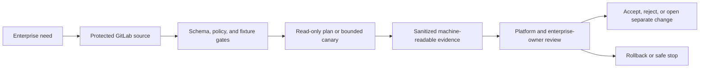

# UC-CICD-002: Automated Build Pipeline

Last verified: 2026-08-13

## Use-case record

| Field | Value |
| --- | --- |
| Canonical portfolio use case | Automated Build Pipeline |
| Primary platform | Enterprise DevSecOps Delivery Platform |
| Enterprise alignment | Shared digital platform, risk and compliance, operational resilience |
| Enterprise outcome | deliver reviewed changes safely to provider, payer, and shared platform services |
| Primary GitLab repository | `midhhealth/platform-delivery/devsecops-cicd-orchestrator` |
| Jira epic | `EPIC-CICD-002` — Implement Automated Build Pipeline |
| Change record | Required before any mutating or runtime action; not required for fixture-only CI |
| Target | existing GitLab, accepted runners, Jenkins, AWX, and Kubernetes delivery paths |
| Current state | **In progress — GitLab implementation commit `f60a40d` is published on `codex/uc-cicd-002-automated-build`; local validation passed and GitLab pipeline evidence is pending** |
| Infrastructure boundary | Reuse the existing lab; do not create a new runner, VM, registry, cluster, or delivery product |
| Owner | Enterprise DevSecOps Delivery Platform team |

## Purpose

Delivery engineer, application or platform owner, security reviewer, and SRE need a repeatable, auditable implementation of **Automated Build Pipeline**.
The canonical coverage target is: Build process runs in pipeline instead of local machines. The work must strengthen the
owning platform and its enterprise outcome without becoming an isolated tool
demonstration.

## Expected outcome

A protected GitLab revision defines the trigger, target allowlist, validation,
evidence, and safe stop for Automated Build Pipeline. CI proves source behavior with
positive and negative fixtures. Any runtime step uses only the documented
existing lab, requires the appropriate approval, publishes machine-readable
evidence, and proves rollback or non-mutation.

## Trigger and actors

| Item | Definition |
| --- | --- |
| Trigger | Merge request, protected scheduled pipeline, or approved operator-started job |
| Primary actors | Delivery engineer, application or platform owner, security reviewer, and SRE |
| Platform owner | Owns source, target allowlist, safe execution, and recovery |
| Enterprise owner | Confirms the provider, payer, shared-platform, compliance, or resilience value |
| Reviewer | Verifies evidence, exceptions, and completion state |

## Preconditions

- The target already exists in canonical inventory or is a synthetic fixture.
- Execution uses existing GitLab, accepted runners, Jenkins, AWX, and Kubernetes delivery paths.
- Repository, branch, runner, inventory, namespace, and credential scopes are
  explicit and protected.
- Inputs contain no passwords, tokens, private keys, kubeconfigs, or protected
  healthcare data.
- A planned product, provisioned-only VM, or deferred cloud path is not treated
  as available.
- Rollback source or a verified non-mutating stop point is known before work.

## Scope and exclusions

In scope are the source contract, allowlisted targets, CI validation,
controlled execution where applicable, sanitized evidence, owner review, and
rollback or safe stop. The page does not authorize a new runner, VM, registry, cluster, or delivery product. Any new
capacity, product installation, or production integration requires a separate
architecture decision and change record.

## End-to-end execution flow

## Code and configuration map

The paths below exist in GitLab implementation commit `f60a40d`. A passing
GitLab pipeline and runner artifact are still required before the story becomes
`Code complete`.

| Planned path | Responsibility |
| --- | --- |
| `use-cases/UC-CICD-002/contract.yml` | Existing build trigger, enterprise outcome, accepted runner tags, source paths, output, and non-mutation contract |
| `use-cases/UC-CICD-002/schemas/report.schema.json` | Existing machine-readable artifact provenance schema |
| `use-cases/UC-CICD-002/scripts/build_bundle.py` | Existing deterministic bundle, checksum, and build-report generator |
| `use-cases/UC-CICD-002/scripts/execute.sh` | Existing guarded build entry point and checksum verification |
| `use-cases/UC-CICD-002/scripts/validate_report.py` | Existing standard-library report validator |
| `use-cases/UC-CICD-002/tests/test-build.sh` | Existing repeated-build, content, schema, and unsafe-output tests |
| `.gitlab-ci.yml` | Existing `application_build` job tagged `shared,validation` with 14-day artifacts |
| `docs/use-cases/UC-CICD-002.md` | Existing implementation, validation, evidence, and rollback notes |

## Jira breakdown

### STORY-CICD-002-001: Define and validate the platform contract

**Description:** The platform owner needs Automated Build Pipeline expressed as versioned
source with an enterprise outcome, existing target, owner, inputs, outputs,
safety boundary, and evidence schema.

**Status:** In progress — source implemented and locally validated; GitLab
pipeline evidence pending.

**Acceptance criteria:** Given the current lab inventory, when the contract is
validated, then every target resolves to an existing asset or synthetic fixture,
the enterprise outcome and owner are present, forbidden infrastructure and
sensitive inputs are rejected, and the expected coverage is: Build process runs in pipeline instead of local machines.

**Implementation steps:** Create the contract and report schema, add positive
and negative fixtures, pin tool dependencies, and connect validation to the
existing GitLab runner allowed for this platform.

**Completed work:** Commit `f60a40d` adds the JSON-compatible YAML contract,
report schema, deterministic builder, report validator, fixtures, CI job, and
repository documentation. `./scripts/local-validate.sh`, repeated-build checks,
shell syntax, Python compilation, and CI YAML parsing passed locally. No passing
GitLab pipeline is claimed.

**Validation and rollback:** Run schema, lint, reference, secret, and fixture
tests. Revert the source commit when the contract points to an absent asset or
fails its enterprise traceability; no runtime rollback is required.

**Required attachments:** `ART-CICD-002-001A` contract validation
and fixture report.

### STORY-CICD-002-002: Execute safely and prove the outcome

**Description:** Platform and enterprise owners need a reproducible result for
Automated Build Pipeline that distinguishes source completion from runtime acceptance and
preserves a recovery path.

**Status:** In progress — the non-mutating build execution is implemented;
accepted runner execution remains pending.

**Acceptance criteria:** Given a protected revision and approved existing
target, when the job runs, then it records revision, executor, target, start/end
time, result, and evidence; mutation requires explicit approval; a second check
proves either idempotence, recovery, or zero change.

**Implementation steps:** Add the guarded job, run PLAN or fixture mode first,
obtain a change record for mutation, limit execution to one canary, collect
sanitized results, exercise rollback or safe stop, and publish the decision.

**Completed work:** The build creates a sorted archive with fixed ownership and
timestamps, SHA-256 checksum, and schema-validated report. Two local builds
produced identical archive and report bytes. The unsafe repository-root output
fixture failed as designed. GitLab job and artifact IDs are pending.

**Validation and rollback:** Compare expected and actual results, verify no
credential or protected data leakage, run the rollback or non-mutation check,
and record unexpected failures in the incident register.

**Required attachments:** `ART-CICD-002-002A` execution result,
`ART-CICD-002-002B` rollback or non-mutation proof, and
`ATT-CICD-002-002A` only when a real UI capture adds review value.

## Evidence and screenshot register

| ID | Evidence | Source | Status |
| --- | --- | --- | --- |
| `ART-CICD-002-001A` | Contract, schema, repeated-build, content, and unsafe-output validation | Local validation at commit `f60a40d`; GitLab CI confirmation required | Local passed; CI pending |
| `ART-CICD-002-002A` | Bundle, checksum, and build report | GitLab `application_build` artifact | Pending pipeline |
| `ART-CICD-002-002B` | Identical second build and repository-root output rejection | Local validation at commit `f60a40d` | Passed locally |
| `ATT-CICD-002-002A` | Optional sanitized supporting capture | Named source system | Pending if required |

## Expected versus current result

| Measure | Expected | Current |
| --- | --- | --- |
| Platform fit | Build process runs in pipeline instead of local machines | Defined in canonical portfolio |
| Enterprise fit | deliver reviewed changes safely to provider, payer, and shared platform services | Traceability specified; owner review pending |
| Infrastructure | Existing lab or synthetic fixture only | No new infrastructure authorized |
| Implementation | Passing source gates and reviewable artifact | Branch `codex/uc-cicd-002-automated-build`, commit `f60a40d`; local gates passed |
| Runtime acceptance | Bounded result plus recovery/non-mutation evidence | Not run |

## Acceptance decision

**In progress.** Local validation does not establish `Code complete` or runtime
acceptance. A passing GitLab pipeline on the accepted shared runner and its
retained build artifact are the next gate. Final acceptance requires the
named existing target, passing evidence, enterprise-owner review, rollback or
safe-stop proof, incident reconciliation, and publication of the verified
result.

## Operational, security, and follow-up notes

- Copy this specification into `midhhealth/platform-delivery/devsecops-cicd-orchestrator` as the epic and story contract.
- Keep secrets and protected healthcare data out of source, logs, screenshots,
  and artifacts.
- Stop when the target is absent, capacity is unclear, or a new product or
  infrastructure allocation would be required.
- Return GitLab commit, pipeline, Jenkins/AWX job, runtime, rollback, and
  incident evidence to the architecture repository.
- Implementation branch:
  `codex/uc-cicd-002-automated-build`; merge request creation URL is
  `http://gitlab.example.com/midhhealth/platform-delivery/devsecops-cicd-orchestrator/-/merge_requests/new?merge_request%5Bsource_branch%5D=codex%2Fuc-cicd-002-automated-build`.
