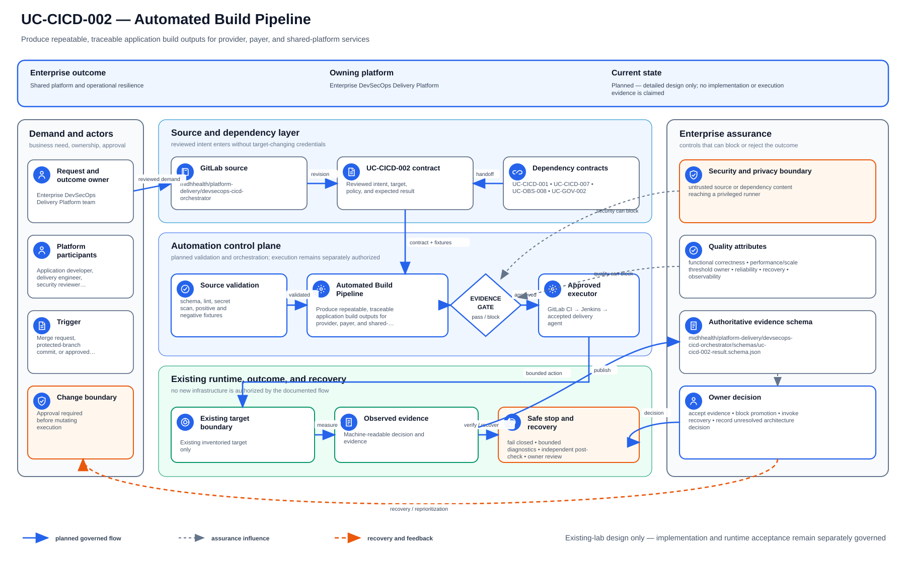

# UC-CICD-002: Automated Build Pipeline

Last reviewed: 2026-08-13

## Use-case record

| Field | Value |
| --- | --- |
| Canonical portfolio use case | Automated Build Pipeline |
| Primary platform | Enterprise DevSecOps Delivery Platform |
| Supporting use cases | [UC-CICD-001](UC-CICD-001-end-to-end-cicd-pipeline.md), [UC-CICD-007](UC-CICD-007-environment-based-release-promotion.md), [UC-OBS-008](../observability/UC-OBS-008-deployment-health-scoring.md), [UC-GOV-002](../governance/UC-GOV-002-secrets-management-automation.md) |
| Enterprise outcome | Produce repeatable, traceable application build outputs for provider, payer, and shared-platform services |
| Primary actors | Application developer, delivery engineer, security reviewer, platform owner |
| Primary GitLab repository | `midhhealth/platform-delivery/devsecops-cicd-orchestrator` |
| Related capabilities | Source control, unit testing, artifact management, image build, security scanning, release promotion |
| Existing execution boundary | GitLab and accepted GitLab runners; Jenkins remains the deployment approval/orchestration boundary |
| Current state | **Planned — detailed design only; no implementation or execution evidence is claimed** |
| Infrastructure constraint | Reuse the existing GitLab service and accepted runners; do not create a runner, VM, registry, cluster, or delivery product |
| Owner | Enterprise DevSecOps Delivery Platform team |

## Purpose

Application builds performed on engineer workstations are difficult to reproduce,
review, secure, and audit. Local tool versions, uncommitted files, cached
dependencies, or manual packaging steps can produce an artifact that cannot be
recreated from the repository revision recorded for a release.

The enterprise delivery platform becomes the build boundary.
For every eligible revision, the pipeline should create the same logical output
from declared source and dependencies, associate that output with its source
revision, and make the result available to later quality, security, artifact,
and release controls. It does not deploy the result.

## Expected outcome

For an eligible GitLab revision, an existing accepted runner produces the
declared application output from version-controlled inputs and returns a
provenance record and checksum. An invalid input or unsuccessful build blocks
artifact publication and every deployment path. The build remains isolated
from runtime systems and does not create infrastructure.

## Platform and enterprise fit

| Relationship | Explanation |
| --- | --- |
| Within the DevSecOps platform | This is the build stage between source validation and artifact publication. It supplies inputs to unit-test, quality, vulnerability, image, and promotion use cases. |
| Provider and payer systems | Teams can show exactly which reviewed revision produced a service or batch artifact used by healthcare workflows. |
| Shared digital platform | Common build behavior reduces repository-specific scripts and makes delivery evidence comparable across teams. |
| Risk and compliance | Source revision, dependency lock state, toolchain identity, result, and checksum form an auditable provenance record. |
| Operational resilience | A reproducible build can be rerun during rollback, recovery, or forensic investigation without depending on an engineer's workstation. |

Success requires the output to be traceable to protected
source and consumed by the platform's later gates. A script that merely compiles
locally does not satisfy the enterprise outcome.

## Trigger and actors

| Item | Definition |
| --- | --- |
| Trigger | Merge request, protected-branch commit, or approved release tag in an onboarded GitLab repository |
| Developer | Owns application source, dependency declarations, and repository build behavior |
| Delivery engineer | Owns the common build contract and pipeline ordering |
| Platform owner | Approves runner class, evidence requirements, and exceptions |
| Reviewer | Confirms source, provenance, negative-path behavior, and enterprise traceability |

## Scope and exclusions

In scope:

- pipeline-triggered compilation, assembly, or packaging;
- restoration of declared dependencies from approved existing sources;
- capture of the source revision and build-tool identity;
- creation of a versioned build output and checksum;
- retention of a machine-readable build result for later gates;
- deterministic or equivalence checks appropriate to the application type; and
- explicit failure that prevents artifact publication and deployment.

Out of scope:

- provisioning runners, registries, repositories, VMs, or Kubernetes capacity;
- deployment, environment promotion, or runtime health validation;
- replacing language-specific test or package managers;
- signing, long-term artifact retention, and container publication, which are
  covered by their own use cases; and
- treating provisioned-only Artifactory or SonarQube VMs as available services.

## Preconditions

| Input or dependency | Required condition |
| --- | --- |
| Source revision | Immutable commit SHA from the named GitLab project; protected branch rules apply to release candidates |
| Build definition | Version controlled in the application repository and reviewed with the application change |
| Dependency definition | Lock file, checksum file, or equivalent constraint is present when the ecosystem supports it |
| Runner | One of the existing accepted runners with an appropriate tag; untagged or arbitrary execution is not allowed |
| Toolchain | Version is declared or pinned closely enough for the team to recreate the build |
| Secrets | Build succeeds without embedding credentials; any required pull credential is protected and masked by the existing platform |
| Data | Synthetic fixtures only; protected healthcare data is excluded from build context and artifacts |

## Detailed functional flow

1. A merge request or protected-branch commit identifies an immutable source
   revision and starts the GitLab pipeline.
2. The pipeline validates that the repository contains an approved build entry
   point and required dependency metadata.
3. The scheduler assigns the job to an existing accepted runner whose tags match
   the build's declared needs.
4. The job creates a clean workspace and restores only declared dependencies.
   Files outside the checked-out revision must not influence the output.
5. The language or application build runs without deployment credentials and
   writes only to the pipeline workspace.
6. The job records the source SHA, project, pipeline and job identifiers,
   toolchain version, dependency-lock digest, start/end time, result, output
   name, size, and checksum.
7. A successful build exposes its output to the unit-test, quality, security,
   and artifact-management stages. A failed or incomplete build blocks every
   downstream packaging and deployment path.
8. A repeated build of the same revision is compared by byte identity where
   feasible, or by a documented equivalence rule when timestamps, signatures,
   or ecosystem metadata prevent byte-for-byte identity.

The detailed architecture SVG above is authoritative for component boundaries
and handoffs. This operating sequence supplies the build-specific behavior
inside its validation, control, evidence, and downstream-gate components.

## Information and evidence contract

The planned machine-readable result should contain, at minimum:

| Field | Reason |
| --- | --- |
| `project_path`, `commit_sha`, `ref` | Identifies the exact reviewed source |
| `pipeline_id`, `job_id`, `runner_id` | Identifies the controlled execution |
| `toolchain` and `toolchain_version` | Supports reproduction and vulnerability review |
| `dependency_manifest_digest` | Shows which declared dependency state was consumed |
| `started_at`, `finished_at`, `result` | Supports operational and audit timelines |
| `artifact_name`, `artifact_size`, `artifact_sha256` | Identifies and verifies the build output |
| `reproducibility_result` | Records identical, equivalent, failed, or not-applicable with justification |

Logs and artifacts must exclude credentials, access tokens, private keys,
kubeconfigs, and protected healthcare data. Evidence is retained according to
the existing GitLab and enterprise retention policy; this page does not create
a new retention service.

## Architecture context

Automated Build Pipeline is evaluated inside the existing enterprise lab and the owning
platform's current source-control and execution boundaries. The architectural
unit is the governed outcome—**Produce repeatable, traceable application build outputs for provider, payer, and shared-platform services**—rather than a new product or
environment.

| Context element | Architecture statement |
| --- | --- |
| Business and operational setting | Enterprise consumers: Enterprise DevSecOps Delivery Platform. The result must be explainable, repeatable, and owned. |
| Current state | **Planned — detailed design only; no implementation or execution evidence is claimed** |
| Desired state | A reviewed contract drives a bounded result, machine-readable evidence, and a safe stop or recovery decision. |
| Existing target boundary | Approved existing delivery target |
| Infrastructure constraint | Reuse the existing lab; no new infrastructure is authorized |
| Accountable platform owner | Enterprise DevSecOps Delivery Platform team; the consuming service, data, security, or workflow owner remains accountable for accepting business impact. |

The page owns the contract, control logic, evidence, and recovery behavior for
Automated Build Pipeline. It does not absorb the responsibilities of the dependency use cases
listed below.

## Architecture diagram

The solid paths show how reviewed demand becomes a bounded decision and evidence. The dashed return path makes recovery and owner acceptance part of the architecture, not an afterthought. Planned control logic remains separate from the existing execution and target boundaries.

## Dependencies and handoffs

Automated Build Pipeline remains accountable to its primary platform. The dependencies below
provide explicit contracts or assurance evidence; they do not become alternate owners.

| Relationship | Use case | Required handoff | Failure propagation |
| --- | --- | --- | --- |
| Required upstream contract | [UC-CICD-001: End-to-End CI/CD Pipeline Setup](UC-CICD-001-end-to-end-cicd-pipeline.md) | source-to-artifact pipeline provenance and stage outcome | Missing, stale, or failed evidence blocks promotion or runtime action. |
| Required upstream contract | [UC-CICD-007: Environment-Based Release Promotion](UC-CICD-007-environment-based-release-promotion.md) | environment promotion contract and approval evidence | Missing, stale, or failed evidence blocks promotion or runtime action. |
| Coordinated assurance handoff | [UC-OBS-008: Deployment Health Scoring](../observability/UC-OBS-008-deployment-health-scoring.md) | deployment-health score and promotion/rollback signal | Missing, stale, or failed evidence blocks promotion or runtime action. |
| Coordinated assurance handoff | [UC-GOV-002: Secrets Management Automation](../governance/UC-GOV-002-secrets-management-automation.md) | approved secret reference, redaction rule, and rotation owner | Missing, stale, or failed evidence blocks promotion or runtime action. |

Before Automated Build Pipeline is implemented, every handoff must resolve to an immutable
revision and machine-readable artifact. A URL, screenshot, or verbal approval
alone is not sufficient dependency evidence.

## Quality attributes

For Automated Build Pipeline, quality is measured against the bounded enterprise outcome—not
document length or a green job. Unapproved business thresholds remain explicit
decisions and must not be invented.

| Attribute | Required measure or invariant | Decision state |
| --- | --- | --- |
| Functional correctness | Every required input is validated; **Produce repeatable, traceable application build outputs for provider, payer, and shared-platform services** is evaluated against positive, negative, missing-input, and unauthorized-scope cases. | Fixed design requirement |
| Performance and scale | Establish a baseline for pipeline duration, queue delay, reproducibility, and false-pass rate on existing capacity; the owner must approve warning and blocking thresholds before runtime promotion. | Thresholds `TBD` before implementation |
| Reliability | Missing prerequisites, stale dependencies, malformed evidence, and partial results fail closed without widening scope. | Fixed design requirement |
| Recovery | Record the maximum acceptable interruption and recovery time before runtime use; source-only validation must remain zero-change. | Owner decision required before runtime exercise |
| Observability | Emit use-case ID, revision, target, executor, start/end time, duration, decision, reason code, and recovery reference. | Required in the result schema |
| Evidence retention | Assign classification, retention period, and deletion owner before storing runtime evidence. | Security/compliance decision required |

Load, latency, availability, retention, RTO, and RPO values for Automated Build Pipeline become
requirements only after the named service or business owner approves them. Until
then, the implementation gate records them as unresolved instead of quietly
choosing defaults.

## Security and privacy architecture

The Automated Build Pipeline design separates source validation, privileged execution, target
access, and evidence review. Those boundaries remain in force even when one
engineer can access more than one system.

| Trust boundary | Allowed flow | Required control |
| --- | --- | --- |
| Contributor → GitLab | Reviewed source, contract, and synthetic/sanitized fixtures | Protected branch rules, peer review, secret scanning, and immutable commit identity |
| GitLab runner → result artifact | Read-only evaluation inputs and machine-readable output | No target-changing credential; pinned tool versions; artifact checksum and expiry |
| Approval plane → executor | Approved revision, target allowlist, mode, canary, and change reference | Separate authorization through the existing Jenkins/AWX or platform control path |
| Executor → existing target | Minimum commands or API operations required for Automated Build Pipeline | Least-privilege identity, explicit target limit, timeout, and stop condition |
| Target → evidence store | Sanitized metadata, measurements, decision, and recovery result | Exclude credentials, tokens, private keys, kubeconfigs, packet payloads, PHI, PII, and unrelated records |

For Automated Build Pipeline, the primary threat is **untrusted source or dependency content reaching a privileged runner**. The mandatory response is
protected refs, isolated build context, pinned dependencies, least-privilege credentials, and artifact provenance. Authentication and authorization mappings must name
the existing identity source, principal or service account, permitted actions,
credential owner, rotation path, and emergency revocation procedure before a
runtime story can move beyond `Planned`.

## Architecture decisions and trade-offs

| Decision | Selected architecture | Alternative deferred or rejected | Rationale and status |
| --- | --- | --- | --- |
| First implementation slice | Contract, schema, fixtures, and read-only evidence on the existing GitLab runner | Product installation or broad runtime rollout | Proves behavior without expanding infrastructure; **approved design direction** |
| Runtime execution | Use only Jenkins shared-library workflow when current inventory and change approval confirm it is available | Direct operator changes or credentials in CI | Preserves separation of duties; **conditional on implementation review** |
| Evidence | Machine-readable result is authoritative; screenshots are optional supporting material | Screenshot-only acceptance | Enables repeatable audit and automated gates; **approved design direction** |
| Failure handling | Fail closed, preserve bounded diagnostics, and recover only the named scope | Continue with partial or stale evidence | Prevents false success and hidden blast radius; **approved design direction** |
| New capacity or product | Stop and raise a separate architecture decision | Silently add a VM, service, cloud dependency, or cluster add-on | Maintains the existing-lab constraint; **mandatory** |

### Open decisions before implementation

| Open decision | Decision owner | Resolution gate |
| --- | --- | --- |
| Exact inventory object and first canary | Platform owner plus consuming service/data owner | Must resolve before the implementation story leaves `Planned` |
| Performance, scale, and reliability thresholds | Service owner and SRE | Must be recorded before a runtime acceptance run |
| Identity-to-action authorization matrix | Platform owner and security reviewer | Must be approved before target credentials are attached |
| Evidence classification and retention | Data/security owner | Must be approved before runtime artifacts are retained |

If any selected approach changes, record the rationale beside UC-CICD-002 in
the implementation repository before code review. A documentation edit alone
does not approve the new architecture.

## Implementation design

The first Automated Build Pipeline implementation is deliberately source-only. Its planned files live in the existing repository; none provisions infrastructure.

| Planned source responsibility | Exact planned location |
| --- | --- |
| Use-case contract and target allowlist | `midhhealth/platform-delivery/devsecops-cicd-orchestrator/contracts/uc-cicd-002.yaml` |
| Primary implementation | `midhhealth/platform-delivery/devsecops-cicd-orchestrator/jobs/automated-build-pipeline.groovy`; entry point: the `automated-build-pipeline` Jenkins job and its shared-library step |
| Machine-readable result schema | `midhhealth/platform-delivery/devsecops-cicd-orchestrator/schemas/uc-cicd-002-result.schema.json` |
| Positive, negative, malformed, and recovery fixtures | `midhhealth/platform-delivery/devsecops-cicd-orchestrator/tests/fixtures/uc-cicd-002/` |
| GitLab source gate | `midhhealth/platform-delivery/devsecops-cicd-orchestrator/.gitlab/ci/uc-cicd-002.yml` |
| Operator diagnosis and recovery | `midhhealth/platform-delivery/devsecops-cicd-orchestrator/docs/runbooks/uc-cicd-002.md` |

### Delivery stages

1. **Contract:** add the contract, schema, owners, dependency revisions, target
   allowlist, modes, reason codes, and open-decision values.
2. **Source validation:** lint exact paths, validate schema compatibility, scan
   for sensitive content, and run every fixture on the existing runner.
3. **Read-only proof:** execute the `automated-build-pipeline` Jenkins job and its shared-library step, publish a checksummed result, and
   prove that blocked cases cannot reach a mutating path.
4. **Bounded execution:** only after separate approval, pass the immutable
   revision, target, mode, canary, and change ID to Jenkins shared-library workflow.
5. **Independent verification:** measure the expected result, confirm unrelated
   state is unchanged, run recovery or zero-change proof, and obtain owner
   review.

The implementation merge request must link this page, the dependency artifacts,
the decision values above, and the eventual pipeline/job/run identifiers. Code
completion alone cannot promote the page to runtime verified.

## Code and configuration map

These are future implementation touchpoints, not existing or completed files.
The implementation team must confirm them against the repository before work.

| Planned location | Responsibility |
| --- | --- |
| `.gitlab-ci.yml` or an included CI template | Place build after source validation and before publication or deployment |
| Application-owned build manifest | Declare the build command, toolchain, inputs, and output |
| Application dependency lock file | Constrain the restorable dependency state |
| Planned build-result schema | Normalize provenance, checksum, timing, and repeatability evidence |
| Planned positive and negative fixtures | Prove success, hard failure, missing output, unsafe input, and reproducibility decisions |
| Planned operator documentation | Explain rerun, evidence review, exception, and safe-stop procedures |

## Control and decision rules

- The source SHA, not a mutable branch name alone, identifies the build.
- A build failure, missing lock state, checksum mismatch, or evidence-generation
  failure is a hard stop.
- Build jobs do not receive Kubernetes, AWX, or production deployment
  credentials.
- Outputs are passed to later stages by the existing GitLab artifact mechanism
  until the separate artifact-management use case is accepted.
- Re-running the job must not modify source, shared runtime systems, or the
  target environment.
- Exceptions to reproducibility require an owner, rationale, expiration, and
  review; they are not silently accepted.

## Failure and recovery scenarios

| Failure | Expected behavior | Recovery or safe stop |
| --- | --- | --- |
| Dependency cannot be restored | Build fails before packaging | Correct the declaration or approved source; rerun the same revision or a reviewed fix |
| Toolchain version differs | Build fails its preflight control | Pin or restore the approved version; do not accept a workstation-generated artifact |
| Output checksum changes unexpectedly | Reproducibility check fails | Compare inputs and build metadata; quarantine both outputs until explained |
| Secret or protected data appears in output | Artifact is rejected | Remove exposure, rotate affected credential if necessary, and record an incident |
| Runner unavailable | Job remains pending or fails visibly | Use another already accepted compatible runner only; do not provision capacity under this documented capability |
| Build succeeds but evidence is incomplete | Downstream gates remain blocked | Regenerate complete evidence before publication |

Because this documented capability is non-mutating outside its CI workspace, rollback means
discarding the output and reverting the build-definition change. It does not
authorize a runtime rollback.

## Jira breakdown

### STORY-CICD-002-001: Define the build contract

**Outcome:** Each participating repository declares its build entry point,
toolchain, dependency state, expected outputs, allowed runner tags, and evidence
fields.

**Description:** The delivery platform owner and application owner jointly
define the source-to-output boundary needed for a reproducible build, without
adding a service or granting deployment access.

**Status:** Planned.

**Acceptance criteria:** Given a repository proposed for onboarding, when its
contract is reviewed, then every input is versioned or protected, every output
is named, the runner maps to an accepted existing runner, and no deployment or
infrastructure action is included.

**Implementation steps:** Confirm the existing repository and runner class;
document the build command, toolchain, dependency state, inputs, outputs, and
evidence fields; review the contract with the application owner; add planned
positive and negative fixtures to the implementation backlog.

**Completed work:** The architecture behavior, enterprise fit, constraints, and
future acceptance criteria are documented here. No implementation is claimed.

**Validation and rollback:** During implementation, validate the contract with
positive and rejected fixtures. A documentation-only change is reversed by
reverting its documentation commit; no runtime rollback applies.

**Required attachments:** Future `ART-CICD-002-001A` contract-review result.

### STORY-CICD-002-002: Add the controlled pipeline build stage

**Outcome:** A clean GitLab job creates the declared output and stops downstream
work on any build or evidence failure.

**Description:** The delivery engineer needs a controlled CI build so reviewed
source, rather than an engineer's workstation, is the origin of every eligible
artifact.

**Status:** Planned.

**Acceptance criteria:** Given a valid revision, the build succeeds on the
accepted runner and publishes the required result; given a broken build,
undeclared dependency, or missing output, the job fails and no later artifact
or deployment job runs.

**Implementation steps:** Add the reviewed job to the existing GitLab delivery
path; select an accepted runner; build from a clean checkout; generate the
normalized result; declare downstream dependencies; test positive, broken,
missing-output, and evidence-failure paths.

**Completed work:** Required behavior is designed. Implementation and execution
are deferred.

**Validation and rollback:** Prove a valid build enables only later source
gates and every invalid case blocks publication and deployment. Revert the
pipeline source change if the new gate disrupts existing eligible builds.

**Required attachments:** Future `ART-CICD-002-002A` pipeline result and
`ART-CICD-002-002B` downstream-block proof.

### STORY-CICD-002-003: Prove provenance and repeatability

**Outcome:** Reviewers can connect an output to its source and understand
whether the same inputs reproduce it.

**Description:** Platform and risk reviewers need durable provenance and a
repeatability decision before a build output is eligible for publication.

**Status:** Planned.

**Acceptance criteria:** Two runs of the same revision produce an identical
checksum or a documented and approved equivalence result; the evidence names
both jobs, the source SHA, toolchain, dependency digest, and final decision.

**Implementation steps:** Run the same revision twice in clean workspaces;
compare checksums or the approved equivalence fields; record both job IDs and
inputs; review discrepancies; publish the accepted or rejected decision.

**Completed work:** The required provenance fields and decision rules are
documented. No build evidence exists.

**Validation and rollback:** Verify the evidence resolves to the immutable SHA
and both runner jobs. Reject and discard outputs when equivalence cannot be
explained; no runtime system is changed.

**Required attachments:** Future `ART-CICD-002-003A` repeatability comparison.

## Evidence and screenshot register

| ID | Planned evidence | Source | Current status |
| --- | --- | --- | --- |
| `ART-CICD-002-001A` | Reviewed build contract and fixture decisions | GitLab CI in the implementation repository | Pending future implementation |
| `ART-CICD-002-002A` | Successful build result and output checksum | Existing accepted GitLab runner | Pending future execution |
| `ART-CICD-002-002B` | Failed-build proof showing downstream jobs blocked | GitLab pipeline graph and machine-readable result | Pending future execution |
| `ART-CICD-002-003A` | Two-run checksum or equivalence comparison | Existing accepted GitLab runner | Pending future execution |

## Expected versus current result

| Measure | Expected future result | Current result |
| --- | --- | --- |
| Platform fit | Build is a reusable gate feeding test, quality, security, and artifact controls | Detailed relationship documented |
| Enterprise fit | Every eligible output is traceable to reviewed source | Outcome and evidence contract documented |
| Infrastructure | Existing GitLab and accepted runners only | Boundary documented; no infrastructure change authorized |
| Implementation | Reviewed job and fixtures pass positive and negative paths | Not scheduled |
| Execution | Output, provenance, and repeatability evidence reviewed | Not run |

## Acceptance decision

**Planned.** This page is the detailed design and future implementation plan.
Code completion requires reviewed source and passing CI
exist in the named implementation repository. It becomes accepted only after
the existing runner produces a traceable output, negative-path tests block
downstream work, repeatability is evaluated, evidence is reviewed, and the
result is returned to this page.

## Related use cases

- `UC-CICD-003` consumes the checked-out source and blocks packaging when unit
  tests fail.
- `UC-CICD-004` evaluates code-quality policy after successful build/test work.
- `UC-CICD-005` publishes and retains approved build outputs.
- `UC-CICD-006` turns an eligible application output into a container image.
- `UC-CICD-007` and `UC-CICD-008` govern promotion and rollback after the
  artifact has passed all required gates.
