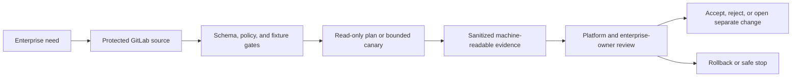

# UC-CICD-003: Automated Unit Testing in CI

Last verified: 2026-08-13

## Use-case record

| Field | Value |
| --- | --- |
| Canonical portfolio use case | Automated Unit Testing in CI |
| Primary platform | Enterprise DevSecOps Delivery Platform |
| Enterprise alignment | Shared digital platform, risk and compliance, operational resilience |
| Enterprise outcome | deliver reviewed changes safely to provider, payer, and shared platform services |
| Primary GitLab repository | `midhhealth/platform-delivery/devsecops-cicd-orchestrator` |
| Jira epic | `EPIC-CICD-003` — Implement Automated Unit Testing in CI |
| Change record | Required before any mutating or runtime action; not required for fixture-only CI |
| Target | existing GitLab, accepted runners, Jenkins, AWX, and Kubernetes delivery paths |
| Current state | **Planned — specification only; implementation and runtime evidence are not claimed** |
| Infrastructure boundary | Reuse the existing lab; do not create a new runner, VM, registry, cluster, or delivery product |
| Owner | Enterprise DevSecOps Delivery Platform team |

## Purpose

Delivery engineer, application or platform owner, security reviewer, and SRE need a repeatable, auditable implementation of **Automated Unit Testing in CI**.
The canonical coverage target is: Tests run before package/deploy stages. The work must strengthen the
owning platform and its enterprise outcome without becoming an isolated tool
demonstration.

## Expected outcome

A protected GitLab revision defines the trigger, target allowlist, validation,
evidence, and safe stop for Automated Unit Testing in CI. CI proves source behavior with
positive and negative fixtures. Any runtime step uses only the documented
existing lab, requires the appropriate approval, publishes machine-readable
evidence, and proves rollback or non-mutation.

## Trigger and actors

| Item | Definition |
| --- | --- |
| Trigger | Merge request, protected scheduled pipeline, or approved operator-started job |
| Primary actors | Delivery engineer, application or platform owner, security reviewer, and SRE |
| Platform owner | Owns source, target allowlist, safe execution, and recovery |
| Enterprise owner | Confirms the provider, payer, shared-platform, compliance, or resilience value |
| Reviewer | Verifies evidence, exceptions, and completion state |

## Preconditions

- The target already exists in canonical inventory or is a synthetic fixture.
- Execution uses existing GitLab, accepted runners, Jenkins, AWX, and Kubernetes delivery paths.
- Repository, branch, runner, inventory, namespace, and credential scopes are
  explicit and protected.
- Inputs contain no passwords, tokens, private keys, kubeconfigs, or protected
  healthcare data.
- A planned product, provisioned-only VM, or deferred cloud path is not treated
  as available.
- Rollback source or a verified non-mutating stop point is known before work.

## Scope and exclusions

In scope are the source contract, allowlisted targets, CI validation,
controlled execution where applicable, sanitized evidence, owner review, and
rollback or safe stop. The page does not authorize a new runner, VM, registry, cluster, or delivery product. Any new
capacity, product installation, or production integration requires a separate
architecture decision and change record.

## End-to-end execution flow

## Code and configuration map

All implementation paths are planned inside the named GitLab repository until a
commit and pipeline are recorded.

| Planned path | Responsibility |
| --- | --- |
| `use-cases/UC-CICD-003/contract.yml` | Trigger, enterprise outcome, owner, target allowlist, safety, and evidence contract |
| `use-cases/UC-CICD-003/schemas/report.schema.json` | Machine-readable result and provenance requirements |
| `use-cases/UC-CICD-003/scripts/execute.sh` | Read-only plan or approved bounded action with explicit exit codes |
| `use-cases/UC-CICD-003/tests/` | Passing, failing, denied-target, redaction, and rollback fixtures |
| `.gitlab-ci.yml` | Pinned validation job on an existing accepted runner |
| `docs/use-cases/UC-CICD-003.md` | Implementation, operations, troubleshooting, and evidence notes |

## Jira breakdown

### STORY-CICD-003-001: Define and validate the platform contract

**Description:** The platform owner needs Automated Unit Testing in CI expressed as versioned
source with an enterprise outcome, existing target, owner, inputs, outputs,
safety boundary, and evidence schema.

**Status:** Planned.

**Acceptance criteria:** Given the current lab inventory, when the contract is
validated, then every target resolves to an existing asset or synthetic fixture,
the enterprise outcome and owner are present, forbidden infrastructure and
sensitive inputs are rejected, and the expected coverage is: Tests run before package/deploy stages.

**Implementation steps:** Create the contract and report schema, add positive
and negative fixtures, pin tool dependencies, and connect validation to the
existing GitLab runner allowed for this platform.

**Completed work:** Architecture scope and the no-new-infrastructure boundary
are documented here. No implementation commit, passing pipeline, or runtime
result is claimed.

**Validation and rollback:** Run schema, lint, reference, secret, and fixture
tests. Revert the source commit when the contract points to an absent asset or
fails its enterprise traceability; no runtime rollback is required.

**Required attachments:** `ART-CICD-003-001A` contract validation
and fixture report.

### STORY-CICD-003-002: Execute safely and prove the outcome

**Description:** Platform and enterprise owners need a reproducible result for
Automated Unit Testing in CI that distinguishes source completion from runtime acceptance and
preserves a recovery path.

**Status:** Planned.

**Acceptance criteria:** Given a protected revision and approved existing
target, when the job runs, then it records revision, executor, target, start/end
time, result, and evidence; mutation requires explicit approval; a second check
proves either idempotence, recovery, or zero change.

**Implementation steps:** Add the guarded job, run PLAN or fixture mode first,
obtain a change record for mutation, limit execution to one canary, collect
sanitized results, exercise rollback or safe stop, and publish the decision.

**Completed work:** Required execution and evidence behavior is specified. No
job, canary, rollback, or acceptance evidence is claimed.

**Validation and rollback:** Compare expected and actual results, verify no
credential or protected data leakage, run the rollback or non-mutation check,
and record unexpected failures in the incident register.

**Required attachments:** `ART-CICD-003-002A` execution result,
`ART-CICD-003-002B` rollback or non-mutation proof, and
`ATT-CICD-003-002A` only when a real UI capture adds review value.

## Evidence and screenshot register

| ID | Evidence | Source | Status |
| --- | --- | --- | --- |
| `ART-CICD-003-001A` | Contract, reference, and fixture validation | GitLab CI | Pending |
| `ART-CICD-003-002A` | Bounded execution or read-only result | Jenkins, AWX, GitLab CI, or approved API | Pending |
| `ART-CICD-003-002B` | Rollback, recovery, idempotence, or non-mutation proof | Approved execution path | Pending |
| `ATT-CICD-003-002A` | Optional sanitized supporting capture | Named source system | Pending if required |

## Expected versus current result

| Measure | Expected | Current |
| --- | --- | --- |
| Platform fit | Tests run before package/deploy stages | Defined in canonical portfolio |
| Enterprise fit | deliver reviewed changes safely to provider, payer, and shared platform services | Traceability specified; owner review pending |
| Infrastructure | Existing lab or synthetic fixture only | No new infrastructure authorized |
| Implementation | Passing source gates and reviewable artifact | Not started |
| Runtime acceptance | Bounded result plus recovery/non-mutation evidence | Not run |

## Acceptance decision

**Planned.** Source validation is only `Code complete`. Acceptance requires the
named existing target, passing evidence, enterprise-owner review, rollback or
safe-stop proof, incident reconciliation, and publication of the verified
result.

## Operational, security, and follow-up notes

- Copy this specification into `midhhealth/platform-delivery/devsecops-cicd-orchestrator` as the epic and story contract.
- Keep secrets and protected healthcare data out of source, logs, screenshots,
  and artifacts.
- Stop when the target is absent, capacity is unclear, or a new product or
  infrastructure allocation would be required.
- Return GitLab commit, pipeline, Jenkins/AWX job, runtime, rollback, and
  incident evidence to the architecture repository.

