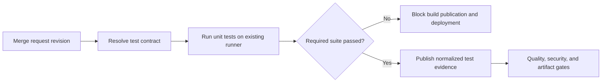

# UC-CICD-003: Automated Unit Testing in CI

Last reviewed: 2026-08-13

## Use-case record

| Field | Value |
| --- | --- |
| Canonical portfolio use case | Automated Unit Testing in CI |
| Primary platform | Enterprise DevSecOps Delivery Platform |
| Enterprise outcome | Detect code-level regressions before an artifact can enter the enterprise delivery path |
| Primary actors | Application developer, code reviewer, delivery engineer, platform owner |
| Primary GitLab repository | `midhhealth/platform-delivery/devsecops-cicd-orchestrator` |
| Related capabilities | Automated build, code quality, dependency scanning, artifact management, release promotion |
| Existing execution boundary | GitLab and an accepted tagged runner; no new test service or runner is authorized |
| Current state | **Planned — detailed design only; no implementation or test execution is claimed** |
| Owner | Enterprise DevSecOps Delivery Platform team with participating application owners |

## Purpose

Unit tests give fast feedback on the smallest testable behavior of an
application. When they run only on a developer workstation, the enterprise
cannot prove that the reviewed revision passed, cannot consistently block a
broken package, and cannot compare results across teams.

This use case places the unit-test decision inside GitLab CI, ahead of package,
image, or deployment work. The platform provides a common contract for when
tests run, what constitutes success, what evidence is retained, and how failure
blocks the delivery graph. Application teams continue to own their test code
and framework-specific assertions.

## Expected outcome

Every eligible merge-request and protected-branch revision runs its complete
declared unit-test suite on an existing accepted runner. A valid passing result
allows only the next source gate; a failed, incomplete, missing, or timed-out
result blocks package, image, artifact-publication, and deployment paths for
that same commit SHA.

## Platform and enterprise fit

| Relationship | Explanation |
| --- | --- |
| Within the DevSecOps platform | Unit testing is the first behavior gate after source/build preparation. Its result controls whether quality, security, artifact, and release stages are eligible to run. |
| Provider and payer systems | Regressions in calculation, validation, authorization, mapping, and workflow logic are detected before they can become deployable artifacts. |
| Shared digital platform | One evidence contract permits consistent review even when applications use different test frameworks. |
| Risk and compliance | The pipeline records that the exact reviewed SHA passed the required suite; exclusions and quarantined tests remain visible. |
| Operational resilience | Fast deterministic tests reduce preventable release failures and provide a safe regression suite for patches and rollback candidates. |

Unit tests do not prove a service works in an environment. Integration,
contract, security, performance, and runtime health validation remain separate
controls.

## Trigger and actors

| Item | Definition |
| --- | --- |
| Trigger | Merge request, protected-branch commit, or approved release tag for an onboarded repository |
| Application developer | Maintains test code, fixtures, and framework configuration |
| Code reviewer | Reviews changed behavior, assertions, skips, and exclusions |
| Delivery engineer | Maintains the shared test-result and pipeline-ordering contract |
| Platform owner | Approves runner class, timeouts, evidence, and exception policy |
| Risk reviewer | Reviews protected-data handling and material exclusions when required |

## Scope and exclusions

In scope:

- discovery and execution of repository-owned unit tests;
- test execution for merge requests and protected branches;
- framework-neutral pass/fail, duration, count, skip, and failure evidence;
- optional coverage collection when the application already defines a coverage
  policy;
- negative-path proof that a failed test blocks package and deployment stages;
- visibility of skipped, quarantined, or excluded tests; and
- reuse of existing accepted GitLab runners.

Out of scope:

- writing application business logic or inventing tests on behalf of product
  owners;
- provisioning a runner, test-management product, SonarQube service, database,
  cluster, or test environment;
- integration, end-to-end, load, chaos, penetration, and production tests;
- using real patient, member, claim, or clinical data; and
- deployment or runtime acceptance.

## Actors and responsibilities

| Actor | Responsibility |
| --- | --- |
| Application developer | Maintains unit tests and fixes failures in the same reviewable repository |
| Code reviewer | Confirms assertions cover the changed behavior and that exclusions are justified |
| Delivery engineer | Maintains the reusable CI contract and job ordering |
| Platform owner | Approves runner class, evidence shape, timeout, and exception policy |
| Security or compliance reviewer | Reviews data handling and high-risk exclusions when applicable |

## Preconditions

- The application repository has an identifiable test command owned by the
  application team.
- Test dependencies are declared and restorable without copying a developer's
  local environment.
- Tests use synthetic, generated, or properly de-identified fixtures committed
  under the repository's data-handling rules.
- The selected image or toolchain and runner tags are declared in source.
- Test execution does not require production credentials or access to runtime
  services; a test needing those dependencies is not a unit test for this gate.
- Package, image, and deployment jobs declare a dependency on the unit-test
  result rather than running independently.

## Detailed functional flow

1. A merge request or protected-branch change starts a GitLab pipeline for an
   immutable commit SHA.
2. The pipeline identifies the repository's declared test command, toolchain,
   and dependency lock state. Missing or ambiguous configuration fails the gate.
3. An existing accepted runner starts an isolated job with no deployment
   credentials and restores only declared test dependencies.
4. The test framework executes the complete required unit-test set. Parallel
   shards are permitted only when their results are recombined and missing
   shards fail the job.
5. The job exports a normalized result containing total, passed, failed,
   skipped, errored, duration, and—when applicable—coverage values.
6. The pipeline evaluates repository policy. Any failed/errored test, missing
   result, timeout, unexpected test-count drop, or unapproved exclusion fails
   the gate.
7. On failure, package, image, publication, and deployment jobs remain blocked.
   The merge request exposes the failed test names and a sanitized diagnostic.
8. On success, the evidence is associated with the source SHA and made
   available to later DevSecOps controls. Success authorizes the next source
   gate; it does not authorize deployment.

## Test contract

Each onboarded repository should declare the following without forcing every
language to use the same framework:

| Contract item | Required behavior |
| --- | --- |
| Test command | One noninteractive command with meaningful exit codes |
| Test roots | Explicit directories or package selectors so accidental discovery changes are visible |
| Toolchain | Language/runtime and test-framework versions are declared |
| Fixtures | Synthetic or approved de-identified data only |
| Timeout | Bounded value that fails rather than leaving a runner occupied indefinitely |
| Result format | Machine-readable output such as JUnit XML plus a concise human-readable summary |
| Coverage policy | Repository-owned threshold or explicitly `not applicable`; the platform does not invent a universal number |
| Exclusions | Identifier, owner, rationale, expiry, and issue reference for every quarantine or skip policy |

## Evidence contract

The future pipeline result must let a reviewer answer who ran what, against
which source, and why the next stage was allowed or blocked.

Required evidence includes:

- GitLab project, commit SHA, pipeline ID, job ID, and runner identity;
- toolchain and test-framework versions;
- dependency-lock digest when available;
- start/end time and duration;
- test totals: collected, passed, failed, errored, and skipped;
- failed-test identifiers and sanitized failure messages;
- coverage values and threshold decision when coverage is in scope;
- active quarantine/exclusion records; and
- final gate decision with the downstream jobs that were allowed or blocked.

Test logs and reports must not contain secrets or protected healthcare data.
Screenshots may support a review but never replace the machine-readable result.

## Code and configuration map

The following entries describe future implementation responsibilities only.
No path is represented as implemented until a reviewed commit is recorded.

| Planned location | Responsibility |
| --- | --- |
| `.gitlab-ci.yml` or an included CI template | Run unit testing before package, image, publication, and deployment jobs |
| Application test configuration | Declare test roots, framework behavior, timeout, coverage, and result output |
| Application dependency lock file | Constrain the test dependency state |
| Planned normalized result schema | Capture provenance, counts, duration, failures, skips, coverage, and gate decision |
| Planned positive and negative fixtures | Prove pass, fail, zero-test, timeout, shard-loss, redaction, and downstream blocking behavior |
| Planned operating notes | Explain diagnosis, quarantine review, rerun, evidence review, and safe stop |

## Decision rules

- A nonzero framework exit code fails the gate.
- Zero tests collected fails unless the repository contract explicitly proves
  that no unit-test scope exists and the platform owner approves the exception.
- Skipped tests are reported; an unexpected increase or expired quarantine
  fails review.
- Coverage is evaluated only against a reviewed repository policy. A lower
  threshold requires a reviewed source change, not a pipeline variable override.
- Retries do not silently turn a flaky test green. Both the initial result and
  retry are retained, and persistent flakiness creates follow-up work.
- Package, container, artifact publication, and deployment stages require this
  job's successful result for the same commit SHA.
- Fork or untrusted-branch pipelines do not receive protected variables.

## Failure and troubleshooting model

| Symptom | First checks | Required outcome |
| --- | --- | --- |
| No tests collected | Test roots, naming rules, checkout contents, framework configuration | Fix discovery or approve a documented no-test exception; never report a false pass |
| Dependency restore fails | Lock file, approved source reachability, pinned toolchain | Correct reviewed source or retry an established transient failure |
| Test passes locally but fails in CI | Uncommitted files, local cache, timezone/locale, concurrency, hidden service dependencies | Remove environmental dependence or reclassify the test |
| Suite times out | Hanging test, accidental integration call, resource usage, timeout value | Isolate the cause; do not simply remove the bound |
| Test count drops | Renames, selection filters, shard loss, quarantine changes | Explain the delta and restore omitted coverage before accepting |
| Sensitive data appears in logs | Fixture source and assertion output | Stop publication, remove the data, rotate exposed credentials if any, and open an incident |
| Runner unavailable | Runner status and declared tags | Wait or use another already accepted compatible runner; do not create infrastructure here |

Because unit tests do not mutate a runtime target, recovery consists of
discarding results from the failed revision, correcting the reviewed source,
and rerunning the complete required suite. Bypassing the gate is not recovery.

## Jira breakdown

### STORY-CICD-003-001: Define repository unit-test contracts

**Outcome:** Participating repositories declare a repeatable test command,
toolchain, fixtures, timeout, result format, coverage policy, and exclusions.

**Description:** Application and delivery owners need a framework-neutral test
contract that preserves application ownership while creating one enterprise
gate decision.

**Status:** Planned.

**Acceptance criteria:** Given an onboarding request, when the contract is
reviewed, then it resolves to an existing repository and runner class, contains
no runtime mutation or protected data, and a positive and intentionally failing
fixture produce distinct, machine-readable decisions.

**Implementation steps:** Confirm the existing repository and runner class;
record the command, roots, toolchain, dependency state, fixtures, timeout,
result format, coverage policy, and exclusions; review positive and intentional
failure fixtures with the application owner.

**Completed work:** The required contract and boundaries are documented here.
No pipeline source or test result is claimed.

**Validation and rollback:** Future validation must exercise valid, failing,
zero-test, timeout, and sensitive-output fixtures. Revert the source contract
if it does not preserve the repository's established test behavior.

**Required attachments:** Future `ART-CICD-003-001A` contract and fixture report.

### STORY-CICD-003-002: Enforce test-before-package ordering

**Outcome:** Package, image, artifact publication, and deployment work cannot
run for a commit whose required unit tests failed or produced no valid result.

**Description:** The delivery engineer needs an explicit dependency graph so a
broken revision cannot bypass testing by reaching a later independent job.

**Status:** Planned.

**Acceptance criteria:** Given a passing suite, the next source gate becomes
eligible; given a failed, timed-out, missing, or incomplete suite, every
downstream packaging and deployment job remains blocked for that SHA.

**Implementation steps:** Add the unit-test job on an accepted runner; declare
all downstream `needs` or stage dependencies; fail closed on missing or invalid
results; exercise passing, failing, timed-out, and canceled paths.

**Completed work:** The intended gate ordering and decision rules are designed.
Implementation is deferred.

**Validation and rollback:** Use an intentionally failing assertion to prove
every later packaging and deployment path remains blocked, then restore the
fixture and prove only the next source gate is eligible. Revert the pipeline
change if it incorrectly blocks unchanged repositories.

**Required attachments:** Future `ART-CICD-003-002A` pipeline dependency graph
and `ART-CICD-003-002B` negative-path result.

### STORY-CICD-003-003: Publish reviewable unit-test evidence

**Outcome:** Developers and reviewers can diagnose a failure and auditors can
reconstruct the gate decision without depending on a screenshot.

**Description:** Developers need actionable diagnostics while platform and
risk reviewers need a durable, sanitized decision tied to the exact revision.

**Status:** Planned.

**Acceptance criteria:** The retained result includes provenance, counts,
duration, sanitized failures, coverage decision when applicable, exclusions,
and the allow/block decision; secret and protected-data fixtures are rejected.

**Implementation steps:** Generate the normalized result; publish framework
reports using existing GitLab artifact handling; enforce redaction checks;
record exclusions and coverage decisions; link evidence to the source SHA.

**Completed work:** Required evidence fields are documented. No execution
evidence is claimed.

**Validation and rollback:** Verify counts against raw framework output, test a
sensitive fixture rejection, and confirm reports resolve to the exact pipeline
and SHA. Discard invalid reports and correct source before rerunning.

**Required attachments:** Future `ART-CICD-003-003A` normalized result and
`ART-CICD-003-003B` redaction decision.

## Evidence and screenshot register

| ID | Planned evidence | Source | Current status |
| --- | --- | --- | --- |
| `ART-CICD-003-001A` | Test contract plus positive and negative fixture decisions | GitLab CI in the implementation repository | Pending future implementation |
| `ART-CICD-003-002A` | Pipeline graph showing test-before-package ordering | GitLab pipeline | Pending future execution |
| `ART-CICD-003-002B` | Deliberate test failure blocking all downstream jobs | Existing accepted GitLab runner | Pending future execution |
| `ART-CICD-003-003A` | Normalized test result tied to the source SHA | Existing accepted GitLab runner | Pending future execution |
| `ART-CICD-003-003B` | Sensitive-output fixture rejection | GitLab CI | Pending future execution |

## Expected versus current result

| Measure | Expected future result | Current result |
| --- | --- | --- |
| Platform fit | Unit-test result controls later quality, security, packaging, and release eligibility | Detailed relationship documented |
| Enterprise fit | Code-level regressions are detected and auditable before deployable output exists | Outcome and control model documented |
| Infrastructure | Existing GitLab and accepted runners only | Boundary documented; no new infrastructure authorized |
| Implementation | Reviewed test contract and pipeline dependency graph | Not scheduled |
| Execution | Positive and negative evidence, including downstream blocking | Not run |

## Acceptance decision

**Planned.** This document explains the intended behavior and separates it from
future implementation. Code complete will require reviewed pipeline source and
passing positive and negative CI fixtures in the named repository. Acceptance
will additionally require evidence that a deliberately failing test blocks all
package and deployment paths, a valid suite enables only the next source gate,
the runner and data boundaries are respected, and the result is linked here.

## Related use cases

- `UC-CICD-002` provides the controlled source/build context.
- `UC-CICD-004` evaluates code quality after the unit-test gate.
- `UC-CICD-005` publishes only outputs associated with passing required gates.
- `UC-CICD-010` composes unit, quality, secret, dependency, and image controls
  into the secure delivery workflow.
- `UC-CICD-015` uses later runtime evidence; it is not replaced by unit tests.
