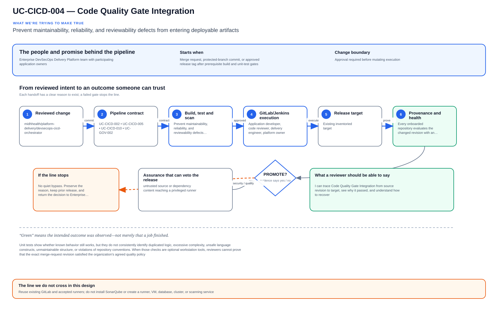

# UC-CICD-004: Code Quality Gate Integration

Last reviewed: 2026-08-13

## Use-case record

| Field | Value |
| --- | --- |
| Canonical portfolio use case | Code Quality Gate Integration |
| Primary platform | Enterprise DevSecOps Delivery Platform |
| Supporting use cases | [UC-CICD-002](UC-CICD-002-automated-build-pipeline.md), [UC-CICD-005](UC-CICD-005-artifact-management-automation.md), [UC-CICD-010](UC-CICD-010-secure-ci-cd-pipeline-implementation.md), [UC-GOV-002](../governance/UC-GOV-002-secrets-management-automation.md) |
| Enterprise outcome | Prevent maintainability, reliability, and reviewability defects from entering deployable artifacts |
| Primary actors | Application developer, code reviewer, delivery engineer, platform owner |
| Primary implementation repository | `midhhealth/platform-delivery/devsecops-cicd-orchestrator` |
| Related capabilities | Automated build, unit testing, dependency management, artifact publication, secure CI/CD |
| Existing execution boundary | GitLab and accepted tagged runners |
| Product constraint | `sonarqube.example.com` is provisioned-only and must not be treated as an available quality service |
| Current state | **Planned — detailed design only; no quality job, service integration, or execution evidence is claimed** |
| Infrastructure boundary | Reuse existing GitLab and accepted runners; do not install SonarQube or create a runner, VM, database, cluster, or scanning service |
| Owner | Enterprise DevSecOps Delivery Platform team with participating application owners |

## Purpose

Unit tests show whether known behavior still works, but they do not consistently
identify duplicated logic, excessive complexity, unsafe language constructs,
unmaintainable structure, or violations of repository conventions. When those
checks are optional workstation tools, reviewers cannot prove that the exact
merge-request revision satisfied the organization's agreed quality policy.

This design introduces a code-quality decision inside GitLab CI. It defines
what is measured, which findings block delivery, how legacy debt is separated
from newly introduced defects, how exceptions expire, and how evidence is
passed to later DevSecOps stages. Application teams retain ownership of their
language-specific rules and remediation.

## Expected outcome

Every onboarded repository evaluates the changed revision with an approved,
versioned quality policy on an existing runner. The pipeline returns a
machine-readable pass/fail decision tied to the commit SHA. New blocking defects,
an invalid policy, a missing report, or an unavailable required analyzer blocks
artifact publication and deployment. Passing the gate enables only the next
source control; it does not authorize a release.

## Platform and enterprise fit

| Relationship | Explanation |
| --- | --- |
| Within the DevSecOps platform | The quality gate follows build and required unit tests and precedes artifact publication, image creation, and promotion. |
| Provider and payer systems | Maintainability and reliability defects in healthcare workflows are identified before they become release candidates. |
| Shared digital platform | A common decision contract makes results comparable while allowing Java, Python, JavaScript, infrastructure, and other repositories to use appropriate analyzers. |
| Risk and compliance | Policy revision, findings, exceptions, reviewer, and gate decision create an auditable record rather than an informal recommendation. |
| Operational resilience | Complexity and defect controls reduce fragile changes and make emergency fixes easier to review and recover. |

The enterprise outcome is a trustworthy decision, not the installation of a
particular product. SonarQube can become an implementation option only after a
separate installation and acceptance change establishes it as available.

## Trigger and actors

| Item | Definition |
| --- | --- |
| Trigger | Merge request, protected-branch commit, or approved release tag after prerequisite build and unit-test gates |
| Application developer | Owns source remediation and repository-specific rule configuration |
| Code reviewer | Evaluates changed code, justified suppressions, and debt impact |
| Delivery engineer | Maintains the common result contract and pipeline dependency graph |
| Platform owner | Approves supported analyzer classes, baseline method, blocking policy, and exception process |
| Risk reviewer | Reviews high-risk suppressions or policy changes when required |

## Preconditions

- The repository and immutable commit SHA are available in GitLab.
- Required build and unit-test stages for the same SHA have completed
  successfully, or the repository contract documents why a build is not
  applicable.
- The application owner has selected repository-native analyzers and rule sets
  appropriate to the language and content; the enterprise platform does not
  invent one universal tool.
- Analyzer and rule-set versions are declared in reviewed source.
- An existing accepted runner can execute the analysis without production,
  Kubernetes, AWX, or deployment credentials.
- Analysis uses repository source and synthetic fixtures only. Protected
  healthcare data is excluded.
- The policy states whether it evaluates changed code, the entire codebase, or
  both, and how an existing debt baseline is identified.

## Scope and exclusions

In scope:

- static quality analysis of version-controlled source and configuration;
- language-appropriate lint, maintainability, complexity, duplication, and
  defect checks;
- new-code and whole-codebase measurements with explicit baseline semantics;
- pass/fail evaluation before packaging and deployment;
- controlled suppressions and time-bounded exceptions;
- normalized machine-readable findings and gate evidence; and
- negative-path proof that a failed gate blocks downstream work.

Out of scope:

- installing or accepting SonarQube or any new scanning platform;
- dependency, container, secret, malware, penetration, or runtime security
  testing, which belong to separate controls;
- automatically rewriting application code;
- imposing the same metric threshold on every language and repository type;
- converting historical debt into an immediate unreviewed delivery outage; and
- deployment, runtime health verification, or production acceptance.

## Quality dimensions and policy model

| Dimension | Question answered | Example policy behavior |
| --- | --- | --- |
| Correctness defect | Does static analysis identify a likely bug or unsafe construct? | New blocking-severity findings fail |
| Maintainability | Is changed logic excessively complex or difficult to reason about? | Changed functions exceed a repository-approved bound |
| Duplication | Is new code copying logic that should remain shared? | New duplication above the agreed change threshold fails or requires review |
| Style and consistency | Does code violate enforceable repository conventions? | Error-class rules block; advisory rules remain visible |
| Dead or unreachable code | Is the change adding behavior that cannot execute or is never referenced? | New confirmed findings block |
| Documentation/API clarity | Are required public interfaces or configuration contracts undocumented? | Repository-specific rule applies when relevant |
| Baseline debt | What qualifying findings already existed before the change? | Visible and tracked, but not attributed to the author unless worsened |

Thresholds belong in reviewed repository or shared-template policy, not in
unprotected pipeline variables. A stricter application policy may extend the
enterprise minimum. Lowering a blocking threshold or disabling a rule is itself
a reviewed policy change.

## Design walkthrough

The architecture conversation for Code Quality Gate Integration should follow one reviewed
change from commit to an identifiable release decision. The result MidhHealth needs is to
Prevent maintainability, reliability, and reviewability defects from entering deployable
artifacts. Enterprise DevSecOps Delivery Platform team with participating application owners
owns the platform decision, while the consuming service or business owner still accepts the
effect on its workflow.

Read the diagram from left to right as a sequence of gates; a later stage cannot repair missing
identity or evidence from an earlier one. In this page, **UC-CICD-002: Automated Build
Pipeline** contributes reviewed contract and evidence required by the bounded workflow;
**UC-CICD-005: Artifact Management Automation** contributes reviewed contract and evidence
required by the bounded workflow. The first buildable boundary is the accepted existing lab
boundary named by the page. The design stops at this rule: Reuse existing GitLab and accepted
runners; do not install SonarQube or create a runner, VM, database, cluster, or scanning
service.

The walkthrough becomes useful when the happy path breaks. If symptom, the expected response is
to Required behavior. The leading design threat is untrusted source or dependency content
reaching a privileged runner; therefore a green source job, screenshot or reachable endpoint is
supporting evidence, not acceptance by itself.

## Architecture context

Code Quality Gate Integration is evaluated inside the existing enterprise lab and the owning
platform's current source-control and execution boundaries. The architectural
unit is the governed outcome—**Prevent maintainability, reliability, and reviewability defects from entering deployable artifacts**—rather than a new product or
environment.

| Context element | Architecture statement |
| --- | --- |
| Business and operational setting | Enterprise consumers: Enterprise DevSecOps Delivery Platform. The result must be explainable, repeatable, and owned. |
| Current state | **Planned — detailed design only; no quality job, service integration, or execution evidence is claimed** |
| Desired state | A reviewed contract drives a bounded result, machine-readable evidence, and a safe stop or recovery decision. |
| Existing target boundary | Approved existing delivery target |
| Infrastructure constraint | Reuse existing GitLab and accepted runners; do not install SonarQube or create a runner, VM, database, cluster, or scanning service |
| Accountable platform owner | Enterprise DevSecOps Delivery Platform team with participating application owners; the consuming service, data, security, or workflow owner remains accountable for accepting business impact. |

The page owns the contract, control logic, evidence, and recovery behavior for
Code Quality Gate Integration. It does not absorb the responsibilities of the dependency use cases
listed below.

## Architecture diagram

Read this one left to right. The upper line follows a reviewed change toward a provable outcome; the lower branch shows who can stop it and how the team returns to a known release.

## Dependencies and handoffs

Code Quality Gate Integration remains accountable to its primary platform. The dependencies below
provide explicit contracts or assurance evidence; they do not become alternate owners.

| Relationship | Use case | Required handoff | Failure propagation |
| --- | --- | --- | --- |
| Required upstream contract | [UC-CICD-002: Automated Build Pipeline](UC-CICD-002-automated-build-pipeline.md) | reviewed contract and evidence required by the bounded workflow | Missing, stale, or failed evidence blocks promotion or runtime action. |
| Required upstream contract | [UC-CICD-005: Artifact Management Automation](UC-CICD-005-artifact-management-automation.md) | reviewed contract and evidence required by the bounded workflow | Missing, stale, or failed evidence blocks promotion or runtime action. |
| Coordinated assurance handoff | [UC-CICD-010: Secure CI/CD Pipeline Implementation](UC-CICD-010-secure-ci-cd-pipeline-implementation.md) | secure pipeline baseline and protected execution boundary | Missing, stale, or failed evidence blocks promotion or runtime action. |
| Coordinated assurance handoff | [UC-GOV-002: Secrets Management Automation](../governance/UC-GOV-002-secrets-management-automation.md) | approved secret reference, redaction rule, and rotation owner | Missing, stale, or failed evidence blocks promotion or runtime action. |

Before Code Quality Gate Integration is implemented, every handoff must resolve to an immutable
revision and machine-readable artifact. A URL, screenshot, or verbal approval
alone is not sufficient dependency evidence.

## Quality attributes

For Code Quality Gate Integration, quality is measured against the bounded enterprise outcome—not
document length or a green job. Unapproved business thresholds remain explicit
decisions and must not be invented.

| Attribute | Required measure or invariant | Decision state |
| --- | --- | --- |
| Functional correctness | Every required input is validated; **Prevent maintainability, reliability, and reviewability defects from entering deployable artifacts** is evaluated against positive, negative, missing-input, and unauthorized-scope cases. | Fixed design requirement |
| Performance and scale | Establish a baseline for pipeline duration, queue delay, reproducibility, and false-pass rate on existing capacity; the owner must approve warning and blocking thresholds before runtime promotion. | Thresholds `TBD` before implementation |
| Reliability | Missing prerequisites, stale dependencies, malformed evidence, and partial results fail closed without widening scope. | Fixed design requirement |
| Recovery | Record the maximum acceptable interruption and recovery time before runtime use; source-only validation must remain zero-change. | Owner decision required before runtime exercise |
| Observability | Emit use-case ID, revision, target, executor, start/end time, duration, decision, reason code, and recovery reference. | Required in the result schema |
| Evidence retention | Assign classification, retention period, and deletion owner before storing runtime evidence. | Security/compliance decision required |

Load, latency, availability, retention, RTO, and RPO values for Code Quality Gate Integration become
requirements only after the named service or business owner approves them. Until
then, the implementation gate records them as unresolved instead of quietly
choosing defaults.

## Security and privacy architecture

The Code Quality Gate Integration design separates source validation, privileged execution, target
access, and evidence review. Those boundaries remain in force even when one
engineer can access more than one system.

| Trust boundary | Allowed flow | Required control |
| --- | --- | --- |
| Contributor → GitLab | Reviewed source, contract, and synthetic/sanitized fixtures | Protected branch rules, peer review, secret scanning, and immutable commit identity |
| GitLab runner → result artifact | Read-only evaluation inputs and machine-readable output | No target-changing credential; pinned tool versions; artifact checksum and expiry |
| Approval plane → executor | Approved revision, target allowlist, mode, canary, and change reference | Separate authorization through the existing Jenkins/AWX or platform control path |
| Executor → existing target | Minimum commands or API operations required for Code Quality Gate Integration | Least-privilege identity, explicit target limit, timeout, and stop condition |
| Target → evidence store | Sanitized metadata, measurements, decision, and recovery result | Exclude credentials, tokens, private keys, kubeconfigs, packet payloads, PHI, PII, and unrelated records |

For Code Quality Gate Integration, the primary threat is **untrusted source or dependency content reaching a privileged runner**. The mandatory response is
protected refs, isolated build context, pinned dependencies, least-privilege credentials, and artifact provenance. Authentication and authorization mappings must name
the existing identity source, principal or service account, permitted actions,
credential owner, rotation path, and emergency revocation procedure before a
runtime story can move beyond `Planned`.

## Architecture decisions and trade-offs

| Decision | Selected architecture | Alternative deferred or rejected | Rationale and status |
| --- | --- | --- | --- |
| First implementation slice | Contract, schema, fixtures, and read-only evidence on the existing GitLab runner | Product installation or broad runtime rollout | Proves behavior without expanding infrastructure; **approved design direction** |
| Runtime execution | Use only Jenkins shared-library workflow when current inventory and change approval confirm it is available | Direct operator changes or credentials in CI | Preserves separation of duties; **conditional on implementation review** |
| Evidence | Machine-readable result is authoritative; screenshots are optional supporting material | Screenshot-only acceptance | Enables repeatable audit and automated gates; **approved design direction** |
| Failure handling | Fail closed, preserve bounded diagnostics, and recover only the named scope | Continue with partial or stale evidence | Prevents false success and hidden blast radius; **approved design direction** |
| New capacity or product | Stop and raise a separate architecture decision | Silently add a VM, service, cloud dependency, or cluster add-on | Maintains the existing-lab constraint; **mandatory** |

### Open decisions before implementation

| Open decision | Decision owner | Resolution gate |
| --- | --- | --- |
| Exact inventory object and first canary | Platform owner plus consuming service/data owner | Must resolve before the implementation story leaves `Planned` |
| Performance, scale, and reliability thresholds | Service owner and SRE | Must be recorded before a runtime acceptance run |
| Identity-to-action authorization matrix | Platform owner and security reviewer | Must be approved before target credentials are attached |
| Evidence classification and retention | Data/security owner | Must be approved before runtime artifacts are retained |

If any selected approach changes, record the rationale beside UC-CICD-004 in
the implementation repository before code review. A documentation edit alone
does not approve the new architecture.

## Implementation design

The first Code Quality Gate Integration implementation is deliberately source-only. Its planned files live in the existing repository; none provisions infrastructure.

| Planned source responsibility | Exact planned location |
| --- | --- |
| Use-case contract and target allowlist | `midhhealth/platform-delivery/devsecops-cicd-orchestrator/contracts/uc-cicd-004.yaml` |
| Primary implementation | `midhhealth/platform-delivery/devsecops-cicd-orchestrator/jobs/code-quality-gate-integration.groovy`; entry point: the `code-quality-gate-integration` Jenkins job and its shared-library step |
| Machine-readable result schema | `midhhealth/platform-delivery/devsecops-cicd-orchestrator/schemas/uc-cicd-004-result.schema.json` |
| Positive, negative, malformed, and recovery fixtures | `midhhealth/platform-delivery/devsecops-cicd-orchestrator/tests/fixtures/uc-cicd-004/` |
| GitLab source gate | `midhhealth/platform-delivery/devsecops-cicd-orchestrator/.gitlab/ci/uc-cicd-004.yml` |
| Operator diagnosis and recovery | `midhhealth/platform-delivery/devsecops-cicd-orchestrator/docs/runbooks/uc-cicd-004.md` |

### Delivery stages

1. **Contract:** add the contract, schema, owners, dependency revisions, target
   allowlist, modes, reason codes, and open-decision values.
2. **Source validation:** lint exact paths, validate schema compatibility, scan
   for sensitive content, and run every fixture on the existing runner.
3. **Read-only proof:** execute the `code-quality-gate-integration` Jenkins job and its shared-library step, publish a checksummed result, and
   prove that blocked cases cannot reach a mutating path.
4. **Bounded execution:** only after separate approval, pass the immutable
   revision, target, mode, canary, and change ID to Jenkins shared-library workflow.
5. **Independent verification:** measure the expected result, confirm unrelated
   state is unchanged, run recovery or zero-change proof, and obtain owner
   review.

The implementation merge request must link this page, the dependency artifacts,
the decision values above, and the eventual pipeline/job/run identifiers. Code
completion alone cannot promote the page to runtime verified.

## Code and configuration map

The locations below are future implementation touchpoints. They are not
represented as existing files or completed source.

| Planned location | Responsibility |
| --- | --- |
| `.gitlab-ci.yml` or an included CI template | Position quality after prerequisites and before publication or deployment |
| Repository-owned quality policy | Pin analyzer, rule set, scope, baseline semantics, thresholds, and exclusions |
| Planned normalized quality-result schema | Capture provenance, findings, metrics, exceptions, and gate decision |
| Planned result adapter | Convert the chosen repository-native analyzer output into the common evidence shape |
| Planned fixture set | Prove passing, blocking, malformed-report, analyzer-failure, baseline, and exclusion-expiry behavior |
| Planned operating notes | Explain diagnosis, exception review, rerun, baseline change, and safe stop |

If SonarQube is installed and accepted through a later approved change, an
adapter may be added without changing this documented capability's decision and evidence
contract. This document does not schedule or authorize that installation.

## Failure and troubleshooting model

| Symptom | First checks | Required behavior |
| --- | --- | --- |
| Analyzer cannot start | Pinned tool version, job image, runner compatibility, dependency restore | Fail the gate and correct reviewed source; do not mark analysis successful |
| Report is missing or malformed | Output path, adapter version, job termination, disk limit | Block downstream work until valid evidence exists |
| Large unexpected finding increase | Baseline SHA, generated paths, rule-set change, analyzer upgrade | Separate real code change from policy/tool change and review both |
| Quality passes despite a known fixture | Rule enabled state, severity mapping, scan scope, suppression | Treat as a gate defect and block rollout of the template |
| Existing debt blocks every merge | New-code classification and whole-codebase floor | Correct baseline policy without hiding debt or weakening unreviewed thresholds |
| Suppression hides too much code | Path and line scope, expiry, reviewer, issue | Narrow or reject the suppression before passing |
| Sensitive content appears in report | Rule output, fixture source, repository data | Stop publication, remove exposure, and open an incident when required |
| SonarQube endpoint is unavailable | Current environment state | Do not attempt integration; it remains provisioned-only until separately accepted |

Analysis is non-mutating outside its CI workspace. Recovery means discarding an
invalid report, correcting the source, policy, or adapter through review, and
rerunning the complete gate. Bypassing or marking a failed scan successful is
not recovery.

## Jira breakdown

### STORY-CICD-004-001: Define the enterprise quality decision contract

**Description:** Delivery and application owners need one auditable decision
shape across languages while keeping rules and thresholds appropriate to each
repository.

**Status:** Planned.

**Acceptance criteria:** Given an onboarding proposal, when the policy is
reviewed, then it names the analyzer and version, scope, baseline, blocking
rules, thresholds, exclusions, evidence fields, owner, and accepted existing
runner class; it contains no new-service or deployment action.

**Implementation steps:** Inventory repository languages and existing quality
commands; classify applicable dimensions; define new-code and baseline rules;
specify the normalized result; review exception and data-handling boundaries.

**Completed work:** The architecture behavior, enterprise fit, quality
dimensions, and no-new-infrastructure boundary are documented here. No source
implementation is claimed.

**Validation and rollback:** Future contract validation must accept a complete
repository policy and reject missing analyzer versions, mutable baselines,
unbounded exclusions, and unavailable products. Revert the documentation or
policy commit if review finds an incorrect boundary.

**Required attachments:** Future `ART-CICD-004-001A` policy-contract review.

### STORY-CICD-004-002: Enforce the quality gate in the delivery graph

**Description:** The delivery engineer needs quality analysis to fail closed
before an output can be published or deployed, using an existing accepted
runner and repository-native tooling.

**Status:** Planned.

**Acceptance criteria:** Given a compliant revision, the normalized decision
passes and only later source gates become eligible; given a blocking finding,
analyzer crash, missing report, invalid baseline, or expired exception, every
publication and deployment path remains blocked for that SHA.

**Implementation steps:** Add the future job after build and unit-test
prerequisites; pin the analyzer; implement the normalized adapter; declare
downstream dependencies; exercise passing and each required failure path.

**Completed work:** Pipeline ordering and failure semantics are designed.
Implementation and execution are deferred.

**Validation and rollback:** Introduce an intentional blocking fixture and
prove later jobs remain blocked, then restore the fixture and prove the next
source gate becomes eligible. Revert the pipeline source change if the adapter
misclassifies established repository results.

**Required attachments:** Future `ART-CICD-004-002A` passing decision and
`ART-CICD-004-002B` downstream-block evidence.

### STORY-CICD-004-003: Govern baselines, suppressions, and policy evolution

**Description:** Application and risk reviewers need legacy debt and temporary
exceptions to remain visible without allowing silent, permanent quality
bypasses.

**Status:** Planned.

**Acceptance criteria:** Every suppression is bounded, owned, reviewed, linked,
and time-limited; expired or broadened exclusions fail review; analyzer or
rule-set upgrades report their decision impact before becoming required.

**Implementation steps:** Define the exception record; add expiry validation;
record baseline and rule-set digests; compare old and proposed analyzer results;
publish an owner-approved policy-change decision.

**Completed work:** Governance requirements are documented. No exception
register or analyzer-upgrade evidence is claimed.

**Validation and rollback:** Test valid, expired, missing-owner, and overbroad
exceptions. Roll back a policy upgrade by restoring the last reviewed rule-set
revision, while retaining both comparison reports.

**Required attachments:** Future `ART-CICD-004-003A` exception validation and
`ART-CICD-004-003B` policy-version comparison.

## Evidence and screenshot register

| ID | Planned evidence | Source | Current status |
| --- | --- | --- | --- |
| `ART-CICD-004-001A` | Reviewed analyzer, baseline, threshold, exclusion, and evidence contract | Implementation repository review | Pending future implementation |
| `ART-CICD-004-002A` | Passing normalized quality decision tied to a commit SHA | Existing accepted GitLab runner | Pending future execution |
| `ART-CICD-004-002B` | Blocking fixture and downstream-job stop proof | GitLab pipeline and machine-readable result | Pending future execution |
| `ART-CICD-004-003A` | Valid and rejected exception decisions | GitLab CI fixtures | Pending future execution |
| `ART-CICD-004-003B` | Old/new analyzer or rule-set impact comparison | GitLab CI fixtures | Pending future execution |

## Expected versus current result

| Measure | Expected future result | Current result |
| --- | --- | --- |
| Platform fit | Quality decision follows build/tests and controls artifact and release eligibility | Detailed relationship documented |
| Enterprise fit | New maintainability and reliability defects are traceable and blocked consistently | Outcome, policy, and governance model documented |
| Infrastructure | Existing GitLab and accepted runners; accepted services only | Boundary documented; SonarQube remains provisioned-only |
| Implementation | Reviewed repository-native analyzer adapter and negative-path fixtures | Not scheduled |
| Execution | Passing, blocking, exception, and policy-version evidence reviewed | Not run |

## Acceptance decision

**Planned.** This page is a detailed design and later implementation plan. Code
complete will require reviewed source and passing positive and negative fixtures
in the named implementation repository. Acceptance will additionally require a
real onboarded repository to prove that blocking findings and invalid evidence
stop all publication and deployment paths, valid results enable only the next
source gate, baselines and exceptions behave as designed, no unavailable
product was assumed, and evidence is linked here.

## Related use cases

- `UC-CICD-002` establishes the controlled build context.
- `UC-CICD-003` supplies the prerequisite unit-test decision.
- `UC-CICD-005` publishes outputs only after required source gates pass.
- `UC-CICD-010` combines quality with secret, dependency, and image security
  controls.
- `UC-CICD-013` covers vulnerable dependencies; it is not replaced by general
  maintainability analysis.

## Enhancement: pipeline configuration is executable source

The [AI-assisted pipeline and dependency track](../../platform-engineering-interview-learning-labs.md#ai-pipeline-dependency-track)
adds structural validation for CI YAML, generated Jenkins jobs, shared-library
interfaces, required stages, dependency order, conditions, timeouts, retry
policy, artifacts and credential references. Cheap deterministic checks run
before expensive build work. Buildkite configuration is not added to the
MidhHealth platform; a Buildkite answer requires separate real evidence.

### Questions an interviewer can press on

- **“What exactly did you validate?”** Name syntax/schema, stage graph,
  required/forbidden fields, generated job output, credential references and
  positive/negative fixtures rather than saying “we linted YAML.”
- **“How did you restructure the pipeline?”** Show the before/after dependency
  graph and explain which checks moved earlier or ran in parallel without
  weakening gates.
- **“How did you know the configuration was deployable?”** Render or generate
  it, run a synthetic project on the intended executor, retain the result and
  prove the previous revision can be restored.

### Enhancement build and deployment binding

Extend the existing contract, Jenkins job/shared-library evaluator, schema,
fixtures, CI and runbook with pipeline graph and configuration reason codes.
Add `tools/pipeline_config_validation/` for repository-native parsers and
`tests/fixtures/uc-cicd-004/pipeline-config/` for valid, cyclic, missing-gate,
unsafe-credential, timeout and generated-job cases. Deploy through the existing
Job DSL/shared-library path, compare generated configuration, run a synthetic
project and roll back to the prior template revision on mismatch.
