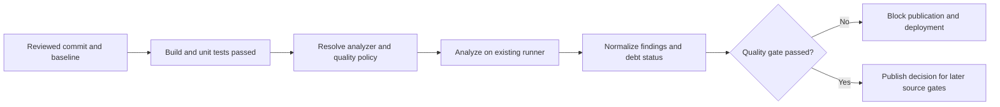

# UC-CICD-004: Code Quality Gate Integration

Last reviewed: 2026-08-13

## Use-case record

| Field | Value |
| --- | --- |
| Canonical portfolio use case | Code Quality Gate Integration |
| Primary platform | Enterprise DevSecOps Delivery Platform |
| Enterprise outcome | Prevent maintainability, reliability, and reviewability defects from entering deployable artifacts |
| Primary actors | Application developer, code reviewer, delivery engineer, platform owner |
| Primary GitLab repository | `midhhealth/platform-delivery/devsecops-cicd-orchestrator` |
| Related capabilities | Automated build, unit testing, dependency management, artifact publication, secure CI/CD |
| Existing execution boundary | GitLab and accepted tagged runners |
| Product constraint | `sonarqube.example.com` is provisioned-only and must not be treated as an available quality service |
| Current state | **Planned — detailed design only; no quality job, service integration, or execution evidence is claimed** |
| Infrastructure boundary | Reuse existing GitLab and accepted runners; do not install SonarQube or create a runner, VM, database, cluster, or scanning service |
| Owner | Enterprise DevSecOps Delivery Platform team with participating application owners |

## Purpose

Unit tests show whether known behavior still works, but they do not consistently
identify duplicated logic, excessive complexity, unsafe language constructs,
unmaintainable structure, or violations of repository conventions. When those
checks are optional workstation tools, reviewers cannot prove that the exact
merge-request revision satisfied the organization's agreed quality policy.

This design introduces a code-quality decision inside GitLab CI. It defines
what is measured, which findings block delivery, how legacy debt is separated
from newly introduced defects, how exceptions expire, and how evidence is
passed to later DevSecOps stages. Application teams retain ownership of their
language-specific rules and remediation.

## Expected outcome

Every onboarded repository evaluates the changed revision with an approved,
versioned quality policy on an existing runner. The pipeline returns a
machine-readable pass/fail decision tied to the commit SHA. New blocking defects,
an invalid policy, a missing report, or an unavailable required analyzer blocks
artifact publication and deployment. Passing the gate enables only the next
source control; it does not authorize a release.

## Platform and enterprise fit

| Relationship | Explanation |
| --- | --- |
| Within the DevSecOps platform | The quality gate follows build and required unit tests and precedes artifact publication, image creation, and promotion. |
| Provider and payer systems | Maintainability and reliability defects in healthcare workflows are identified before they become release candidates. |
| Shared digital platform | A common decision contract makes results comparable while allowing Java, Python, JavaScript, infrastructure, and other repositories to use appropriate analyzers. |
| Risk and compliance | Policy revision, findings, exceptions, reviewer, and gate decision create an auditable record rather than an informal recommendation. |
| Operational resilience | Complexity and defect controls reduce fragile changes and make emergency fixes easier to review and recover. |

The enterprise outcome is a trustworthy decision, not the installation of a
particular product. SonarQube can become an implementation option only after a
separate installation and acceptance change establishes it as available.

## Trigger and actors

| Item | Definition |
| --- | --- |
| Trigger | Merge request, protected-branch commit, or approved release tag after prerequisite build and unit-test gates |
| Application developer | Owns source remediation and repository-specific rule configuration |
| Code reviewer | Evaluates changed code, justified suppressions, and debt impact |
| Delivery engineer | Maintains the common result contract and pipeline dependency graph |
| Platform owner | Approves supported analyzer classes, baseline method, blocking policy, and exception process |
| Risk reviewer | Reviews high-risk suppressions or policy changes when required |

## Preconditions

- The repository and immutable commit SHA are available in GitLab.
- Required build and unit-test stages for the same SHA have completed
  successfully, or the repository contract documents why a build is not
  applicable.
- The application owner has selected repository-native analyzers and rule sets
  appropriate to the language and content; the enterprise platform does not
  invent one universal tool.
- Analyzer and rule-set versions are declared in reviewed source.
- An existing accepted runner can execute the analysis without production,
  Kubernetes, AWX, or deployment credentials.
- Analysis uses repository source and synthetic fixtures only. Protected
  healthcare data is excluded.
- The policy states whether it evaluates changed code, the entire codebase, or
  both, and how an existing debt baseline is identified.

## Scope and exclusions

In scope:

- static quality analysis of version-controlled source and configuration;
- language-appropriate lint, maintainability, complexity, duplication, and
  defect checks;
- new-code and whole-codebase measurements with explicit baseline semantics;
- pass/fail evaluation before packaging and deployment;
- controlled suppressions and time-bounded exceptions;
- normalized machine-readable findings and gate evidence; and
- negative-path proof that a failed gate blocks downstream work.

Out of scope:

- installing or accepting SonarQube or any new scanning platform;
- dependency, container, secret, malware, penetration, or runtime security
  testing, which belong to separate controls;
- automatically rewriting application code;
- imposing the same metric threshold on every language and repository type;
- converting historical debt into an immediate unreviewed delivery outage; and
- deployment, runtime health verification, or production acceptance.

## Quality dimensions and policy model

| Dimension | Question answered | Example policy behavior |
| --- | --- | --- |
| Correctness defect | Does static analysis identify a likely bug or unsafe construct? | New blocking-severity findings fail |
| Maintainability | Is changed logic excessively complex or difficult to reason about? | Changed functions exceed a repository-approved bound |
| Duplication | Is new code copying logic that should remain shared? | New duplication above the agreed change threshold fails or requires review |
| Style and consistency | Does code violate enforceable repository conventions? | Error-class rules block; advisory rules remain visible |
| Dead or unreachable code | Is the change adding behavior that cannot execute or is never referenced? | New confirmed findings block |
| Documentation/API clarity | Are required public interfaces or configuration contracts undocumented? | Repository-specific rule applies when relevant |
| Baseline debt | What qualifying findings already existed before the change? | Visible and tracked, but not attributed to the author unless worsened |

Thresholds belong in reviewed repository or shared-template policy, not in
unprotected pipeline variables. A stricter application policy may extend the
enterprise minimum. Lowering a blocking threshold or disabling a rule is itself
a reviewed policy change.

## End-to-end execution flow

1. A merge request identifies an immutable source revision and its target
   branch or approved baseline revision.
2. Prerequisite build and unit-test results for the same SHA pass.
3. The pipeline resolves the repository's declared analyzer, version, rule set,
   scope, baseline method, thresholds, and approved exclusions.
4. An existing accepted runner performs analysis in an isolated workspace with
   no deployment credentials.
5. Raw tool output is normalized into findings by rule, severity, location,
   status, and whether each finding is new, existing, resolved, or excluded.
6. The policy engine evaluates new-code requirements and any applicable
   whole-codebase floor. Invalid configuration or missing results fail closed.
7. A failing decision blocks artifact, image, publication, and deployment jobs.
   The merge request exposes actionable, sanitized diagnostics.
8. A passing decision and its provenance are retained for later gates. Existing
   debt remains visible and assigned; it is not silently erased by a green
   new-code result.

## Decision rules

- Findings are evaluated against the immutable source SHA and explicit baseline
  SHA; a mutable branch name alone is insufficient evidence.
- New blocking-severity defects fail the gate.
- Missing output, malformed output, analyzer crash, incomplete shard, or
  policy-resolution failure is a failed gate, not a warning-only success.
- Historical debt remains visible. The application owner must define whether a
  repository also enforces a whole-codebase floor in addition to new-code rules.
- A suppression requires a rule identifier, bounded source location, rationale,
  owner, reviewer, issue reference, and expiry or review date.
- Generated, vendored, and migration files may be excluded only through
  reviewed path policy; ad hoc command-line exclusions are prohibited.
- Quality success never bypasses unit, security, artifact, promotion, or
  runtime-health controls.
- The gate does not contact provisioned-only SonarQube. Until that service is
  separately accepted, planned implementation uses repository-native tools on
  existing runners or remains unimplemented.

## Evidence contract

The future machine-readable result should contain:

| Evidence field | Purpose |
| --- | --- |
| Project, commit SHA, target ref, and baseline SHA | Identifies the evaluated change and comparison point |
| Pipeline, job, and runner identifiers | Identifies controlled execution |
| Analyzer, version, and rule-set digest | Makes the decision reproducible and reviewable |
| Analysis scope and excluded paths | Shows what was and was not evaluated |
| Finding counts by severity and state | Distinguishes new, existing, resolved, and suppressed findings |
| Metric values and thresholds | Explains complexity, duplication, or other quantitative decisions |
| Active exception identifiers and expiry dates | Prevents invisible permanent bypasses |
| Final decision and blocking reasons | Controls later pipeline eligibility |
| Start/end time and report checksum | Supports provenance and integrity review |

Reports must not expose credentials, private source beyond normal repository
access, or protected healthcare data. Screenshots may supplement a review but
do not replace the normalized result.

## Code and configuration map

The locations below are future implementation touchpoints. They are not
represented as existing files or completed source.

| Planned location | Responsibility |
| --- | --- |
| `.gitlab-ci.yml` or an included CI template | Position quality after prerequisites and before publication or deployment |
| Repository-owned quality policy | Pin analyzer, rule set, scope, baseline semantics, thresholds, and exclusions |
| Planned normalized quality-result schema | Capture provenance, findings, metrics, exceptions, and gate decision |
| Planned result adapter | Convert the chosen repository-native analyzer output into the common evidence shape |
| Planned fixture set | Prove passing, blocking, malformed-report, analyzer-failure, baseline, and exclusion-expiry behavior |
| Planned operating notes | Explain diagnosis, exception review, rerun, baseline change, and safe stop |

If SonarQube is installed and accepted through a later approved change, an
adapter may be added without changing this use case's decision and evidence
contract. This document does not schedule or authorize that installation.

## Failure and troubleshooting model

| Symptom | First checks | Required behavior |
| --- | --- | --- |
| Analyzer cannot start | Pinned tool version, job image, runner compatibility, dependency restore | Fail the gate and correct reviewed source; do not mark analysis successful |
| Report is missing or malformed | Output path, adapter version, job termination, disk limit | Block downstream work until valid evidence exists |
| Large unexpected finding increase | Baseline SHA, generated paths, rule-set change, analyzer upgrade | Separate real code change from policy/tool change and review both |
| Quality passes despite a known fixture | Rule enabled state, severity mapping, scan scope, suppression | Treat as a gate defect and block rollout of the template |
| Existing debt blocks every merge | New-code classification and whole-codebase floor | Correct baseline policy without hiding debt or weakening unreviewed thresholds |
| Suppression hides too much code | Path and line scope, expiry, reviewer, issue | Narrow or reject the suppression before passing |
| Sensitive content appears in report | Rule output, fixture source, repository data | Stop publication, remove exposure, and open an incident when required |
| SonarQube endpoint is unavailable | Current environment state | Do not attempt integration; it remains provisioned-only until separately accepted |

Analysis is non-mutating outside its CI workspace. Recovery means discarding an
invalid report, correcting the source, policy, or adapter through review, and
rerunning the complete gate. Bypassing or marking a failed scan successful is
not recovery.

## Jira breakdown

### STORY-CICD-004-001: Define the enterprise quality decision contract

**Description:** Delivery and application owners need one auditable decision
shape across languages while keeping rules and thresholds appropriate to each
repository.

**Status:** Planned.

**Acceptance criteria:** Given an onboarding proposal, when the policy is
reviewed, then it names the analyzer and version, scope, baseline, blocking
rules, thresholds, exclusions, evidence fields, owner, and accepted existing
runner class; it contains no new-service or deployment action.

**Implementation steps:** Inventory repository languages and existing quality
commands; classify applicable dimensions; define new-code and baseline rules;
specify the normalized result; review exception and data-handling boundaries.

**Completed work:** The architecture behavior, enterprise fit, quality
dimensions, and no-new-infrastructure boundary are documented here. No source
implementation is claimed.

**Validation and rollback:** Future contract validation must accept a complete
repository policy and reject missing analyzer versions, mutable baselines,
unbounded exclusions, and unavailable products. Revert the documentation or
policy commit if review finds an incorrect boundary.

**Required attachments:** Future `ART-CICD-004-001A` policy-contract review.

### STORY-CICD-004-002: Enforce the quality gate in the delivery graph

**Description:** The delivery engineer needs quality analysis to fail closed
before an output can be published or deployed, using an existing accepted
runner and repository-native tooling.

**Status:** Planned.

**Acceptance criteria:** Given a compliant revision, the normalized decision
passes and only later source gates become eligible; given a blocking finding,
analyzer crash, missing report, invalid baseline, or expired exception, every
publication and deployment path remains blocked for that SHA.

**Implementation steps:** Add the future job after build and unit-test
prerequisites; pin the analyzer; implement the normalized adapter; declare
downstream dependencies; exercise passing and each required failure path.

**Completed work:** Pipeline ordering and failure semantics are designed.
Implementation and execution are deferred.

**Validation and rollback:** Introduce an intentional blocking fixture and
prove later jobs remain blocked, then restore the fixture and prove the next
source gate becomes eligible. Revert the pipeline source change if the adapter
misclassifies established repository results.

**Required attachments:** Future `ART-CICD-004-002A` passing decision and
`ART-CICD-004-002B` downstream-block evidence.

### STORY-CICD-004-003: Govern baselines, suppressions, and policy evolution

**Description:** Application and risk reviewers need legacy debt and temporary
exceptions to remain visible without allowing silent, permanent quality
bypasses.

**Status:** Planned.

**Acceptance criteria:** Every suppression is bounded, owned, reviewed, linked,
and time-limited; expired or broadened exclusions fail review; analyzer or
rule-set upgrades report their decision impact before becoming required.

**Implementation steps:** Define the exception record; add expiry validation;
record baseline and rule-set digests; compare old and proposed analyzer results;
publish an owner-approved policy-change decision.

**Completed work:** Governance requirements are documented. No exception
register or analyzer-upgrade evidence is claimed.

**Validation and rollback:** Test valid, expired, missing-owner, and overbroad
exceptions. Roll back a policy upgrade by restoring the last reviewed rule-set
revision, while retaining both comparison reports.

**Required attachments:** Future `ART-CICD-004-003A` exception validation and
`ART-CICD-004-003B` policy-version comparison.

## Evidence and screenshot register

| ID | Planned evidence | Source | Current status |
| --- | --- | --- | --- |
| `ART-CICD-004-001A` | Reviewed analyzer, baseline, threshold, exclusion, and evidence contract | Implementation repository review | Pending future implementation |
| `ART-CICD-004-002A` | Passing normalized quality decision tied to a commit SHA | Existing accepted GitLab runner | Pending future execution |
| `ART-CICD-004-002B` | Blocking fixture and downstream-job stop proof | GitLab pipeline and machine-readable result | Pending future execution |
| `ART-CICD-004-003A` | Valid and rejected exception decisions | GitLab CI fixtures | Pending future execution |
| `ART-CICD-004-003B` | Old/new analyzer or rule-set impact comparison | GitLab CI fixtures | Pending future execution |

## Expected versus current result

| Measure | Expected future result | Current result |
| --- | --- | --- |
| Platform fit | Quality decision follows build/tests and controls artifact and release eligibility | Detailed relationship documented |
| Enterprise fit | New maintainability and reliability defects are traceable and blocked consistently | Outcome, policy, and governance model documented |
| Infrastructure | Existing GitLab and accepted runners; accepted services only | Boundary documented; SonarQube remains provisioned-only |
| Implementation | Reviewed repository-native analyzer adapter and negative-path fixtures | Not scheduled |
| Execution | Passing, blocking, exception, and policy-version evidence reviewed | Not run |

## Acceptance decision

**Planned.** This page is a detailed design and later implementation plan. Code
complete will require reviewed source and passing positive and negative fixtures
in the named implementation repository. Acceptance will additionally require a
real onboarded repository to prove that blocking findings and invalid evidence
stop all publication and deployment paths, valid results enable only the next
source gate, baselines and exceptions behave as designed, no unavailable
product was assumed, and evidence is linked here.

## Related use cases

- `UC-CICD-002` establishes the controlled build context.
- `UC-CICD-003` supplies the prerequisite unit-test decision.
- `UC-CICD-005` publishes outputs only after required source gates pass.
- `UC-CICD-010` combines quality with secret, dependency, and image security
  controls.
- `UC-CICD-013` covers vulnerable dependencies; it is not replaced by general
  maintainability analysis.
