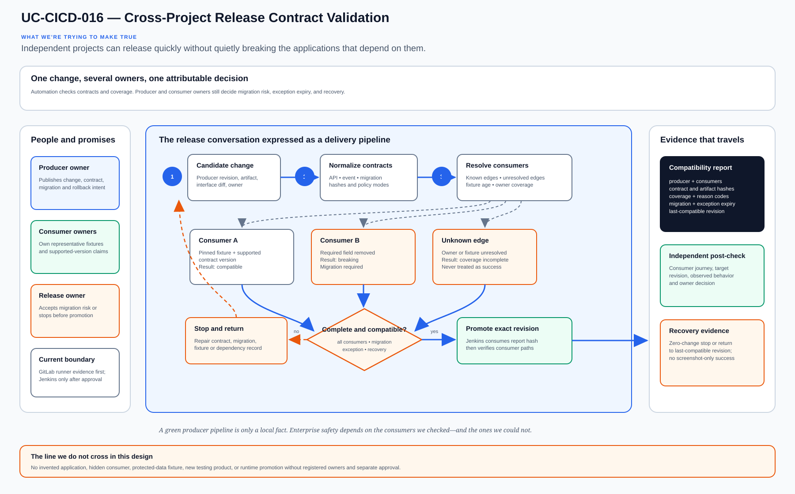

# UC-CICD-016: Cross-Project Release Contract Validation

Last reviewed: 2026-08-13

## Use-case record

| Field | Value |
| --- | --- |
| Canonical portfolio use case | Cross-Project Release Contract Validation |
| Primary platform | Enterprise DevSecOps Delivery Platform |
| Supporting use cases | [UC-DATA-007](../data/UC-DATA-007-schema-registry-and-evolution.md), [UC-DATA-008](../data/UC-DATA-008-event-contract-management.md), [UC-DB-004](../database/UC-DB-004-schema-migration-automation.md), [UC-CICD-007](UC-CICD-007-environment-based-release-promotion.md), [UC-RSO-010](../resilience/UC-RSO-010-dependency-mapping.md) |
| Enterprise alignment | Provider operations, payer operations, shared digital platform, operational resilience |
| Enterprise outcome | Let separately owned applications change independently without surprising their consumers |
| Primary implementation repository | `midhhealth/platform-delivery/devsecops-cicd-orchestrator` |
| Jira epic | `EPIC-CICD-016` — Build Cross-Project Release Contract Validation |
| Change record | Not required for fixture-only CI; required before a contract result can authorize a runtime promotion |
| Target | existing GitLab runners and approved Jenkins promotion path; application repositories remain separately owned |
| Current state | **Planned — architecture and lab contract only; no compatibility gate or runtime result is claimed** |
| Infrastructure boundary | Reuse GitLab, accepted runners, Jenkins and repository artifacts; do not install a contract-testing product or create another runtime |
| Owner | Enterprise DevSecOps Delivery Platform team |

## Purpose

A provider application, payer service, shared API, database migration, and data
producer can each pass their own pipeline while still breaking another project.
The missing control is a release conversation between owners: what changed,
which consumers were checked, which compatibility rule was applied, and who
accepted the remaining risk.

Cross-Project Release Contract Validation gives that conversation a durable
engineering form. Each producer publishes a versioned interface contract;
affected consumers prove compatibility against the candidate revision before
promotion. The gate reports uncertainty instead of turning an incomplete
dependency inventory into a green result.

## Expected outcome

A merge request produces one attributable compatibility report containing the
producer revision, contract revision, known consumer revisions, compatibility
mode, results, uncovered consumers, deployment-order constraints, and recovery
decision. A breaking API, event, or schema change blocks promotion unless an
owned, time-bounded exception describes migration and rollback.

The first lab slice uses repository fixtures and the existing GitLab runner.
Later runtime promotion may consume the report through Jenkins, but only after
the real producer and consumer projects are registered and their owners approve
the contract relationship.

## Platform and enterprise fit

| Relationship | Architecture fit |
| --- | --- |
| Owning responsibility | DevSecOps owns the common contract, evaluator, result schema and promotion behavior. |
| Application responsibility | Producers own interface changes; consumers own representative compatibility fixtures and adoption decisions. |
| Enterprise use | Provider, payer and shared applications remain separate projects while releases share an explicit compatibility handshake. |
| Required inputs | Producer and consumer identities, immutable revisions, interface contract, compatibility policy and dependency record. |
| Produced handoff | Machine-readable allow, block, exception-required, or coverage-incomplete decision. |
| Existing-lab boundary | Source and fixture validation runs on accepted runners; no application deployment is implied. |

## Trigger and actors

| Item | Definition |
| --- | --- |
| Trigger | A merge request changes a public API, event, schema, migration, shared library, or platform contract consumed by another project. |
| Producer owner | Explains the change, compatibility promise, migration window and rollback boundary. |
| Consumer owner | Maintains representative fixtures and confirms whether the candidate preserves required behavior. |
| Delivery engineer | Maintains deterministic evaluation and prevents a partial result from authorizing promotion. |
| Data or database owner | Reviews schema evolution, event semantics and expand/migrate/contract sequencing. |
| Service owner or SRE | Confirms dependency coverage, operational risk and post-release verification. |

## Preconditions

- Every participating project has a stable project identifier and protected
  source revision.
- The dependency register distinguishes confirmed consumers from suspected or
  unknown consumers.
- Contracts and fixtures contain synthetic or approved de-identified data.
- Compatibility modes—backward, forward, full, migration-required, or
  intentionally breaking—are explicit rather than inferred from a tool exit
  code.
- A missing consumer, stale fixture, unresolved owner, or malformed result
  produces `coverage-incomplete` and cannot silently pass.
- Runtime promotion remains unavailable until artifact identity, target,
  authority, stop conditions and rollback are known.

## Scope and exclusions

In scope:

- OpenAPI or equivalent API contracts, event schemas, database migration
  contracts and versioned shared-platform interfaces;
- producer-versus-consumer fixture evaluation;
- semantic version and compatibility-policy decisions;
- deployment ordering, dual-read/dual-write or expand/migrate/contract notes;
- time-bounded exceptions with owner and expiry;
- release evidence that names every checked and unchecked consumer; and
- a safe stop when dependency coverage is uncertain.

Out of scope:

- inventing care or payer applications to populate the register;
- installing Pact, a schema registry, service mesh, feature-flag platform, or
  another delivery product;
- treating unit tests as proof of cross-project compatibility;
- querying or copying protected production payloads into fixtures;
- deploying several projects merely to demonstrate the document; and
- allowing one project to approve another project's operational risk.

## Design walkthrough

For design review, walk through Cross-Project Release Contract Validation by trying to follow
one reviewed change from commit to an identifiable release decision. The result MidhHealth needs
is to Let separately owned applications change independently without surprising their consumers.
Enterprise DevSecOps Delivery Platform team owns the platform decision, while the consuming
service or business owner still accepts the effect on its workflow.

Read the diagram from left to right as a sequence of gates; a later stage cannot repair missing
identity or evidence from an earlier one. In this page, **UC-DATA-007: Schema Registry and
Evolution** contributes schema revision, compatibility policy and migration note; **UC-DATA-008:
Event Contract Management** contributes producer, consumers, event semantics and ownership. The
first buildable boundary is existing GitLab runners and approved Jenkins promotion path;
application repositories remain separately owned. The design stops at this rule: Reuse GitLab,
accepted runners, Jenkins and repository artifacts; do not install a contract-testing product or
create another runtime.

The walkthrough becomes useful when the happy path breaks. If a required dependency or
verification result is unavailable, the expected response is to stop before mutation, preserve
the evidence and return the decision to the accountable owner. The leading design threat is an
unsafe false-positive result; therefore a green source job, screenshot or reachable endpoint is
supporting evidence, not acceptance by itself.

## Architecture context

Independent ownership is valuable only when the interfaces between projects
are equally explicit. Today the documentation names platform contracts and one
registered reference application, but no real application-to-application
contract exists. The planned control therefore begins with honest source
evidence and remains `coverage-incomplete` until at least two real application
projects register a relationship.

| Context element | Architecture statement |
| --- | --- |
| Current state | Platform contracts are documented; application-to-application contracts are empty and Podinfo has no registered business consumer. |
| Desired state | A candidate interface revision is evaluated against every registered consumer before promotion. |
| Existing target boundary | GitLab repositories, accepted runners, Jenkins promotion orchestration and retained artifacts. |
| Human decision | Owners decide whether an intentional break has a safe migration path; automation checks facts and enforces the recorded decision. |
| Safe stop | Unknown consumer, stale contract, ambiguous compatibility mode or failed fixture blocks promotion. |

## Architecture diagram

The diagram follows one interface change across independently owned projects.
The decision diamond is intentionally late: source validity alone is not enough
when consumer coverage or a migration sequence is missing.

## Dependencies and handoffs

| Relationship | Use case | Required handoff | Failure propagation |
| --- | --- | --- | --- |
| Required upstream contract | [UC-DATA-007: Schema Registry and Evolution](../data/UC-DATA-007-schema-registry-and-evolution.md) | schema revision, compatibility policy and migration note | Unknown or incompatible schema evolution blocks the candidate. |
| Required upstream contract | [UC-DATA-008: Event Contract Management](../data/UC-DATA-008-event-contract-management.md) | producer, consumers, event semantics and ownership | Missing consumer ownership makes coverage incomplete. |
| Required upstream contract | [UC-DB-004: Schema Migration Automation](../database/UC-DB-004-schema-migration-automation.md) | expand/migrate/contract ordering and reversible boundary | Destructive or unordered migration blocks promotion. |
| Coordinated assurance handoff | [UC-CICD-007: Environment-Based Release Promotion](UC-CICD-007-environment-based-release-promotion.md) | target environment, immutable artifact and approval context | Promotion cannot consume a stale or failed compatibility result. |
| Coordinated assurance handoff | [UC-RSO-010: Dependency Mapping](../resilience/UC-RSO-010-dependency-mapping.md) | confirmed and unresolved producer-consumer edges | Unresolved critical edges prevent a complete-coverage decision. |

## Quality attributes

| Attribute | Required measure or invariant | Decision state |
| --- | --- | --- |
| Functional correctness | Every declared consumer receives the candidate contract and its expected fixture outcome is reproduced. | Fixed design requirement |
| Performance and scale | Record evaluation duration, consumer fan-out and queue delay; owners approve warning and blocking values. | Thresholds `TBD` before implementation |
| Reliability | Partial, stale, timed-out or malformed consumer results never collapse into success. | Fixed design requirement |
| Recovery | The report identifies the last compatible producer revision and the migration or rollback owner. | Required before promotion use |
| Observability | Emit project IDs, revisions, contract hash, consumer coverage, decision, reason codes and duration. | Required in result schema |
| Evidence retention | Retain contracts and sanitized results by approved classification; never retain credentials or protected payloads. | Security owner decision required |

## Security and privacy architecture

| Trust boundary | Allowed flow | Required control |
| --- | --- | --- |
| Producer contributor → GitLab | Reviewed interface definition and synthetic fixtures | Protected branch, peer review, secret scanning and immutable commit identity |
| Consumer project → evaluator | Read-only contract fixture and supported-version declaration | Project-scoped token or artifact access; no deployment credential |
| Runner → evidence artifact | Normalized compatibility result | Schema validation, checksum, expiry and sensitive-data scan |
| Jenkins approval → target | Approved report ID, artifact digest and environment | Separate promotion identity, target allowlist and rollback reference |

Fixtures model shape and behavior, not real patient, member, claim, payment, or
clinical records. A contract containing protected data is quarantined and the
gate fails before consumer execution.

## Architecture decisions and trade-offs

| Decision | Selected architecture | Deferred alternative | Rationale and status |
| --- | --- | --- | --- |
| Contract format | Adapter-based evaluator with normalized internal result | Mandating one contract-testing vendor | Fits API, event and database contracts without adding a product; approved design direction |
| Initial proof | Repository fixtures on an accepted GitLab runner | Coordinated runtime deployment | Proves blocking behavior safely; approved design direction |
| Unknown consumers | `coverage-incomplete`, never success | Assume the dependency list is complete | Preserves honesty while application inventory is incomplete; mandatory |
| Breaking change | Owned migration plus expiry and rollback | Permanent bypass | Keeps exceptions visible and temporary; mandatory |
| Promotion integration | Jenkins consumes an immutable result after separate review | Direct deployment credential in the evaluator | Maintains separation of duties; conditional |

### Open decisions before implementation

| Open decision | Owner | Resolution gate |
| --- | --- | --- |
| First real producer-consumer pair | Application architecture owner | Two registered projects and owners are required before runtime claims. |
| Supported contract adapters | DevSecOps and data owners | Select only formats present in real repositories. |
| Compatibility and expiry policy | Producer, consumer and risk owners | Record before the first intentional breaking-change fixture. |
| Evidence retention | Security and data owners | Approve before retaining any runtime-derived contract evidence. |

## Implementation design

The initial implementation is a deterministic evaluator, not a deployment
system. It reads a contract manifest, resolves registered consumers, invokes
format-specific adapters, aggregates results, and fails closed when coverage
cannot be proven.

| Planned source responsibility | Exact planned location |
| --- | --- |
| Contract and target allowlist | `midhhealth/platform-delivery/devsecops-cicd-orchestrator/contracts/uc-cicd-016.yaml` |
| Primary implementation | `midhhealth/platform-delivery/devsecops-cicd-orchestrator/src/release_contracts/evaluate.py`; entry point: the `evaluate_release_contracts` contract evaluator |
| Machine-readable result schema | `midhhealth/platform-delivery/devsecops-cicd-orchestrator/schemas/uc-cicd-016-result.schema.json` |
| Positive, blocking, malformed and recovery fixtures | `midhhealth/platform-delivery/devsecops-cicd-orchestrator/tests/fixtures/uc-cicd-016/` |
| GitLab CI include | `midhhealth/platform-delivery/devsecops-cicd-orchestrator/.gitlab/ci/uc-cicd-016.yml` |
| Operator diagnosis and recovery | `midhhealth/platform-delivery/devsecops-cicd-orchestrator/docs/runbooks/uc-cicd-016.md` |

Planned fixture families include compatible additive API change, removed
required field, event semantic change without schema change, safe database
expansion, premature destructive migration, stale consumer fixture, unknown
consumer, expired exception, partial timeout, and last-compatible revision.

## Code and configuration map

| Planned artifact | Responsibility | Current state |
| --- | --- | --- |
| `/contracts/uc-cicd-016.yaml` | Project identities, contract adapters, consumer set, policy and stop conditions | Planned |
| `/src/release_contracts/evaluate.py` | Adapter orchestration, coverage calculation and fail-closed decision | Planned |
| `/schemas/uc-cicd-016-result.schema.json` | Provenance, per-consumer result, migration, exception and recovery fields | Planned |
| `/tests/fixtures/uc-cicd-016/` | Compatible, incompatible, incomplete, malformed and recovery cases | Planned |
| `/.gitlab/ci/uc-cicd-016.yml` | Lint, schema, fixture, secret and deterministic-repeat gates | Planned |
| `/docs/runbooks/uc-cicd-016.md` | Triage, owner contact, exception, migration and rollback decisions | Planned |

## Jira breakdown

### STORY-CICD-016-001: Agree on a contract two projects can own

**Description:** Producer, consumer, delivery and data owners need one precise
record of interface meaning, compatibility policy, dependency coverage and
recovery responsibility before automation judges a release.

**Status:** Planned.

**Acceptance criteria:** Given two registered fixture projects, their contract
names immutable revisions, owners, supported versions, compatibility mode,
consumer coverage, failure behavior and last-compatible revision; missing
ownership or an unknown consumer fails schema validation.

**Implementation steps:** Review real repository formats; define the YAML
contract and JSON result schema; add synthetic examples; document data and
identity boundaries; record open decisions.

**Completed work:** Architecture, ownership, file locations and failure
semantics are documented. No evaluator has been implemented.

**Validation and rollback:** Validate positive and malformed contracts. Revert
the contract revision if it changes established meaning without a migration.

**Required attachments:** Future `ART-CICD-016-001A` reviewed contract and
dependency-coverage report.

### STORY-CICD-016-002: Build the compatibility and coverage gate

**Description:** Delivery engineers need deterministic adapters that show both
compatibility and the completeness of consumer testing before a pipeline may
offer promotion.

**Status:** Planned.

**Acceptance criteria:** Compatible fixtures pass; breaking, stale, malformed,
timed-out, expired-exception and unknown-consumer fixtures block with stable
reason codes; two clean runs produce equivalent decisions.

**Implementation steps:** Implement adapters and aggregation; validate result
schema; pin dependencies; add redaction and secret checks; publish the CI
include and runbook.

**Completed work:** Required behaviors and fixture families are specified;
source remains unimplemented.

**Validation and rollback:** Execute every fixture twice and compare normalized
results. Revert the CI include if it blocks unrelated pipelines or permits an
incomplete result.

**Required attachments:** Future `ART-CICD-016-002A` fixture matrix and
`ART-CICD-016-002B` downstream-block proof.

### STORY-CICD-016-003: Prove promotion consumes the right result

**Description:** Release owners need evidence that Jenkins accepts only a
current compatibility report for the exact producer, consumers, artifact and
environment, and that a failed decision leaves runtime unchanged.

**Status:** Planned.

**Acceptance criteria:** A separately approved canary promotion references the
exact report checksum; mismatched, stale or incomplete reports stop before
target access; the post-check confirms the intended revision or proves
zero-change; recovery returns to the last compatible revision.

**Implementation steps:** Register the immutable report input in the existing
promotion job; enforce age and identity checks; run source-only proof first;
obtain change approval for one canary; capture independent verification and
recovery evidence.

**Completed work:** Promotion and recovery expectations are documented. No
Jenkins job or runtime target has consumed the planned result.

**Validation and rollback:** Test mismatched revisions and stale evidence in
fixtures. For a later canary, verify runtime state independently and invoke the
existing rollback path if compatibility symptoms appear.

**Required attachments:** Future `ART-CICD-016-003A` promotion-decision record
and `ART-CICD-016-003B` rollback or zero-change proof.

## Evidence and screenshot register

| ID | Planned evidence | Source | Current status |
| --- | --- | --- | --- |
| `ART-CICD-016-001A` | Contract, ownership and dependency-coverage review | Architecture and implementation repository review | Pending |
| `ART-CICD-016-002A` | Adapter and fixture result matrix | Existing GitLab runner | Pending |
| `ART-CICD-016-002B` | Incompatible and incomplete results blocking promotion | Existing GitLab pipeline | Pending |
| `ART-CICD-016-003A` | Immutable result consumed by approved promotion | Existing Jenkins path | Pending separate implementation and approval |
| `ART-CICD-016-003B` | Independent rollback or zero-change proof | Existing target verification path | Pending separate implementation and approval |

## Expected versus current result

| Measure | Expected future result | Current result |
| --- | --- | --- |
| Contract coverage | Every known producer-consumer edge is checked or explicitly reported unresolved | Architecture defines coverage semantics; no application pair registered |
| Compatibility | API, event and migration changes receive deterministic decisions | Fixture families are planned |
| Promotion | Only a current, complete, passing result can be consumed | No promotion integration exists |
| Recovery | Last-compatible revision and migration reversal are attributable | Recovery contract is documented, not exercised |
| Infrastructure | Existing repositories, runners, Jenkins and artifact storage only | No new infrastructure authorized |

## Acceptance decision

**Planned.** Architecture-ready status means the ownership, interfaces,
implementation locations, fixtures, failure behavior and recovery gates are
specific enough to build. Code complete requires passing deterministic fixture
validation. Runtime verified requires two registered application projects and
an approved canary whose result, post-check and recovery evidence are retained.
Accepted additionally requires producer, consumer, delivery and service-owner
review.

## Operational, security, and follow-up notes

- Keep unknown dependencies visible; do not convert an empty consumer list
  into evidence of compatibility.
- Prefer additive evolution and explicit deprecation windows.
- Treat consumer fixtures as owned contracts, not copies maintained silently
  by the producer.
- Never place protected payloads, tokens or kubeconfigs in contract evidence.
- Link future incident and rollback evidence back to the precise contract
  revision that allowed the release.

## Interview questions grounded in the lab

1. How can two green pipelines still produce a broken enterprise workflow?
2. What is the difference between contract compatibility and complete consumer coverage?
3. How would you release a database change that old and new application versions must both tolerate?
4. When should an intentional breaking change be allowed, and who owns the exception?
5. How do you prove a compatibility report belongs to the artifact being promoted?
6. What happens when a consumer times out or its fixture is stale?
7. How does the design keep separately owned projects independent without hiding dependencies?
8. What evidence would convince you that rollback returned to a compatible system?
