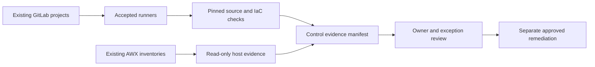

# UC-GOV-001: Automated Compliance Evidence Collection

Last verified: 2026-08-13

## Use-case record

| Field | Value |
| --- | --- |
| Canonical portfolio use case | Automated Compliance Scanning |
| Primary platform | Enterprise Cloud Governance and Operations Automation |
| Supporting use cases | [UC-CICD-010](../devsecops/UC-CICD-010-secure-ci-cd-pipeline-implementation.md), [UC-RSO-009](../resilience/UC-RSO-009-service-ownership.md), [UC-OBS-004](../observability/UC-OBS-004-centralized-log-management.md), [UC-INFRA-007](../infrastructure/UC-INFRA-007-infrastructure-change-impact-analysis.md) |
| Enterprise alignment | Risk and compliance, shared digital platform |
| Enterprise outcome | Prove that changes supporting provider and payer workflows pass common source and host controls |
| Supporting platforms | DevSecOps delivery, Linux systems, infrastructure, resilience operations |
| Jira epic | `EPIC-GOV-001` — Collect reusable lab compliance evidence |
| Change record | Not required for read-only source scans; assign before host remediation |
| Target | Existing GitLab repositories, shared/infra runners, AWX inventories, and managed VM fleet |
| Current state | **Planned — Checkov is pinned; consolidated evidence workflow is not accepted** |
| Infrastructure boundary | No governance VM, scanner service, cloud account, or new credential system is created |
| Owner | Governance Automation team |

## Purpose

Governance engineers need one repeatable way to collect source-policy and
read-only host-control evidence from the lab. The workflow should reuse
installed GitLab and AWX paths and produce a bounded report instead of assuming
the provisioned-only `governance` VM hosts a product.

## Expected outcome

Protected pipelines scan repository fixtures and IaC with pinned tools, while
an approved AWX evidence playbook collects non-secret host facts from existing
inventory groups. A manifest joins results to control IDs, owners, source
commits, timestamps, exceptions, and expiry dates.

## Platform and enterprise fit

| Relationship | Detailed fit |
| --- | --- |
| Owning platform | **Automated Compliance Evidence Collection** belongs to the Enterprise Cloud Governance and Operations Automation because that platform turns versioned controls and operational requests into review, approval, evidence, exception, and bounded remediation. |
| Enterprise consumers | The capability supports cross-platform risk, compliance, identity, change, and operational accountability. |
| Enterprise outcome | Its planned result advances: Prove that changes supporting provider and payer workflows pass common source and host controls. |
| Control contribution | The design adds policy ownership, least privilege, expiring exceptions, and auditable decisions. |
| Cross-platform handoff | Supporting platforms consume a reviewed result or evidence artifact; they do not take ownership away from the primary platform. |
| Infrastructure boundary | Fit is achieved by reusing documented existing repositories, control planes, services, and targets—not by inventing capacity or treating planned products as available. |

The platform fit is therefore based on ownership and a reusable decision, not
on the presence of a particular tool. Enterprise fit requires evidence that the
named outcome was observed for the bounded scope; completing documentation or
running an isolated technology demonstration is insufficient.

## Trigger and actors

| Item | Definition |
| --- | --- |
| Trigger | Merge request, scheduled evidence pipeline, or audit-request parameter |
| Governance engineer | Owns control mapping and exception policy |
| Repository owner | Resolves source findings |
| Linux/platform owner | Reviews host findings and approves remediation |
| Auditor/reviewer | Verifies artifact completeness and provenance |

## Preconditions

- `gitlab-runner-shared01` and `gitlab-runner-infra01` remain accepted with
  their documented tags and scopes.
- Checkov `3.3.8` and other scanners are pinned in repository CI source.
- AWX uses purpose-specific inventories and read-only modules for evidence.
- Reports exclude credentials, private keys, tokens, kubeconfigs, and protected
  healthcare data.

## Scope and exclusions

In scope are repository policy checks, Terraform static checks, selected
non-secret Linux posture facts, exception metadata, artifact signing/checksum,
and evidence indexing. New products, new VMs, cloud API scanning, active
remediation, credential rotation, and automatic policy exceptions are excluded.

## Architecture context

Automated Compliance Evidence Collection is evaluated inside the existing enterprise lab and the owning
platform's current source-control and execution boundaries. The architectural
unit is the governed outcome—**Prove that changes supporting provider and payer workflows pass common source and host controls**—rather than a new product or
environment.

| Context element | Architecture statement |
| --- | --- |
| Business and operational setting | Enterprise consumers: Risk and compliance, shared digital platform. The result must be explainable, repeatable, and owned. |
| Current state | **Planned — Checkov is pinned; consolidated evidence workflow is not accepted** |
| Desired state | A reviewed contract drives a bounded result, machine-readable evidence, and a safe stop or recovery decision. |
| Existing target boundary | Existing GitLab repositories, shared/infra runners, AWX inventories, and managed VM fleet |
| Infrastructure constraint | No governance VM, scanner service, cloud account, or new credential system is created |
| Accountable platform owner | Governance Automation team; the consuming service, data, security, or workflow owner remains accountable for accepting business impact. |

The page owns the contract, control logic, evidence, and recovery behavior for
Automated Compliance Evidence Collection. It does not absorb the responsibilities of the dependency use cases
listed below.

## Architecture diagram

## Dependencies and handoffs

Automated Compliance Evidence Collection remains accountable to its primary platform. The dependencies below
provide explicit contracts or assurance evidence; they do not become alternate owners.

| Relationship | Use case | Required handoff | Failure propagation |
| --- | --- | --- | --- |
| Required upstream contract | [UC-CICD-010: Secure CI/CD Pipeline Implementation](../devsecops/UC-CICD-010-secure-ci-cd-pipeline-implementation.md) | secure pipeline baseline and protected execution boundary | Missing, stale, or failed evidence blocks promotion or runtime action. |
| Required upstream contract | [UC-RSO-009: Service Ownership](../resilience/UC-RSO-009-service-ownership.md) | accountable service owner and operational tier | Missing, stale, or failed evidence blocks promotion or runtime action. |
| Coordinated assurance handoff | [UC-OBS-004: Centralized Log Management](../observability/UC-OBS-004-centralized-log-management.md) | sanitized log fields, source identity, and retention route | Missing, stale, or failed evidence blocks promotion or runtime action. |
| Coordinated assurance handoff | [UC-INFRA-007: Infrastructure Change Impact Analysis](../infrastructure/UC-INFRA-007-infrastructure-change-impact-analysis.md) | resource-to-service impact and affected-owner list | Missing, stale, or failed evidence blocks promotion or runtime action. |

Before Automated Compliance Evidence Collection is implemented, every handoff must resolve to an immutable
revision and machine-readable artifact. A URL, screenshot, or verbal approval
alone is not sufficient dependency evidence.

## Quality attributes

For Automated Compliance Evidence Collection, quality is measured against the bounded enterprise outcome—not
document length or a green job. Unapproved business thresholds remain explicit
decisions and must not be invented.

| Attribute | Required measure or invariant | Decision state |
| --- | --- | --- |
| Functional correctness | Every required input is validated; **Prove that changes supporting provider and payer workflows pass common source and host controls** is evaluated against positive, negative, missing-input, and unauthorized-scope cases. | Fixed design requirement |
| Performance and scale | Establish a baseline for control coverage, false-positive rate, evidence freshness, and exception age on existing capacity; the owner must approve warning and blocking thresholds before runtime promotion. | Thresholds `TBD` before implementation |
| Reliability | Missing prerequisites, stale dependencies, malformed evidence, and partial results fail closed without widening scope. | Fixed design requirement |
| Recovery | Record the maximum acceptable interruption and recovery time before runtime use; source-only validation must remain zero-change. | Owner decision required before runtime exercise |
| Observability | Emit use-case ID, revision, target, executor, start/end time, duration, decision, reason code, and recovery reference. | Required in the result schema |
| Evidence retention | Assign classification, retention period, and deletion owner before storing runtime evidence. | Security/compliance decision required |

Load, latency, availability, retention, RTO, and RPO values for Automated Compliance Evidence Collection become
requirements only after the named service or business owner approves them. Until
then, the implementation gate records them as unresolved instead of quietly
choosing defaults.

## Security and privacy architecture

The Automated Compliance Evidence Collection design separates source validation, privileged execution, target
access, and evidence review. Those boundaries remain in force even when one
engineer can access more than one system.

| Trust boundary | Allowed flow | Required control |
| --- | --- | --- |
| Contributor → GitLab | Reviewed source, contract, and synthetic/sanitized fixtures | Protected branch rules, peer review, secret scanning, and immutable commit identity |
| GitLab runner → result artifact | Read-only evaluation inputs and machine-readable output | No target-changing credential; pinned tool versions; artifact checksum and expiry |
| Approval plane → executor | Approved revision, target allowlist, mode, canary, and change reference | Separate authorization through the existing Jenkins/AWX or platform control path |
| Executor → existing target | Minimum commands or API operations required for Automated Compliance Evidence Collection | Least-privilege identity, explicit target limit, timeout, and stop condition |
| Target → evidence store | Sanitized metadata, measurements, decision, and recovery result | Exclude credentials, tokens, private keys, kubeconfigs, packet payloads, PHI, PII, and unrelated records |

For Automated Compliance Evidence Collection, the primary threat is **a governance workflow receiving broader privileges than the control scope requires**. The mandatory response is
separation of evaluation and remediation, expiring exceptions, target allowlists, protected credentials, and review evidence. Authentication and authorization mappings must name
the existing identity source, principal or service account, permitted actions,
credential owner, rotation path, and emergency revocation procedure before a
runtime story can move beyond `Planned`.

## Architecture decisions and trade-offs

| Decision | Selected architecture | Alternative deferred or rejected | Rationale and status |
| --- | --- | --- | --- |
| First implementation slice | Contract, schema, fixtures, and read-only evidence on the existing GitLab runner | Product installation or broad runtime rollout | Proves behavior without expanding infrastructure; **approved design direction** |
| Runtime execution | Use only Approved read-only or AWX control path when current inventory and change approval confirm it is available | Direct operator changes or credentials in CI | Preserves separation of duties; **conditional on implementation review** |
| Evidence | Machine-readable result is authoritative; screenshots are optional supporting material | Screenshot-only acceptance | Enables repeatable audit and automated gates; **approved design direction** |
| Failure handling | Fail closed, preserve bounded diagnostics, and recover only the named scope | Continue with partial or stale evidence | Prevents false success and hidden blast radius; **approved design direction** |
| New capacity or product | Stop and raise a separate architecture decision | Silently add a VM, service, cloud dependency, or cluster add-on | Maintains the existing-lab constraint; **mandatory** |

### Open decisions before implementation

| Open decision | Decision owner | Resolution gate |
| --- | --- | --- |
| Exact inventory object and first canary | Platform owner plus consuming service/data owner | Must resolve before the implementation story leaves `Planned` |
| Performance, scale, and reliability thresholds | Service owner and SRE | Must be recorded before a runtime acceptance run |
| Identity-to-action authorization matrix | Platform owner and security reviewer | Must be approved before target credentials are attached |
| Evidence classification and retention | Data/security owner | Must be approved before runtime artifacts are retained |

If any selected approach changes, record the rationale beside UC-GOV-001 in
the implementation repository before code review. A documentation edit alone
does not approve the new architecture.

## Implementation design

The first Automated Compliance Evidence Collection implementation is deliberately source-only. Its planned files live in the existing repository; none provisions infrastructure.

| Planned source responsibility | Exact planned location |
| --- | --- |
| Use-case contract and target allowlist | `midhhealth/security-governance/cloud-governance-ops-automation/contracts/uc-gov-001.yaml` |
| Primary implementation | `midhhealth/security-governance/cloud-governance-ops-automation/playbooks/compliance-evidence-collection.yml`; entry point: the `compliance-evidence-collection` control evaluator and bounded remediation entry point |
| Machine-readable result schema | `midhhealth/security-governance/cloud-governance-ops-automation/schemas/uc-gov-001-result.schema.json` |
| Positive, negative, malformed, and recovery fixtures | `midhhealth/security-governance/cloud-governance-ops-automation/tests/fixtures/uc-gov-001/` |
| GitLab source gate | `midhhealth/security-governance/cloud-governance-ops-automation/.gitlab/ci/uc-gov-001.yml` |
| Operator diagnosis and recovery | `midhhealth/security-governance/cloud-governance-ops-automation/docs/runbooks/uc-gov-001.md` |

### Delivery stages

1. **Contract:** add the contract, schema, owners, dependency revisions, target
   allowlist, modes, reason codes, and open-decision values.
2. **Source validation:** lint exact paths, validate schema compatibility, scan
   for sensitive content, and run every fixture on the existing runner.
3. **Read-only proof:** execute the `compliance-evidence-collection` control evaluator and bounded remediation entry point, publish a checksummed result, and
   prove that blocked cases cannot reach a mutating path.
4. **Bounded execution:** only after separate approval, pass the immutable
   revision, target, mode, canary, and change ID to Approved read-only or AWX control path.
5. **Independent verification:** measure the expected result, confirm unrelated
   state is unchanged, run recovery or zero-change proof, and obtain owner
   review.

The implementation merge request must link this page, the dependency artifacts,
the decision values above, and the eventual pipeline/job/run identifiers. Code
completion alone cannot promote the page to runtime verified.

## Code and configuration map

| Repository | Planned path | Responsibility |
| --- | --- | --- |
| `cloud-governance-ops-automation` | `controls/control-map.yml` | Control ID, evidence query, owner, severity, and expiry policy |
| same | `scripts/build-evidence-manifest.py` | Normalize CI and AWX results without secrets |
| same | `playbooks/collect-compliance-evidence.yml` | Read-only approved host facts |
| same | `schemas/evidence-manifest.schema.json` | Required provenance and finding fields |
| participating repositories | `.gitlab-ci.yml` include | Pinned source and IaC scan jobs |
| `enterprise-architecture-docs` | `docs/documentation-standard.md` | Documentation and incident obligations |

## Jira breakdown

### STORY-GOV-001: Map controls to existing evidence sources

**Description:** Governance needs a control catalog that points only to
evidence the current lab can collect and names the platform owner responsible
for each result.

**Status:** Planned.

**Acceptance criteria:** Every control has an ID, rationale, enterprise risk,
owner, evidence source, pass condition, review frequency, and exception expiry;
unsupported controls are marked deferred.

**Implementation steps:** Inventory current CI and AWX evidence, write the map,
validate its schema, and obtain platform-owner review.

**Completed work:** Existing execution assets and the no-new-infrastructure
boundary are documented; the catalog is pending.

**Validation and rollback:** Validate all repository and playbook references.
Revert mappings that point to absent products or unverified environments.

**Required attachments:** `ART-GOV-001A` control-map validation.

### STORY-GOV-002: Collect source and host evidence safely

**Description:** Repository and platform owners need one run that uses pinned
CI scanners and read-only AWX tasks without exposing sensitive data.

**Status:** Planned.

**Acceptance criteria:** Source scans run on allowed runners; host tasks use
read-only modules; artifacts identify commit and AWX job; redaction tests find
no secret material.

**Implementation steps:** Add CI includes, write the evidence playbook, generate
fixtures, and enforce artifact retention and access controls.

**Completed work:** Tool and runner versions are verified; collection source is
not yet implemented.

**Validation and rollback:** Run against fixtures and a canary inventory limit.
Stop the schedule and revoke artifact access if redaction fails.

**Required attachments:** `ART-GOV-002A` CI evidence,
`ART-GOV-002B` AWX evidence, and `ART-GOV-002C` redaction test.

### STORY-GOV-003: Review findings and bound remediation

**Description:** Governance and platform owners need findings routed to the
right owner with explicit exception and remediation boundaries.

**Status:** Planned.

**Acceptance criteria:** Findings include owner, severity, source, evidence,
due date, and state; exceptions require rationale and expiry; no collection job
performs remediation.

**Implementation steps:** Build the manifest, add review-state validation, link
issues or changes, and publish an aggregate pass/fail summary.

**Completed work:** Review fields are specified; no runtime workflow is claimed.

**Validation and rollback:** Exercise pass, fail, expired-exception, and unknown
owner fixtures. Disable routing if findings reach the wrong team.

**Required attachments:** `ART-GOV-003A` reviewed evidence manifest.

## Evidence and screenshot register

| ID | Evidence | Source | Status |
| --- | --- | --- | --- |
| `ART-GOV-001A` | Control-map validation | GitLab CI | Pending |
| `ART-GOV-002A` | Source scan result | GitLab CI | Pending |
| `ART-GOV-002B` | Read-only host result | AWX | Pending |
| `ART-GOV-002C` | Secret-redaction test | GitLab CI | Pending |
| `ART-GOV-003A` | Reviewed evidence manifest | Protected artifact | Pending |

## Expected versus current result

| Measure | Expected | Current |
| --- | --- | --- |
| Control coverage | Current lab controls mapped to real evidence | Pending |
| Sensitive data | Zero secrets or protected health data in artifacts | Requirement only |
| Remediation | Collection remains non-mutating | Specification only |

## Acceptance decision

**Planned.** Accept after control-owner review, fixture tests, one canary AWX
run, redaction review, a signed/checksummed manifest, and proof that no host or
source configuration changed.

## Operational, security, and follow-up notes

- The `governance` VM remains provisioned-only and is not a dependency.
- Evidence access must be narrower than ordinary pipeline-log access.
- Every remediation requires its own change, validation, and rollback.
- Copy implementation stories to the governance GitLab project; return the
  accepted manifest and incident references here.
