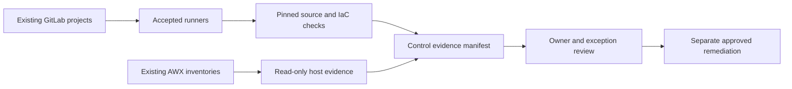

# UC-GOV-001: Automated Compliance Evidence Collection

Last verified: 2026-08-13

## Use-case record

| Field | Value |
| --- | --- |
| Canonical portfolio use case | Automated Compliance Scanning |
| Primary platform | Enterprise Cloud Governance and Operations Automation |
| Enterprise alignment | Risk and compliance, shared digital platform |
| Enterprise outcome | Prove that changes supporting provider and payer workflows pass common source and host controls |
| Supporting platforms | DevSecOps delivery, Linux systems, infrastructure, resilience operations |
| Jira epic | `EPIC-GOV-001` — Collect reusable lab compliance evidence |
| Change record | Not required for read-only source scans; assign before host remediation |
| Target | Existing GitLab repositories, shared/infra runners, AWX inventories, and managed VM fleet |
| Current state | **Planned — Checkov is pinned; consolidated evidence workflow is not accepted** |
| Infrastructure boundary | No governance VM, scanner service, cloud account, or new credential system is created |
| Owner | Governance Automation team |

## Purpose

Governance engineers need one repeatable way to collect source-policy and
read-only host-control evidence from the lab. The workflow should reuse
installed GitLab and AWX paths and produce a bounded report instead of assuming
the provisioned-only `governance` VM hosts a product.

## Expected outcome

Protected pipelines scan repository fixtures and IaC with pinned tools, while
an approved AWX evidence playbook collects non-secret host facts from existing
inventory groups. A manifest joins results to control IDs, owners, source
commits, timestamps, exceptions, and expiry dates.

## Platform and enterprise fit

| Relationship | Detailed fit |
| --- | --- |
| Owning platform | **Automated Compliance Evidence Collection** belongs to the Enterprise Cloud Governance and Operations Automation because that platform turns versioned controls and operational requests into review, approval, evidence, exception, and bounded remediation. |
| Enterprise consumers | The capability supports cross-platform risk, compliance, identity, change, and operational accountability. |
| Enterprise outcome | Its planned result advances: Prove that changes supporting provider and payer workflows pass common source and host controls. |
| Control contribution | The design adds policy ownership, least privilege, expiring exceptions, and auditable decisions. |
| Cross-platform handoff | Supporting platforms consume a reviewed result or evidence artifact; they do not take ownership away from the primary platform. |
| Infrastructure boundary | Fit is achieved by reusing documented existing repositories, control planes, services, and targets—not by inventing capacity or treating planned products as available. |

The platform fit is therefore based on ownership and a reusable decision, not
on the presence of a particular tool. Enterprise fit requires evidence that the
named outcome was observed for the bounded scope; completing documentation or
running an isolated technology demonstration is insufficient.

## Trigger and actors

| Item | Definition |
| --- | --- |
| Trigger | Merge request, scheduled evidence pipeline, or audit-request parameter |
| Governance engineer | Owns control mapping and exception policy |
| Repository owner | Resolves source findings |
| Linux/platform owner | Reviews host findings and approves remediation |
| Auditor/reviewer | Verifies artifact completeness and provenance |

## Preconditions

- `gitlab-runner-shared01` and `gitlab-runner-infra01` remain accepted with
  their documented tags and scopes.
- Checkov `3.3.8` and other scanners are pinned in repository CI source.
- AWX uses purpose-specific inventories and read-only modules for evidence.
- Reports exclude credentials, private keys, tokens, kubeconfigs, and protected
  healthcare data.

## Scope and exclusions

In scope are repository policy checks, Terraform static checks, selected
non-secret Linux posture facts, exception metadata, artifact signing/checksum,
and evidence indexing. New products, new VMs, cloud API scanning, active
remediation, credential rotation, and automatic policy exceptions are excluded.

## End-to-end execution flow

## Code and configuration map

| Repository | Planned path | Responsibility |
| --- | --- | --- |
| `cloud-governance-ops-automation` | `controls/control-map.yml` | Control ID, evidence query, owner, severity, and expiry policy |
| same | `scripts/build-evidence-manifest.py` | Normalize CI and AWX results without secrets |
| same | `playbooks/collect-compliance-evidence.yml` | Read-only approved host facts |
| same | `schemas/evidence-manifest.schema.json` | Required provenance and finding fields |
| participating repositories | `.gitlab-ci.yml` include | Pinned source and IaC scan jobs |
| `enterprise-architecture-docs` | `docs/documentation-standard.md` | Documentation and incident obligations |

## Jira breakdown

### STORY-GOV-001: Map controls to existing evidence sources

**Description:** Governance needs a control catalog that points only to
evidence the current lab can collect and names the platform owner responsible
for each result.

**Status:** Planned.

**Acceptance criteria:** Every control has an ID, rationale, enterprise risk,
owner, evidence source, pass condition, review frequency, and exception expiry;
unsupported controls are marked deferred.

**Implementation steps:** Inventory current CI and AWX evidence, write the map,
validate its schema, and obtain platform-owner review.

**Completed work:** Existing execution assets and the no-new-infrastructure
boundary are documented; the catalog is pending.

**Validation and rollback:** Validate all repository and playbook references.
Revert mappings that point to absent products or unverified environments.

**Required attachments:** `ART-GOV-001A` control-map validation.

### STORY-GOV-002: Collect source and host evidence safely

**Description:** Repository and platform owners need one run that uses pinned
CI scanners and read-only AWX tasks without exposing sensitive data.

**Status:** Planned.

**Acceptance criteria:** Source scans run on allowed runners; host tasks use
read-only modules; artifacts identify commit and AWX job; redaction tests find
no secret material.

**Implementation steps:** Add CI includes, write the evidence playbook, generate
fixtures, and enforce artifact retention and access controls.

**Completed work:** Tool and runner versions are verified; collection source is
not yet implemented.

**Validation and rollback:** Run against fixtures and a canary inventory limit.
Stop the schedule and revoke artifact access if redaction fails.

**Required attachments:** `ART-GOV-002A` CI evidence,
`ART-GOV-002B` AWX evidence, and `ART-GOV-002C` redaction test.

### STORY-GOV-003: Review findings and bound remediation

**Description:** Governance and platform owners need findings routed to the
right owner with explicit exception and remediation boundaries.

**Status:** Planned.

**Acceptance criteria:** Findings include owner, severity, source, evidence,
due date, and state; exceptions require rationale and expiry; no collection job
performs remediation.

**Implementation steps:** Build the manifest, add review-state validation, link
issues or changes, and publish an aggregate pass/fail summary.

**Completed work:** Review fields are specified; no runtime workflow is claimed.

**Validation and rollback:** Exercise pass, fail, expired-exception, and unknown
owner fixtures. Disable routing if findings reach the wrong team.

**Required attachments:** `ART-GOV-003A` reviewed evidence manifest.

## Evidence and screenshot register

| ID | Evidence | Source | Status |
| --- | --- | --- | --- |
| `ART-GOV-001A` | Control-map validation | GitLab CI | Pending |
| `ART-GOV-002A` | Source scan result | GitLab CI | Pending |
| `ART-GOV-002B` | Read-only host result | AWX | Pending |
| `ART-GOV-002C` | Secret-redaction test | GitLab CI | Pending |
| `ART-GOV-003A` | Reviewed evidence manifest | Protected artifact | Pending |

## Expected versus current result

| Measure | Expected | Current |
| --- | --- | --- |
| Control coverage | Current lab controls mapped to real evidence | Pending |
| Sensitive data | Zero secrets or protected health data in artifacts | Requirement only |
| Remediation | Collection remains non-mutating | Specification only |

## Acceptance decision

**Planned.** Accept after control-owner review, fixture tests, one canary AWX
run, redaction review, a signed/checksummed manifest, and proof that no host or
source configuration changed.

## Operational, security, and follow-up notes

- The `governance` VM remains provisioned-only and is not a dependency.
- Evidence access must be narrower than ordinary pipeline-log access.
- Every remediation requires its own change, validation, and rollback.
- Copy implementation stories to the governance GitLab project; return the
  accepted manifest and incident references here.
