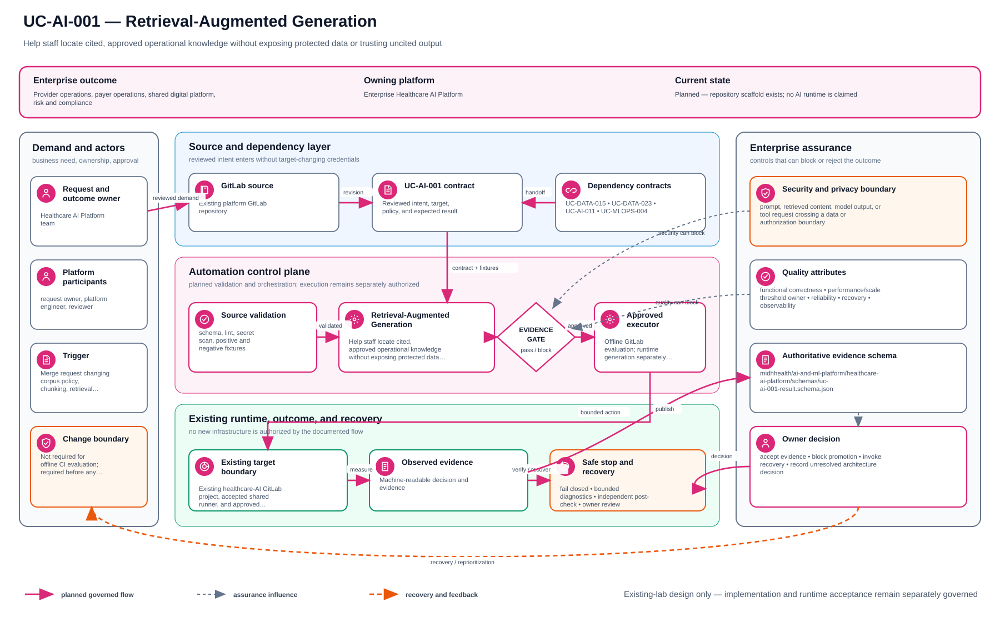

# UC-AI-001: Retrieval-Augmented Generation

Last verified: 2026-08-13

## Use-case record

| Field | Value |
| --- | --- |
| Canonical portfolio use case | Retrieval-Augmented Generation |
| Primary platform | Enterprise Healthcare AI Platform |
| Supporting use cases | [UC-AI-005](UC-AI-005-healthcare-knowledge-base-indexing.md), [UC-AI-011](UC-AI-011-ai-security-and-access-control.md), [UC-DATA-023](../data/UC-DATA-023-data-access-governance.md), [UC-AI-007](UC-AI-007-ai-prompt-and-response-evaluation.md) |
| Enterprise alignment | Provider operations, payer operations, shared digital platform, risk and compliance |
| Enterprise outcome | Help staff locate cited, approved operational knowledge without exposing protected data or trusting uncited output |
| Supporting platforms | Data engineering, governance, DevSecOps delivery, observability |
| Jira epic | `EPIC-AI-001` — Prove governed retrieval over approved documentation |
| Change record | Not required for offline CI evaluation; required before any runtime service or model endpoint |
| Target | Existing healthcare-AI GitLab project, accepted shared runner, and approved documentation snapshots |
| Current state | **Planned — repository scaffold exists; no AI runtime is claimed** |
| Infrastructure boundary | No model server, vector database, VM, cluster workload, cloud API, or new storage is created |
| Owner | Healthcare AI Platform team |

## Purpose

Platform, provider, and payer staff need a controlled way to retrieve relevant
runbook, architecture, policy, and service-ownership passages with stable
citations. The first slice proves ingestion, retrieval, evaluation, and audit
metadata in CI; generation remains disabled until a model endpoint is
separately approved.

## Expected outcome

A GitLab pipeline builds an ephemeral index from an allowlisted documentation
snapshot, runs a versioned question set, and publishes retrieval relevance,
citation resolution, latency, and refusal results. Every result links to the
source path and commit. Queries outside the corpus return `insufficient
approved context`.

## Platform and enterprise fit

| Relationship | Detailed fit |
| --- | --- |
| Owning platform | **Retrieval-Augmented Generation** belongs to the Enterprise Healthcare AI Platform because that platform turns versioned AI behavior and approved knowledge/data into offline evaluation, human review, safety decisions, and controlled fallback. |
| Enterprise consumers | The capability supports provider, payer, and enterprise-assistance workflows that must remain safe and reviewable. |
| Enterprise outcome | Its planned result advances: Help staff locate cited, approved operational knowledge without exposing protected data or trusting uncited output. |
| Control contribution | The design adds privacy, grounding, bias and safety evaluation, human oversight, traceability, and shutdown controls. |
| Cross-platform handoff | Supporting platforms consume a reviewed result or evidence artifact; they do not take ownership away from the primary platform. |
| Infrastructure boundary | Fit is achieved by reusing documented existing repositories, control planes, services, and targets—not by inventing capacity or treating planned products as available. |

The platform fit is therefore based on ownership and a reusable decision, not
on the presence of a particular tool. Enterprise fit requires evidence that the
named outcome was observed for the bounded scope; completing documentation or
running an isolated technology demonstration is insufficient.

## Trigger and actors

| Item | Definition |
| --- | --- |
| Trigger | Merge request changing corpus policy, chunking, retrieval logic, or evaluation cases |
| Knowledge owner | Approves documents and review/expiry metadata |
| Retrieval engineer | Implements indexing, ranking, and citations |
| AI safety engineer | Defines refusal, injection, leakage, and quality tests |
| Workflow owner | Confirms usefulness for a provider, payer, or platform task |

## Preconditions

- Corpus files come from approved GitLab repositories at immutable commits.
- Inputs exclude credentials, private keys, tokens, PHI, and production record
  extracts.
- `gitlab-runner-shared01` is the only required compute target.
- No outbound model or embedding API is required by the acceptance path.
- Generated indexes and results expire as CI artifacts and are not runtime
  knowledge services.

## Scope and exclusions

In scope are corpus allowlisting, document checksums, deterministic chunking,
local lexical retrieval, citations, evaluation, injection fixtures, refusal,
and audit metadata. LLM generation, embeddings services, vector databases,
agents, tool execution, FHIR connections, clinical advice, claims decisions,
new compute, and protected data are excluded.

## Design walkthrough

For design review, walk through Retrieval-Augmented Generation by trying to follow an approved
question and evidence source through retrieval, review and a bounded answer. The result
MidhHealth needs is to Help staff locate cited, approved operational knowledge without exposing
protected data or trusting uncited output. Healthcare AI Platform team owns the platform
decision, while the consuming service or business owner still accepts the effect on its
workflow.

Follow the information rather than the products: ownership and classification travel with it,
including on rejected and replayed paths. In this page, **UC-AI-005: Healthcare Knowledge Base
Indexing** contributes offline safety and quality decision with human-review and shutdown
requirements; **UC-AI-011: AI Security and Access Control** contributes offline safety and
quality decision with human-review and shutdown requirements. The first buildable boundary is
Existing healthcare-AI GitLab project, accepted shared runner, and approved documentation
snapshots. The design stops at this rule: No model server, vector database, VM, cluster
workload, cloud API, or new storage is created.

The walkthrough becomes useful when the happy path breaks. If a required dependency or
verification result is unavailable, the expected response is to stop before mutation, preserve
the evidence and return the decision to the accountable owner. The leading design threat is
prompt, retrieved content, model output, or tool request crossing a data or authorization
boundary; therefore a green source job, screenshot or reachable endpoint is supporting evidence,
not acceptance by itself.

## Architecture context

Retrieval-Augmented Generation is evaluated inside the existing enterprise lab and the owning
platform's current source-control and execution boundaries. The architectural
unit is the governed outcome—**Help staff locate cited, approved operational knowledge without exposing protected data or trusting uncited output**—rather than a new product or
environment.

| Context element | Architecture statement |
| --- | --- |
| Business and operational setting | Enterprise consumers: Provider operations, payer operations, shared digital platform, risk and compliance. The result must be explainable, repeatable, and owned. |
| Current state | **Planned — repository scaffold exists; no AI runtime is claimed** |
| Desired state | A reviewed contract drives a bounded result, machine-readable evidence, and a safe stop or recovery decision. |
| Existing target boundary | Existing healthcare-AI GitLab project, accepted shared runner, and approved documentation snapshots |
| Infrastructure constraint | No model server, vector database, VM, cluster workload, cloud API, or new storage is created |
| Accountable platform owner | Healthcare AI Platform team; the consuming service, data, security, or workflow owner remains accountable for accepting business impact. |

The page owns the contract, control logic, evidence, and recovery behavior for
Retrieval-Augmented Generation. It does not absorb the responsibilities of the dependency use cases
listed below.

## Architecture diagram

Follow the information, not the boxes. The main route keeps contract, classification, processing, and consumption visible; the orange route is where refused or replayable work waits for a human decision.

## Dependencies and handoffs

Retrieval-Augmented Generation remains accountable to its primary platform. The dependencies below
provide explicit contracts or assurance evidence; they do not become alternate owners.

| Relationship | Use case | Required handoff | Failure propagation |
| --- | --- | --- | --- |
| Required upstream contract | [UC-AI-005: Healthcare Knowledge Base Indexing](UC-AI-005-healthcare-knowledge-base-indexing.md) | offline safety and quality decision with human-review and shutdown requirements | Missing, stale, or contradictory handoff stops the dependent decision and is recorded for the accountable owner. |
| Required upstream contract | [UC-AI-011: AI Security and Access Control](UC-AI-011-ai-security-and-access-control.md) | offline safety and quality decision with human-review and shutdown requirements | Missing, stale, or contradictory handoff stops the dependent decision and is recorded for the accountable owner. |
| Coordinated assurance handoff | [UC-DATA-023: Data Access Governance](../data/UC-DATA-023-data-access-governance.md) | validated data result with counts, lineage, quality, and reconciliation state | Missing, stale, or contradictory handoff stops the dependent decision and is recorded for the accountable owner. |
| Coordinated assurance handoff | [UC-AI-007: AI Prompt and Response Evaluation](UC-AI-007-ai-prompt-and-response-evaluation.md) | offline safety and quality decision with human-review and shutdown requirements | Missing, stale, or contradictory handoff stops the dependent decision and is recorded for the accountable owner. |

Before Retrieval-Augmented Generation is implemented, every handoff must resolve to an immutable
revision and machine-readable artifact. A URL, screenshot, or verbal approval
alone is not sufficient dependency evidence.

## Quality attributes

For Retrieval-Augmented Generation, quality is measured against the bounded enterprise outcome—not
document length or a green job. Unapproved business thresholds remain explicit
decisions and must not be invented.

| Attribute | Required measure or invariant | Decision state |
| --- | --- | --- |
| Functional correctness | Every required input is validated; **Help staff locate cited, approved operational knowledge without exposing protected data or trusting uncited output** is evaluated against positive, negative, missing-input, and unauthorized-scope cases. | Fixed design requirement |
| Performance and scale | Establish a baseline for safety-case coverage, citation or decision accuracy, latency baseline, and review burden on existing capacity; the owner must approve warning and blocking thresholds before runtime promotion. | Thresholds `TBD` before implementation |
| Reliability | Missing prerequisites, stale dependencies, malformed evidence, and partial results fail closed without widening scope. | Fixed design requirement |
| Recovery | Record the maximum acceptable interruption and recovery time before runtime use; source-only validation must remain zero-change. | Owner decision required before runtime exercise |
| Observability | Emit use-case ID, revision, target, executor, start/end time, duration, decision, reason code, and recovery reference. | Required in the result schema |
| Evidence retention | Assign classification, retention period, and deletion owner before storing runtime evidence. | Security/compliance decision required |

Load, latency, availability, retention, RTO, and RPO values for Retrieval-Augmented Generation become
requirements only after the named service or business owner approves them. Until
then, the implementation gate records them as unresolved instead of quietly
choosing defaults.

## Security and privacy architecture

The Retrieval-Augmented Generation design separates source validation, privileged execution, target
access, and evidence review. Those boundaries remain in force even when one
engineer can access more than one system.

| Trust boundary | Allowed flow | Required control |
| --- | --- | --- |
| Contributor → GitLab | Reviewed source, contract, and synthetic/sanitized fixtures | Protected branch rules, peer review, secret scanning, and immutable commit identity |
| GitLab runner → result artifact | Read-only evaluation inputs and machine-readable output | No target-changing credential; pinned tool versions; artifact checksum and expiry |
| Approval plane → executor | Approved revision, target allowlist, mode, canary, and change reference | Separate authorization through the existing Jenkins/AWX or platform control path |
| Executor → existing target | Minimum commands or API operations required for Retrieval-Augmented Generation | Least-privilege identity, explicit target limit, timeout, and stop condition |
| Target → evidence store | Sanitized metadata, measurements, decision, and recovery result | Exclude credentials, tokens, private keys, kubeconfigs, packet payloads, PHI, PII, and unrelated records |

For Retrieval-Augmented Generation, the primary threat is **prompt, retrieved content, model output, or tool request crossing a data or authorization boundary**. The mandatory response is
synthetic/de-identified fixtures, role-aware policy, untrusted-content isolation, refusal tests, human review, and artifact redaction. Authentication and authorization mappings must name
the existing identity source, principal or service account, permitted actions,
credential owner, rotation path, and emergency revocation procedure before a
runtime story can move beyond `Planned`.

## Architecture decisions and trade-offs

| Decision | Selected architecture | Alternative deferred or rejected | Rationale and status |
| --- | --- | --- | --- |
| First implementation slice | Contract, schema, fixtures, and read-only evidence on the existing GitLab runner | Product installation or broad runtime rollout | Proves behavior without expanding infrastructure; **approved design direction** |
| Runtime execution | Use only Existing GitLab shared runner when current inventory and change approval confirm it is available | Direct operator changes or credentials in CI | Preserves separation of duties; **conditional on implementation review** |
| Evidence | Machine-readable result is authoritative; screenshots are optional supporting material | Screenshot-only acceptance | Enables repeatable audit and automated gates; **approved design direction** |
| Failure handling | Fail closed, preserve bounded diagnostics, and recover only the named scope | Continue with partial or stale evidence | Prevents false success and hidden blast radius; **approved design direction** |
| New capacity or product | Stop and raise a separate architecture decision | Silently add a VM, service, cloud dependency, or cluster add-on | Maintains the existing-lab constraint; **mandatory** |

### Open decisions before implementation

| Open decision | Decision owner | Resolution gate |
| --- | --- | --- |
| Exact inventory object and first canary | Platform owner plus consuming service/data owner | Must resolve before the implementation story leaves `Planned` |
| Performance, scale, and reliability thresholds | Service owner and SRE | Must be recorded before a runtime acceptance run |
| Identity-to-action authorization matrix | Platform owner and security reviewer | Must be approved before target credentials are attached |
| Evidence classification and retention | Data/security owner | Must be approved before runtime artifacts are retained |

If any selected approach changes, record the rationale beside UC-AI-001 in
the implementation repository before code review. A documentation edit alone
does not approve the new architecture.

## Implementation design

The first Retrieval-Augmented Generation implementation is deliberately source-only. Its planned files live in the existing repository; none provisions infrastructure.

| Planned source responsibility | Exact planned location |
| --- | --- |
| Use-case contract and target allowlist | `midhhealth/ai-and-ml-platform/healthcare-ai-platform/contracts/uc-ai-001.yaml` |
| Primary implementation | `midhhealth/ai-and-ml-platform/healthcare-ai-platform/src/evaluations/retrieval-augmented-generation.py`; entry point: the `evaluate_retrieval_augmented_generation` offline evaluator |
| Machine-readable result schema | `midhhealth/ai-and-ml-platform/healthcare-ai-platform/schemas/uc-ai-001-result.schema.json` |
| Positive, negative, malformed, and recovery fixtures | `midhhealth/ai-and-ml-platform/healthcare-ai-platform/tests/fixtures/uc-ai-001/` |
| GitLab source gate | `midhhealth/ai-and-ml-platform/healthcare-ai-platform/.gitlab/ci/uc-ai-001.yml` |
| Operator diagnosis and recovery | `midhhealth/ai-and-ml-platform/healthcare-ai-platform/docs/runbooks/uc-ai-001.md` |

### Delivery stages

1. **Contract:** add the contract, schema, owners, dependency revisions, target
   allowlist, modes, reason codes, and open-decision values.
2. **Source validation:** lint exact paths, validate schema compatibility, scan
   for sensitive content, and run every fixture on the existing runner.
3. **Read-only proof:** execute the `evaluate_retrieval_augmented_generation` offline evaluator, publish a checksummed result, and
   prove that blocked cases cannot reach a mutating path.
4. **Bounded execution:** only after separate approval, pass the immutable
   revision, target, mode, canary, and change ID to Existing GitLab shared runner.
5. **Independent verification:** measure the expected result, confirm unrelated
   state is unchanged, run recovery or zero-change proof, and obtain owner
   review.

The implementation merge request must link this page, the dependency artifacts,
the decision values above, and the eventual pipeline/job/run identifiers. Code
completion alone cannot promote the page to runtime verified.

## Code and configuration map

| Repository | Planned path | Responsibility |
| --- | --- | --- |
| `healthcare-ai-platform` | `config/approved-corpus.yml` | Repository, commit, path, owner, class, and expiry allowlist |
| same | `src/knowledge/index.py` | Deterministic chunking and ephemeral indexing |
| same | `src/knowledge/retrieve.py` | Ranked passages with stable citation metadata |
| same | `evals/enterprise-knowledge.yml` | Provider, payer, platform, refusal, and injection cases |
| same | `schemas/retrieval-evaluation.schema.json` | Machine-readable evaluation contract |
| `enterprise-architecture-docs` | approved pages selected by policy | Initial non-sensitive corpus candidate |

## Jira breakdown

### STORY-AI-001: Approve and fingerprint the knowledge corpus

**Description:** Knowledge and security owners need an explicit list of
documents that can be indexed, with immutable revision, ownership, data class,
review date, and checksum.

**Status:** Planned.

**Acceptance criteria:** Every file is allowlisted and checksummed; denied paths
and secret patterns fail the job; stale approval fails closed; no PHI or
credential-bearing content is included.

**Implementation steps:** Define corpus schema, select approved documentation,
record commits, scan content, and generate a signed/checksummed manifest.

**Completed work:** The documentation repository exists; no AI corpus approval
or index is claimed.

**Validation and rollback:** Test allowed, unlisted, changed, expired, and
secret-bearing fixtures. Remove an artifact and revert the manifest on policy
failure.

**Required attachments:** `ART-AI-001A` approved corpus manifest and scan.

### STORY-AI-002: Retrieve cited passages without a model service

**Description:** Retrieval engineers need a deterministic baseline that ranks
approved passages and exposes exact citations before generation adds risk.

**Status:** Planned.

**Acceptance criteria:** Results include repository, commit, path, heading,
chunk ID, and score; citations resolve to the indexed text; out-of-scope queries
return insufficient context; no network model call occurs.

**Implementation steps:** Implement chunking and lexical retrieval, build the
index in CI, add citation verification, and expire the index artifact.

**Completed work:** Retrieval requirements are specified; code is pending.

**Validation and rollback:** Run deterministic unit tests and compare repeated
results. Revert ranking changes that reduce the accepted baseline.

**Required attachments:** `ART-AI-002A` retrieval and citation test report.

### STORY-AI-003: Evaluate enterprise fit and safety boundaries

**Description:** Workflow and safety owners need evidence that retrieval helps
real staff tasks while refusing unsupported, sensitive, or instruction-
injection requests.

**Status:** Planned.

**Acceptance criteria:** Evaluation spans provider, payer, and platform
questions; relevance and citation thresholds are explicit; prompt-injection,
secret request, clinical advice, and unsupported-answer cases fail closed.

**Implementation steps:** Create reviewed cases, run CI evaluation, publish
aggregate metrics and failures, and document the gate for any later generator.

**Completed work:** Evaluation categories are defined; no passing result is
claimed.

**Validation and rollback:** Re-run the fixed suite for every corpus or ranking
change. Block promotion and restore the prior accepted revision on regression.

**Required attachments:** `ART-AI-003A` evaluation and safety report.

## Evidence and screenshot register

| ID | Evidence | Source | Status |
| --- | --- | --- | --- |
| `ART-AI-001A` | Corpus manifest and content scan | GitLab CI | Pending |
| `ART-AI-002A` | Retrieval/citation tests | GitLab CI | Pending |
| `ART-AI-003A` | Enterprise and safety evaluation | Protected CI artifact | Pending |

## Expected versus current result

| Measure | Expected | Current |
| --- | --- | --- |
| Corpus | Approved, immutable, non-sensitive snapshot | Not approved |
| Retrieval | Stable cited passages and refusal | Not implemented |
| Runtime/model | None required for first acceptance | No runtime claimed |

## Acceptance decision

**Planned.** Accept the offline retrieval slice only after corpus approval,
citation verification, deterministic evaluation, injection/refusal tests, and
artifact redaction. LLM generation and runtime serving remain separate work.

## Operational, security, and follow-up notes

- Retrieved text is untrusted content; it cannot override system policy.
- Do not use output for clinical diagnosis, treatment, coverage, or payment
  decisions.
- A later model integration must name endpoint, data boundary, audit, human
  review, observability, cost, and shutdown controls.
- Copy implementation stories to the healthcare-AI GitLab project and return
  CI evidence here.
