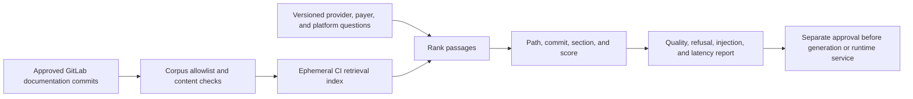

# UC-AI-001: Retrieval-Augmented Generation

Last verified: 2026-08-13

## Use-case record

| Field | Value |
| --- | --- |
| Canonical portfolio use case | Retrieval-Augmented Generation |
| Primary platform | Enterprise Healthcare AI Platform |
| Enterprise alignment | Provider operations, payer operations, shared digital platform, risk and compliance |
| Enterprise outcome | Help staff locate cited, approved operational knowledge without exposing protected data or trusting uncited output |
| Supporting platforms | Data engineering, governance, DevSecOps delivery, observability |
| Jira epic | `EPIC-AI-001` — Prove governed retrieval over approved documentation |
| Change record | Not required for offline CI evaluation; required before any runtime service or model endpoint |
| Target | Existing healthcare-AI GitLab project, accepted shared runner, and approved documentation snapshots |
| Current state | **Planned — repository scaffold exists; no AI runtime is claimed** |
| Infrastructure boundary | No model server, vector database, VM, cluster workload, cloud API, or new storage is created |
| Owner | Healthcare AI Platform team |

## Purpose

Platform, provider, and payer staff need a controlled way to retrieve relevant
runbook, architecture, policy, and service-ownership passages with stable
citations. The first slice proves ingestion, retrieval, evaluation, and audit
metadata in CI; generation remains disabled until a model endpoint is
separately approved.

## Expected outcome

A GitLab pipeline builds an ephemeral index from an allowlisted documentation
snapshot, runs a versioned question set, and publishes retrieval relevance,
citation resolution, latency, and refusal results. Every result links to the
source path and commit. Queries outside the corpus return `insufficient
approved context`.

## Platform and enterprise fit

| Relationship | Detailed fit |
| --- | --- |
| Owning platform | **Retrieval-Augmented Generation** belongs to the Enterprise Healthcare AI Platform because that platform turns versioned AI behavior and approved knowledge/data into offline evaluation, human review, safety decisions, and controlled fallback. |
| Enterprise consumers | The capability supports provider, payer, and enterprise-assistance workflows that must remain safe and reviewable. |
| Enterprise outcome | Its planned result advances: Help staff locate cited, approved operational knowledge without exposing protected data or trusting uncited output. |
| Control contribution | The design adds privacy, grounding, bias and safety evaluation, human oversight, traceability, and shutdown controls. |
| Cross-platform handoff | Supporting platforms consume a reviewed result or evidence artifact; they do not take ownership away from the primary platform. |
| Infrastructure boundary | Fit is achieved by reusing documented existing repositories, control planes, services, and targets—not by inventing capacity or treating planned products as available. |

The platform fit is therefore based on ownership and a reusable decision, not
on the presence of a particular tool. Enterprise fit requires evidence that the
named outcome was observed for the bounded scope; completing documentation or
running an isolated technology demonstration is insufficient.

## Trigger and actors

| Item | Definition |
| --- | --- |
| Trigger | Merge request changing corpus policy, chunking, retrieval logic, or evaluation cases |
| Knowledge owner | Approves documents and review/expiry metadata |
| Retrieval engineer | Implements indexing, ranking, and citations |
| AI safety engineer | Defines refusal, injection, leakage, and quality tests |
| Workflow owner | Confirms usefulness for a provider, payer, or platform task |

## Preconditions

- Corpus files come from approved GitLab repositories at immutable commits.
- Inputs exclude credentials, private keys, tokens, PHI, and production record
  extracts.
- `gitlab-runner-shared01` is the only required compute target.
- No outbound model or embedding API is required by the acceptance path.
- Generated indexes and results expire as CI artifacts and are not runtime
  knowledge services.

## Scope and exclusions

In scope are corpus allowlisting, document checksums, deterministic chunking,
local lexical retrieval, citations, evaluation, injection fixtures, refusal,
and audit metadata. LLM generation, embeddings services, vector databases,
agents, tool execution, FHIR connections, clinical advice, claims decisions,
new compute, and protected data are excluded.

## End-to-end execution flow

## Code and configuration map

| Repository | Planned path | Responsibility |
| --- | --- | --- |
| `healthcare-ai-platform` | `config/approved-corpus.yml` | Repository, commit, path, owner, class, and expiry allowlist |
| same | `src/knowledge/index.py` | Deterministic chunking and ephemeral indexing |
| same | `src/knowledge/retrieve.py` | Ranked passages with stable citation metadata |
| same | `evals/enterprise-knowledge.yml` | Provider, payer, platform, refusal, and injection cases |
| same | `schemas/retrieval-evaluation.schema.json` | Machine-readable evaluation contract |
| `enterprise-architecture-docs` | approved pages selected by policy | Initial non-sensitive corpus candidate |

## Jira breakdown

### STORY-AI-001: Approve and fingerprint the knowledge corpus

**Description:** Knowledge and security owners need an explicit list of
documents that can be indexed, with immutable revision, ownership, data class,
review date, and checksum.

**Status:** Planned.

**Acceptance criteria:** Every file is allowlisted and checksummed; denied paths
and secret patterns fail the job; stale approval fails closed; no PHI or
credential-bearing content is included.

**Implementation steps:** Define corpus schema, select approved documentation,
record commits, scan content, and generate a signed/checksummed manifest.

**Completed work:** The documentation repository exists; no AI corpus approval
or index is claimed.

**Validation and rollback:** Test allowed, unlisted, changed, expired, and
secret-bearing fixtures. Remove an artifact and revert the manifest on policy
failure.

**Required attachments:** `ART-AI-001A` approved corpus manifest and scan.

### STORY-AI-002: Retrieve cited passages without a model service

**Description:** Retrieval engineers need a deterministic baseline that ranks
approved passages and exposes exact citations before generation adds risk.

**Status:** Planned.

**Acceptance criteria:** Results include repository, commit, path, heading,
chunk ID, and score; citations resolve to the indexed text; out-of-scope queries
return insufficient context; no network model call occurs.

**Implementation steps:** Implement chunking and lexical retrieval, build the
index in CI, add citation verification, and expire the index artifact.

**Completed work:** Retrieval requirements are specified; code is pending.

**Validation and rollback:** Run deterministic unit tests and compare repeated
results. Revert ranking changes that reduce the accepted baseline.

**Required attachments:** `ART-AI-002A` retrieval and citation test report.

### STORY-AI-003: Evaluate enterprise fit and safety boundaries

**Description:** Workflow and safety owners need evidence that retrieval helps
real staff tasks while refusing unsupported, sensitive, or instruction-
injection requests.

**Status:** Planned.

**Acceptance criteria:** Evaluation spans provider, payer, and platform
questions; relevance and citation thresholds are explicit; prompt-injection,
secret request, clinical advice, and unsupported-answer cases fail closed.

**Implementation steps:** Create reviewed cases, run CI evaluation, publish
aggregate metrics and failures, and document the gate for any later generator.

**Completed work:** Evaluation categories are defined; no passing result is
claimed.

**Validation and rollback:** Re-run the fixed suite for every corpus or ranking
change. Block promotion and restore the prior accepted revision on regression.

**Required attachments:** `ART-AI-003A` evaluation and safety report.

## Evidence and screenshot register

| ID | Evidence | Source | Status |
| --- | --- | --- | --- |
| `ART-AI-001A` | Corpus manifest and content scan | GitLab CI | Pending |
| `ART-AI-002A` | Retrieval/citation tests | GitLab CI | Pending |
| `ART-AI-003A` | Enterprise and safety evaluation | Protected CI artifact | Pending |

## Expected versus current result

| Measure | Expected | Current |
| --- | --- | --- |
| Corpus | Approved, immutable, non-sensitive snapshot | Not approved |
| Retrieval | Stable cited passages and refusal | Not implemented |
| Runtime/model | None required for first acceptance | No runtime claimed |

## Acceptance decision

**Planned.** Accept the offline retrieval slice only after corpus approval,
citation verification, deterministic evaluation, injection/refusal tests, and
artifact redaction. LLM generation and runtime serving remain separate work.

## Operational, security, and follow-up notes

- Retrieved text is untrusted content; it cannot override system policy.
- Do not use output for clinical diagnosis, treatment, coverage, or payment
  decisions.
- A later model integration must name endpoint, data boundary, audit, human
  review, observability, cost, and shutdown controls.
- Copy implementation stories to the healthcare-AI GitLab project and return
  CI evidence here.
