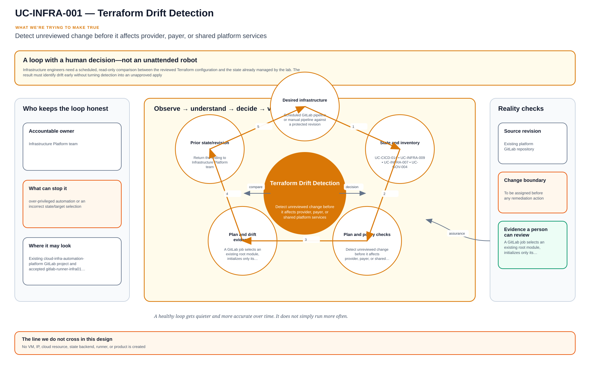

# UC-INFRA-001: Terraform Drift Detection

Last verified: 2026-08-13

## Use-case record

| Field | Value |
| --- | --- |
| Canonical portfolio use case | Terraform Drift Detection |
| Primary platform | Enterprise Multi-Cloud Infrastructure Platform |
| Supporting use cases | [UC-CICD-014](../devsecops/UC-CICD-014-terraform-plan-automation.md), [UC-INFRA-009](UC-INFRA-009-terraform-state-integrity-monitoring.md), [UC-INFRA-007](UC-INFRA-007-infrastructure-change-impact-analysis.md), [UC-GOV-004](../governance/UC-GOV-004-cloud-iam-and-rbac-standardization.md) |
| Primary implementation repository | `midhhealth/platform-engineering/cloud-infra-automation-platform` |
| Enterprise alignment | Shared digital platform, risk and compliance, operational resilience |
| Enterprise outcome | Detect unreviewed change before it affects provider, payer, or shared platform services |
| Supporting platforms | DevSecOps delivery, governance, observability, resilience operations |
| Jira epic | `EPIC-INFRA-001` — Produce reviewable infrastructure drift evidence |
| Change record | To be assigned before any remediation action |
| Target | Existing `cloud-infra-automation-platform` GitLab project and accepted `gitlab-runner-infra01` runner |
| Current state | **Planned — documentation specification only** |
| Infrastructure boundary | No VM, IP, cloud resource, state backend, runner, or product is created |
| Owner | Infrastructure Platform team |

## Purpose

Infrastructure engineers need a scheduled, read-only comparison between the
reviewed Terraform configuration and the state already managed by the lab.
The result must identify drift early without turning detection into an
unapproved apply.

## Expected outcome

A GitLab job selects an existing root module, initializes only its configured
backend, runs a refresh-only or normal plan with mutation disabled, and
publishes a sanitized report containing the commit, workspace, provider lock,
resource summary, and detailed exit code. A non-empty plan opens a review item;
it never changes infrastructure automatically.

## Platform and enterprise fit

| Relationship | Detailed fit |
| --- | --- |
| Owning platform | **Terraform Drift Detection** belongs to the Enterprise Multi-Cloud Infrastructure Platform because that platform turns reviewed desired state into inventory checks, plans, approvals, bounded automation, and recovery evidence. |
| Enterprise consumers | The capability supports the infrastructure foundations used by provider, payer, data, and shared services. |
| Enterprise outcome | Its planned result advances: Detect unreviewed change before it affects provider, payer, or shared platform services. |
| Control contribution | The design adds controlled blast radius, ownership, drift visibility, and reversible change. |
| Cross-platform handoff | Supporting platforms consume a reviewed result or evidence artifact; they do not take ownership away from the primary platform. |
| Infrastructure boundary | Fit is achieved by reusing documented existing repositories, control planes, services, and targets—not by inventing capacity or treating planned products as available. |

The platform fit is therefore based on ownership and a reusable decision, not
on the presence of a particular tool. Enterprise fit requires evidence that the
named outcome was observed for the bounded scope; completing documentation or
running an isolated technology demonstration is insufficient.

## Trigger and actors

| Item | Definition |
| --- | --- |
| Trigger | Scheduled GitLab pipeline or manual pipeline against a protected revision |
| Operator | Selects an allowlisted root and reviews the report |
| Infrastructure engineer | Owns Terraform source and determines whether drift is legitimate |
| Governance reviewer | Reviews policy or ownership exceptions |
| Service owner | Confirms impact when a changed resource supports a business service |

## Preconditions

- The selected Terraform root and lock file already exist in
  `cloud-infra-automation-platform`.
- `gitlab-runner-infra01` remains accepted, project-scoped, locked, and tagged
  `ansible,infra,terraform`.
- Backend and provider credentials are injected from protected GitLab
  variables; no secret is written to an artifact.
- The selected target is already represented in the canonical inventory and
  environment documentation.

## Scope and exclusions

In scope are existing Terraform roots, read-only plan execution, plan
summarization, ownership lookup, and evidence publication. Apply, import,
resource creation, state repair, backend migration, cloud-account creation,
and automatic remediation are excluded.

## Design walkthrough

For design review, walk through Terraform Drift Detection by trying to follow declared intent
through plan, state ownership and post-change verification. The result MidhHealth needs is to
Detect unreviewed change before it affects provider, payer, or shared platform services.
Infrastructure Platform team owns the platform decision, while the consuming service or business
owner still accepts the effect on its workflow.

Begin with the observation, then follow the decision and action back to a new observation; the
loop is incomplete until the owner sees the effect. In this page, **UC-CICD-014: Terraform Plan
Automation** contributes reviewed contract and evidence required by the bounded workflow;
**UC-INFRA-009: Terraform State Integrity Monitoring** contributes reviewed contract and
evidence required by the bounded workflow. The first buildable boundary is Existing
cloud-infra-automation-platform GitLab project and accepted gitlab-runner-infra01 runner. The
design stops at this rule: No VM, IP, cloud resource, state backend, runner, or product is
created.

The walkthrough becomes useful when the happy path breaks. If a required dependency or
verification result is unavailable, the expected response is to stop before mutation, preserve
the evidence and return the decision to the accountable owner. The leading design threat is
over-privileged automation or an incorrect state/target selection; therefore a green source job,
screenshot or reachable endpoint is supporting evidence, not acceptance by itself.

## Architecture context

Terraform Drift Detection is evaluated inside the existing enterprise lab and the owning
platform's current source-control and execution boundaries. The architectural
unit is the governed outcome—**Detect unreviewed change before it affects provider, payer, or shared platform services**—rather than a new product or
environment.

| Context element | Architecture statement |
| --- | --- |
| Business and operational setting | Enterprise consumers: Shared digital platform, risk and compliance, operational resilience. The result must be explainable, repeatable, and owned. |
| Current state | **Planned — documentation specification only** |
| Desired state | A reviewed contract drives a bounded result, machine-readable evidence, and a safe stop or recovery decision. |
| Existing target boundary | Existing `cloud-infra-automation-platform` GitLab project and accepted `gitlab-runner-infra01` runner |
| Infrastructure constraint | No VM, IP, cloud resource, state backend, runner, or product is created |
| Accountable platform owner | Infrastructure Platform team; the consuming service, data, security, or workflow owner remains accountable for accepting business impact. |

The page owns the contract, control logic, evidence, and recovery behavior for
Terraform Drift Detection. It does not absorb the responsibilities of the dependency use cases
listed below.

## Architecture diagram

The center is the outcome the team cares about. The surrounding loop senses, compares, decides, verifies, and learns; it only closes when an accountable owner accepts the evidence.

## Dependencies and handoffs

Terraform Drift Detection remains accountable to its primary platform. The dependencies below
provide explicit contracts or assurance evidence; they do not become alternate owners.

| Relationship | Use case | Required handoff | Failure propagation |
| --- | --- | --- | --- |
| Required upstream contract | [UC-CICD-014: Terraform Plan Automation](../devsecops/UC-CICD-014-terraform-plan-automation.md) | reviewed contract and evidence required by the bounded workflow | Missing, stale, or failed evidence blocks promotion or runtime action. |
| Required upstream contract | [UC-INFRA-009: Terraform State Integrity Monitoring](UC-INFRA-009-terraform-state-integrity-monitoring.md) | reviewed contract and evidence required by the bounded workflow | Missing, stale, or failed evidence blocks promotion or runtime action. |
| Coordinated assurance handoff | [UC-INFRA-007: Infrastructure Change Impact Analysis](UC-INFRA-007-infrastructure-change-impact-analysis.md) | resource-to-service impact and affected-owner list | Missing, stale, or failed evidence blocks promotion or runtime action. |
| Coordinated assurance handoff | [UC-GOV-004: Cloud IAM and RBAC Standardization](../governance/UC-GOV-004-cloud-iam-and-rbac-standardization.md) | principal, role, resource, and approval policy | Missing, stale, or failed evidence blocks promotion or runtime action. |

Before Terraform Drift Detection is implemented, every handoff must resolve to an immutable
revision and machine-readable artifact. A URL, screenshot, or verbal approval
alone is not sufficient dependency evidence.

## Quality attributes

For Terraform Drift Detection, quality is measured against the bounded enterprise outcome—not
document length or a green job. Unapproved business thresholds remain explicit
decisions and must not be invented.

| Attribute | Required measure or invariant | Decision state |
| --- | --- | --- |
| Functional correctness | Every required input is validated; **Detect unreviewed change before it affects provider, payer, or shared platform services** is evaluated against positive, negative, missing-input, and unauthorized-scope cases. | Fixed design requirement |
| Performance and scale | Establish a baseline for plan determinism, drift coverage, execution duration, and convergence on existing capacity; the owner must approve warning and blocking thresholds before runtime promotion. | Thresholds `TBD` before implementation |
| Reliability | Missing prerequisites, stale dependencies, malformed evidence, and partial results fail closed without widening scope. | Fixed design requirement |
| Recovery | Record the maximum acceptable interruption and recovery time before runtime use; source-only validation must remain zero-change. | Owner decision required before runtime exercise |
| Observability | Emit use-case ID, revision, target, executor, start/end time, duration, decision, reason code, and recovery reference. | Required in the result schema |
| Evidence retention | Assign classification, retention period, and deletion owner before storing runtime evidence. | Security/compliance decision required |

Load, latency, availability, retention, RTO, and RPO values for Terraform Drift Detection become
requirements only after the named service or business owner approves them. Until
then, the implementation gate records them as unresolved instead of quietly
choosing defaults.

## Security and privacy architecture

The Terraform Drift Detection design separates source validation, privileged execution, target
access, and evidence review. Those boundaries remain in force even when one
engineer can access more than one system.

| Trust boundary | Allowed flow | Required control |
| --- | --- | --- |
| Contributor → GitLab | Reviewed source, contract, and synthetic/sanitized fixtures | Protected branch rules, peer review, secret scanning, and immutable commit identity |
| GitLab runner → result artifact | Read-only evaluation inputs and machine-readable output | No target-changing credential; pinned tool versions; artifact checksum and expiry |
| Approval plane → executor | Approved revision, target allowlist, mode, canary, and change reference | Separate authorization through the existing Jenkins/AWX or platform control path |
| Executor → existing target | Minimum commands or API operations required for Terraform Drift Detection | Least-privilege identity, explicit target limit, timeout, and stop condition |
| Target → evidence store | Sanitized metadata, measurements, decision, and recovery result | Exclude credentials, tokens, private keys, kubeconfigs, packet payloads, PHI, PII, and unrelated records |

For Terraform Drift Detection, the primary threat is **over-privileged automation or an incorrect state/target selection**. The mandatory response is
inventory allowlists, state identity checks, plan-before-apply, separate approval, and target-scoped credentials. Authentication and authorization mappings must name
the existing identity source, principal or service account, permitted actions,
credential owner, rotation path, and emergency revocation procedure before a
runtime story can move beyond `Planned`.

## Architecture decisions and trade-offs

| Decision | Selected architecture | Alternative deferred or rejected | Rationale and status |
| --- | --- | --- | --- |
| First implementation slice | Contract, schema, fixtures, and read-only evidence on the existing GitLab runner | Product installation or broad runtime rollout | Proves behavior without expanding infrastructure; **approved design direction** |
| Runtime execution | Use only Approved Jenkins or AWX action when current inventory and change approval confirm it is available | Direct operator changes or credentials in CI | Preserves separation of duties; **conditional on implementation review** |
| Evidence | Machine-readable result is authoritative; screenshots are optional supporting material | Screenshot-only acceptance | Enables repeatable audit and automated gates; **approved design direction** |
| Failure handling | Fail closed, preserve bounded diagnostics, and recover only the named scope | Continue with partial or stale evidence | Prevents false success and hidden blast radius; **approved design direction** |
| New capacity or product | Stop and raise a separate architecture decision | Silently add a VM, service, cloud dependency, or cluster add-on | Maintains the existing-lab constraint; **mandatory** |

### Open decisions before implementation

| Open decision | Decision owner | Resolution gate |
| --- | --- | --- |
| Exact inventory object and first canary | Platform owner plus consuming service/data owner | Must resolve before the implementation story leaves `Planned` |
| Performance, scale, and reliability thresholds | Service owner and SRE | Must be recorded before a runtime acceptance run |
| Identity-to-action authorization matrix | Platform owner and security reviewer | Must be approved before target credentials are attached |
| Evidence classification and retention | Data/security owner | Must be approved before runtime artifacts are retained |

If any selected approach changes, record the rationale beside UC-INFRA-001 in
the implementation repository before code review. A documentation edit alone
does not approve the new architecture.

## Implementation design

The first Terraform Drift Detection implementation is deliberately source-only. Its planned files live in the existing repository; none provisions infrastructure.

| Planned source responsibility | Exact planned location |
| --- | --- |
| Use-case contract and target allowlist | `midhhealth/platform-engineering/cloud-infra-automation-platform/contracts/uc-infra-001.yaml` |
| Primary implementation | `midhhealth/platform-engineering/cloud-infra-automation-platform/automation/terraform-drift-detection/main.yml`; entry point: the `terraform-drift-detection` plan and bounded execution entry point |
| Machine-readable result schema | `midhhealth/platform-engineering/cloud-infra-automation-platform/schemas/uc-infra-001-result.schema.json` |
| Positive, negative, malformed, and recovery fixtures | `midhhealth/platform-engineering/cloud-infra-automation-platform/tests/fixtures/uc-infra-001/` |
| GitLab source gate | `midhhealth/platform-engineering/cloud-infra-automation-platform/.gitlab/ci/uc-infra-001.yml` |
| Operator diagnosis and recovery | `midhhealth/platform-engineering/cloud-infra-automation-platform/docs/runbooks/uc-infra-001.md` |

### Delivery stages

1. **Contract:** add the contract, schema, owners, dependency revisions, target
   allowlist, modes, reason codes, and open-decision values.
2. **Source validation:** lint exact paths, validate schema compatibility, scan
   for sensitive content, and run every fixture on the existing runner.
3. **Read-only proof:** execute the `terraform-drift-detection` plan and bounded execution entry point, publish a checksummed result, and
   prove that blocked cases cannot reach a mutating path.
4. **Bounded execution:** only after separate approval, pass the immutable
   revision, target, mode, canary, and change ID to Approved Jenkins or AWX action.
5. **Independent verification:** measure the expected result, confirm unrelated
   state is unchanged, run recovery or zero-change proof, and obtain owner
   review.

The implementation merge request must link this page, the dependency artifacts,
the decision values above, and the eventual pipeline/job/run identifiers. Code
completion alone cannot promote the page to runtime verified.

## Code and configuration map

All paths below are planned GitLab implementation paths.

| Repository | Planned path | Responsibility |
| --- | --- | --- |
| `cloud-infra-automation-platform` | `.gitlab-ci.yml` | Schedule and protected manual entry point |
| same | `scripts/detect-terraform-drift.sh` | Root allowlist, init, plan, exit-code handling, and redaction |
| same | `scripts/summarize-terraform-plan.py` | Machine-readable creates, updates, deletes, replacements, and addresses |
| same | `config/drift-targets.yml` | Existing root, workspace, owner, service, and runbook mapping |
| same | `artifacts/drift/` | CI-generated reports only; reports are not committed |
| `enterprise-architecture-docs` | `docs/current-environment-state.md` | Canonical existence and status check |

## Jira breakdown

### STORY-INFRA-001: Define the existing-target drift contract

**Description:** The infrastructure platform team needs an allowlisted mapping
from an existing Terraform root to its workspace, owner, service impact, and
evidence policy so a generic job cannot probe or change undeclared targets.

**Status:** Planned.

**Acceptance criteria:** The mapping contains only verified roots; CI rejects
unknown roots and mutable commands; each target has an owner and enterprise
service relationship.

**Implementation steps:** Add `config/drift-targets.yml`, validate its schema,
and compare each target with canonical environment documentation.

**Completed work:** The enterprise and existing-lab boundary is documented on
this page; no GitLab implementation is claimed.

**Validation and rollback:** Run schema and allowlist tests. Revert the mapping
change if it exposes an undeclared target; no runtime rollback is required.

**Required attachments:** `ART-INFRA-001A` target-map validation output.

### STORY-INFRA-002: Generate a non-mutating Terraform plan

**Description:** The accepted infrastructure runner must produce drift evidence
without applying, importing, destroying, or changing state configuration.

**Status:** Planned.

**Acceptance criteria:** An unchanged target exits cleanly; drift returns the
documented non-zero detailed exit code; errors are distinct from drift; secrets
are absent from logs and artifacts.

**Implementation steps:** Add the detector script, pin Terraform `1.13.5`, use
the committed provider lock, disable interactive input, and preserve the plan
JSON only as a protected expiring artifact.

**Completed work:** The runner and Terraform version are verified in current
environment documentation; the detector script does not yet exist.

**Validation and rollback:** Test unchanged, intentional-drift fixture, invalid
credential, and unknown-root paths. Roll back by disabling the scheduled job
and reverting the pipeline commit.

**Required attachments:** `ART-INFRA-002A` pipeline log and
`ART-INFRA-002B` sanitized drift summary.

### STORY-INFRA-003: Route drift to an approved decision

**Description:** Service and platform owners need a durable review record that
separates accepted external change, source correction, state repair, and
infrastructure remediation.

**Status:** Planned.

**Acceptance criteria:** A drift finding names owner, affected addresses,
service impact, and recommended next decision; no remediation job is launched;
the finding links a separately approved change when action is required.

**Implementation steps:** Publish the report, add the pipeline URL to the
review item, notify the named owner, and record accepted exceptions with expiry.

**Completed work:** Decision categories are specified; no notification or issue
automation is claimed.

**Validation and rollback:** Exercise the flow with a fixture plan. Disable the
notification integration if it routes to an incorrect owner; retain the
artifact for audit.

**Required attachments:** `ART-INFRA-003A` review record and decision outcome.

## Evidence and screenshot register

| ID | Evidence | Source | Status |
| --- | --- | --- | --- |
| `ART-INFRA-001A` | Validated target map | GitLab CI artifact | Pending |
| `ART-INFRA-002A` | Detector pipeline log | GitLab pipeline | Pending |
| `ART-INFRA-002B` | Sanitized plan summary | Protected CI artifact | Pending |
| `ART-INFRA-003A` | Owner decision record | GitLab issue/change record | Pending |

## Expected versus current result

| Measure | Expected | Current |
| --- | --- | --- |
| Existing targets mapped | Every selected root has owner and enterprise impact | Not yet measured |
| Mutation protection | Detection path contains no apply/import/state-write action | Specification only |
| Evidence | Commit, target, exit code, and sanitized resource summary | Not yet produced |

## Acceptance decision

**Planned.** Acceptance requires passing CI tests, one unchanged-target run,
one controlled fixture-drift run, secret-redaction review, and proof that no
infrastructure or state changed.

## Operational, security, and follow-up notes

- Treat detailed plan JSON as sensitive and expire it quickly.
- Never run against an unlisted workspace or backend.
- Remediation belongs to a separate approved change and rollback plan.
- Copy implementation stories to the infrastructure GitLab project; return
  pipeline and decision evidence to this documentation repository.

## Enhancement: controlled drift, not automatic repair

The [Terraform state and drift lab](../../platform-engineering-interview-learning-labs.md#terraform-state-drift)
adds a bounded, out-of-band change to an allowlisted fixture resource. A
read-only plan must identify who changed what, which state lineage was read and
which environment is affected. Detection creates evidence and a decision; it
does not silently apply Terraform or erase an emergency change.

### Questions an interviewer can press on

- **“How did you handle drift across environments?”** Describe separate roots
  and state identities, scheduled read-only plans, normalized findings and
  ownership—not one shared workspace or a production auto-apply.
- **“What is the impact of drift?”** Trace the changed attribute to service,
  dependency, policy and blast radius before recommending import, revert or a
  code change.
- **“How did you test this safely?”** Name the fixture, expected delta,
  correlation ID, unchanged unrelated scope and cleanup evidence.

### Enhancement build and deployment binding

Extend the existing contract/evaluator/schema with state identity, drift
provenance, service impact and disposition fields. Fixtures introduce an
allowlisted out-of-band change, wrong environment, stale state and unrelated
change; CI proves detection never reaches apply. Deploy the read-only evaluator
on the existing infrastructure runner, publish routed findings and recover the
fixture through reviewed code or an explicitly recorded import decision.
