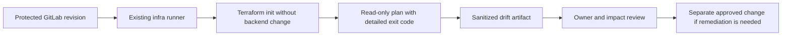

# UC-INFRA-001: Terraform Drift Detection

Last verified: 2026-08-13

## Use-case record

| Field | Value |
| --- | --- |
| Canonical portfolio use case | Terraform Drift Detection |
| Primary platform | Enterprise Multi-Cloud Infrastructure Platform |
| Enterprise alignment | Shared digital platform, risk and compliance, operational resilience |
| Enterprise outcome | Detect unreviewed change before it affects provider, payer, or shared platform services |
| Supporting platforms | DevSecOps delivery, governance, observability, resilience operations |
| Jira epic | `EPIC-INFRA-001` — Produce reviewable infrastructure drift evidence |
| Change record | To be assigned before any remediation action |
| Target | Existing `cloud-infra-automation-platform` GitLab project and accepted `gitlab-runner-infra01` runner |
| Current state | **Planned — documentation specification only** |
| Infrastructure boundary | No VM, IP, cloud resource, state backend, runner, or product is created |
| Owner | Infrastructure Platform team |

## Purpose

Infrastructure engineers need a scheduled, read-only comparison between the
reviewed Terraform configuration and the state already managed by the lab.
The result must identify drift early without turning detection into an
unapproved apply.

## Expected outcome

A GitLab job selects an existing root module, initializes only its configured
backend, runs a refresh-only or normal plan with mutation disabled, and
publishes a sanitized report containing the commit, workspace, provider lock,
resource summary, and detailed exit code. A non-empty plan opens a review item;
it never changes infrastructure automatically.

## Trigger and actors

| Item | Definition |
| --- | --- |
| Trigger | Scheduled GitLab pipeline or manual pipeline against a protected revision |
| Operator | Selects an allowlisted root and reviews the report |
| Infrastructure engineer | Owns Terraform source and determines whether drift is legitimate |
| Governance reviewer | Reviews policy or ownership exceptions |
| Service owner | Confirms impact when a changed resource supports a business service |

## Preconditions

- The selected Terraform root and lock file already exist in
  `cloud-infra-automation-platform`.
- `gitlab-runner-infra01` remains accepted, project-scoped, locked, and tagged
  `ansible,infra,terraform`.
- Backend and provider credentials are injected from protected GitLab
  variables; no secret is written to an artifact.
- The selected target is already represented in the canonical inventory and
  environment documentation.

## Scope and exclusions

In scope are existing Terraform roots, read-only plan execution, plan
summarization, ownership lookup, and evidence publication. Apply, import,
resource creation, state repair, backend migration, cloud-account creation,
and automatic remediation are excluded.

## End-to-end execution flow

## Code and configuration map

All paths below are planned GitLab implementation paths.

| Repository | Planned path | Responsibility |
| --- | --- | --- |
| `cloud-infra-automation-platform` | `.gitlab-ci.yml` | Schedule and protected manual entry point |
| same | `scripts/detect-terraform-drift.sh` | Root allowlist, init, plan, exit-code handling, and redaction |
| same | `scripts/summarize-terraform-plan.py` | Machine-readable creates, updates, deletes, replacements, and addresses |
| same | `config/drift-targets.yml` | Existing root, workspace, owner, service, and runbook mapping |
| same | `artifacts/drift/` | CI-generated reports only; reports are not committed |
| `enterprise-architecture-docs` | `docs/current-environment-state.md` | Canonical existence and status check |

## Jira breakdown

### STORY-INFRA-001: Define the existing-target drift contract

**Description:** The infrastructure platform team needs an allowlisted mapping
from an existing Terraform root to its workspace, owner, service impact, and
evidence policy so a generic job cannot probe or change undeclared targets.

**Status:** Planned.

**Acceptance criteria:** The mapping contains only verified roots; CI rejects
unknown roots and mutable commands; each target has an owner and enterprise
service relationship.

**Implementation steps:** Add `config/drift-targets.yml`, validate its schema,
and compare each target with canonical environment documentation.

**Completed work:** The enterprise and existing-lab boundary is documented on
this page; no GitLab implementation is claimed.

**Validation and rollback:** Run schema and allowlist tests. Revert the mapping
change if it exposes an undeclared target; no runtime rollback is required.

**Required attachments:** `ART-INFRA-001A` target-map validation output.

### STORY-INFRA-002: Generate a non-mutating Terraform plan

**Description:** The accepted infrastructure runner must produce drift evidence
without applying, importing, destroying, or changing state configuration.

**Status:** Planned.

**Acceptance criteria:** An unchanged target exits cleanly; drift returns the
documented non-zero detailed exit code; errors are distinct from drift; secrets
are absent from logs and artifacts.

**Implementation steps:** Add the detector script, pin Terraform `1.13.5`, use
the committed provider lock, disable interactive input, and preserve the plan
JSON only as a protected expiring artifact.

**Completed work:** The runner and Terraform version are verified in current
environment documentation; the detector script does not yet exist.

**Validation and rollback:** Test unchanged, intentional-drift fixture, invalid
credential, and unknown-root paths. Roll back by disabling the scheduled job
and reverting the pipeline commit.

**Required attachments:** `ART-INFRA-002A` pipeline log and
`ART-INFRA-002B` sanitized drift summary.

### STORY-INFRA-003: Route drift to an approved decision

**Description:** Service and platform owners need a durable review record that
separates accepted external change, source correction, state repair, and
infrastructure remediation.

**Status:** Planned.

**Acceptance criteria:** A drift finding names owner, affected addresses,
service impact, and recommended next decision; no remediation job is launched;
the finding links a separately approved change when action is required.

**Implementation steps:** Publish the report, add the pipeline URL to the
review item, notify the named owner, and record accepted exceptions with expiry.

**Completed work:** Decision categories are specified; no notification or issue
automation is claimed.

**Validation and rollback:** Exercise the flow with a fixture plan. Disable the
notification integration if it routes to an incorrect owner; retain the
artifact for audit.

**Required attachments:** `ART-INFRA-003A` review record and decision outcome.

## Evidence and screenshot register

| ID | Evidence | Source | Status |
| --- | --- | --- | --- |
| `ART-INFRA-001A` | Validated target map | GitLab CI artifact | Pending |
| `ART-INFRA-002A` | Detector pipeline log | GitLab pipeline | Pending |
| `ART-INFRA-002B` | Sanitized plan summary | Protected CI artifact | Pending |
| `ART-INFRA-003A` | Owner decision record | GitLab issue/change record | Pending |

## Expected versus current result

| Measure | Expected | Current |
| --- | --- | --- |
| Existing targets mapped | Every selected root has owner and enterprise impact | Not yet measured |
| Mutation protection | Detection path contains no apply/import/state-write action | Specification only |
| Evidence | Commit, target, exit code, and sanitized resource summary | Not yet produced |

## Acceptance decision

**Planned.** Acceptance requires passing CI tests, one unchanged-target run,
one controlled fixture-drift run, secret-redaction review, and proof that no
infrastructure or state changed.

## Operational, security, and follow-up notes

- Treat detailed plan JSON as sensitive and expire it quickly.
- Never run against an unlisted workspace or backend.
- Remediation belongs to a separate approved change and rollback plan.
- Copy implementation stories to the infrastructure GitLab project; return
  pipeline and decision evidence to this documentation repository.
