# UC-K8S-001: Kubernetes Configuration Drift

Last verified: 2026-08-13

## Use-case record

| Field | Value |
| --- | --- |
| Canonical portfolio use case | Kubernetes Configuration Drift |
| Primary platform | Enterprise Kubernetes Platform with GitOps |
| Supporting use cases | [UC-NET-018](../network/UC-NET-018-kubernetes-networking.md), [UC-K8S-006](UC-K8S-006-kubernetes-security-baseline-implementation.md), [UC-INFRA-001](../infrastructure/UC-INFRA-001-terraform-drift-detection.md), [UC-GOV-003](../governance/UC-GOV-003-secure-secrets-management-for-applications.md) |
| Enterprise alignment | Shared digital platform, operational resilience, risk and compliance |
| Enterprise outcome | Keep the existing application cluster aligned with reviewed source before it hosts additional provider or payer services |
| Supporting platforms | DevSecOps delivery, network, observability, governance |
| Jira epic | `EPIC-K8S-001` — Detect unmanaged Kubernetes changes |
| Change record | To be assigned before any reconciliation |
| Target | Existing four-node kubeadm cluster and `jenkins-agent01` deployment path |
| Current state | **Planned — ingress and Longhorn are accepted; Argo CD is not installed** |
| Infrastructure boundary | No cluster, node, VM, IP, load balancer, or storage system is created |
| Owner | Kubernetes Platform team |

## Purpose

Cluster operators need to know when accepted Kubernetes objects differ from
their reviewed Helm or manifest source. Detection must use the application
cluster context, avoid the AWX k3s context, and remain read-only until a
separate reconciliation change is approved.

## Expected outcome

A Jenkins PLAN action renders the reviewed source, queries the existing
application cluster, and publishes differences for objects owned by the
selected component. The first targets are accepted ingress-nginx, Headlamp
routing objects, and Longhorn configuration. The job never applies or prunes.

## Platform and enterprise fit

| Relationship | Detailed fit |
| --- | --- |
| Owning platform | **Kubernetes Configuration Drift** belongs to the Enterprise Kubernetes Platform with GitOps because that platform turns reviewed workload intent into Helm/GitOps reconciliation, policy, health verification, and revision recovery. |
| Enterprise consumers | The capability supports containerized provider, payer, data, AI, and shared-platform workloads. |
| Enterprise outcome | Its planned result advances: Keep the existing application cluster aligned with reviewed source before it hosts additional provider or payer services. |
| Control contribution | The design adds cluster/namespace ownership, policy enforcement, workload health, and auditable rollback. |
| Cross-platform handoff | Supporting platforms consume a reviewed result or evidence artifact; they do not take ownership away from the primary platform. |
| Infrastructure boundary | Fit is achieved by reusing documented existing repositories, control planes, services, and targets—not by inventing capacity or treating planned products as available. |

The platform fit is therefore based on ownership and a reusable decision, not
on the presence of a particular tool. Enterprise fit requires evidence that the
named outcome was observed for the bounded scope; completing documentation or
running an isolated technology demonstration is insufficient.

## Trigger and actors

| Item | Definition |
| --- | --- |
| Trigger | Scheduled Jenkins PLAN or operator-started PLAN for a protected Git ref |
| Platform operator | Selects component and reviewed source revision |
| Kubernetes engineer | Classifies drift and owns source correction |
| Service owner | Reviews application impact |
| SRE | Reviews health and incident correlation |

## Preconditions

- `/etc/kubernetes/admin.conf` on `k8s-control.example.com` identifies the
  `kubernetes-admin@kubernetes` context and Kubernetes `1.34.10` API.
- All four expected nodes are Ready before evidence collection.
- `jenkins-agent01` remains the exclusive `kubernetes-deployer` executor.
- Ingress-nginx and Longhorn ownership source is pinned to accepted revisions.
- No job treats the AWX-local k3s cluster as the application cluster.

## Scope and exclusions

In scope are read-only rendering, object ownership allowlists, live-versus-Git
comparison, health context, and drift artifacts. Argo CD installation,
automatic sync, prune, apply, node changes, namespace creation, and addon
installation are excluded from this first slice.

## Architecture context

Kubernetes Configuration Drift is evaluated inside the existing enterprise lab and the owning
platform's current source-control and execution boundaries. The architectural
unit is the governed outcome—**Keep the existing application cluster aligned with reviewed source before it hosts additional provider or payer services**—rather than a new product or
environment.

| Context element | Architecture statement |
| --- | --- |
| Business and operational setting | Enterprise consumers: Shared digital platform, operational resilience, risk and compliance. The result must be explainable, repeatable, and owned. |
| Current state | **Planned — ingress and Longhorn are accepted; Argo CD is not installed** |
| Desired state | A reviewed contract drives a bounded result, machine-readable evidence, and a safe stop or recovery decision. |
| Existing target boundary | Existing four-node kubeadm cluster and `jenkins-agent01` deployment path |
| Infrastructure constraint | No cluster, node, VM, IP, load balancer, or storage system is created |
| Accountable platform owner | Kubernetes Platform team; the consuming service, data, security, or workflow owner remains accountable for accepting business impact. |

The page owns the contract, control logic, evidence, and recovery behavior for
Kubernetes Configuration Drift. It does not absorb the responsibilities of the dependency use cases
listed below.

## Architecture diagram

```mermaid
flowchart LR
    Source["Protected Helm/manifests"] --> Jenkins["Existing Jenkins PLAN job"]
    Jenkins --> Agent["jenkins-agent01"]
    Agent --> Guard["Verify application cluster identity"]
    Guard --> Diff["Render and compare allowlisted objects"]
    Diff --> Health["Add rollout, pod, PVC, and event context"]
    Health --> Artifact["Sanitized drift report"]
    Artifact --> Change["Separate approval for reconciliation"]
```

## Dependencies and handoffs

Kubernetes Configuration Drift remains accountable to its primary platform. The dependencies below
provide explicit contracts or assurance evidence; they do not become alternate owners.

| Relationship | Use case | Required handoff | Failure propagation |
| --- | --- | --- | --- |
| Required upstream contract | [UC-NET-018: Kubernetes Networking](../network/UC-NET-018-kubernetes-networking.md) | cluster network identity and service-path contract | Missing, stale, or failed evidence blocks promotion or runtime action. |
| Required upstream contract | [UC-K8S-006: Kubernetes Security Baseline Implementation](UC-K8S-006-kubernetes-security-baseline-implementation.md) | workload security baseline and policy exceptions | Missing, stale, or failed evidence blocks promotion or runtime action. |
| Coordinated assurance handoff | [UC-INFRA-001: Terraform Drift Detection](../infrastructure/UC-INFRA-001-terraform-drift-detection.md) | desired/observed infrastructure identity and drift result | Missing, stale, or failed evidence blocks promotion or runtime action. |
| Coordinated assurance handoff | [UC-GOV-003: Secure Secrets Management for Applications](../governance/UC-GOV-003-secure-secrets-management-for-applications.md) | application secret-injection and workload identity boundary | Missing, stale, or failed evidence blocks promotion or runtime action. |

Before Kubernetes Configuration Drift is implemented, every handoff must resolve to an immutable
revision and machine-readable artifact. A URL, screenshot, or verbal approval
alone is not sufficient dependency evidence.

## Quality attributes

For Kubernetes Configuration Drift, quality is measured against the bounded enterprise outcome—not
document length or a green job. Unapproved business thresholds remain explicit
decisions and must not be invented.

| Attribute | Required measure or invariant | Decision state |
| --- | --- | --- |
| Functional correctness | Every required input is validated; **Keep the existing application cluster aligned with reviewed source before it hosts additional provider or payer services** is evaluated against positive, negative, missing-input, and unauthorized-scope cases. | Fixed design requirement |
| Performance and scale | Establish a baseline for reconciliation time, policy accuracy, workload health, and namespace isolation on existing capacity; the owner must approve warning and blocking thresholds before runtime promotion. | Thresholds `TBD` before implementation |
| Reliability | Missing prerequisites, stale dependencies, malformed evidence, and partial results fail closed without widening scope. | Fixed design requirement |
| Recovery | Record the maximum acceptable interruption and recovery time before runtime use; source-only validation must remain zero-change. | Owner decision required before runtime exercise |
| Observability | Emit use-case ID, revision, target, executor, start/end time, duration, decision, reason code, and recovery reference. | Required in the result schema |
| Evidence retention | Assign classification, retention period, and deletion owner before storing runtime evidence. | Security/compliance decision required |

Load, latency, availability, retention, RTO, and RPO values for Kubernetes Configuration Drift become
requirements only after the named service or business owner approves them. Until
then, the implementation gate records them as unresolved instead of quietly
choosing defaults.

## Security and privacy architecture

The Kubernetes Configuration Drift design separates source validation, privileged execution, target
access, and evidence review. Those boundaries remain in force even when one
engineer can access more than one system.

| Trust boundary | Allowed flow | Required control |
| --- | --- | --- |
| Contributor → GitLab | Reviewed source, contract, and synthetic/sanitized fixtures | Protected branch rules, peer review, secret scanning, and immutable commit identity |
| GitLab runner → result artifact | Read-only evaluation inputs and machine-readable output | No target-changing credential; pinned tool versions; artifact checksum and expiry |
| Approval plane → executor | Approved revision, target allowlist, mode, canary, and change reference | Separate authorization through the existing Jenkins/AWX or platform control path |
| Executor → existing target | Minimum commands or API operations required for Kubernetes Configuration Drift | Least-privilege identity, explicit target limit, timeout, and stop condition |
| Target → evidence store | Sanitized metadata, measurements, decision, and recovery result | Exclude credentials, tokens, private keys, kubeconfigs, packet payloads, PHI, PII, and unrelated records |

For Kubernetes Configuration Drift, the primary threat is **a manifest escaping its namespace, identity, image, or network boundary**. The mandatory response is
cluster-identity guards, namespace allowlists, policy checks, immutable images, and least-privilege service accounts. Authentication and authorization mappings must name
the existing identity source, principal or service account, permitted actions,
credential owner, rotation path, and emergency revocation procedure before a
runtime story can move beyond `Planned`.

## Architecture decisions and trade-offs

| Decision | Selected architecture | Alternative deferred or rejected | Rationale and status |
| --- | --- | --- | --- |
| First implementation slice | Contract, schema, fixtures, and read-only evidence on the existing GitLab runner | Product installation or broad runtime rollout | Proves behavior without expanding infrastructure; **approved design direction** |
| Runtime execution | Use only Approved cluster delivery path when current inventory and change approval confirm it is available | Direct operator changes or credentials in CI | Preserves separation of duties; **conditional on implementation review** |
| Evidence | Machine-readable result is authoritative; screenshots are optional supporting material | Screenshot-only acceptance | Enables repeatable audit and automated gates; **approved design direction** |
| Failure handling | Fail closed, preserve bounded diagnostics, and recover only the named scope | Continue with partial or stale evidence | Prevents false success and hidden blast radius; **approved design direction** |
| New capacity or product | Stop and raise a separate architecture decision | Silently add a VM, service, cloud dependency, or cluster add-on | Maintains the existing-lab constraint; **mandatory** |

### Open decisions before implementation

| Open decision | Decision owner | Resolution gate |
| --- | --- | --- |
| Exact inventory object and first canary | Platform owner plus consuming service/data owner | Must resolve before the implementation story leaves `Planned` |
| Performance, scale, and reliability thresholds | Service owner and SRE | Must be recorded before a runtime acceptance run |
| Identity-to-action authorization matrix | Platform owner and security reviewer | Must be approved before target credentials are attached |
| Evidence classification and retention | Data/security owner | Must be approved before runtime artifacts are retained |

If any selected approach changes, record the rationale beside UC-K8S-001 in
the implementation repository before code review. A documentation edit alone
does not approve the new architecture.

## Implementation design

The first Kubernetes Configuration Drift implementation is deliberately source-only. Its planned files live in the existing repository; none provisions infrastructure.

| Planned source responsibility | Exact planned location |
| --- | --- |
| Use-case contract and target allowlist | `midhhealth/platform-engineering/kubernetes-platform-gitops/contracts/uc-k8s-001.yaml` |
| Primary implementation | `midhhealth/platform-engineering/kubernetes-platform-gitops/use-cases/kubernetes-configuration-drift/policy.yaml`; entry point: the `kubernetes-configuration-drift` validation and reconciliation entry point |
| Machine-readable result schema | `midhhealth/platform-engineering/kubernetes-platform-gitops/schemas/uc-k8s-001-result.schema.json` |
| Positive, negative, malformed, and recovery fixtures | `midhhealth/platform-engineering/kubernetes-platform-gitops/tests/fixtures/uc-k8s-001/` |
| GitLab source gate | `midhhealth/platform-engineering/kubernetes-platform-gitops/.gitlab/ci/uc-k8s-001.yml` |
| Operator diagnosis and recovery | `midhhealth/platform-engineering/kubernetes-platform-gitops/docs/runbooks/uc-k8s-001.md` |

### Delivery stages

1. **Contract:** add the contract, schema, owners, dependency revisions, target
   allowlist, modes, reason codes, and open-decision values.
2. **Source validation:** lint exact paths, validate schema compatibility, scan
   for sensitive content, and run every fixture on the existing runner.
3. **Read-only proof:** execute the `kubernetes-configuration-drift` validation and reconciliation entry point, publish a checksummed result, and
   prove that blocked cases cannot reach a mutating path.
4. **Bounded execution:** only after separate approval, pass the immutable
   revision, target, mode, canary, and change ID to Approved cluster delivery path.
5. **Independent verification:** measure the expected result, confirm unrelated
   state is unchanged, run recovery or zero-change proof, and obtain owner
   review.

The implementation merge request must link this page, the dependency artifacts,
the decision values above, and the eventual pipeline/job/run identifiers. Code
completion alone cannot promote the page to runtime verified.

## Code and configuration map

| Repository | Planned path | Responsibility |
| --- | --- | --- |
| `kubernetes-platform-gitops` | `scripts/detect-kubernetes-drift.sh` | Context guard, render, compare, and exit codes |
| same | `config/drift-ownership.yml` | Component-to-object allowlist and accepted revision |
| same | existing ingress and Longhorn chart/manifests | Desired-state source; exact paths must be confirmed in GitLab |
| `jenkins-jobs` | planned `jobs/check_kubernetes_drift.groovy` | PLAN-only operator interface |
| `jenkins-shared-library` | planned `vars/kubernetesDriftPipeline.groovy` | Input validation and evidence publication |
| `enterprise-architecture-docs` | `docs/current-environment-state.md` | Cluster and component acceptance boundary |

## Jira breakdown

### STORY-K8S-001: Guard the application-cluster identity

**Description:** The Kubernetes team needs the drift job to fail closed unless
the selected context names the accepted four-node application cluster.

**Status:** Planned.

**Acceptance criteria:** The job records context and API version, finds the four
canonical nodes, rejects the AWX k3s context, and performs no mutation.

**Implementation steps:** Add context, server, node-name, and read-only
authorization checks before chart rendering or live queries.

**Completed work:** The cluster distinction and accepted node state are already
documented; no drift job is claimed.

**Validation and rollback:** Test the correct kubeconfig and an AWX k3s fixture.
Rollback is removal of the PLAN job; no cluster state changes.

**Required attachments:** `ART-K8S-001A` context-guard output.

### STORY-K8S-002: Compare owned objects with reviewed source

**Description:** Component owners need a bounded diff that cannot read or act
on unrelated namespaces or cluster resources.

**Status:** Planned.

**Acceptance criteria:** Only allowlisted ingress, Headlamp, and Longhorn
objects are compared; unchanged source returns clean; fixture drift is reported
with object kind, namespace, name, and field path.

**Implementation steps:** Define ownership, render the pinned source, normalize
server-generated fields, and compare with live read-only output.

**Completed work:** Existing components and acceptance revisions are known;
ownership configuration and comparison logic are pending.

**Validation and rollback:** Run golden fixtures for no drift, spec drift,
missing object, and extra object. Revert detector source on false positives.

**Required attachments:** `ART-K8S-002A` fixture report and
`ART-K8S-002B` live no-change report.

### STORY-K8S-003: Publish drift with runtime health context

**Description:** SRE and service owners need a finding to show whether drift is
already affecting rollout, pod, ingress, PVC, or event health.

**Status:** Planned.

**Acceptance criteria:** The report contains the source revision, live object
identity, health snapshot, owner, and safe next decision; no apply or prune is
available from the detection job.

**Implementation steps:** Collect bounded health data, redact Secret data,
publish an expiring artifact, and link any remediation change.

**Completed work:** Evidence requirements are specified; runtime artifacts are
pending.

**Validation and rollback:** Review the artifact for secrets and cross-namespace
leakage. Disable report publication if boundaries fail.

**Required attachments:** `ART-K8S-003A` sanitized drift and health bundle.

## Evidence and screenshot register

| ID | Evidence | Source | Status |
| --- | --- | --- | --- |
| `ART-K8S-001A` | Cluster identity guard | Jenkins artifact | Pending |
| `ART-K8S-002A` | Controlled fixture drift | CI artifact | Pending |
| `ART-K8S-002B` | Live read-only comparison | Jenkins artifact | Pending |
| `ART-K8S-003A` | Drift plus health context | Protected artifact | Pending |

## Expected versus current result

| Measure | Expected | Current |
| --- | --- | --- |
| Cluster identity | Four-node application cluster proven before query | Manual evidence exists; job pending |
| Drift coverage | Three accepted component boundaries | Ownership map pending |
| Mutation | Zero writes from detection path | Design requirement only |

## Acceptance decision

**Planned.** Accept only after source tests, a live no-change run, a controlled
fixture-drift run, secret review, and proof that Kubernetes resource versions
did not change during detection.

## Operational, security, and follow-up notes

- Use a read-only service identity when the Jenkins credential is introduced.
- Never include Secret values, kubeconfig content, or tokens in evidence.
- Automatic reconciliation remains a later, separately approved use case.
- Copy code stories to the Kubernetes and Jenkins GitLab repositories; return
  accepted evidence and incident links here.
