```mermaid
flowchart LR
    Source["Protected Helm/manifests"] --> Jenkins["Existing Jenkins PLAN job"]
    Jenkins --> Agent["jenkins-agent01"]
    Agent --> Guard["Verify application cluster identity"]
    Guard --> Diff["Render and compare allowlisted objects"]
    Diff --> Health["Add rollout, pod, PVC, and event context"]
    Health --> Artifact["Sanitized drift report"]
    Artifact --> Change["Separate approval for reconciliation"]
```

# UC-K8S-001: Kubernetes Configuration Drift

Last verified: 2026-08-13

## Use-case record

| Field | Value |
| --- | --- |
| Canonical portfolio use case | Kubernetes Configuration Drift |
| Primary platform | Enterprise Kubernetes Platform with GitOps |
| Enterprise alignment | Shared digital platform, operational resilience, risk and compliance |
| Enterprise outcome | Keep the existing application cluster aligned with reviewed source before it hosts additional provider or payer services |
| Supporting platforms | DevSecOps delivery, network, observability, governance |
| Jira epic | `EPIC-K8S-001` — Detect unmanaged Kubernetes changes |
| Change record | To be assigned before any reconciliation |
| Target | Existing four-node kubeadm cluster and `jenkins-agent01` deployment path |
| Current state | **Planned — ingress and Longhorn are accepted; Argo CD is not installed** |
| Infrastructure boundary | No cluster, node, VM, IP, load balancer, or storage system is created |
| Owner | Kubernetes Platform team |

## Purpose

Cluster operators need to know when accepted Kubernetes objects differ from
their reviewed Helm or manifest source. Detection must use the application
cluster context, avoid the AWX k3s context, and remain read-only until a
separate reconciliation change is approved.

## Expected outcome

A Jenkins PLAN action renders the reviewed source, queries the existing
application cluster, and publishes differences for objects owned by the
selected component. The first targets are accepted ingress-nginx, Headlamp
routing objects, and Longhorn configuration. The job never applies or prunes.

## Trigger and actors

| Item | Definition |
| --- | --- |
| Trigger | Scheduled Jenkins PLAN or operator-started PLAN for a protected Git ref |
| Platform operator | Selects component and reviewed source revision |
| Kubernetes engineer | Classifies drift and owns source correction |
| Service owner | Reviews application impact |
| SRE | Reviews health and incident correlation |

## Preconditions

- `/etc/kubernetes/admin.conf` on `k8s-control.example.com` identifies the
  `kubernetes-admin@kubernetes` context and Kubernetes `1.34.10` API.
- All four expected nodes are Ready before evidence collection.
- `jenkins-agent01` remains the exclusive `kubernetes-deployer` executor.
- Ingress-nginx and Longhorn ownership source is pinned to accepted revisions.
- No job treats the AWX-local k3s cluster as the application cluster.

## Scope and exclusions

In scope are read-only rendering, object ownership allowlists, live-versus-Git
comparison, health context, and drift artifacts. Argo CD installation,
automatic sync, prune, apply, node changes, namespace creation, and addon
installation are excluded from this first slice.

## End-to-end execution flow

## Code and configuration map

| Repository | Planned path | Responsibility |
| --- | --- | --- |
| `kubernetes-platform-gitops` | `scripts/detect-kubernetes-drift.sh` | Context guard, render, compare, and exit codes |
| same | `config/drift-ownership.yml` | Component-to-object allowlist and accepted revision |
| same | existing ingress and Longhorn chart/manifests | Desired-state source; exact paths must be confirmed in GitLab |
| `jenkins-jobs` | planned `jobs/check_kubernetes_drift.groovy` | PLAN-only operator interface |
| `jenkins-shared-library` | planned `vars/kubernetesDriftPipeline.groovy` | Input validation and evidence publication |
| `enterprise-architecture-docs` | `docs/current-environment-state.md` | Cluster and component acceptance boundary |

## Jira breakdown

### STORY-K8S-001: Guard the application-cluster identity

**Description:** The Kubernetes team needs the drift job to fail closed unless
the selected context names the accepted four-node application cluster.

**Status:** Planned.

**Acceptance criteria:** The job records context and API version, finds the four
canonical nodes, rejects the AWX k3s context, and performs no mutation.

**Implementation steps:** Add context, server, node-name, and read-only
authorization checks before chart rendering or live queries.

**Completed work:** The cluster distinction and accepted node state are already
documented; no drift job is claimed.

**Validation and rollback:** Test the correct kubeconfig and an AWX k3s fixture.
Rollback is removal of the PLAN job; no cluster state changes.

**Required attachments:** `ART-K8S-001A` context-guard output.

### STORY-K8S-002: Compare owned objects with reviewed source

**Description:** Component owners need a bounded diff that cannot read or act
on unrelated namespaces or cluster resources.

**Status:** Planned.

**Acceptance criteria:** Only allowlisted ingress, Headlamp, and Longhorn
objects are compared; unchanged source returns clean; fixture drift is reported
with object kind, namespace, name, and field path.

**Implementation steps:** Define ownership, render the pinned source, normalize
server-generated fields, and compare with live read-only output.

**Completed work:** Existing components and acceptance revisions are known;
ownership configuration and comparison logic are pending.

**Validation and rollback:** Run golden fixtures for no drift, spec drift,
missing object, and extra object. Revert detector source on false positives.

**Required attachments:** `ART-K8S-002A` fixture report and
`ART-K8S-002B` live no-change report.

### STORY-K8S-003: Publish drift with runtime health context

**Description:** SRE and service owners need a finding to show whether drift is
already affecting rollout, pod, ingress, PVC, or event health.

**Status:** Planned.

**Acceptance criteria:** The report contains the source revision, live object
identity, health snapshot, owner, and safe next decision; no apply or prune is
available from the detection job.

**Implementation steps:** Collect bounded health data, redact Secret data,
publish an expiring artifact, and link any remediation change.

**Completed work:** Evidence requirements are specified; runtime artifacts are
pending.

**Validation and rollback:** Review the artifact for secrets and cross-namespace
leakage. Disable report publication if boundaries fail.

**Required attachments:** `ART-K8S-003A` sanitized drift and health bundle.

## Evidence and screenshot register

| ID | Evidence | Source | Status |
| --- | --- | --- | --- |
| `ART-K8S-001A` | Cluster identity guard | Jenkins artifact | Pending |
| `ART-K8S-002A` | Controlled fixture drift | CI artifact | Pending |
| `ART-K8S-002B` | Live read-only comparison | Jenkins artifact | Pending |
| `ART-K8S-003A` | Drift plus health context | Protected artifact | Pending |

## Expected versus current result

| Measure | Expected | Current |
| --- | --- | --- |
| Cluster identity | Four-node application cluster proven before query | Manual evidence exists; job pending |
| Drift coverage | Three accepted component boundaries | Ownership map pending |
| Mutation | Zero writes from detection path | Design requirement only |

## Acceptance decision

**Planned.** Accept only after source tests, a live no-change run, a controlled
fixture-drift run, secret review, and proof that Kubernetes resource versions
did not change during detection.

## Operational, security, and follow-up notes

- Use a read-only service identity when the Jenkins credential is introduced.
- Never include Secret values, kubeconfig content, or tokens in evidence.
- Automatic reconciliation remains a later, separately approved use case.
- Copy code stories to the Kubernetes and Jenkins GitLab repositories; return
  accepted evidence and incident links here.
