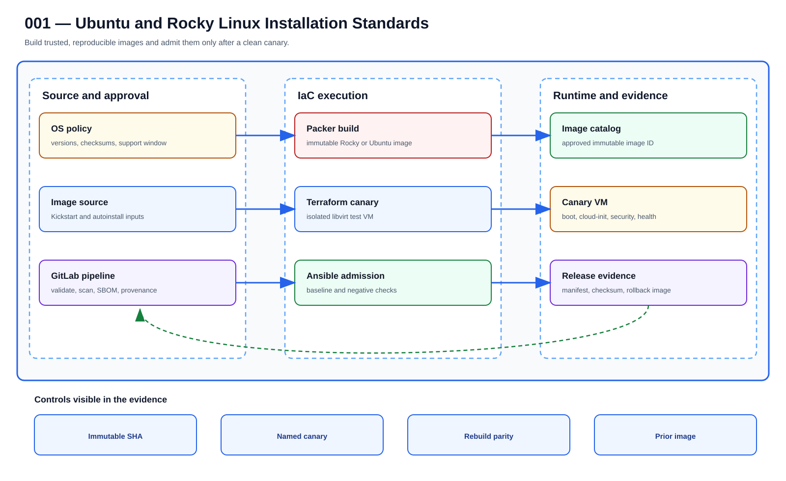

# UC-LNX-001: Ubuntu and Rocky Linux Installation Standards

Last verified: 2026-08-02

## Use-case record

| Field | Value |
| --- | --- |
| Portfolio | Enterprise Linux Systems Engineering Platform |
| Supporting use cases | [UC-INFRA-005](../infrastructure/UC-INFRA-005-server-configuration-automation-using-ansible.md), [UC-NET-005](../network/UC-NET-005-authoritative-and-recursive-dns.md), [UC-GOV-002](../governance/UC-GOV-002-secrets-management-automation.md), [UC-OBS-004](../observability/UC-OBS-004-centralized-log-management.md) |
| Primary implementation repository | `midhhealth/platform-engineering/linux-systems-platform` |
| Canonical coverage target | Reproducible supported operating-system builds |
| Delivery model | End-to-end infrastructure as code |
| Primary roles | Linux platform engineer, image engineer, security engineer, SRE |
| Target environment | New Rocky Linux and Ubuntu VM images before production admission |
| Current state | **Defined. The Linux repository validates existing Rocky hosts, but it has no accepted image-build pipeline or Ubuntu build source.** |
| Related change | None; implementation requires a future approved change record |
| Owner | Linux Platform team |

## Purpose

A reliable server build starts before Ansible connects to it. Installation media, checksums, unattended-install files, hardening choices, and admission tests stay together so another engineer can rebuild the image and explain what went into it.

## Expected outcome

The team can rebuild a signed Rocky or Ubuntu image from one reviewed commit, boot it in isolation, verify the baseline, and publish it only when admission passes. A repeat build produces the same manifest without remembered console steps.

## Platform and enterprise fit

| Relationship | Detailed fit |
| --- | --- |
| Owning platform | **Ubuntu and Rocky Linux Installation Standards** belongs to the the documented enterprise outcome because that platform turns GitLab-reviewed standards through Jenkins approval and Terraform/image or AWX/Ansible execution into verified operating-system state. |
| Enterprise consumers | The capability supports the Linux foundation beneath provider, payer, database, Kubernetes, observability, and shared services. |
| Enterprise outcome | Its planned result advances: the documented enterprise outcome. |
| Control contribution | The design adds repeatability, least privilege, canary scope, idempotence, recovery, and host-level evidence. |
| Cross-platform handoff | Supporting platforms consume a reviewed result or evidence artifact; they do not take ownership away from the primary platform. |
| Infrastructure boundary | Fit is achieved by reusing documented existing repositories, control planes, services, and targets—not by inventing capacity or treating planned products as available. |

The platform fit is therefore based on ownership and a reusable decision, not
on the presence of a particular tool. Enterprise fit requires evidence that the
named outcome was observed for the bounded scope; completing documentation or
running an isolated technology demonstration is insufficient.

## Trigger and actors

| Item | Definition |
| --- | --- |
| Trigger | A supported OS release or hardened image revision is approved for build |
| Engineering owners | Linux platform engineer, image engineer, security engineer, SRE |
| Approver | Confirms target, risk, window, plan, and recovery readiness |
| SRE/operations | Reviews health, alerts, evidence, incident linkage, and handoff |

## Preconditions

- The sequential change-control record authorizes this exact Linux component and no conflicting work is active.
- GitLab, the matching tagged runner, Jenkins, AWX, target inventory, DNS, and required observability paths are healthy.
- The target and canary are named explicitly; dynamic all-host execution is not the default.
- Credentials and sensitive variables are stored in approved secret systems and referenced by ID, never committed.
- Backup, snapshot, replacement, or other recovery evidence appropriate to the change exists before mutation.
- The selected Git SHA has passed all source, syntax, lint, policy, and secret gates.

## Scope and exclusions

**In scope:** Version-pinned Rocky and Ubuntu base images, checksums, unattended install inputs, image scanning, publication, provenance, and admission tests.

**Excluded:** Physical bare-metal imaging, desktop images, unreviewed public cloud marketplace images, and product installation.

## Design walkthrough

For design review, walk through Ubuntu and Rocky Linux Installation Standards by trying to treat
the host or fleet change as a canary-led operating procedure rather than a collection of
commands. The result MidhHealth needs is to Its planned result advances: the documented
enterprise outcome. Linux Platform team owns the platform decision, while the consuming service
or business owner still accepts the effect on its workflow.

Read the diagram from left to right as a sequence of gates; a later stage cannot repair missing
identity or evidence from an earlier one. In this page, **UC-INFRA-005: Server Configuration
Automation Using Ansible** contributes server configuration source and bounded Ansible
execution; **UC-NET-005: Authoritative and Recursive DNS** contributes authoritative name,
resolver path, and expected DNS answer. The first buildable boundary is the accepted existing
lab boundary named by the page. The design stops at this rule: Fit is achieved by reusing
documented existing repositories, control planes, services, and targets—not by inventing
capacity or treating planned products as available.

The walkthrough becomes useful when the happy path breaks. If a required dependency or
verification result is unavailable, the expected response is to stop before mutation, preserve
the evidence and return the decision to the accountable owner. The leading design threat is
host-level automation crossing its inventory, privilege, or credential boundary; therefore a
green source job, screenshot or reachable endpoint is supporting evidence, not acceptance by
itself.

## Architecture context

Ubuntu and Rocky Linux Installation Standards is evaluated inside the existing enterprise lab and the owning
platform's current source-control and execution boundaries. The architectural
unit is the governed outcome—**Reproducible supported operating-system builds**—rather than a new product or
environment.

| Context element | Architecture statement |
| --- | --- |
| Business and operational setting | Enterprise consumers: Enterprise Linux Systems Engineering Platform. The result must be explainable, repeatable, and owned. |
| Current state | **Defined. The Linux repository validates existing Rocky hosts, but it has no accepted image-build pipeline or Ubuntu build source.** |
| Desired state | A reviewed contract drives a bounded result, machine-readable evidence, and a safe stop or recovery decision. |
| Existing target boundary | New Rocky Linux and Ubuntu VM images before production admission |
| Infrastructure constraint | Use existing GitLab, Jenkins, AWX, libvirt, and inventoried hosts; no VM, IP, product, or capacity is authorized by this page |
| Accountable platform owner | Linux Platform team; the consuming service, data, security, or workflow owner remains accountable for accepting business impact. |

The page owns the contract, control logic, evidence, and recovery behavior for
Ubuntu and Rocky Linux Installation Standards. It does not absorb the responsibilities of the dependency use cases
listed below.

## Architecture diagram

Read this one left to right. The upper line follows a reviewed change toward a provable outcome; the lower branch shows who can stop it and how the team returns to a known release.

## IaC delivery model

| Layer | Ownership and control |
| --- | --- |
| GitLab | Authoritative source, merge request, protected branch, validation pipeline, immutable SHA, and artifacts |
| Jenkins | Operator-selected PLAN/CHECK/APPLY/ROLLBACK action, approval boundary, concurrency control, and evidence aggregation |
| Terraform/image automation | Owns VM, image, volume, network, and other infrastructure lifecycle only when the change touches those resources |
| AWX and Ansible | Own operating-system desired state, inventory targeting, check mode, serial rollout, and per-host job events |
| Observability and evidence | Health gates, logs, metrics, alerts, expected-versus-observed result, incident links, and acceptance record |

Current-source reality: Existing source provides inventory and baseline validation only; no image factory is claimed.

## End-to-end implementation

### Code and configuration map

| State | Repository path | Responsibility |
| --- | --- | --- |
| Existing | `linux-systems-platform: roles/linux_baseline and playbooks/preflight.yml` | Post-build OS assumption and baseline checks |
| Planned | `cloud-infra-automation-platform: image-build/rocky and image-build/ubuntu` | Packer definitions, Kickstart/autoinstall inputs, checksums, and image manifests |
| Planned | `linux-systems-platform: tests/os-images and playbooks/os-image-admission.yml` | Boot, package, service, SELinux, network, and evidence admission tests |

### Required variables and controls

| Variable/control | Example or constraint | Purpose |
| --- | --- | --- |
| `linux_image_family` | rocky or ubuntu | Selects supported build workflow |
| `linux_image_version` | approved major/minor | Prevents moving release targets |
| `linux_image_sha256` | publisher checksum | Verifies installation media |
| `linux_image_cis_profile` | approved profile ID | Binds hardening expectations to evidence |

### Delivery sequence

1. Pin installation media URL, checksum, OS version, firmware mode, disk layout, and package manifest in reviewed source.
2. Build an ephemeral image with Kickstart or autoinstall through the approved image pipeline; do not customize it manually.
3. Scan the image, export SBOM and build manifest, and sign or checksum the resulting artifact.
4. Provision an isolated canary VM from the candidate image through Terraform/libvirt and cloud-init.
5. Run Ansible admission checks for identity, networking, repositories, time, SELinux/AppArmor, firewall, guest agent, and unsupported packages.
6. Destroy the canary, publish the immutable image only after approval, and record consumers allowed to use it.

## Dependencies and handoffs

Ubuntu and Rocky Linux Installation Standards remains accountable to its primary platform. The dependencies below
provide explicit contracts or assurance evidence; they do not become alternate owners.

| Relationship | Use case | Required handoff | Failure propagation |
| --- | --- | --- | --- |
| Required upstream contract | [UC-INFRA-005: Server Configuration Automation Using Ansible](../infrastructure/UC-INFRA-005-server-configuration-automation-using-ansible.md) | server configuration source and bounded Ansible execution | Missing, stale, or failed evidence blocks promotion or runtime action. |
| Required upstream contract | [UC-NET-005: Authoritative and Recursive DNS](../network/UC-NET-005-authoritative-and-recursive-dns.md) | authoritative name, resolver path, and expected DNS answer | Missing, stale, or failed evidence blocks promotion or runtime action. |
| Coordinated assurance handoff | [UC-GOV-002: Secrets Management Automation](../governance/UC-GOV-002-secrets-management-automation.md) | approved secret reference, redaction rule, and rotation owner | Missing, stale, or failed evidence blocks promotion or runtime action. |
| Coordinated assurance handoff | [UC-OBS-004: Centralized Log Management](../observability/UC-OBS-004-centralized-log-management.md) | sanitized log fields, source identity, and retention route | Missing, stale, or failed evidence blocks promotion or runtime action. |

Before Ubuntu and Rocky Linux Installation Standards is implemented, every handoff must resolve to an immutable
revision and machine-readable artifact. A URL, screenshot, or verbal approval
alone is not sufficient dependency evidence.

## Quality attributes

For Ubuntu and Rocky Linux Installation Standards, quality is measured against the bounded enterprise outcome—not
document length or a green job. Unapproved business thresholds remain explicit
decisions and must not be invented.

| Attribute | Required measure or invariant | Decision state |
| --- | --- | --- |
| Functional correctness | Every required input is validated; **Reproducible supported operating-system builds** is evaluated against positive, negative, missing-input, and unauthorized-scope cases. | Fixed design requirement |
| Performance and scale | Establish a baseline for convergence time, idempotence, service health, and configuration drift on existing capacity; the owner must approve warning and blocking thresholds before runtime promotion. | Thresholds `TBD` before implementation |
| Reliability | Missing prerequisites, stale dependencies, malformed evidence, and partial results fail closed without widening scope. | Fixed design requirement |
| Recovery | Record the maximum acceptable interruption and recovery time before runtime use; source-only validation must remain zero-change. | Owner decision required before runtime exercise |
| Observability | Emit use-case ID, revision, target, executor, start/end time, duration, decision, reason code, and recovery reference. | Required in the result schema |
| Evidence retention | Assign classification, retention period, and deletion owner before storing runtime evidence. | Security/compliance decision required |

Load, latency, availability, retention, RTO, and RPO values for Ubuntu and Rocky Linux Installation Standards become
requirements only after the named service or business owner approves them. Until
then, the implementation gate records them as unresolved instead of quietly
choosing defaults.

## Security and privacy architecture

The Ubuntu and Rocky Linux Installation Standards design separates source validation, privileged execution, target
access, and evidence review. Those boundaries remain in force even when one
engineer can access more than one system.

| Trust boundary | Allowed flow | Required control |
| --- | --- | --- |
| Contributor → GitLab | Reviewed source, contract, and synthetic/sanitized fixtures | Protected branch rules, peer review, secret scanning, and immutable commit identity |
| GitLab runner → result artifact | Read-only evaluation inputs and machine-readable output | No target-changing credential; pinned tool versions; artifact checksum and expiry |
| Approval plane → executor | Approved revision, target allowlist, mode, canary, and change reference | Separate authorization through the existing Jenkins/AWX or platform control path |
| Executor → existing target | Minimum commands or API operations required for Ubuntu and Rocky Linux Installation Standards | Least-privilege identity, explicit target limit, timeout, and stop condition |
| Target → evidence store | Sanitized metadata, measurements, decision, and recovery result | Exclude credentials, tokens, private keys, kubeconfigs, packet payloads, PHI, PII, and unrelated records |

For Ubuntu and Rocky Linux Installation Standards, the primary threat is **host-level automation crossing its inventory, privilege, or credential boundary**. The mandatory response is
AWX inventory limits, purpose-specific credentials, check mode, canaries, protected variables, and exact rollback tasks. Authentication and authorization mappings must name
the existing identity source, principal or service account, permitted actions,
credential owner, rotation path, and emergency revocation procedure before a
runtime story can move beyond `Planned`.

## Architecture decisions and trade-offs

| Decision | Selected architecture | Alternative deferred or rejected | Rationale and status |
| --- | --- | --- | --- |
| First implementation slice | Contract, schema, fixtures, and read-only evidence on the existing GitLab runner | Product installation or broad runtime rollout | Proves behavior without expanding infrastructure; **approved design direction** |
| Runtime execution | Use only AWX controlled execution when current inventory and change approval confirm it is available | Direct operator changes or credentials in CI | Preserves separation of duties; **conditional on implementation review** |
| Evidence | Machine-readable result is authoritative; screenshots are optional supporting material | Screenshot-only acceptance | Enables repeatable audit and automated gates; **approved design direction** |
| Failure handling | Fail closed, preserve bounded diagnostics, and recover only the named scope | Continue with partial or stale evidence | Prevents false success and hidden blast radius; **approved design direction** |
| New capacity or product | Stop and raise a separate architecture decision | Silently add a VM, service, cloud dependency, or cluster add-on | Maintains the existing-lab constraint; **mandatory** |

### Open decisions before implementation

| Open decision | Decision owner | Resolution gate |
| --- | --- | --- |
| Exact inventory object and first canary | Platform owner plus consuming service/data owner | Must resolve before the implementation story leaves `Planned` |
| Performance, scale, and reliability thresholds | Service owner and SRE | Must be recorded before a runtime acceptance run |
| Identity-to-action authorization matrix | Platform owner and security reviewer | Must be approved before target credentials are attached |
| Evidence classification and retention | Data/security owner | Must be approved before runtime artifacts are retained |

If any selected approach changes, record the rationale beside UC-LNX-001 in
the implementation repository before code review. A documentation edit alone
does not approve the new architecture.

## Implementation design

The existing Linux code/configuration map remains authoritative; extend its named role and playbook rather than creating parallel automation.

| Planned source responsibility | Exact planned location |
| --- | --- |
| Use-case contract and target allowlist | `midhhealth/platform-engineering/linux-systems-platform/contracts/uc-lnx-001.yaml` |
| Primary implementation | `midhhealth/platform-engineering/linux-systems-platform/roles/os-installation-standards/tasks/main.yml`; entry point: the page's named Ansible role and verification tasks |
| Machine-readable result schema | `midhhealth/platform-engineering/linux-systems-platform/schemas/uc-lnx-001-result.schema.json` |
| Positive, negative, malformed, and recovery fixtures | `midhhealth/platform-engineering/linux-systems-platform/tests/fixtures/uc-lnx-001/` |
| GitLab source gate | `midhhealth/platform-engineering/linux-systems-platform/.gitlab/ci/uc-lnx-001.yml` |
| Operator diagnosis and recovery | `midhhealth/platform-engineering/linux-systems-platform/docs/runbooks/uc-lnx-001.md` |

### Delivery stages

1. **Contract:** add the contract, schema, owners, dependency revisions, target
   allowlist, modes, reason codes, and open-decision values.
2. **Source validation:** lint exact paths, validate schema compatibility, scan
   for sensitive content, and run every fixture on the existing runner.
3. **Read-only proof:** execute the page's named Ansible role and verification tasks, publish a checksummed result, and
   prove that blocked cases cannot reach a mutating path.
4. **Bounded execution:** only after separate approval, pass the immutable
   revision, target, mode, canary, and change ID to AWX controlled execution.
5. **Independent verification:** measure the expected result, confirm unrelated
   state is unchanged, run recovery or zero-change proof, and obtain owner
   review.

The implementation merge request must link this page, the dependency artifacts,
the decision values above, and the eventual pipeline/job/run identifiers. Code
completion alone cannot promote the page to runtime verified.

## Code and configuration map

The table under **End-to-end implementation** is the implementation map required by the documentation contract. Paths marked `Existing` were observed in the current repository clone; paths marked `Planned` are design targets and must not be treated as completed source.

## Jira breakdown

### STORY-LNX-001-001: Implement and validate the source model

**Description:** The platform team keeps the inputs, roles or modules, tests, pipeline gates, and operating boundaries for Ubuntu and Rocky Linux Installation Standards in Git. A reviewer can reproduce the proposal from the selected commit without relying on settings that exist only in a console.

**Status:** In progress; bounded supporting source exists, but the full use-case source gate is not accepted.

**Acceptance criteria:**

- Required inputs have schemas/defaults, safe bounds, owners, and secret references.
- Local validation and GitLab CI reject malformed, unsafe, non-idempotent, or out-of-scope changes.
- The pipeline publishes the immutable Git SHA, plan/check artifacts, and exact target assumptions.

**Implementation steps:**

1. Pin installation media URL, checksum, OS version, firmware mode, disk layout, and package manifest in reviewed source.
2. Build an ephemeral image with Kickstart or autoinstall through the approved image pipeline; do not customize it manually.
3. Scan the image, export SBOM and build manifest, and sign or checksum the resulting artifact.

**Completed work:** Existing source provides inventory and baseline validation only; no image factory is claimed.

**Validation and rollback:** Run local and CI validation without runtime mutation. Roll back source by reverting the merge request and regenerating artifacts from the prior accepted revision.

**Required attachments:** `ART-LNX-001-001` and `ATT-LNX-001-001`.

### STORY-LNX-001-002: Execute the bounded canary and rollout

**Description:** The operator reviews PLAN or CHECK output against one named canary before applying Ubuntu and Rocky Linux Installation Standards. Failed health or negative tests stop the run, and expansion requires explicit approval.

**Status:** Planned; no runtime acceptance is claimed.

**Acceptance criteria:**

- Jenkins/AWX or Terraform uses the reviewed Git SHA, credential references, inventory, and explicit canary limit.
- Canary health and negative tests pass before any cohort expansion.
- Failure thresholds stop the workflow and preserve artifacts without hidden manual correction.

**Implementation steps:**

1. Provision an isolated canary VM from the candidate image through Terraform/libvirt and cloud-init.
2. Run Ansible admission checks for identity, networking, repositories, time, SELinux/AppArmor, firewall, guest agent, and unsupported packages.
3. Destroy the canary, publish the immutable image only after approval, and record consumers allowed to use it.

**Completed work:** The execution design is documented; a successful live canary is not yet recorded.

**Validation and rollback:** Packer/image source validation and checksum verification pass; Canary boots without interactive input and cloud-init completes once; Ansible check mode reports the approved baseline. Depublish the candidate image, restore the previous accepted image ID in environment variables, and rebuild affected unaccepted canaries. Existing production VMs are not reimaged as rollback.

**Required attachments:** `ART-LNX-001-002`, `ATT-LNX-001-002`, and `ATT-LNX-001-003`.

### STORY-LNX-001-003: Prove convergence, recovery, and handoff

**Description:** Operations accepts Ubuntu and Rocky Linux Installation Standards only after the same revision converges cleanly, runtime health is visible, and the recovery path has been exercised. The evidence must explain what moved, what stayed stable, and how the team recovered it.

**Status:** Planned; blocked until the canary story succeeds.

**Acceptance criteria:**

- Repeating the same reviewed code and inputs produces zero unexpected change.
- Rollback or recovery is exercised and the service returns within its approved objective.
- Logs, metrics, job output, expected-versus-observed results, owner, and follow-up actions are published.

**Implementation steps:**

1. Repeat the identical execution and compare the changed-host/task/resource set.
2. Exercise the documented rollback or recovery path on the bounded target.
3. Verify service health, monitoring, security posture, and consumer access after recovery.
4. Publish sanitized artifacts, link incidents, and obtain owner/SRE acceptance.

**Completed work:** Acceptance criteria and evidence requirements are defined; no use-case-specific runtime evidence is claimed.

**Validation and rollback:** Rebuild from the same inputs produces equivalent manifest and admission results. Depublish the candidate image, restore the previous accepted image ID in environment variables, and rebuild affected unaccepted canaries. Existing production VMs are not reimaged as rollback.

**Required attachments:** `ART-LNX-001-003`, `ATT-LNX-001-004`, and `ATT-LNX-001-005`.

## Evidence and screenshot register

| ID | Required evidence | Source | Status |
| --- | --- | --- | --- |
| `ART-LNX-001-001` | CI validation, immutable SHA, and plan/check artifact | GitLab | Pending |
| `ATT-LNX-001-001` | Successful source pipeline overview | GitLab | Pending |
| `ART-LNX-001-002` | Canary execution log with target and changed set | Jenkins/AWX/Terraform | Pending |
| `ATT-LNX-001-002` | Canary job/build result | Jenkins or AWX | Pending |
| `ATT-LNX-001-003` | Runtime health and expected state | Approved CLI or dashboard | Pending |
| `ART-LNX-001-003` | Second convergence and rollback/recovery log | Control plane artifact | Pending |
| `ATT-LNX-001-004` | Recovery result | Control plane | Pending |
| `ATT-LNX-001-005` | Final accepted operating state | Dashboard or approved CLI | Pending |

## Expected versus current result

| Area | Expected | Current observation | Decision |
| --- | --- | --- | --- |
| Source | Complete IaC and pipeline for Ubuntu and Rocky Linux Installation Standards | Existing source provides inventory and baseline validation only; no image factory is claimed. | Not yet code complete |
| Runtime | Approved canary and cohort execution | No use-case-specific accepted run recorded | Pending |
| Idempotence | Identical second run has zero unexpected change | No accepted second convergence | Pending |
| Recovery | Recovery exercised and timed | No accepted recovery artifact | Pending |
| Evidence | Sanitized artifacts linked to immutable executions | Register defined; captures pending | Pending |

## Validation, idempotence, and rollback

- Packer/image source validation and checksum verification pass.
- Canary boots without interactive input and cloud-init completes once.
- Ansible check mode reports the approved baseline.
- Rebuild from the same inputs produces equivalent manifest and admission results.

**Rollback/recovery:** Depublish the candidate image, restore the previous accepted image ID in environment variables, and rebuild affected unaccepted canaries. Existing production VMs are not reimaged as rollback.

Idempotence is proved by repeating the same reviewed revision, target, variables, and action after the first successful run. A green first run or an Ansible exit code of zero is insufficient when tasks still report unexplained changes.

## Troubleshooting guide

Primary scenario: **The canary boots but cloud-init never reaches done.**

1. Stop cohort expansion and preserve the Git SHA, pipeline, Jenkins build, AWX job, Terraform plan/state reference, timestamps, and target list.
2. Confirm the failure is in source validation, orchestration, infrastructure, connectivity, privilege, desired-state execution, or consumer health before changing anything.
3. Compare desired inputs with live facts and the last accepted evidence; inspect logs and metrics around the exact execution window.
4. Reproduce only on the canary or in check/plan mode, change one hypothesis at a time, and avoid console drift.
5. Run the documented recovery path. Record any unexpected failure or near miss in the incident register before resuming.

## Interview preparation

1. **Question:** Explain the end-to-end IaC architecture for Ubuntu and Rocky Linux Installation Standards.
   **Answer signals:** Separate GitLab source gates, Jenkins approval, Terraform/image ownership where applicable, AWX/Ansible desired state, canary rollout, evidence, and rollback.

2. **Question:** Which inputs and target boundaries make Ubuntu and Rocky Linux installation standards safe to repeat and reuse?
   **Answer signals:** linux_image_family, linux_image_version, linux_image_sha256, linux_image_cis_profile; immutable inputs, explicit target limits, deterministic tasks, and no hidden UI state.

3. **Question:** What would you require before approving the first production APPLY?
   **Answer signals:** Packer/image source validation and checksum verification pass; Canary boots without interactive input and cloud-init completes once, a reviewed plan/check result, named owner, maintenance window, and recovery evidence.

4. **Question:** Troubleshooting scenario: The canary boots but cloud-init never reaches done. What do you do first?
   **Answer signals:** Stop propagation, preserve job and host evidence, compare desired versus observed state, isolate the failing layer, test one hypothesis at a time, and link an incident when unexpected.

5. **Question:** How do you prove idempotence and distinguish it from a successful first run?
   **Answer signals:** Repeat the identical reviewed revision and inputs; expect zero unintended changes, stable health, and equivalent evidence rather than merely an exit code of zero.

6. **Question:** Describe the rollback or recovery strategy.
   **Answer signals:** Depublish the candidate image, restore the previous accepted image ID in environment variables, and rebuild affected unaccepted canaries. Existing production VMs are not reimaged as rollback.

7. **Question:** What security and audit controls would you defend in an interview?
   **Answer signals:** Least privilege, protected branches, secret references, approval gates, bounded limits, immutable Git SHA, machine-readable artifacts, and sanitized evidence.

8. **Question:** What tradeoff would you discuss between image immutability and fast security updates?
   **Answer signals:** State the business constraint, compare failure modes and recovery cost, choose a bounded default, measure the result, and document when the alternative is justified.

9. **Question:** Tell me about a time you owned a difficult Ubuntu and Rocky Linux Installation Standards change or incident across multiple teams. What did you do?
   **Answer signals:** Use a concise STAR example showing ownership, risk communication, evidence-based decisions, a safe stop or rollback, collaboration with service/security/SRE owners, measurable recovery or improvement, and a durable IaC correction.

## Safety and security controls

- Protected branches, merge requests, tagged runners, immutable revisions, and retained artifacts.
- Least-privilege credentials referenced from Jenkins/AWX or the approved secret system.
- PLAN/CHECK by default; APPLY/ROLLBACK requires explicit confirmation and exact target limits.
- Serial/canary rollout, failure thresholds, runtime health gates, and stop conditions.
- No protected health information, credentials, private keys, or unredacted secrets in logs or screenshots.

## Acceptance decision

UC-LNX-001 is **not yet accepted**. This page is the end-to-end IaC implementation and interview specification. Acceptance requires completed source, a passing GitLab pipeline, controlled execution, runtime health, a zero-change second convergence, exercised recovery, reviewed evidence, and publication on the canonical branch.
