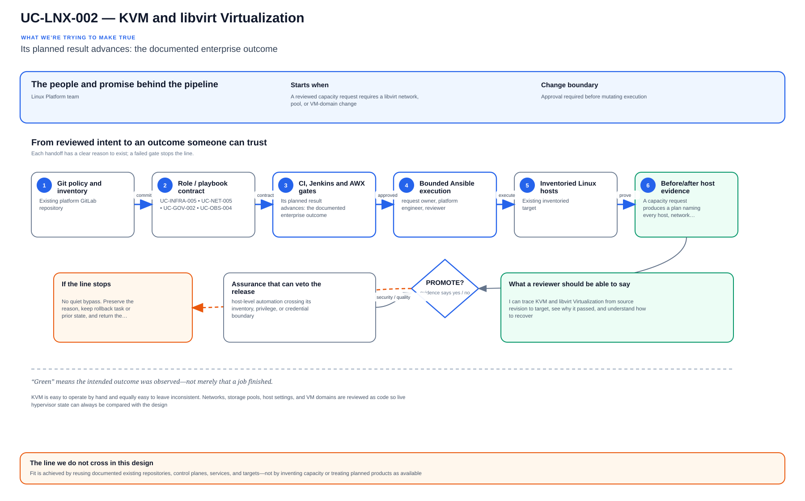

# UC-LNX-002: KVM and libvirt Virtualization

Last verified: 2026-08-02

## Use-case record

| Field | Value |
| --- | --- |
| Portfolio | Enterprise Linux Systems Engineering Platform |
| Canonical coverage target | Managed hypervisor, network, storage-pool and domain lifecycle |
| Delivery model | End-to-end infrastructure as code |
| Primary roles | Virtualization engineer, Linux platform engineer, network engineer, storage engineer |
| Target environment | infra01, infra02, and infra03 hypervisors and their approved libvirt resources |
| Current state | **Defined. Live KVM hosts exist, but the platform has no dedicated accepted Terraform module or lifecycle evidence ledger for them.** |
| Related change | None; implementation requires a future approved change record |
| Owner | Linux Platform team |

## Purpose

KVM is easy to operate by hand and equally easy to leave inconsistent. Networks, storage pools, host settings, and VM domains are reviewed as code so live hypervisor state can always be compared with the design.

## Expected outcome

A capacity request produces a plan naming every host, network, pool, volume, and domain it will touch. A canary proves connectivity and isolation, while the repeat plan returns no unexpected changes.

## Trigger and actors

| Item | Definition |
| --- | --- |
| Trigger | A reviewed capacity request requires a libvirt network, pool, or VM-domain change |
| Engineering owners | Virtualization engineer, Linux platform engineer, network engineer, storage engineer |
| Approver | Confirms target, risk, window, plan, and recovery readiness |
| SRE/operations | Reviews health, alerts, evidence, incident linkage, and handoff |

## Preconditions

- The sequential change-control record authorizes this exact Linux component and no conflicting work is active.
- GitLab, the matching tagged runner, Jenkins, AWX, target inventory, DNS, and required observability paths are healthy.
- The target and canary are named explicitly; dynamic all-host execution is not the default.
- Credentials and sensitive variables are stored in approved secret systems and referenced by ID, never committed.
- Backup, snapshot, replacement, or other recovery evidence appropriate to the change exists before mutation.
- The selected Git SHA has passed all source, syntax, lint, policy, and secret gates.

## Scope and exclusions

**In scope:** Hypervisor prerequisites, bridges, storage pools, domain definitions, autostart, resource limits, placement, and lifecycle evidence.

**Excluded:** Application configuration inside guests, manual virt-manager changes, and public-cloud compute.

## Architecture diagram

A capacity request becomes a Terraform plan, passes through a canary domain, and finishes as healthy libvirt resources with state and runtime evidence.

## IaC delivery model

| Layer | Ownership and control |
| --- | --- |
| GitLab | Authoritative source, merge request, protected branch, validation pipeline, immutable SHA, and artifacts |
| Jenkins | Operator-selected PLAN/CHECK/APPLY/ROLLBACK action, approval boundary, concurrency control, and evidence aggregation |
| Terraform/image automation | Owns VM, image, volume, network, and other infrastructure lifecycle only when the change touches those resources |
| AWX and Ansible | Own operating-system desired state, inventory targeting, check mode, serial rollout, and per-host job events |
| Observability and evidence | Health gates, logs, metrics, alerts, expected-versus-observed result, incident links, and acceptance record |

Current-source reality: Canonical inventory documents the three KVM hosts; domain mutation must be added as reviewed IaC.

## End-to-end implementation

### Code and configuration map

| State | Repository path | Responsibility |
| --- | --- | --- |
| Existing | `enterprise-architecture-docs: docs/vm-inventory.md` | Accepted host, pool, VM, IP, and MAC facts |
| Planned | `cloud-infra-automation-platform: terraform/modules/compute` | libvirt domain, volume, network, and placement resources |
| Planned | `linux-systems-platform: roles/libvirt_host and playbooks/libvirt-host.yml` | KVM packages, daemon, bridge, pool, capacity, and health controls |

### Required variables and controls

| Variable/control | Example or constraint | Purpose |
| --- | --- | --- |
| `libvirt_hypervisor` | infra01/02/03 | Explicit placement target |
| `libvirt_pool` | lab-images or infra03-images | Prevents accidental default-pool use |
| `domain_vcpu_memory` | approved capacity tuple | Enforces reservation review |
| `domain_autostart` | true for accepted services | Controls reboot recovery |

### Delivery sequence

1. Reconcile capacity, NUMA, storage free space, bridge state, and current domain inventory before planning.
2. Model networks, pools, volumes, domains, deterministic MAC addresses, firmware, and autostart in Terraform.
3. Run fmt, validate, policy checks, and a saved Terraform plan; reject deletion or replacement not named in the change.
4. Apply one canary domain through the protected workflow and verify libvirt XML, bridge attachment, storage chain, and console.
5. Restart or migrate only when the change record explicitly authorizes it; verify autostart using a controlled canary.
6. Run a second plan expecting no changes and publish domain, network, pool, and capacity evidence.

## Code and configuration map

The table under **End-to-end implementation** is the implementation map required by the documentation contract. Paths marked `Existing` were observed in the current repository clone; paths marked `Planned` are design targets and must not be treated as completed source.

## Jira breakdown

### STORY-LNX-002-001: Implement and validate the source model

**Description:** The platform team keeps the inputs, roles or modules, tests, pipeline gates, and operating boundaries for KVM and libvirt Virtualization in Git. A reviewer can reproduce the proposal from the selected commit without relying on settings that exist only in a console.

**Status:** In progress; bounded supporting source exists, but the full use-case source gate is not accepted.

**Acceptance criteria:**

- Required inputs have schemas/defaults, safe bounds, owners, and secret references.
- Local validation and GitLab CI reject malformed, unsafe, non-idempotent, or out-of-scope changes.
- The pipeline publishes the immutable Git SHA, plan/check artifacts, and exact target assumptions.

**Implementation steps:**

1. Reconcile capacity, NUMA, storage free space, bridge state, and current domain inventory before planning.
2. Model networks, pools, volumes, domains, deterministic MAC addresses, firmware, and autostart in Terraform.
3. Run fmt, validate, policy checks, and a saved Terraform plan; reject deletion or replacement not named in the change.

**Completed work:** Canonical inventory documents the three KVM hosts; domain mutation must be added as reviewed IaC.

**Validation and rollback:** Run local and CI validation without runtime mutation. Roll back source by reverting the merge request and regenerating artifacts from the prior accepted revision.

**Required attachments:** `ART-LNX-002-001` and `ATT-LNX-002-001`.

### STORY-LNX-002-002: Execute the bounded canary and rollout

**Description:** The operator reviews PLAN or CHECK output against one named canary before applying KVM and libvirt Virtualization. Failed health or negative tests stop the run, and expansion requires explicit approval.

**Status:** Planned; no runtime acceptance is claimed.

**Acceptance criteria:**

- Jenkins/AWX or Terraform uses the reviewed Git SHA, credential references, inventory, and explicit canary limit.
- Canary health and negative tests pass before any cohort expansion.
- Failure thresholds stop the workflow and preserve artifacts without hidden manual correction.

**Implementation steps:**

1. Apply one canary domain through the protected workflow and verify libvirt XML, bridge attachment, storage chain, and console.
2. Restart or migrate only when the change record explicitly authorizes it; verify autostart using a controlled canary.
3. Run a second plan expecting no changes and publish domain, network, pool, and capacity evidence.

**Completed work:** The execution design is documented; a successful live canary is not yet recorded.

**Validation and rollback:** Terraform saved plan names only approved resources; virsh dominfo, domiflist, domblklist, and pool-info match desired state; Canary guest obtains its reserved identity and remains reachable. Destroy only an unaccepted canary from its saved state, or restore the prior reviewed domain/XML and volume snapshot for an accepted guest. Never delete an unresolved storage chain.

**Required attachments:** `ART-LNX-002-002`, `ATT-LNX-002-002`, and `ATT-LNX-002-003`.

### STORY-LNX-002-003: Prove convergence, recovery, and handoff

**Description:** Operations accepts KVM and libvirt Virtualization only after the same revision converges cleanly, runtime health is visible, and the recovery path has been exercised. The evidence must explain what moved, what stayed stable, and how the team recovered it.

**Status:** Planned; blocked until the canary story succeeds.

**Acceptance criteria:**

- Repeating the same reviewed code and inputs produces zero unexpected change.
- Rollback or recovery is exercised and the service returns within its approved objective.
- Logs, metrics, job output, expected-versus-observed results, owner, and follow-up actions are published.

**Implementation steps:**

1. Repeat the identical execution and compare the changed-host/task/resource set.
2. Exercise the documented rollback or recovery path on the bounded target.
3. Verify service health, monitoring, security posture, and consumer access after recovery.
4. Publish sanitized artifacts, link incidents, and obtain owner/SRE acceptance.

**Completed work:** Acceptance criteria and evidence requirements are defined; no use-case-specific runtime evidence is claimed.

**Validation and rollback:** Second Terraform plan reports zero change. Destroy only an unaccepted canary from its saved state, or restore the prior reviewed domain/XML and volume snapshot for an accepted guest. Never delete an unresolved storage chain.

**Required attachments:** `ART-LNX-002-003`, `ATT-LNX-002-004`, and `ATT-LNX-002-005`.

## Evidence and screenshot register

| ID | Required evidence | Source | Status |
| --- | --- | --- | --- |
| `ART-LNX-002-001` | CI validation, immutable SHA, and plan/check artifact | GitLab | Pending |
| `ATT-LNX-002-001` | Successful source pipeline overview | GitLab | Pending |
| `ART-LNX-002-002` | Canary execution log with target and changed set | Jenkins/AWX/Terraform | Pending |
| `ATT-LNX-002-002` | Canary job/build result | Jenkins or AWX | Pending |
| `ATT-LNX-002-003` | Runtime health and expected state | Approved CLI or dashboard | Pending |
| `ART-LNX-002-003` | Second convergence and rollback/recovery log | Control plane artifact | Pending |
| `ATT-LNX-002-004` | Recovery result | Control plane | Pending |
| `ATT-LNX-002-005` | Final accepted operating state | Dashboard or approved CLI | Pending |

## Expected versus current result

| Area | Expected | Current observation | Decision |
| --- | --- | --- | --- |
| Source | Complete IaC and pipeline for KVM and libvirt Virtualization | Canonical inventory documents the three KVM hosts; domain mutation must be added as reviewed IaC. | Not yet code complete |
| Runtime | Approved canary and cohort execution | No use-case-specific accepted run recorded | Pending |
| Idempotence | Identical second run has zero unexpected change | No accepted second convergence | Pending |
| Recovery | Recovery exercised and timed | No accepted recovery artifact | Pending |
| Evidence | Sanitized artifacts linked to immutable executions | Register defined; captures pending | Pending |

## Validation, idempotence, and rollback

- Terraform saved plan names only approved resources.
- virsh dominfo, domiflist, domblklist, and pool-info match desired state.
- Canary guest obtains its reserved identity and remains reachable.
- Second Terraform plan reports zero change.

**Rollback/recovery:** Destroy only an unaccepted canary from its saved state, or restore the prior reviewed domain/XML and volume snapshot for an accepted guest. Never delete an unresolved storage chain.

Idempotence is proved by repeating the same reviewed revision, target, variables, and action after the first successful run. A green first run or an Ansible exit code of zero is insufficient when tasks still report unexplained changes.

## Troubleshooting guide

Primary scenario: **Terraform plans replacement of an existing production domain after a harmless variable change.**

1. Stop cohort expansion and preserve the Git SHA, pipeline, Jenkins build, AWX job, Terraform plan/state reference, timestamps, and target list.
2. Confirm the failure is in source validation, orchestration, infrastructure, connectivity, privilege, desired-state execution, or consumer health before changing anything.
3. Compare desired inputs with live facts and the last accepted evidence; inspect logs and metrics around the exact execution window.
4. Reproduce only on the canary or in check/plan mode, change one hypothesis at a time, and avoid console drift.
5. Run the documented recovery path. Record any unexpected failure or near miss in the incident register before resuming.

## Interview preparation

1. **Question:** Explain the end-to-end IaC architecture for KVM and libvirt Virtualization.
   **Answer signals:** Separate GitLab source gates, Jenkins approval, Terraform/image ownership where applicable, AWX/Ansible desired state, canary rollout, evidence, and rollback.

2. **Question:** Which inputs and target boundaries make KVM and libvirt virtualization safe to repeat and reuse?
   **Answer signals:** libvirt_hypervisor, libvirt_pool, domain_vcpu_memory, domain_autostart; immutable inputs, explicit target limits, deterministic tasks, and no hidden UI state.

3. **Question:** What would you require before approving the first production APPLY?
   **Answer signals:** Terraform saved plan names only approved resources; virsh dominfo, domiflist, domblklist, and pool-info match desired state, a reviewed plan/check result, named owner, maintenance window, and recovery evidence.

4. **Question:** Troubleshooting scenario: Terraform plans replacement of an existing production domain after a harmless variable change. What do you do first?
   **Answer signals:** Stop propagation, preserve job and host evidence, compare desired versus observed state, isolate the failing layer, test one hypothesis at a time, and link an incident when unexpected.

5. **Question:** How do you prove idempotence and distinguish it from a successful first run?
   **Answer signals:** Repeat the identical reviewed revision and inputs; expect zero unintended changes, stable health, and equivalent evidence rather than merely an exit code of zero.

6. **Question:** Describe the rollback or recovery strategy.
   **Answer signals:** Destroy only an unaccepted canary from its saved state, or restore the prior reviewed domain/XML and volume snapshot for an accepted guest. Never delete an unresolved storage chain.

7. **Question:** What security and audit controls would you defend in an interview?
   **Answer signals:** Least privilege, protected branches, secret references, approval gates, bounded limits, immutable Git SHA, machine-readable artifacts, and sanitized evidence.

8. **Question:** What tradeoff would you discuss between dense consolidation and blast-radius isolation?
   **Answer signals:** State the business constraint, compare failure modes and recovery cost, choose a bounded default, measure the result, and document when the alternative is justified.

9. **Question:** Tell me about a time you owned a difficult KVM and libvirt Virtualization change or incident across multiple teams. What did you do?
   **Answer signals:** Use a concise STAR example showing ownership, risk communication, evidence-based decisions, a safe stop or rollback, collaboration with service/security/SRE owners, measurable recovery or improvement, and a durable IaC correction.

## Safety and security controls

- Protected branches, merge requests, tagged runners, immutable revisions, and retained artifacts.
- Least-privilege credentials referenced from Jenkins/AWX or the approved secret system.
- PLAN/CHECK by default; APPLY/ROLLBACK requires explicit confirmation and exact target limits.
- Serial/canary rollout, failure thresholds, runtime health gates, and stop conditions.
- No protected health information, credentials, private keys, or unredacted secrets in logs or screenshots.

## Acceptance decision

UC-LNX-002 is **not yet accepted**. This page is the end-to-end IaC implementation and interview specification. Acceptance requires completed source, a passing GitLab pipeline, controlled execution, runtime health, a zero-change second convergence, exercised recovery, reviewed evidence, and publication on the canonical branch.
