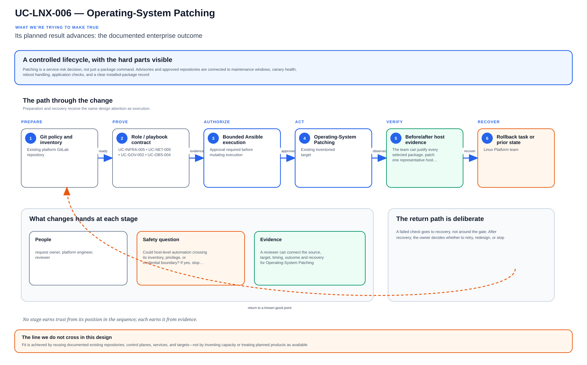

# UC-LNX-006: Operating-System Patching

Last verified: 2026-08-02

## Use-case record

| Field | Value |
| --- | --- |
| Portfolio | Enterprise Linux Systems Engineering Platform |
| Canonical coverage target | Assessed, scheduled and evidenced security updates |
| Delivery model | End-to-end infrastructure as code |
| Primary roles | Linux systems engineer, security engineer, service owner, SRE |
| Target environment | Linux hosts grouped by service tier and maintenance cohort |
| Current state | **Partially implemented. Patch assessment evidence exists; download/apply, reboot orchestration, service validation, and rollback proof are planned.** |
| Related change | None; implementation requires a future approved change record |
| Owner | Linux Platform team |

## Purpose

Patching is a service-risk decision, not just a package command. Advisories and approved repositories are connected to maintenance windows, canary health, reboot handling, application checks, and a clear installed-package record.

## Expected outcome

The team can justify every selected package, patch one representative host, verify service health after reboot, and expand by cohort. The report separates installed, excluded, failed, and deferred updates.

## Platform and enterprise fit

| Relationship | Detailed fit |
| --- | --- |
| Owning platform | **Operating-System Patching** belongs to the the documented enterprise outcome because that platform turns GitLab-reviewed standards through Jenkins approval and Terraform/image or AWX/Ansible execution into verified operating-system state. |
| Enterprise consumers | The capability supports the Linux foundation beneath provider, payer, database, Kubernetes, observability, and shared services. |
| Enterprise outcome | Its planned result advances: the documented enterprise outcome. |
| Control contribution | The design adds repeatability, least privilege, canary scope, idempotence, recovery, and host-level evidence. |
| Cross-platform handoff | Supporting platforms consume a reviewed result or evidence artifact; they do not take ownership away from the primary platform. |
| Infrastructure boundary | Fit is achieved by reusing documented existing repositories, control planes, services, and targets—not by inventing capacity or treating planned products as available. |

The platform fit is therefore based on ownership and a reusable decision, not
on the presence of a particular tool. Enterprise fit requires evidence that the
named outcome was observed for the bounded scope; completing documentation or
running an isolated technology demonstration is insufficient.

## Trigger and actors

| Item | Definition |
| --- | --- |
| Trigger | A reviewed patch window begins after vulnerability and service-impact assessment |
| Engineering owners | Linux systems engineer, security engineer, service owner, SRE |
| Approver | Confirms target, risk, window, plan, and recovery readiness |
| SRE/operations | Reviews health, alerts, evidence, incident linkage, and handoff |

## Preconditions

- The sequential change-control record authorizes this exact Linux component and no conflicting work is active.
- GitLab, the matching tagged runner, Jenkins, AWX, target inventory, DNS, and required observability paths are healthy.
- The target and canary are named explicitly; dynamic all-host execution is not the default.
- Credentials and sensitive variables are stored in approved secret systems and referenced by ID, never committed.
- Backup, snapshot, replacement, or other recovery evidence appropriate to the change exists before mutation.
- The selected Git SHA has passed all source, syntax, lint, policy, and secret gates.

## Scope and exclusions

**In scope:** Repository refresh, advisory classification, prechecks, staged update, reboot decision, service health, evidence, and exception management.

**Excluded:** Unapproved major-version upgrades, application releases, and blind update-all execution across the fleet.

## Architecture diagram

Advisory triage and a frozen package set lead to an Ansible canary and reboot gate, then host health and package evidence.

## IaC delivery model

| Layer | Ownership and control |
| --- | --- |
| GitLab | Authoritative source, merge request, protected branch, validation pipeline, immutable SHA, and artifacts |
| Jenkins | Operator-selected PLAN/CHECK/APPLY/ROLLBACK action, approval boundary, concurrency control, and evidence aggregation |
| Terraform/image automation | Owns VM, image, volume, network, and other infrastructure lifecycle only when the change touches those resources |
| AWX and Ansible | Own operating-system desired state, inventory targeting, check mode, serial rollout, and per-host job events |
| Observability and evidence | Health gates, logs, metrics, alerts, expected-versus-observed result, incident links, and acceptance record |

Current-source reality: roles/patch_assessment writes per-host available-update evidence under /var/tmp/linux-systems-platform.

## End-to-end implementation

### Code and configuration map

| State | Repository path | Responsibility |
| --- | --- | --- |
| Existing | `linux-systems-platform: roles/patch_assessment and playbooks/patch-assessment.yml` | Read-only available update assessment |
| Planned | `linux-systems-platform: roles/os_patching and playbooks/patch-apply.yml` | Precheck, download, update, reboot, and postcheck workflow |
| Planned | `linux-systems-platform: docs/runbooks/patching-runbook.md` | Window, exception, failure, and recovery procedure |

### Required variables and controls

| Variable/control | Example or constraint | Purpose |
| --- | --- | --- |
| `patch_advisory_scope` | security or approved IDs | Prevents uncontrolled package scope |
| `patch_cohort` | canary/batch/service tier | Controls rollout order |
| `reboot_policy` | never/if-required/window | Makes reboot behavior explicit |
| `max_failure_percentage` | approved threshold | Stops unsafe batch propagation |

### Delivery sequence

1. Collect package, advisory, kernel, uptime, disk, service, cluster, backup, and open-incident prechecks.
2. Resolve packages from approved repositories and generate the exact transaction preview.
3. Patch one non-redundant-aware canary or one member of a redundant service pair after owner approval.
4. Reboot only when policy and workload readiness permit; wait for SSH and guest-agent recovery.
5. Validate required services, ports, logs, monitoring, application probes, and the installed transaction.
6. Continue cohort by cohort, rerun assessment, and record exceptions with owner and due date.

## Code and configuration map

The table under **End-to-end implementation** is the implementation map required by the documentation contract. Paths marked `Existing` were observed in the current repository clone; paths marked `Planned` are design targets and must not be treated as completed source.

## Jira breakdown

### STORY-LNX-006-001: Implement and validate the source model

**Description:** The platform team keeps the inputs, roles or modules, tests, pipeline gates, and operating boundaries for Operating-System Patching in Git. A reviewer can reproduce the proposal from the selected commit without relying on settings that exist only in a console.

**Status:** In progress; bounded supporting source exists, but the full use-case source gate is not accepted.

**Acceptance criteria:**

- Required inputs have schemas/defaults, safe bounds, owners, and secret references.
- Local validation and GitLab CI reject malformed, unsafe, non-idempotent, or out-of-scope changes.
- The pipeline publishes the immutable Git SHA, plan/check artifacts, and exact target assumptions.

**Implementation steps:**

1. Collect package, advisory, kernel, uptime, disk, service, cluster, backup, and open-incident prechecks.
2. Resolve packages from approved repositories and generate the exact transaction preview.
3. Patch one non-redundant-aware canary or one member of a redundant service pair after owner approval.

**Completed work:** roles/patch_assessment writes per-host available-update evidence under /var/tmp/linux-systems-platform.

**Validation and rollback:** Run local and CI validation without runtime mutation. Roll back source by reverting the merge request and regenerating artifacts from the prior accepted revision.

**Required attachments:** `ART-LNX-006-001` and `ATT-LNX-006-001`.

### STORY-LNX-006-002: Execute the bounded canary and rollout

**Description:** The operator reviews PLAN or CHECK output against one named canary before applying Operating-System Patching. Failed health or negative tests stop the run, and expansion requires explicit approval.

**Status:** Planned; no runtime acceptance is claimed.

**Acceptance criteria:**

- Jenkins/AWX or Terraform uses the reviewed Git SHA, credential references, inventory, and explicit canary limit.
- Canary health and negative tests pass before any cohort expansion.
- Failure thresholds stop the workflow and preserve artifacts without hidden manual correction.

**Implementation steps:**

1. Reboot only when policy and workload readiness permit; wait for SSH and guest-agent recovery.
2. Validate required services, ports, logs, monitoring, application probes, and the installed transaction.
3. Continue cohort by cohort, rerun assessment, and record exceptions with owner and due date.

**Completed work:** The execution design is documented; a successful live canary is not yet recorded.

**Validation and rollback:** Transaction preview contains only approved packages and repositories; Canary returns with expected kernel and all service probes healthy; No critical alerts or failed systemd units remain. Use package history rollback only when supported and safe; otherwise boot the previous kernel or restore the affected VM/service from the tested recovery path. Stop the cohort on first unexplained failure.

**Required attachments:** `ART-LNX-006-002`, `ATT-LNX-006-002`, and `ATT-LNX-006-003`.

### STORY-LNX-006-003: Prove convergence, recovery, and handoff

**Description:** Operations accepts Operating-System Patching only after the same revision converges cleanly, runtime health is visible, and the recovery path has been exercised. The evidence must explain what moved, what stayed stable, and how the team recovered it.

**Status:** Planned; blocked until the canary story succeeds.

**Acceptance criteria:**

- Repeating the same reviewed code and inputs produces zero unexpected change.
- Rollback or recovery is exercised and the service returns within its approved objective.
- Logs, metrics, job output, expected-versus-observed results, owner, and follow-up actions are published.

**Implementation steps:**

1. Repeat the identical execution and compare the changed-host/task/resource set.
2. Exercise the documented rollback or recovery path on the bounded target.
3. Verify service health, monitoring, security posture, and consumer access after recovery.
4. Publish sanitized artifacts, link incidents, and obtain owner/SRE acceptance.

**Completed work:** Acceptance criteria and evidence requirements are defined; no use-case-specific runtime evidence is claimed.

**Validation and rollback:** Post-window assessment and second run show no pending approved updates or unintended changes. Use package history rollback only when supported and safe; otherwise boot the previous kernel or restore the affected VM/service from the tested recovery path. Stop the cohort on first unexplained failure.

**Required attachments:** `ART-LNX-006-003`, `ATT-LNX-006-004`, and `ATT-LNX-006-005`.

## Evidence and screenshot register

| ID | Required evidence | Source | Status |
| --- | --- | --- | --- |
| `ART-LNX-006-001` | CI validation, immutable SHA, and plan/check artifact | GitLab | Pending |
| `ATT-LNX-006-001` | Successful source pipeline overview | GitLab | Pending |
| `ART-LNX-006-002` | Canary execution log with target and changed set | Jenkins/AWX/Terraform | Pending |
| `ATT-LNX-006-002` | Canary job/build result | Jenkins or AWX | Pending |
| `ATT-LNX-006-003` | Runtime health and expected state | Approved CLI or dashboard | Pending |
| `ART-LNX-006-003` | Second convergence and rollback/recovery log | Control plane artifact | Pending |
| `ATT-LNX-006-004` | Recovery result | Control plane | Pending |
| `ATT-LNX-006-005` | Final accepted operating state | Dashboard or approved CLI | Pending |

## Expected versus current result

| Area | Expected | Current observation | Decision |
| --- | --- | --- | --- |
| Source | Complete IaC and pipeline for Operating-System Patching | roles/patch_assessment writes per-host available-update evidence under /var/tmp/linux-systems-platform. | Not yet code complete |
| Runtime | Approved canary and cohort execution | No use-case-specific accepted run recorded | Pending |
| Idempotence | Identical second run has zero unexpected change | No accepted second convergence | Pending |
| Recovery | Recovery exercised and timed | No accepted recovery artifact | Pending |
| Evidence | Sanitized artifacts linked to immutable executions | Register defined; captures pending | Pending |

## Validation, idempotence, and rollback

- Transaction preview contains only approved packages and repositories.
- Canary returns with expected kernel and all service probes healthy.
- No critical alerts or failed systemd units remain.
- Post-window assessment and second run show no pending approved updates or unintended changes.

**Rollback/recovery:** Use package history rollback only when supported and safe; otherwise boot the previous kernel or restore the affected VM/service from the tested recovery path. Stop the cohort on first unexplained failure.

Idempotence is proved by repeating the same reviewed revision, target, variables, and action after the first successful run. A green first run or an Ansible exit code of zero is insufficient when tasks still report unexplained changes.

## Troubleshooting guide

Primary scenario: **The host returns after reboot, but one service is active while its application health check fails.**

1. Stop cohort expansion and preserve the Git SHA, pipeline, Jenkins build, AWX job, Terraform plan/state reference, timestamps, and target list.
2. Confirm the failure is in source validation, orchestration, infrastructure, connectivity, privilege, desired-state execution, or consumer health before changing anything.
3. Compare desired inputs with live facts and the last accepted evidence; inspect logs and metrics around the exact execution window.
4. Reproduce only on the canary or in check/plan mode, change one hypothesis at a time, and avoid console drift.
5. Run the documented recovery path. Record any unexpected failure or near miss in the incident register before resuming.

## Interview preparation

1. **Question:** Explain the end-to-end IaC architecture for Operating-System Patching.
   **Answer signals:** Separate GitLab source gates, Jenkins approval, Terraform/image ownership where applicable, AWX/Ansible desired state, canary rollout, evidence, and rollback.

2. **Question:** Which inputs and target boundaries make operating-system patching safe to repeat and reuse?
   **Answer signals:** patch_advisory_scope, patch_cohort, reboot_policy, max_failure_percentage; immutable inputs, explicit target limits, deterministic tasks, and no hidden UI state.

3. **Question:** What would you require before approving the first production APPLY?
   **Answer signals:** Transaction preview contains only approved packages and repositories; Canary returns with expected kernel and all service probes healthy, a reviewed plan/check result, named owner, maintenance window, and recovery evidence.

4. **Question:** Troubleshooting scenario: The host returns after reboot, but one service is active while its application health check fails. What do you do first?
   **Answer signals:** Stop propagation, preserve job and host evidence, compare desired versus observed state, isolate the failing layer, test one hypothesis at a time, and link an incident when unexpected.

5. **Question:** How do you prove idempotence and distinguish it from a successful first run?
   **Answer signals:** Repeat the identical reviewed revision and inputs; expect zero unintended changes, stable health, and equivalent evidence rather than merely an exit code of zero.

6. **Question:** Describe the rollback or recovery strategy.
   **Answer signals:** Use package history rollback only when supported and safe; otherwise boot the previous kernel or restore the affected VM/service from the tested recovery path. Stop the cohort on first unexplained failure.

7. **Question:** What security and audit controls would you defend in an interview?
   **Answer signals:** Least privilege, protected branches, secret references, approval gates, bounded limits, immutable Git SHA, machine-readable artifacts, and sanitized evidence.

8. **Question:** What tradeoff would you discuss between patch velocity and service availability?
   **Answer signals:** State the business constraint, compare failure modes and recovery cost, choose a bounded default, measure the result, and document when the alternative is justified.

9. **Question:** Tell me about a time you owned a difficult Operating-System Patching change or incident across multiple teams. What did you do?
   **Answer signals:** Use a concise STAR example showing ownership, risk communication, evidence-based decisions, a safe stop or rollback, collaboration with service/security/SRE owners, measurable recovery or improvement, and a durable IaC correction.

## Safety and security controls

- Protected branches, merge requests, tagged runners, immutable revisions, and retained artifacts.
- Least-privilege credentials referenced from Jenkins/AWX or the approved secret system.
- PLAN/CHECK by default; APPLY/ROLLBACK requires explicit confirmation and exact target limits.
- Serial/canary rollout, failure thresholds, runtime health gates, and stop conditions.
- No protected health information, credentials, private keys, or unredacted secrets in logs or screenshots.

## Acceptance decision

UC-LNX-006 is **not yet accepted**. This page is the end-to-end IaC implementation and interview specification. Acceptance requires completed source, a passing GitLab pipeline, controlled execution, runtime health, a zero-change second convergence, exercised recovery, reviewed evidence, and publication on the canonical branch.
