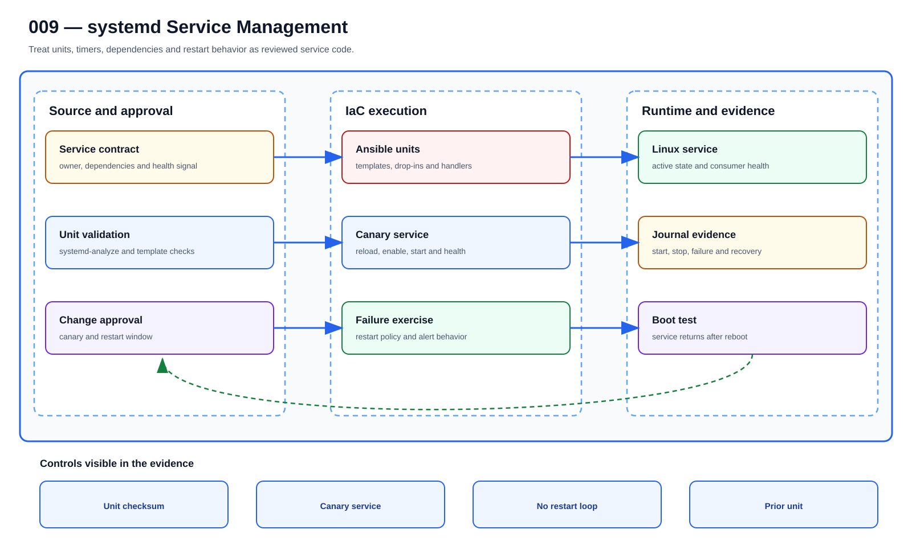

# UC-LNX-009: systemd Service Management

Last verified: 2026-08-02

## Use-case record

| Field | Value |
| --- | --- |
| Portfolio | Enterprise Linux Systems Engineering Platform |
| Canonical coverage target | Standard service ownership, health and recovery |
| Delivery model | End-to-end infrastructure as code |
| Primary roles | Linux systems engineer, application owner, SRE, security engineer |
| Target environment | Managed Linux services and timers on the existing VM fleet |
| Current state | **Partially scaffolded. Baseline checks required services, but source-managed units, overrides, health probes, failure injection, and rollback are planned.** |
| Related change | None; implementation requires a future approved change record |
| Owner | Linux Platform team |

## Purpose

A systemd unit is an operating contract: it says who runs a service, what it depends on, how it is limited, and how it recovers. Git keeps those choices reviewable and consistent across hosts.

## Expected outcome

A changed unit passes `systemd-analyze verify`, starts on one canary, survives restart and boot tests, and reports meaningful health. An unchanged unit does not reload or restart on the second run.

## Platform and enterprise fit

| Relationship | Detailed fit |
| --- | --- |
| Owning platform | **systemd Service Management** belongs to the the documented enterprise outcome because that platform turns GitLab-reviewed standards through Jenkins approval and Terraform/image or AWX/Ansible execution into verified operating-system state. |
| Enterprise consumers | The capability supports the Linux foundation beneath provider, payer, database, Kubernetes, observability, and shared services. |
| Enterprise outcome | Its planned result advances: the documented enterprise outcome. |
| Control contribution | The design adds repeatability, least privilege, canary scope, idempotence, recovery, and host-level evidence. |
| Cross-platform handoff | Supporting platforms consume a reviewed result or evidence artifact; they do not take ownership away from the primary platform. |
| Infrastructure boundary | Fit is achieved by reusing documented existing repositories, control planes, services, and targets—not by inventing capacity or treating planned products as available. |

The platform fit is therefore based on ownership and a reusable decision, not
on the presence of a particular tool. Enterprise fit requires evidence that the
named outcome was observed for the bounded scope; completing documentation or
running an isolated technology demonstration is insufficient.

## Trigger and actors

| Item | Definition |
| --- | --- |
| Trigger | A service unit, timer, dependency, resource limit, or recovery policy must change |
| Engineering owners | Linux systems engineer, application owner, SRE, security engineer |
| Approver | Confirms target, risk, maintenance window, evidence, and recovery readiness |
| SRE/operations | Reviews health, alerts, incidents, convergence, and handoff |

## Preconditions

- The sequential change record authorizes this exact use case and no conflicting infrastructure work is active.
- GitLab, tagged runners, Jenkins, AWX, inventory, DNS, and observability dependencies are healthy.
- Target and canary limits are explicit; credentials are referenced from approved secret systems.
- The selected Git SHA passed syntax, lint, policy, secret, and plan/check gates.
- Required backup, console, replacement, or recovery evidence exists before mutation.

## Scope and exclusions

**In scope:** Unit files, drop-ins, dependencies, ordering, environment references, sandboxing, restart policy, timers, daemon reload, health checks, and journal evidence.

**Excluded:** Secrets embedded in units, ad-hoc systemctl enable commands, and Kubernetes workload management.

## Architecture diagram

Unit source and ownership move through validation, canary deployment, and restart tests before systemd state and journal evidence are accepted.

## IaC delivery model

| Layer | Responsibility |
| --- | --- |
| GitLab | Source of truth, merge request, protected branch, CI gates, immutable SHA, and artifacts |
| Jenkins | Manual PLAN/CHECK/APPLY/ROLLBACK selection, approval, concurrency control, and evidence aggregation |
| Terraform/image automation | Infrastructure lifecycle only when the change affects VM, image, volume, or network resources |
| AWX and Ansible | OS desired state, check mode, inventory limit, serial rollout, and per-host events |
| Observability/evidence | Health gates, logs, metrics, incidents, expected-versus-observed result, and acceptance |

Current-source reality: roles/linux_baseline verifies required service state for chronyd, firewalld, and qemu-guest-agent.

## End-to-end implementation

### Code and configuration map

| State | Repository path | Responsibility |
| --- | --- | --- |
| Existing | `linux-systems-platform: roles/linux_baseline` | Required-service presence and health checks |
| Planned | `linux-systems-platform: roles/systemd_services` | Unit/drop-in deployment, daemon reload, enablement, and service health |
| Planned | `linux-systems-platform: playbooks/systemd-service.yml and tests/systemd` | Canary, failure injection, restart, timer, and evidence workflow |

### Required variables and controls

| Variable/control | Example or constraint | Purpose |
| --- | --- | --- |
| `systemd_unit_name` | approved service.service | Exact managed identity |
| `systemd_unit_checksum` | rendered content digest | Change and audit evidence |
| `systemd_restart_policy` | on-failure with bounds | Recovery without restart storms |
| `systemd_resource_limits` | CPU/memory/file limits | Host protection |

### Delivery sequence

1. Document owner, dependencies, ports, users, files, environment references, start order, stop behavior, and health signal.
2. Render units and drop-ins from templates; validate with systemd-analyze verify before deployment.
3. Deploy to one canary, run daemon-reload only on content change, enable/start through handlers, and wait for health.
4. Test restart, dependency failure, timeout, and boot persistence while monitoring journal and service metrics.
5. Expand by cohort and compare unit checksum, enablement, ActiveState/SubState, and consumer health.
6. Repeat the role for zero-change convergence and retain journal evidence from the controlled failure test.

## Code and configuration map

The implementation map above is authoritative for this detail page. `Existing` paths were observed in the current repository clone. `Planned` paths are IaC design targets and are not completion claims.

## Jira breakdown

### STORY-LNX-009-001: Implement and validate the source model

**Description:** The platform team keeps the inputs, roles or modules, tests, pipeline gates, and operating boundaries for systemd Service Management in Git. A reviewer can reproduce the proposal from the selected commit without relying on settings that exist only in a console.

**Status:** In progress where supporting source is listed; the complete source gate is not accepted.

**Acceptance criteria:**

- Inputs have schemas/defaults, safe bounds, owners, and secret references.
- CI rejects malformed, unsafe, non-idempotent, and out-of-scope changes.
- The pipeline publishes the immutable SHA, exact target assumptions, and plan/check artifact.

**Implementation steps:**

1. Document owner, dependencies, ports, users, files, environment references, start order, stop behavior, and health signal.
2. Render units and drop-ins from templates; validate with systemd-analyze verify before deployment.
3. Deploy to one canary, run daemon-reload only on content change, enable/start through handlers, and wait for health.

**Completed work:** roles/linux_baseline verifies required service state for chronyd, firewalld, and qemu-guest-agent.

**Validation and rollback:** Validate without mutation; revert the merge request and regenerate artifacts from the prior accepted revision if the source gate is wrong.

**Required attachments:** `ART-LNX-009-001` and `ATT-LNX-009-001`.

### STORY-LNX-009-002: Execute the bounded canary and rollout

**Description:** The operator reviews PLAN or CHECK output against one named canary before applying systemd Service Management. Failed health or negative tests stop the run, and expansion requires explicit approval.

**Status:** Planned; no live acceptance is claimed.

**Acceptance criteria:**

- Execution uses the reviewed SHA, credentials, inventory, variables, and canary limit.
- Health and negative tests pass before cohort expansion.
- Failure thresholds preserve artifacts and stop without hidden manual correction.

**Implementation steps:**

1. Test restart, dependency failure, timeout, and boot persistence while monitoring journal and service metrics.
2. Expand by cohort and compare unit checksum, enablement, ActiveState/SubState, and consumer health.
3. Repeat the role for zero-change convergence and retain journal evidence from the controlled failure test.

**Completed work:** The controlled execution design exists only in documentation.

**Validation and rollback:** systemd-analyze verify succeeds for every rendered unit; Canary unit is enabled, active, healthy, and uses the expected dependencies and limits; Controlled failure follows the approved restart/alert policy without looping. Restore the previous reviewed unit/drop-in, daemon-reload, restart only the affected service, and verify consumers. If new unit ownership is removed, disable it only after confirming no dependent service.

**Required attachments:** `ART-LNX-009-002`, `ATT-LNX-009-002`, and `ATT-LNX-009-003`.

### STORY-LNX-009-003: Prove convergence, recovery, and handoff

**Description:** Operations accepts systemd Service Management only after the same revision converges cleanly, runtime health is visible, and the recovery path has been exercised. The evidence must explain what moved, what stayed stable, and how the team recovered it.

**Status:** Planned; blocked until the canary story succeeds.

**Acceptance criteria:**

- Repeating identical code and inputs produces zero unexpected change.
- Recovery is exercised and service returns within the approved objective.
- Logs, metrics, job output, owner, expected-versus-observed result, and incidents are linked.

**Implementation steps:**

1. Repeat the identical execution and compare the changed set.
2. Exercise rollback or recovery on the bounded target.
3. Verify service health, monitoring, security posture, and consumer access.
4. Publish sanitized evidence and obtain owner/SRE acceptance.

**Completed work:** Acceptance and evidence requirements are defined; no runtime proof is claimed.

**Validation and rollback:** Second Ansible run has zero change and reboot validation restores the service. Restore the previous reviewed unit/drop-in, daemon-reload, restart only the affected service, and verify consumers. If new unit ownership is removed, disable it only after confirming no dependent service.

**Required attachments:** `ART-LNX-009-003`, `ATT-LNX-009-004`, and `ATT-LNX-009-005`.

## Evidence and screenshot register

| ID | Required evidence | Source | Status |
| --- | --- | --- | --- |
| `ART-LNX-009-001` | CI validation, immutable SHA, and plan/check artifact | GitLab | Pending |
| `ATT-LNX-009-001` | Successful source pipeline | GitLab | Pending |
| `ART-LNX-009-002` | Canary execution log and changed set | Jenkins/AWX/Terraform | Pending |
| `ATT-LNX-009-002` | Canary result | Control plane | Pending |
| `ATT-LNX-009-003` | Runtime health and expected state | Dashboard or approved CLI | Pending |
| `ART-LNX-009-003` | Second convergence and recovery log | Control plane | Pending |
| `ATT-LNX-009-004` | Recovery result | Control plane | Pending |
| `ATT-LNX-009-005` | Final accepted state | Dashboard or approved CLI | Pending |

## Expected versus current result

| Area | Expected | Current observation | Decision |
| --- | --- | --- | --- |
| Source | Complete IaC and pipeline for systemd Service Management | roles/linux_baseline verifies required service state for chronyd, firewalld, and qemu-guest-agent. | Not yet code complete |
| Runtime | Approved canary and cohort execution | No use-case-specific accepted run | Pending |
| Idempotence | Identical second run has zero unexpected change | No accepted convergence proof | Pending |
| Recovery | Recovery exercised and timed | No accepted recovery artifact | Pending |
| Evidence | Sanitized artifacts tied to immutable executions | Register defined; captures pending | Pending |

## Validation, idempotence, and rollback

- systemd-analyze verify succeeds for every rendered unit.
- Canary unit is enabled, active, healthy, and uses the expected dependencies and limits.
- Controlled failure follows the approved restart/alert policy without looping.
- Second Ansible run has zero change and reboot validation restores the service.

**Rollback/recovery:** Restore the previous reviewed unit/drop-in, daemon-reload, restart only the affected service, and verify consumers. If new unit ownership is removed, disable it only after confirming no dependent service.

Idempotence requires the same reviewed revision, target, variables, and action to produce zero unexplained changes plus stable consumer health. A green first run alone is insufficient.

## Troubleshooting guide

Primary scenario: **The unit is active, but it repeatedly restarts and consumers see intermittent failures.**

1. Stop propagation and retain the Git SHA, plan/check, execution IDs, timestamps, and target list.
2. Isolate source, orchestration, infrastructure, connectivity, privilege, host-state, and consumer-health layers.
3. Compare live facts with the intended variables and last accepted baseline; correlate logs and metrics to the execution window.
4. Reproduce only on the canary or in PLAN/CHECK, change one hypothesis, and avoid console drift.
5. Recover through the documented path and record unexpected failures or near misses in the incident register.

## Interview preparation

1. **Question:** Explain the end-to-end IaC architecture for systemd Service Management.
   **Answer signals:** Separate source validation, approval/orchestration, infrastructure ownership, AWX/Ansible desired state, runtime health, convergence, evidence, and recovery.

2. **Question:** How would you model systemd service management so repeated execution stays safe?
   **Answer signals:** systemd_unit_name, systemd_unit_checksum, systemd_restart_policy, systemd_resource_limits; stable identities, declarative state, handlers only on change, bounded targets, and explicit exclusions.

3. **Question:** What must be visible in a GitLab pipeline before runtime approval?
   **Answer signals:** systemd-analyze verify succeeds for every rendered unit; Canary unit is enabled, active, healthy, and uses the expected dependencies and limits; immutable SHA, lint/policy results, plan/check artifact, target assumptions, and no secret exposure.

4. **Question:** Troubleshooting scenario: The unit is active, but it repeatedly restarts and consumers see intermittent failures. What is your investigation order?
   **Answer signals:** Stop propagation, preserve timestamps and artifacts, verify target/input, isolate source/orchestration/connectivity/privilege/host/service layers, compare to baseline, and test on the canary.

5. **Question:** How do you prove idempotence rather than only success?
   **Answer signals:** Run the same reviewed SHA, inputs, target, and action again; require zero unexplained changes plus stable consumer health and evidence.

6. **Question:** What rollback or recovery would you use?
   **Answer signals:** Restore the previous reviewed unit/drop-in, daemon-reload, restart only the affected service, and verify consumers. If new unit ownership is removed, disable it only after confirming no dependent service.

7. **Question:** Which security and audit controls matter most?
   **Answer signals:** Least privilege, protected source, secret references, explicit approval, canary limits, negative tests, immutable artifacts, exception expiry, and incident linkage.

8. **Question:** Discuss the tradeoff between automatic restart resilience and masking persistent faults.
   **Answer signals:** Tie the choice to service objectives and failure modes, use a conservative default, measure on a canary, preserve recovery, and document exceptions.

9. **Question:** Tell me about a time you owned a difficult systemd Service Management change or incident across multiple teams. What did you do?
   **Answer signals:** Use a concise STAR example showing ownership, risk communication, evidence-based decisions, a safe stop or rollback, collaboration with service/security/SRE owners, measurable recovery or improvement, and a durable IaC correction.

## Safety and security controls

- Protected source, merge requests, tagged runners, immutable revisions, and retained artifacts.
- Least-privilege credentials referenced from approved secret systems.
- PLAN/CHECK by default; APPLY/ROLLBACK requires approval and exact target limits.
- Canary/serial rollout, failure thresholds, health gates, and stop conditions.
- No secrets, private keys, credentials, or protected health information in artifacts.

## Acceptance decision

UC-LNX-009 is **not yet accepted**. Acceptance requires implemented source, passing CI, controlled execution, runtime health, a zero-change second convergence, exercised recovery, reviewed evidence, and publication on the canonical branch.
