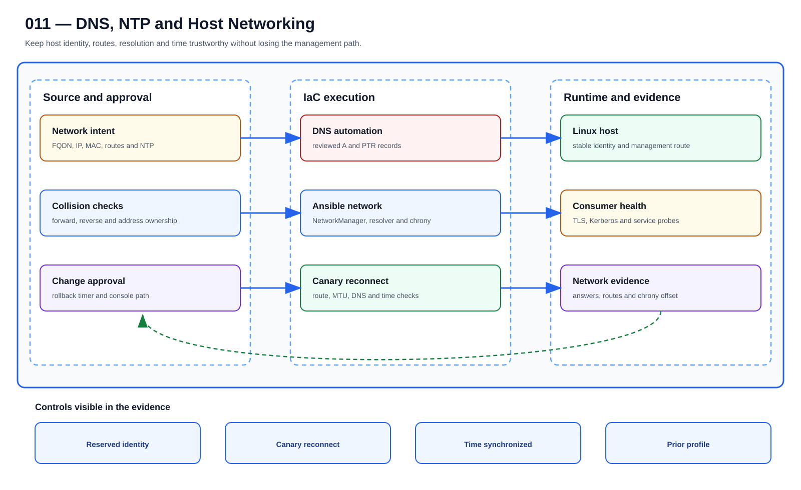

# UC-LNX-011: DNS, NTP and Host Networking

Last verified: 2026-08-02

## Use-case record

| Field | Value |
| --- | --- |
| Portfolio | Enterprise Linux Systems Engineering Platform |
| Supporting use cases | [UC-NET-005](../network/UC-NET-005-authoritative-and-recursive-dns.md), [UC-NET-024](../network/UC-NET-024-certificate-and-tls-routing.md), [UC-GOV-010](../governance/UC-GOV-010-certificate-expiry-monitoring.md), [UC-INFRA-005](../infrastructure/UC-INFRA-005-server-configuration-automation-using-ansible.md) |
| Canonical coverage target | Consistent infrastructure service configuration |
| Delivery model | End-to-end infrastructure as code |
| Primary roles | Linux network engineer, DNS administrator, SRE, service owner |
| Target environment | Managed Linux hosts, canonical DNS, routes, resolver, and chrony clients |
| Current state | **Partially implemented. Network/time assessment exists; source-enforced host network state and safe DNS integration are not accepted.** |
| Related change | None; implementation requires a future approved change record |
| Owner | Linux Platform team |

## Purpose

DNS, time, routes, and interfaces form one dependency chain even when different teams own them. The workflow validates that chain and protects the management path before applying network state.

## Expected outcome

The canary keeps management access, resolves forward and reverse records, follows intended routes, and stays within the allowed clock offset. Failure restores the previous known-good profile.

## Platform and enterprise fit

| Relationship | Detailed fit |
| --- | --- |
| Owning platform | **DNS, NTP and Host Networking** belongs to the the documented enterprise outcome because that platform turns GitLab-reviewed standards through Jenkins approval and Terraform/image or AWX/Ansible execution into verified operating-system state. |
| Enterprise consumers | The capability supports the Linux foundation beneath provider, payer, database, Kubernetes, observability, and shared services. |
| Enterprise outcome | Its planned result advances: the documented enterprise outcome. |
| Control contribution | The design adds repeatability, least privilege, canary scope, idempotence, recovery, and host-level evidence. |
| Cross-platform handoff | Supporting platforms consume a reviewed result or evidence artifact; they do not take ownership away from the primary platform. |
| Infrastructure boundary | Fit is achieved by reusing documented existing repositories, control planes, services, and targets—not by inventing capacity or treating planned products as available. |

The platform fit is therefore based on ownership and a reusable decision, not
on the presence of a particular tool. Enterprise fit requires evidence that the
named outcome was observed for the bounded scope; completing documentation or
running an isolated technology demonstration is insufficient.

## Trigger and actors

| Item | Definition |
| --- | --- |
| Trigger | A host, resolver, route, interface, or time-source requirement changes |
| Engineering owners | Linux network engineer, DNS administrator, SRE, service owner |
| Approver | Confirms target, risk, maintenance window, evidence, and recovery readiness |
| SRE/operations | Reviews health, alerts, incidents, convergence, and handoff |

## Preconditions

- The sequential change record authorizes this exact use case and no conflicting infrastructure work is active.
- GitLab, tagged runners, Jenkins, AWX, inventory, DNS, and observability dependencies are healthy.
- Target and canary limits are explicit; credentials are referenced from approved secret systems.
- The selected Git SHA passed syntax, lint, policy, secret, and plan/check gates.
- Required backup, console, replacement, or recovery evidence exists before mutation.

## Scope and exclusions

**In scope:** FQDN, resolver search/order, routes, interface profiles, DNS records, chrony sources, synchronization, connectivity probes, and rollback.

**Excluded:** Network appliance firmware, Kubernetes CNI policy, unreviewed DNS UI edits, and changing management routes without console recovery.

## Architecture context

DNS, NTP and Host Networking is evaluated inside the existing enterprise lab and the owning
platform's current source-control and execution boundaries. The architectural
unit is the governed outcome—**Consistent infrastructure service configuration**—rather than a new product or
environment.

| Context element | Architecture statement |
| --- | --- |
| Business and operational setting | Enterprise consumers: Enterprise Linux Systems Engineering Platform. The result must be explainable, repeatable, and owned. |
| Current state | **Partially implemented. Network/time assessment exists; source-enforced host network state and safe DNS integration are not accepted.** |
| Desired state | A reviewed contract drives a bounded result, machine-readable evidence, and a safe stop or recovery decision. |
| Existing target boundary | Managed Linux hosts, canonical DNS, routes, resolver, and chrony clients |
| Infrastructure constraint | Use existing GitLab, Jenkins, AWX, libvirt, and inventoried hosts; no VM, IP, product, or capacity is authorized by this page |
| Accountable platform owner | Linux Platform team; the consuming service, data, security, or workflow owner remains accountable for accepting business impact. |

The page owns the contract, control logic, evidence, and recovery behavior for
DNS, NTP and Host Networking. It does not absorb the responsibilities of the dependency use cases
listed below.

## Architecture diagram

Read this one left to right. The upper line follows a reviewed change toward a provable outcome; the lower branch shows who can stop it and how the team returns to a known release.

## IaC delivery model

| Layer | Responsibility |
| --- | --- |
| GitLab | Source of truth, merge request, protected branch, CI gates, immutable SHA, and artifacts |
| Jenkins | Manual PLAN/CHECK/APPLY/ROLLBACK selection, approval, concurrency control, and evidence aggregation |
| Terraform/image automation | Infrastructure lifecycle only when the change affects VM, image, volume, or network resources |
| AWX and Ansible | OS desired state, check mode, inventory limit, serial rollout, and per-host events |
| Observability/evidence | Health gates, logs, metrics, incidents, expected-versus-observed result, and acceptance |

Current-source reality: roles/network_time records DNS, route, interface, and chrony evidence for existing hosts.

## End-to-end implementation

### Code and configuration map

| State | Repository path | Responsibility |
| --- | --- | --- |
| Existing | `linux-systems-platform: roles/network_time and playbooks/network-time-assessment.yml` | Read-only host networking, resolver, route, and time evidence |
| Planned | `linux-systems-platform: roles/host_network and roles/time_sync` | NetworkManager and chrony desired state |
| Planned | `cloud-infra-automation-platform: ansible/roles/bind_dns and inventories` | Canonical A/PTR lifecycle integrated with host changes |

### Required variables and controls

| Variable/control | Example or constraint | Purpose |
| --- | --- | --- |
| `host_fqdn_ipv4` | canonical name/address pair | Identity and DNS contract |
| `dns_servers` | 192.168.1.106 | Approved resolver list |
| `network_routes` | explicit destination/gateway/metric | Deterministic routing |
| `chrony_sources` | approved NTP sources | Time integrity |

### Delivery sequence

1. Record current connection profiles, routes, resolver, DNS forward/reverse answers, chrony sources, offset, and management path.
2. Validate proposed address/MAC/DNS reservations and detect duplicate identity before applying host state.
3. Render NetworkManager and chrony configuration as Ansible data with a rollback timeout or console path.
4. Apply to one canary, wait for reconnection, and verify authoritative DNS, recursive resolution, routes, MTU, latency, and NTP synchronization.
5. Run service-consumer probes and confirm logs/certificates retain correct time and hostname.
6. Expand by cohort and rerun assessment and desired-state roles for convergence.

## Dependencies and handoffs

DNS, NTP and Host Networking remains accountable to its primary platform. The dependencies below
provide explicit contracts or assurance evidence; they do not become alternate owners.

| Relationship | Use case | Required handoff | Failure propagation |
| --- | --- | --- | --- |
| Required upstream contract | [UC-NET-005: Authoritative and Recursive DNS](../network/UC-NET-005-authoritative-and-recursive-dns.md) | authoritative name, resolver path, and expected DNS answer | Missing, stale, or failed evidence blocks promotion or runtime action. |
| Required upstream contract | [UC-NET-024: Certificate and TLS Routing](../network/UC-NET-024-certificate-and-tls-routing.md) | certificate identity, TLS route, and expiry state | Missing, stale, or failed evidence blocks promotion or runtime action. |
| Coordinated assurance handoff | [UC-GOV-010: Certificate Expiry Monitoring](../governance/UC-GOV-010-certificate-expiry-monitoring.md) | certificate-expiry evidence and response ownership | Missing, stale, or failed evidence blocks promotion or runtime action. |
| Coordinated assurance handoff | [UC-INFRA-005: Server Configuration Automation Using Ansible](../infrastructure/UC-INFRA-005-server-configuration-automation-using-ansible.md) | server configuration source and bounded Ansible execution | Missing, stale, or failed evidence blocks promotion or runtime action. |

Before DNS, NTP and Host Networking is implemented, every handoff must resolve to an immutable
revision and machine-readable artifact. A URL, screenshot, or verbal approval
alone is not sufficient dependency evidence.

## Quality attributes

For DNS, NTP and Host Networking, quality is measured against the bounded enterprise outcome—not
document length or a green job. Unapproved business thresholds remain explicit
decisions and must not be invented.

| Attribute | Required measure or invariant | Decision state |
| --- | --- | --- |
| Functional correctness | Every required input is validated; **Consistent infrastructure service configuration** is evaluated against positive, negative, missing-input, and unauthorized-scope cases. | Fixed design requirement |
| Performance and scale | Establish a baseline for convergence time, idempotence, service health, and configuration drift on existing capacity; the owner must approve warning and blocking thresholds before runtime promotion. | Thresholds `TBD` before implementation |
| Reliability | Missing prerequisites, stale dependencies, malformed evidence, and partial results fail closed without widening scope. | Fixed design requirement |
| Recovery | Record the maximum acceptable interruption and recovery time before runtime use; source-only validation must remain zero-change. | Owner decision required before runtime exercise |
| Observability | Emit use-case ID, revision, target, executor, start/end time, duration, decision, reason code, and recovery reference. | Required in the result schema |
| Evidence retention | Assign classification, retention period, and deletion owner before storing runtime evidence. | Security/compliance decision required |

Load, latency, availability, retention, RTO, and RPO values for DNS, NTP and Host Networking become
requirements only after the named service or business owner approves them. Until
then, the implementation gate records them as unresolved instead of quietly
choosing defaults.

## Security and privacy architecture

The DNS, NTP and Host Networking design separates source validation, privileged execution, target
access, and evidence review. Those boundaries remain in force even when one
engineer can access more than one system.

| Trust boundary | Allowed flow | Required control |
| --- | --- | --- |
| Contributor → GitLab | Reviewed source, contract, and synthetic/sanitized fixtures | Protected branch rules, peer review, secret scanning, and immutable commit identity |
| GitLab runner → result artifact | Read-only evaluation inputs and machine-readable output | No target-changing credential; pinned tool versions; artifact checksum and expiry |
| Approval plane → executor | Approved revision, target allowlist, mode, canary, and change reference | Separate authorization through the existing Jenkins/AWX or platform control path |
| Executor → existing target | Minimum commands or API operations required for DNS, NTP and Host Networking | Least-privilege identity, explicit target limit, timeout, and stop condition |
| Target → evidence store | Sanitized metadata, measurements, decision, and recovery result | Exclude credentials, tokens, private keys, kubeconfigs, packet payloads, PHI, PII, and unrelated records |

For DNS, NTP and Host Networking, the primary threat is **host-level automation crossing its inventory, privilege, or credential boundary**. The mandatory response is
AWX inventory limits, purpose-specific credentials, check mode, canaries, protected variables, and exact rollback tasks. Authentication and authorization mappings must name
the existing identity source, principal or service account, permitted actions,
credential owner, rotation path, and emergency revocation procedure before a
runtime story can move beyond `Planned`.

## Architecture decisions and trade-offs

| Decision | Selected architecture | Alternative deferred or rejected | Rationale and status |
| --- | --- | --- | --- |
| First implementation slice | Contract, schema, fixtures, and read-only evidence on the existing GitLab runner | Product installation or broad runtime rollout | Proves behavior without expanding infrastructure; **approved design direction** |
| Runtime execution | Use only AWX controlled execution when current inventory and change approval confirm it is available | Direct operator changes or credentials in CI | Preserves separation of duties; **conditional on implementation review** |
| Evidence | Machine-readable result is authoritative; screenshots are optional supporting material | Screenshot-only acceptance | Enables repeatable audit and automated gates; **approved design direction** |
| Failure handling | Fail closed, preserve bounded diagnostics, and recover only the named scope | Continue with partial or stale evidence | Prevents false success and hidden blast radius; **approved design direction** |
| New capacity or product | Stop and raise a separate architecture decision | Silently add a VM, service, cloud dependency, or cluster add-on | Maintains the existing-lab constraint; **mandatory** |

### Open decisions before implementation

| Open decision | Decision owner | Resolution gate |
| --- | --- | --- |
| Exact inventory object and first canary | Platform owner plus consuming service/data owner | Must resolve before the implementation story leaves `Planned` |
| Performance, scale, and reliability thresholds | Service owner and SRE | Must be recorded before a runtime acceptance run |
| Identity-to-action authorization matrix | Platform owner and security reviewer | Must be approved before target credentials are attached |
| Evidence classification and retention | Data/security owner | Must be approved before runtime artifacts are retained |

If any selected approach changes, record the rationale beside UC-LNX-011 in
the implementation repository before code review. A documentation edit alone
does not approve the new architecture.

## Implementation design

The existing Linux code/configuration map remains authoritative; extend its named role and playbook rather than creating parallel automation.

| Planned source responsibility | Exact planned location |
| --- | --- |
| Use-case contract and target allowlist | `midhhealth/platform-engineering/linux-systems-platform/contracts/uc-lnx-011.yaml` |
| Primary implementation | `midhhealth/platform-engineering/linux-systems-platform/roles/dns-ntp-host-networking/tasks/main.yml`; entry point: the page's named Ansible role and verification tasks |
| Machine-readable result schema | `midhhealth/platform-engineering/linux-systems-platform/schemas/uc-lnx-011-result.schema.json` |
| Positive, negative, malformed, and recovery fixtures | `midhhealth/platform-engineering/linux-systems-platform/tests/fixtures/uc-lnx-011/` |
| GitLab source gate | `midhhealth/platform-engineering/linux-systems-platform/.gitlab/ci/uc-lnx-011.yml` |
| Operator diagnosis and recovery | `midhhealth/platform-engineering/linux-systems-platform/docs/runbooks/uc-lnx-011.md` |

### Delivery stages

1. **Contract:** add the contract, schema, owners, dependency revisions, target
   allowlist, modes, reason codes, and open-decision values.
2. **Source validation:** lint exact paths, validate schema compatibility, scan
   for sensitive content, and run every fixture on the existing runner.
3. **Read-only proof:** execute the page's named Ansible role and verification tasks, publish a checksummed result, and
   prove that blocked cases cannot reach a mutating path.
4. **Bounded execution:** only after separate approval, pass the immutable
   revision, target, mode, canary, and change ID to AWX controlled execution.
5. **Independent verification:** measure the expected result, confirm unrelated
   state is unchanged, run recovery or zero-change proof, and obtain owner
   review.

The implementation merge request must link this page, the dependency artifacts,
the decision values above, and the eventual pipeline/job/run identifiers. Code
completion alone cannot promote the page to runtime verified.

## Code and configuration map

The implementation map above is authoritative for this detail page. `Existing` paths were observed in the current repository clone. `Planned` paths are IaC design targets and are not completion claims.

## Jira breakdown

### STORY-LNX-011-001: Implement and validate the source model

**Description:** The platform team keeps the inputs, roles or modules, tests, pipeline gates, and operating boundaries for DNS, NTP and Host Networking in Git. A reviewer can reproduce the proposal from the selected commit without relying on settings that exist only in a console.

**Status:** In progress where supporting source is listed; the complete source gate is not accepted.

**Acceptance criteria:**

- Inputs have schemas/defaults, safe bounds, owners, and secret references.
- CI rejects malformed, unsafe, non-idempotent, and out-of-scope changes.
- The pipeline publishes the immutable SHA, exact target assumptions, and plan/check artifact.

**Implementation steps:**

1. Record current connection profiles, routes, resolver, DNS forward/reverse answers, chrony sources, offset, and management path.
2. Validate proposed address/MAC/DNS reservations and detect duplicate identity before applying host state.
3. Render NetworkManager and chrony configuration as Ansible data with a rollback timeout or console path.

**Completed work:** roles/network_time records DNS, route, interface, and chrony evidence for existing hosts.

**Validation and rollback:** Validate without mutation; revert the merge request and regenerate artifacts from the prior accepted revision if the source gate is wrong.

**Required attachments:** `ART-LNX-011-001` and `ATT-LNX-011-001`.

### STORY-LNX-011-002: Execute the bounded canary and rollout

**Description:** The operator reviews PLAN or CHECK output against one named canary before applying DNS, NTP and Host Networking. Failed health or negative tests stop the run, and expansion requires explicit approval.

**Status:** Planned; no live acceptance is claimed.

**Acceptance criteria:**

- Execution uses the reviewed SHA, credentials, inventory, variables, and canary limit.
- Health and negative tests pass before cohort expansion.
- Failure thresholds preserve artifacts and stop without hidden manual correction.

**Implementation steps:**

1. Apply to one canary, wait for reconnection, and verify authoritative DNS, recursive resolution, routes, MTU, latency, and NTP synchronization.
2. Run service-consumer probes and confirm logs/certificates retain correct time and hostname.
3. Expand by cohort and rerun assessment and desired-state roles for convergence.

**Completed work:** The controlled execution design exists only in documentation.

**Validation and rollback:** Forward and reverse DNS return the approved identity; Management route and resolver remain reachable after canary apply; chronyc reports synchronized state and acceptable offset. Restore the previous NetworkManager profile, routes, resolver, chrony config, and DNS revision through automation. Use console recovery if management connectivity is lost.

**Required attachments:** `ART-LNX-011-002`, `ATT-LNX-011-002`, and `ATT-LNX-011-003`.

### STORY-LNX-011-003: Prove convergence, recovery, and handoff

**Description:** Operations accepts DNS, NTP and Host Networking only after the same revision converges cleanly, runtime health is visible, and the recovery path has been exercised. The evidence must explain what moved, what stayed stable, and how the team recovered it.

**Status:** Planned; blocked until the canary story succeeds.

**Acceptance criteria:**

- Repeating identical code and inputs produces zero unexpected change.
- Recovery is exercised and service returns within the approved objective.
- Logs, metrics, job output, owner, expected-versus-observed result, and incidents are linked.

**Implementation steps:**

1. Repeat the identical execution and compare the changed set.
2. Exercise rollback or recovery on the bounded target.
3. Verify service health, monitoring, security posture, and consumer access.
4. Publish sanitized evidence and obtain owner/SRE acceptance.

**Completed work:** Acceptance and evidence requirements are defined; no runtime proof is claimed.

**Validation and rollback:** Second run reports zero change and consumer probes remain healthy. Restore the previous NetworkManager profile, routes, resolver, chrony config, and DNS revision through automation. Use console recovery if management connectivity is lost.

**Required attachments:** `ART-LNX-011-003`, `ATT-LNX-011-004`, and `ATT-LNX-011-005`.

## Evidence and screenshot register

| ID | Required evidence | Source | Status |
| --- | --- | --- | --- |
| `ART-LNX-011-001` | CI validation, immutable SHA, and plan/check artifact | GitLab | Pending |
| `ATT-LNX-011-001` | Successful source pipeline | GitLab | Pending |
| `ART-LNX-011-002` | Canary execution log and changed set | Jenkins/AWX/Terraform | Pending |
| `ATT-LNX-011-002` | Canary result | Control plane | Pending |
| `ATT-LNX-011-003` | Runtime health and expected state | Dashboard or approved CLI | Pending |
| `ART-LNX-011-003` | Second convergence and recovery log | Control plane | Pending |
| `ATT-LNX-011-004` | Recovery result | Control plane | Pending |
| `ATT-LNX-011-005` | Final accepted state | Dashboard or approved CLI | Pending |

## Expected versus current result

| Area | Expected | Current observation | Decision |
| --- | --- | --- | --- |
| Source | Complete IaC and pipeline for DNS, NTP and Host Networking | roles/network_time records DNS, route, interface, and chrony evidence for existing hosts. | Not yet code complete |
| Runtime | Approved canary and cohort execution | No use-case-specific accepted run | Pending |
| Idempotence | Identical second run has zero unexpected change | No accepted convergence proof | Pending |
| Recovery | Recovery exercised and timed | No accepted recovery artifact | Pending |
| Evidence | Sanitized artifacts tied to immutable executions | Register defined; captures pending | Pending |

## Validation, idempotence, and rollback

- Forward and reverse DNS return the approved identity.
- Management route and resolver remain reachable after canary apply.
- chronyc reports synchronized state and acceptable offset.
- Second run reports zero change and consumer probes remain healthy.

**Rollback/recovery:** Restore the previous NetworkManager profile, routes, resolver, chrony config, and DNS revision through automation. Use console recovery if management connectivity is lost.

Idempotence requires the same reviewed revision, target, variables, and action to produce zero unexplained changes plus stable consumer health. A green first run alone is insufficient.

## Troubleshooting guide

Primary scenario: **The host is reachable by IP after the change, but TLS and Kerberos consumers fail intermittently.**

1. Stop propagation and retain the Git SHA, plan/check, execution IDs, timestamps, and target list.
2. Isolate source, orchestration, infrastructure, connectivity, privilege, host-state, and consumer-health layers.
3. Compare live facts with the intended variables and last accepted baseline; correlate logs and metrics to the execution window.
4. Reproduce only on the canary or in PLAN/CHECK, change one hypothesis, and avoid console drift.
5. Recover through the documented path and record unexpected failures or near misses in the incident register.

## Interview preparation

1. **Question:** Explain the end-to-end IaC architecture for DNS, NTP and Host Networking.
   **Answer signals:** Separate source validation, approval/orchestration, infrastructure ownership, AWX/Ansible desired state, runtime health, convergence, evidence, and recovery.

2. **Question:** How would you model DNS, NTP, and host networking so repeated execution stays safe?
   **Answer signals:** host_fqdn_ipv4, dns_servers, network_routes, chrony_sources; stable identities, declarative state, handlers only on change, bounded targets, and explicit exclusions.

3. **Question:** What must be visible in a GitLab pipeline before runtime approval?
   **Answer signals:** Forward and reverse DNS return the approved identity; Management route and resolver remain reachable after canary apply; immutable SHA, lint/policy results, plan/check artifact, target assumptions, and no secret exposure.

4. **Question:** Troubleshooting scenario: The host is reachable by IP after the change, but TLS and Kerberos consumers fail intermittently. What is your investigation order?
   **Answer signals:** Stop propagation, preserve timestamps and artifacts, verify target/input, isolate source/orchestration/connectivity/privilege/host/service layers, compare to baseline, and test on the canary.

5. **Question:** How do you prove idempotence rather than only success?
   **Answer signals:** Run the same reviewed SHA, inputs, target, and action again; require zero unexplained changes plus stable consumer health and evidence.

6. **Question:** What rollback or recovery would you use?
   **Answer signals:** Restore the previous NetworkManager profile, routes, resolver, chrony config, and DNS revision through automation. Use console recovery if management connectivity is lost.

7. **Question:** Which security and audit controls matter most?
   **Answer signals:** Least privilege, protected source, secret references, explicit approval, canary limits, negative tests, immutable artifacts, exception expiry, and incident linkage.

8. **Question:** Discuss the tradeoff between central network consistency and protection of management connectivity.
   **Answer signals:** Tie the choice to service objectives and failure modes, use a conservative default, measure on a canary, preserve recovery, and document exceptions.

9. **Question:** Tell me about a time you owned a difficult DNS, NTP and Host Networking change or incident across multiple teams. What did you do?
   **Answer signals:** Use a concise STAR example showing ownership, risk communication, evidence-based decisions, a safe stop or rollback, collaboration with service/security/SRE owners, measurable recovery or improvement, and a durable IaC correction.

## Safety and security controls

- Protected source, merge requests, tagged runners, immutable revisions, and retained artifacts.
- Least-privilege credentials referenced from approved secret systems.
- PLAN/CHECK by default; APPLY/ROLLBACK requires approval and exact target limits.
- Canary/serial rollout, failure thresholds, health gates, and stop conditions.
- No secrets, private keys, credentials, or protected health information in artifacts.

## Acceptance decision

UC-LNX-011 is **not yet accepted**. Acceptance requires implemented source, passing CI, controlled execution, runtime health, a zero-change second convergence, exercised recovery, reviewed evidence, and publication on the canonical branch.
