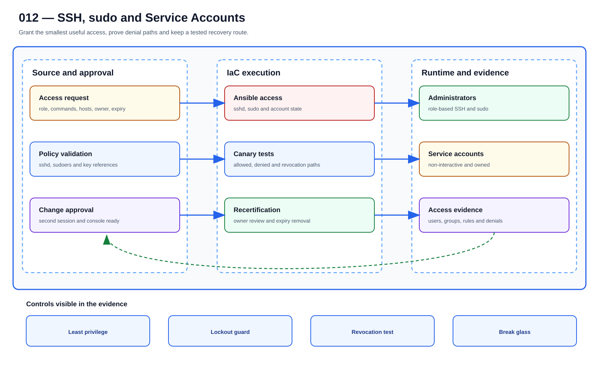

# UC-LNX-012: SSH, sudo and Service Accounts

Last verified: 2026-08-02

## Use-case record

| Field | Value |
| --- | --- |
| Portfolio | Enterprise Linux Systems Engineering Platform |
| Canonical coverage target | Least-privilege administrative access |
| Delivery model | End-to-end infrastructure as code |
| Primary roles | Linux security engineer, identity engineer, service owner, compliance reviewer |
| Target environment | Administrative and non-interactive access on all managed Linux hosts |
| Current state | **Partially implemented. Access-review evidence exists; lifecycle enforcement, certificate-based SSH, service-account controls, and revocation drills are planned.** |
| Related change | None; implementation requires a future approved change record |
| Owner | Linux Platform team |

## Purpose

Host access needs an owner, a reason, a scope, and an end date. SSH, sudo, service identities, key references, and recertification data are managed together so removal does not leave a hidden back door.

## Expected outcome

An approved identity performs only named actions on intended hosts, while unauthorized access is denied and logged. Current account, key, sudo, and ownership evidence remains reviewable.

## Platform and enterprise fit

| Relationship | Detailed fit |
| --- | --- |
| Owning platform | **SSH, sudo and Service Accounts** belongs to the the documented enterprise outcome because that platform turns GitLab-reviewed standards through Jenkins approval and Terraform/image or AWX/Ansible execution into verified operating-system state. |
| Enterprise consumers | The capability supports the Linux foundation beneath provider, payer, database, Kubernetes, observability, and shared services. |
| Enterprise outcome | Its planned result advances: the documented enterprise outcome. |
| Control contribution | The design adds repeatability, least privilege, canary scope, idempotence, recovery, and host-level evidence. |
| Cross-platform handoff | Supporting platforms consume a reviewed result or evidence artifact; they do not take ownership away from the primary platform. |
| Infrastructure boundary | Fit is achieved by reusing documented existing repositories, control planes, services, and targets—not by inventing capacity or treating planned products as available. |

The platform fit is therefore based on ownership and a reusable decision, not
on the presence of a particular tool. Enterprise fit requires evidence that the
named outcome was observed for the bounded scope; completing documentation or
running an isolated technology demonstration is insufficient.

## Trigger and actors

| Item | Definition |
| --- | --- |
| Trigger | An approved access request, role change, service onboarding, or access recertification occurs |
| Engineering owners | Linux security engineer, identity engineer, service owner, compliance reviewer |
| Approver | Confirms target, risk, maintenance window, evidence, and recovery readiness |
| SRE/operations | Reviews health, alerts, incidents, convergence, and handoff |

## Preconditions

- The sequential change record authorizes this exact use case and no conflicting infrastructure work is active.
- GitLab, tagged runners, Jenkins, AWX, inventory, DNS, and observability dependencies are healthy.
- Target and canary limits are explicit; credentials are referenced from approved secret systems.
- The selected Git SHA passed syntax, lint, policy, secret, and plan/check gates.
- Required backup, console, replacement, or recovery evidence exists before mutation.

## Scope and exclusions

**In scope:** sshd policy, authorized access sources, sudo rules, service accounts, shells, key/certificate lifecycle, ownership, expiry, recertification, and evidence.

**Excluded:** Personal private keys in Git, shared human accounts, unrestricted NOPASSWD ALL, and identity-provider configuration owned by UC-LNX-021.

## Architecture diagram

An identity request becomes SSH, sudo, and service-account policy, tested for allowed and denied behavior before access-review evidence is published.

## IaC delivery model

| Layer | Responsibility |
| --- | --- |
| GitLab | Source of truth, merge request, protected branch, CI gates, immutable SHA, and artifacts |
| Jenkins | Manual PLAN/CHECK/APPLY/ROLLBACK selection, approval, concurrency control, and evidence aggregation |
| Terraform/image automation | Infrastructure lifecycle only when the change affects VM, image, volume, or network resources |
| AWX and Ansible | OS desired state, check mode, inventory limit, serial rollout, and per-host events |
| Observability/evidence | Health gates, logs, metrics, incidents, expected-versus-observed result, and acceptance |

Current-source reality: roles/access_controls reviews accounts, shells, sudo, and access posture.

## End-to-end implementation

### Code and configuration map

| State | Repository path | Responsibility |
| --- | --- | --- |
| Existing | `linux-systems-platform: roles/access_controls and playbooks/access-review.yml` | Read-only SSH, sudo, user, and service-account evidence |
| Planned | `linux-systems-platform: roles/access_state` | sshd, sudoers fragments, local break-glass, and service-account desired state |
| Planned | `linux-systems-platform: playbooks/access-change.yml and playbooks/access-recertify.yml` | Canary, lockout protection, revocation, and review workflow |

### Required variables and controls

| Variable/control | Example or constraint | Purpose |
| --- | --- | --- |
| `ssh_auth_source` | certificate or approved key reference | Central lifecycle |
| `sudo_role_rules` | command-scoped policy | Least privilege |
| `service_account_owner` | named team and application | Accountability |
| `account_expiry` | reviewed date or non-expiring rationale | Lifecycle control |

### Delivery sequence

1. Map human roles, service identities, commands, hosts, ownership, expiry, and emergency access before changing policy.
2. Validate sshd configuration and sudoers fragments offline; test a second privileged session before closing the first.
3. Deploy to one canary with console recovery available and confirm allowed and denied access paths.
4. Create service accounts without interactive shells unless justified; retrieve secrets/keys from approved systems.
5. Run access recertification and revoke expired access through reviewed source.
6. Repeat the role and publish users, groups, sudo, sshd, key/certificate, and denial evidence.

## Code and configuration map

The implementation map above is authoritative for this detail page. `Existing` paths were observed in the current repository clone. `Planned` paths are IaC design targets and are not completion claims.

## Jira breakdown

### STORY-LNX-012-001: Implement and validate the source model

**Description:** The platform team keeps the inputs, roles or modules, tests, pipeline gates, and operating boundaries for SSH, sudo and Service Accounts in Git. A reviewer can reproduce the proposal from the selected commit without relying on settings that exist only in a console.

**Status:** In progress where supporting source is listed; the complete source gate is not accepted.

**Acceptance criteria:**

- Inputs have schemas/defaults, safe bounds, owners, and secret references.
- CI rejects malformed, unsafe, non-idempotent, and out-of-scope changes.
- The pipeline publishes the immutable SHA, exact target assumptions, and plan/check artifact.

**Implementation steps:**

1. Map human roles, service identities, commands, hosts, ownership, expiry, and emergency access before changing policy.
2. Validate sshd configuration and sudoers fragments offline; test a second privileged session before closing the first.
3. Deploy to one canary with console recovery available and confirm allowed and denied access paths.

**Completed work:** roles/access_controls reviews accounts, shells, sudo, and access posture.

**Validation and rollback:** Validate without mutation; revert the merge request and regenerate artifacts from the prior accepted revision if the source gate is wrong.

**Required attachments:** `ART-LNX-012-001` and `ATT-LNX-012-001`.

### STORY-LNX-012-002: Execute the bounded canary and rollout

**Description:** The operator reviews PLAN or CHECK output against one named canary before applying SSH, sudo and Service Accounts. Failed health or negative tests stop the run, and expansion requires explicit approval.

**Status:** Planned; no live acceptance is claimed.

**Acceptance criteria:**

- Execution uses the reviewed SHA, credentials, inventory, variables, and canary limit.
- Health and negative tests pass before cohort expansion.
- Failure thresholds preserve artifacts and stop without hidden manual correction.

**Implementation steps:**

1. Create service accounts without interactive shells unless justified; retrieve secrets/keys from approved systems.
2. Run access recertification and revoke expired access through reviewed source.
3. Repeat the role and publish users, groups, sudo, sshd, key/certificate, and denial evidence.

**Completed work:** The controlled execution design exists only in documentation.

**Validation and rollback:** sshd -t and visudo validation pass before reload; Approved administrator and service paths succeed while denied paths fail; No unmanaged interactive service account or broad sudo rule remains. Restore the prior reviewed sshd/sudo/account revision through the still-open validated session. If locked out, use the documented console break-glass path and record an incident.

**Required attachments:** `ART-LNX-012-002`, `ATT-LNX-012-002`, and `ATT-LNX-012-003`.

### STORY-LNX-012-003: Prove convergence, recovery, and handoff

**Description:** Operations accepts SSH, sudo and Service Accounts only after the same revision converges cleanly, runtime health is visible, and the recovery path has been exercised. The evidence must explain what moved, what stayed stable, and how the team recovered it.

**Status:** Planned; blocked until the canary story succeeds.

**Acceptance criteria:**

- Repeating identical code and inputs produces zero unexpected change.
- Recovery is exercised and service returns within the approved objective.
- Logs, metrics, job output, owner, expected-versus-observed result, and incidents are linked.

**Implementation steps:**

1. Repeat the identical execution and compare the changed set.
2. Exercise rollback or recovery on the bounded target.
3. Verify service health, monitoring, security posture, and consumer access.
4. Publish sanitized evidence and obtain owner/SRE acceptance.

**Completed work:** Acceptance and evidence requirements are defined; no runtime proof is claimed.

**Validation and rollback:** Second run is unchanged and revocation is effective on the canary. Restore the prior reviewed sshd/sudo/account revision through the still-open validated session. If locked out, use the documented console break-glass path and record an incident.

**Required attachments:** `ART-LNX-012-003`, `ATT-LNX-012-004`, and `ATT-LNX-012-005`.

## Evidence and screenshot register

| ID | Required evidence | Source | Status |
| --- | --- | --- | --- |
| `ART-LNX-012-001` | CI validation, immutable SHA, and plan/check artifact | GitLab | Pending |
| `ATT-LNX-012-001` | Successful source pipeline | GitLab | Pending |
| `ART-LNX-012-002` | Canary execution log and changed set | Jenkins/AWX/Terraform | Pending |
| `ATT-LNX-012-002` | Canary result | Control plane | Pending |
| `ATT-LNX-012-003` | Runtime health and expected state | Dashboard or approved CLI | Pending |
| `ART-LNX-012-003` | Second convergence and recovery log | Control plane | Pending |
| `ATT-LNX-012-004` | Recovery result | Control plane | Pending |
| `ATT-LNX-012-005` | Final accepted state | Dashboard or approved CLI | Pending |

## Expected versus current result

| Area | Expected | Current observation | Decision |
| --- | --- | --- | --- |
| Source | Complete IaC and pipeline for SSH, sudo and Service Accounts | roles/access_controls reviews accounts, shells, sudo, and access posture. | Not yet code complete |
| Runtime | Approved canary and cohort execution | No use-case-specific accepted run | Pending |
| Idempotence | Identical second run has zero unexpected change | No accepted convergence proof | Pending |
| Recovery | Recovery exercised and timed | No accepted recovery artifact | Pending |
| Evidence | Sanitized artifacts tied to immutable executions | Register defined; captures pending | Pending |

## Validation, idempotence, and rollback

- sshd -t and visudo validation pass before reload.
- Approved administrator and service paths succeed while denied paths fail.
- No unmanaged interactive service account or broad sudo rule remains.
- Second run is unchanged and revocation is effective on the canary.

**Rollback/recovery:** Restore the prior reviewed sshd/sudo/account revision through the still-open validated session. If locked out, use the documented console break-glass path and record an incident.

Idempotence requires the same reviewed revision, target, variables, and action to produce zero unexplained changes plus stable consumer health. A green first run alone is insufficient.

## Troubleshooting guide

Primary scenario: **The automation validates successfully but the canary rejects every new SSH session after reload.**

1. Stop propagation and retain the Git SHA, plan/check, execution IDs, timestamps, and target list.
2. Isolate source, orchestration, infrastructure, connectivity, privilege, host-state, and consumer-health layers.
3. Compare live facts with the intended variables and last accepted baseline; correlate logs and metrics to the execution window.
4. Reproduce only on the canary or in PLAN/CHECK, change one hypothesis, and avoid console drift.
5. Recover through the documented path and record unexpected failures or near misses in the incident register.

## Interview preparation

1. **Question:** Explain the end-to-end IaC architecture for SSH, sudo and Service Accounts.
   **Answer signals:** Separate source validation, approval/orchestration, infrastructure ownership, AWX/Ansible desired state, runtime health, convergence, evidence, and recovery.

2. **Question:** How would you model SSH, sudo, and service-account management so repeated execution stays safe?
   **Answer signals:** ssh_auth_source, sudo_role_rules, service_account_owner, account_expiry; stable identities, declarative state, handlers only on change, bounded targets, and explicit exclusions.

3. **Question:** What must be visible in a GitLab pipeline before runtime approval?
   **Answer signals:** sshd -t and visudo validation pass before reload; Approved administrator and service paths succeed while denied paths fail; immutable SHA, lint/policy results, plan/check artifact, target assumptions, and no secret exposure.

4. **Question:** Troubleshooting scenario: The automation validates successfully but the canary rejects every new SSH session after reload. What is your investigation order?
   **Answer signals:** Stop propagation, preserve timestamps and artifacts, verify target/input, isolate source/orchestration/connectivity/privilege/host/service layers, compare to baseline, and test on the canary.

5. **Question:** How do you prove idempotence rather than only success?
   **Answer signals:** Run the same reviewed SHA, inputs, target, and action again; require zero unexplained changes plus stable consumer health and evidence.

6. **Question:** What rollback or recovery would you use?
   **Answer signals:** Restore the prior reviewed sshd/sudo/account revision through the still-open validated session. If locked out, use the documented console break-glass path and record an incident.

7. **Question:** Which security and audit controls matter most?
   **Answer signals:** Least privilege, protected source, secret references, explicit approval, canary limits, negative tests, immutable artifacts, exception expiry, and incident linkage.

8. **Question:** Discuss the tradeoff between centralized access control and survivable emergency administration.
   **Answer signals:** Tie the choice to service objectives and failure modes, use a conservative default, measure on a canary, preserve recovery, and document exceptions.

9. **Question:** Tell me about a time you owned a difficult SSH, sudo and Service Accounts change or incident across multiple teams. What did you do?
   **Answer signals:** Use a concise STAR example showing ownership, risk communication, evidence-based decisions, a safe stop or rollback, collaboration with service/security/SRE owners, measurable recovery or improvement, and a durable IaC correction.

## Safety and security controls

- Protected source, merge requests, tagged runners, immutable revisions, and retained artifacts.
- Least-privilege credentials referenced from approved secret systems.
- PLAN/CHECK by default; APPLY/ROLLBACK requires approval and exact target limits.
- Canary/serial rollout, failure thresholds, health gates, and stop conditions.
- No secrets, private keys, credentials, or protected health information in artifacts.

## Acceptance decision

UC-LNX-012 is **not yet accepted**. Acceptance requires implemented source, passing CI, controlled execution, runtime health, a zero-change second convergence, exercised recovery, reviewed evidence, and publication on the canonical branch.
