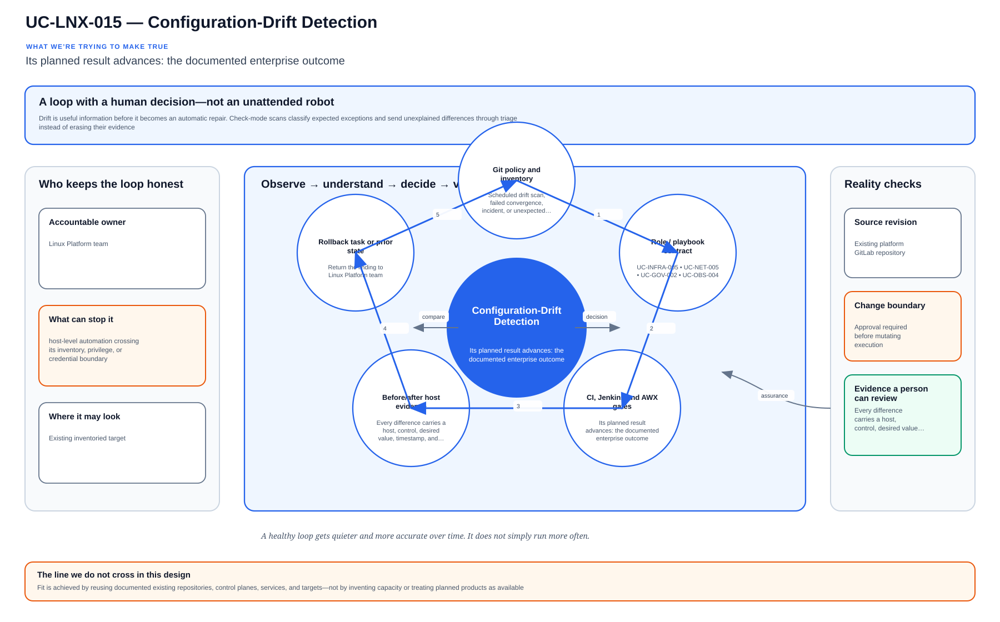

# UC-LNX-015: Configuration-Drift Detection

Last verified: 2026-08-02

## Use-case record

| Field | Value |
| --- | --- |
| Portfolio | Enterprise Linux Systems Engineering Platform |
| Canonical coverage target | Desired-state comparison and remediation |
| Delivery model | End-to-end infrastructure as code |
| Primary roles | Linux platform engineer, SRE, security engineer, configuration owner |
| Target environment | Managed Linux inventory, AWX objects, and critical host configuration |
| Current state | **Partially implemented. A drift evidence role exists; authoritative object coverage, severity policy, auto-remediation boundaries, and accepted runtime scans are incomplete.** |
| Related change | None; implementation requires a future approved change record |
| Owner | Linux Platform team |

## Purpose

Drift is useful information before it becomes an automatic repair. Check-mode scans classify expected exceptions and send unexplained differences through triage instead of erasing their evidence.

## Expected outcome

Every difference carries a host, control, desired value, timestamp, and owner. Approved remediation reaches a canary first, and a clean follow-up scan proves convergence.

## Platform and enterprise fit

| Relationship | Detailed fit |
| --- | --- |
| Owning platform | **Configuration-Drift Detection** belongs to the the documented enterprise outcome because that platform turns GitLab-reviewed standards through Jenkins approval and Terraform/image or AWX/Ansible execution into verified operating-system state. |
| Enterprise consumers | The capability supports the Linux foundation beneath provider, payer, database, Kubernetes, observability, and shared services. |
| Enterprise outcome | Its planned result advances: the documented enterprise outcome. |
| Control contribution | The design adds repeatability, least privilege, canary scope, idempotence, recovery, and host-level evidence. |
| Cross-platform handoff | Supporting platforms consume a reviewed result or evidence artifact; they do not take ownership away from the primary platform. |
| Infrastructure boundary | Fit is achieved by reusing documented existing repositories, control planes, services, and targets—not by inventing capacity or treating planned products as available. |

The platform fit is therefore based on ownership and a reusable decision, not
on the presence of a particular tool. Enterprise fit requires evidence that the
named outcome was observed for the bounded scope; completing documentation or
running an isolated technology demonstration is insufficient.

## Trigger and actors

| Item | Definition |
| --- | --- |
| Trigger | Scheduled drift scan, failed convergence, incident, or unexpected host change |
| Engineering owners | Linux platform engineer, SRE, security engineer, configuration owner |
| Approver | Confirms target, risk, maintenance window, evidence, and recovery readiness |
| SRE/operations | Reviews health, alerts, incidents, convergence, and handoff |

## Preconditions

- The sequential change record authorizes this exact use case and no conflicting infrastructure work is active.
- GitLab, tagged runners, Jenkins, AWX, inventory, DNS, and observability dependencies are healthy.
- Target and canary limits are explicit; credentials are referenced from approved secret systems.
- The selected Git SHA passed syntax, lint, policy, secret, and plan/check gates.
- Required backup, console, replacement, or recovery evidence exists before mutation.

## Scope and exclusions

**In scope:** File/package/service/account/firewall/repository drift, AWX object drift, inventory mismatch, severity, ownership, remediation, exception expiry, and evidence.

**Excluded:** Blind auto-remediation of high-risk drift, application data comparison, and accepting console changes without source reconciliation.

## Architecture diagram

Reviewed desired state is compared with live facts, differences are classified, and only approved remediation reaches a canary before closure.

## IaC delivery model

| Layer | Responsibility |
| --- | --- |
| GitLab | Source of truth, merge request, protected branch, CI gates, immutable SHA, and artifacts |
| Jenkins | Manual PLAN/CHECK/APPLY/ROLLBACK selection, approval, concurrency control, and evidence aggregation |
| Terraform/image automation | Infrastructure lifecycle only when the change affects VM, image, volume, or network resources |
| AWX and Ansible | OS desired state, check mode, inventory limit, serial rollout, and per-host events |
| Observability/evidence | Health gates, logs, metrics, incidents, expected-versus-observed result, and acceptance |

Current-source reality: roles/drift_detection and its findings template create desired-versus-live evidence.

## End-to-end implementation

### Code and configuration map

| State | Repository path | Responsibility |
| --- | --- | --- |
| Existing | `linux-systems-platform: roles/drift_detection and playbooks/drift-detection.yml` | Current drift findings generation |
| Planned | `linux-systems-platform: vars/drift_catalog.yml` | Control IDs, desired facts, severity, owner, and remediation mode |
| Planned | `linux-systems-platform: playbooks/drift-remediate.yml` | Approval-gated remediation and exception workflow |

### Required variables and controls

| Variable/control | Example or constraint | Purpose |
| --- | --- | --- |
| `drift_control_id` | stable control reference | Traceable finding |
| `drift_severity` | critical/high/medium/low | Response priority |
| `drift_remediation_mode` | report/manual/approved-auto | Risk boundary |
| `drift_exception_expiry` | dated waiver | Prevents permanent exceptions |

### Delivery sequence

1. Define authoritative desired facts and owners for files, packages, services, accounts, repositories, security controls, and AWX objects.
2. Collect live facts without mutation and normalize values so ordering or volatile fields do not create noise.
3. Classify findings by risk and detect inventory/source mismatches before host remediation.
4. Auto-remediate only low-risk controls explicitly approved for that mode; route others through a change.
5. Verify the changed control, consumer health, and absence of collateral changes.
6. Repeat the scan expecting zero unresolved unapproved drift and publish aged exceptions.

## Code and configuration map

The implementation map above is authoritative for this detail page. `Existing` paths were observed in the current repository clone. `Planned` paths are IaC design targets and are not completion claims.

## Jira breakdown

### STORY-LNX-015-001: Implement and validate the source model

**Description:** The platform team keeps the inputs, roles or modules, tests, pipeline gates, and operating boundaries for Configuration-Drift Detection in Git. A reviewer can reproduce the proposal from the selected commit without relying on settings that exist only in a console.

**Status:** In progress where supporting source is listed; the complete source gate is not accepted.

**Acceptance criteria:**

- Inputs have schemas/defaults, safe bounds, owners, and secret references.
- CI rejects malformed, unsafe, non-idempotent, and out-of-scope changes.
- The pipeline publishes the immutable SHA, exact target assumptions, and plan/check artifact.

**Implementation steps:**

1. Define authoritative desired facts and owners for files, packages, services, accounts, repositories, security controls, and AWX objects.
2. Collect live facts without mutation and normalize values so ordering or volatile fields do not create noise.
3. Classify findings by risk and detect inventory/source mismatches before host remediation.

**Completed work:** roles/drift_detection and its findings template create desired-versus-live evidence.

**Validation and rollback:** Validate without mutation; revert the merge request and regenerate artifacts from the prior accepted revision if the source gate is wrong.

**Required attachments:** `ART-LNX-015-001` and `ATT-LNX-015-001`.

### STORY-LNX-015-002: Execute the bounded canary and rollout

**Description:** The operator reviews PLAN or CHECK output against one named canary before applying Configuration-Drift Detection. Failed health or negative tests stop the run, and expansion requires explicit approval.

**Status:** Planned; no live acceptance is claimed.

**Acceptance criteria:**

- Execution uses the reviewed SHA, credentials, inventory, variables, and canary limit.
- Health and negative tests pass before cohort expansion.
- Failure thresholds preserve artifacts and stop without hidden manual correction.

**Implementation steps:**

1. Auto-remediate only low-risk controls explicitly approved for that mode; route others through a change.
2. Verify the changed control, consumer health, and absence of collateral changes.
3. Repeat the scan expecting zero unresolved unapproved drift and publish aged exceptions.

**Completed work:** The controlled execution design exists only in documentation.

**Validation and rollback:** The same unchanged host produces a stable finding set; Injected canary drift is detected with correct control ID and severity; Approved remediation changes only the intended control. Reapply the prior accepted desired-state revision if remediation is wrong. If live state was the valid change, stop and reconcile source through review rather than preserving hidden drift.

**Required attachments:** `ART-LNX-015-002`, `ATT-LNX-015-002`, and `ATT-LNX-015-003`.

### STORY-LNX-015-003: Prove convergence, recovery, and handoff

**Description:** Operations accepts Configuration-Drift Detection only after the same revision converges cleanly, runtime health is visible, and the recovery path has been exercised. The evidence must explain what moved, what stayed stable, and how the team recovered it.

**Status:** Planned; blocked until the canary story succeeds.

**Acceptance criteria:**

- Repeating identical code and inputs produces zero unexpected change.
- Recovery is exercised and service returns within the approved objective.
- Logs, metrics, job output, owner, expected-versus-observed result, and incidents are linked.

**Implementation steps:**

1. Repeat the identical execution and compare the changed set.
2. Exercise rollback or recovery on the bounded target.
3. Verify service health, monitoring, security posture, and consumer access.
4. Publish sanitized evidence and obtain owner/SRE acceptance.

**Completed work:** Acceptance and evidence requirements are defined; no runtime proof is claimed.

**Validation and rollback:** Post-remediation scan is clean and second remediation run is unchanged. Reapply the prior accepted desired-state revision if remediation is wrong. If live state was the valid change, stop and reconcile source through review rather than preserving hidden drift.

**Required attachments:** `ART-LNX-015-003`, `ATT-LNX-015-004`, and `ATT-LNX-015-005`.

## Evidence and screenshot register

| ID | Required evidence | Source | Status |
| --- | --- | --- | --- |
| `ART-LNX-015-001` | CI validation, immutable SHA, and plan/check artifact | GitLab | Pending |
| `ATT-LNX-015-001` | Successful source pipeline | GitLab | Pending |
| `ART-LNX-015-002` | Canary execution log and changed set | Jenkins/AWX/Terraform | Pending |
| `ATT-LNX-015-002` | Canary result | Control plane | Pending |
| `ATT-LNX-015-003` | Runtime health and expected state | Dashboard or approved CLI | Pending |
| `ART-LNX-015-003` | Second convergence and recovery log | Control plane | Pending |
| `ATT-LNX-015-004` | Recovery result | Control plane | Pending |
| `ATT-LNX-015-005` | Final accepted state | Dashboard or approved CLI | Pending |

## Expected versus current result

| Area | Expected | Current observation | Decision |
| --- | --- | --- | --- |
| Source | Complete IaC and pipeline for Configuration-Drift Detection | roles/drift_detection and its findings template create desired-versus-live evidence. | Not yet code complete |
| Runtime | Approved canary and cohort execution | No use-case-specific accepted run | Pending |
| Idempotence | Identical second run has zero unexpected change | No accepted convergence proof | Pending |
| Recovery | Recovery exercised and timed | No accepted recovery artifact | Pending |
| Evidence | Sanitized artifacts tied to immutable executions | Register defined; captures pending | Pending |

## Validation, idempotence, and rollback

- The same unchanged host produces a stable finding set.
- Injected canary drift is detected with correct control ID and severity.
- Approved remediation changes only the intended control.
- Post-remediation scan is clean and second remediation run is unchanged.

**Rollback/recovery:** Reapply the prior accepted desired-state revision if remediation is wrong. If live state was the valid change, stop and reconcile source through review rather than preserving hidden drift.

Idempotence requires the same reviewed revision, target, variables, and action to produce zero unexplained changes plus stable consumer health. A green first run alone is insufficient.

## Troubleshooting guide

Primary scenario: **The scheduled scan reports hundreds of changes caused only by timestamps and unordered command output.**

1. Stop propagation and retain the Git SHA, plan/check, execution IDs, timestamps, and target list.
2. Isolate source, orchestration, infrastructure, connectivity, privilege, host-state, and consumer-health layers.
3. Compare live facts with the intended variables and last accepted baseline; correlate logs and metrics to the execution window.
4. Reproduce only on the canary or in PLAN/CHECK, change one hypothesis, and avoid console drift.
5. Recover through the documented path and record unexpected failures or near misses in the incident register.

## Interview preparation

1. **Question:** Explain the end-to-end IaC architecture for Configuration-Drift Detection.
   **Answer signals:** Separate source validation, approval/orchestration, infrastructure ownership, AWX/Ansible desired state, runtime health, convergence, evidence, and recovery.

2. **Question:** How would you model configuration-drift detection so repeated execution stays safe?
   **Answer signals:** drift_control_id, drift_severity, drift_remediation_mode, drift_exception_expiry; stable identities, declarative state, handlers only on change, bounded targets, and explicit exclusions.

3. **Question:** What must be visible in a GitLab pipeline before runtime approval?
   **Answer signals:** The same unchanged host produces a stable finding set; Injected canary drift is detected with correct control ID and severity; immutable SHA, lint/policy results, plan/check artifact, target assumptions, and no secret exposure.

4. **Question:** Troubleshooting scenario: The scheduled scan reports hundreds of changes caused only by timestamps and unordered command output. What is your investigation order?
   **Answer signals:** Stop propagation, preserve timestamps and artifacts, verify target/input, isolate source/orchestration/connectivity/privilege/host/service layers, compare to baseline, and test on the canary.

5. **Question:** How do you prove idempotence rather than only success?
   **Answer signals:** Run the same reviewed SHA, inputs, target, and action again; require zero unexplained changes plus stable consumer health and evidence.

6. **Question:** What rollback or recovery would you use?
   **Answer signals:** Reapply the prior accepted desired-state revision if remediation is wrong. If live state was the valid change, stop and reconcile source through review rather than preserving hidden drift.

7. **Question:** Which security and audit controls matter most?
   **Answer signals:** Least privilege, protected source, secret references, explicit approval, canary limits, negative tests, immutable artifacts, exception expiry, and incident linkage.

8. **Question:** Discuss the tradeoff between automatic remediation speed and human review of high-risk change.
   **Answer signals:** Tie the choice to service objectives and failure modes, use a conservative default, measure on a canary, preserve recovery, and document exceptions.

9. **Question:** Tell me about a time you owned a difficult Configuration-Drift Detection change or incident across multiple teams. What did you do?
   **Answer signals:** Use a concise STAR example showing ownership, risk communication, evidence-based decisions, a safe stop or rollback, collaboration with service/security/SRE owners, measurable recovery or improvement, and a durable IaC correction.

## Safety and security controls

- Protected source, merge requests, tagged runners, immutable revisions, and retained artifacts.
- Least-privilege credentials referenced from approved secret systems.
- PLAN/CHECK by default; APPLY/ROLLBACK requires approval and exact target limits.
- Canary/serial rollout, failure thresholds, health gates, and stop conditions.
- No secrets, private keys, credentials, or protected health information in artifacts.

## Acceptance decision

UC-LNX-015 is **not yet accepted**. Acceptance requires implemented source, passing CI, controlled execution, runtime health, a zero-change second convergence, exercised recovery, reviewed evidence, and publication on the canonical branch.
