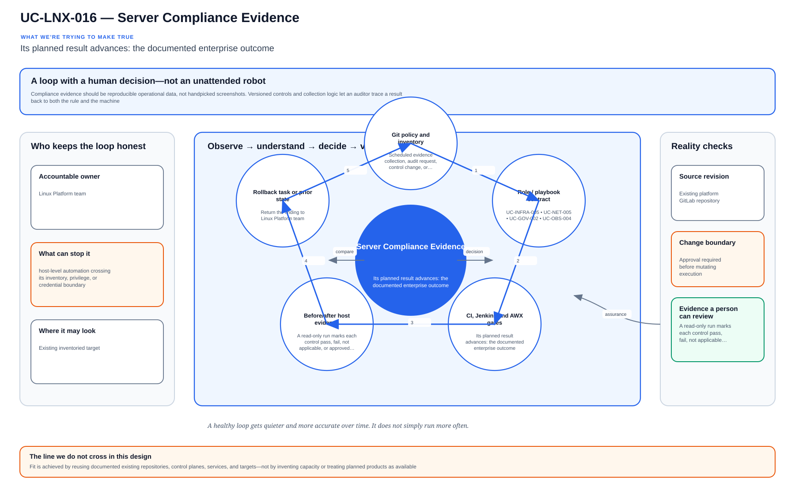

# UC-LNX-016: Server Compliance Evidence

Last verified: 2026-08-02

## Use-case record

| Field | Value |
| --- | --- |
| Portfolio | Enterprise Linux Systems Engineering Platform |
| Canonical coverage target | Auditable operating-system and service posture |
| Delivery model | End-to-end infrastructure as code |
| Primary roles | Linux security engineer, compliance analyst, platform engineer, evidence reviewer |
| Target environment | Managed Linux hosts and their required control/evidence catalog |
| Current state | **Partially implemented. Compliance evidence text is generated; control mapping, immutable central artifacts, reviewer workflow, and accepted coverage are incomplete.** |
| Related change | None; implementation requires a future approved change record |
| Owner | Linux Platform team |

## Purpose

Compliance evidence should be reproducible operational data, not handpicked screenshots. Versioned controls and collection logic let an auditor trace a result back to both the rule and the machine.

## Expected outcome

A read-only run marks each control pass, fail, not applicable, or approved exception for the named fleet. The report identifies its Git revision and collection job without changing a host.

## Platform and enterprise fit

| Relationship | Detailed fit |
| --- | --- |
| Owning platform | **Server Compliance Evidence** belongs to the the documented enterprise outcome because that platform turns GitLab-reviewed standards through Jenkins approval and Terraform/image or AWX/Ansible execution into verified operating-system state. |
| Enterprise consumers | The capability supports the Linux foundation beneath provider, payer, database, Kubernetes, observability, and shared services. |
| Enterprise outcome | Its planned result advances: the documented enterprise outcome. |
| Control contribution | The design adds repeatability, least privilege, canary scope, idempotence, recovery, and host-level evidence. |
| Cross-platform handoff | Supporting platforms consume a reviewed result or evidence artifact; they do not take ownership away from the primary platform. |
| Infrastructure boundary | Fit is achieved by reusing documented existing repositories, control planes, services, and targets—not by inventing capacity or treating planned products as available. |

The platform fit is therefore based on ownership and a reusable decision, not
on the presence of a particular tool. Enterprise fit requires evidence that the
named outcome was observed for the bounded scope; completing documentation or
running an isolated technology demonstration is insufficient.

## Trigger and actors

| Item | Definition |
| --- | --- |
| Trigger | Scheduled evidence collection, audit request, control change, or exception review |
| Engineering owners | Linux security engineer, compliance analyst, platform engineer, evidence reviewer |
| Approver | Confirms target, risk, maintenance window, evidence, and recovery readiness |
| SRE/operations | Reviews health, alerts, incidents, convergence, and handoff |

## Preconditions

- The sequential change record authorizes this exact use case and no conflicting infrastructure work is active.
- GitLab, tagged runners, Jenkins, AWX, inventory, DNS, and observability dependencies are healthy.
- Target and canary limits are explicit; credentials are referenced from approved secret systems.
- The selected Git SHA passed syntax, lint, policy, secret, and plan/check gates.
- Required backup, console, replacement, or recovery evidence exists before mutation.

## Scope and exclusions

**In scope:** Control catalog, OS/service facts, evidence collection, timestamps, target and Git SHA, exception mapping, retention, integrity, reviewer decision, and remediation linkage.

**Excluded:** Claiming certification, storing secrets/PHI, screenshots without underlying artifacts, and treating a passing playbook as control effectiveness.

## Architecture diagram

Versioned controls drive read-only collection, results and exceptions are normalized, and the signed report links findings to source and host evidence.

## IaC delivery model

| Layer | Responsibility |
| --- | --- |
| GitLab | Source of truth, merge request, protected branch, CI gates, immutable SHA, and artifacts |
| Jenkins | Manual PLAN/CHECK/APPLY/ROLLBACK selection, approval, concurrency control, and evidence aggregation |
| Terraform/image automation | Infrastructure lifecycle only when the change affects VM, image, volume, or network resources |
| AWX and Ansible | OS desired state, check mode, inventory limit, serial rollout, and per-host events |
| Observability/evidence | Health gates, logs, metrics, incidents, expected-versus-observed result, and acceptance |

Current-source reality: roles/compliance_evidence writes host evidence under /var/tmp/linux-systems-platform.

## End-to-end implementation

### Code and configuration map

| State | Repository path | Responsibility |
| --- | --- | --- |
| Existing | `linux-systems-platform: roles/compliance_evidence and playbooks/compliance-evidence.yml` | Host posture evidence generation |
| Planned | `linux-systems-platform: vars/compliance_controls.yml` | Control-to-fact mapping, owner, frequency, and expected result |
| Planned | `linux-systems-platform: playbooks/compliance-collect.yml and scripts/package-evidence.sh` | Centralized, checksummed, sanitized evidence bundle and manifest |

### Required variables and controls

| Variable/control | Example or constraint | Purpose |
| --- | --- | --- |
| `compliance_profile` | approved organizational/CIS/STIG mapping | Defines expected controls |
| `evidence_run_id` | immutable execution ID | Traceability |
| `evidence_retention` | approved duration | Lifecycle |
| `exception_record` | owner/expiry/remediation | Honest noncompliance |

### Delivery sequence

1. Define each control, authoritative source, expected observation, collection method, owner, frequency, exception process, and sensitivity.
2. Collect machine-readable host facts with target, timestamp, Git SHA, tool versions, and command/task result.
3. Normalize and sanitize artifacts, calculate checksums, and transfer them to approved central retention.
4. Evaluate expected versus observed results without converting missing evidence into pass.
5. Route failures and expiring exceptions to owners and link remediation change/incident IDs.
6. Repeat a sample collection, verify integrity and retrieval, and obtain reviewer sign-off.

## Code and configuration map

The implementation map above is authoritative for this detail page. `Existing` paths were observed in the current repository clone. `Planned` paths are IaC design targets and are not completion claims.

## Jira breakdown

### STORY-LNX-016-001: Implement and validate the source model

**Description:** The platform team keeps the inputs, roles or modules, tests, pipeline gates, and operating boundaries for Server Compliance Evidence in Git. A reviewer can reproduce the proposal from the selected commit without relying on settings that exist only in a console.

**Status:** In progress where supporting source is listed; the complete source gate is not accepted.

**Acceptance criteria:**

- Inputs have schemas/defaults, safe bounds, owners, and secret references.
- CI rejects malformed, unsafe, non-idempotent, and out-of-scope changes.
- The pipeline publishes the immutable SHA, exact target assumptions, and plan/check artifact.

**Implementation steps:**

1. Define each control, authoritative source, expected observation, collection method, owner, frequency, exception process, and sensitivity.
2. Collect machine-readable host facts with target, timestamp, Git SHA, tool versions, and command/task result.
3. Normalize and sanitize artifacts, calculate checksums, and transfer them to approved central retention.

**Completed work:** roles/compliance_evidence writes host evidence under /var/tmp/linux-systems-platform.

**Validation and rollback:** Validate without mutation; revert the merge request and regenerate artifacts from the prior accepted revision if the source gate is wrong.

**Required attachments:** `ART-LNX-016-001` and `ATT-LNX-016-001`.

### STORY-LNX-016-002: Execute the bounded canary and rollout

**Description:** The operator reviews PLAN or CHECK output against one named canary before applying Server Compliance Evidence. Failed health or negative tests stop the run, and expansion requires explicit approval.

**Status:** Planned; no live acceptance is claimed.

**Acceptance criteria:**

- Execution uses the reviewed SHA, credentials, inventory, variables, and canary limit.
- Health and negative tests pass before cohort expansion.
- Failure thresholds preserve artifacts and stop without hidden manual correction.

**Implementation steps:**

1. Evaluate expected versus observed results without converting missing evidence into pass.
2. Route failures and expiring exceptions to owners and link remediation change/incident IDs.
3. Repeat a sample collection, verify integrity and retrieval, and obtain reviewer sign-off.

**Completed work:** The controlled execution design exists only in documentation.

**Validation and rollback:** Every artifact identifies target, time, Git SHA, control, and collection method; Missing or failed collection is reported as unknown/fail, never pass; Checksums and central retrieval verify artifact integrity. Evidence is append-only; correct an invalid collector through a new reviewed revision and superseding run. Preserve the flawed artifact with its rejection decision rather than rewriting history.

**Required attachments:** `ART-LNX-016-002`, `ATT-LNX-016-002`, and `ATT-LNX-016-003`.

### STORY-LNX-016-003: Prove convergence, recovery, and handoff

**Description:** Operations accepts Server Compliance Evidence only after the same revision converges cleanly, runtime health is visible, and the recovery path has been exercised. The evidence must explain what moved, what stayed stable, and how the team recovered it.

**Status:** Planned; blocked until the canary story succeeds.

**Acceptance criteria:**

- Repeating identical code and inputs produces zero unexpected change.
- Recovery is exercised and service returns within the approved objective.
- Logs, metrics, job output, owner, expected-versus-observed result, and incidents are linked.

**Implementation steps:**

1. Repeat the identical execution and compare the changed set.
2. Exercise rollback or recovery on the bounded target.
3. Verify service health, monitoring, security posture, and consumer access.
4. Publish sanitized evidence and obtain owner/SRE acceptance.

**Completed work:** Acceptance and evidence requirements are defined; no runtime proof is claimed.

**Validation and rollback:** Reviewer can trace each exception to owner, expiry, and remediation. Evidence is append-only; correct an invalid collector through a new reviewed revision and superseding run. Preserve the flawed artifact with its rejection decision rather than rewriting history.

**Required attachments:** `ART-LNX-016-003`, `ATT-LNX-016-004`, and `ATT-LNX-016-005`.

## Evidence and screenshot register

| ID | Required evidence | Source | Status |
| --- | --- | --- | --- |
| `ART-LNX-016-001` | CI validation, immutable SHA, and plan/check artifact | GitLab | Pending |
| `ATT-LNX-016-001` | Successful source pipeline | GitLab | Pending |
| `ART-LNX-016-002` | Canary execution log and changed set | Jenkins/AWX/Terraform | Pending |
| `ATT-LNX-016-002` | Canary result | Control plane | Pending |
| `ATT-LNX-016-003` | Runtime health and expected state | Dashboard or approved CLI | Pending |
| `ART-LNX-016-003` | Second convergence and recovery log | Control plane | Pending |
| `ATT-LNX-016-004` | Recovery result | Control plane | Pending |
| `ATT-LNX-016-005` | Final accepted state | Dashboard or approved CLI | Pending |

## Expected versus current result

| Area | Expected | Current observation | Decision |
| --- | --- | --- | --- |
| Source | Complete IaC and pipeline for Server Compliance Evidence | roles/compliance_evidence writes host evidence under /var/tmp/linux-systems-platform. | Not yet code complete |
| Runtime | Approved canary and cohort execution | No use-case-specific accepted run | Pending |
| Idempotence | Identical second run has zero unexpected change | No accepted convergence proof | Pending |
| Recovery | Recovery exercised and timed | No accepted recovery artifact | Pending |
| Evidence | Sanitized artifacts tied to immutable executions | Register defined; captures pending | Pending |

## Validation, idempotence, and rollback

- Every artifact identifies target, time, Git SHA, control, and collection method.
- Missing or failed collection is reported as unknown/fail, never pass.
- Checksums and central retrieval verify artifact integrity.
- Reviewer can trace each exception to owner, expiry, and remediation.

**Rollback/recovery:** Evidence is append-only; correct an invalid collector through a new reviewed revision and superseding run. Preserve the flawed artifact with its rejection decision rather than rewriting history.

Idempotence requires the same reviewed revision, target, variables, and action to produce zero unexplained changes plus stable consumer health. A green first run alone is insufficient.

## Troubleshooting guide

Primary scenario: **The dashboard shows 100 percent compliance even though several hosts were unreachable.**

1. Stop propagation and retain the Git SHA, plan/check, execution IDs, timestamps, and target list.
2. Isolate source, orchestration, infrastructure, connectivity, privilege, host-state, and consumer-health layers.
3. Compare live facts with the intended variables and last accepted baseline; correlate logs and metrics to the execution window.
4. Reproduce only on the canary or in PLAN/CHECK, change one hypothesis, and avoid console drift.
5. Recover through the documented path and record unexpected failures or near misses in the incident register.

## Interview preparation

1. **Question:** Explain the end-to-end IaC architecture for Server Compliance Evidence.
   **Answer signals:** Separate source validation, approval/orchestration, infrastructure ownership, AWX/Ansible desired state, runtime health, convergence, evidence, and recovery.

2. **Question:** How would you model server compliance collection so repeated execution stays safe?
   **Answer signals:** compliance_profile, evidence_run_id, evidence_retention, exception_record; stable identities, declarative state, handlers only on change, bounded targets, and explicit exclusions.

3. **Question:** What must be visible in a GitLab pipeline before runtime approval?
   **Answer signals:** Every artifact identifies target, time, Git SHA, control, and collection method; Missing or failed collection is reported as unknown/fail, never pass; immutable SHA, lint/policy results, plan/check artifact, target assumptions, and no secret exposure.

4. **Question:** Troubleshooting scenario: The dashboard shows 100 percent compliance even though several hosts were unreachable. What is your investigation order?
   **Answer signals:** Stop propagation, preserve timestamps and artifacts, verify target/input, isolate source/orchestration/connectivity/privilege/host/service layers, compare to baseline, and test on the canary.

5. **Question:** How do you prove idempotence rather than only success?
   **Answer signals:** Run the same reviewed SHA, inputs, target, and action again; require zero unexplained changes plus stable consumer health and evidence.

6. **Question:** What rollback or recovery would you use?
   **Answer signals:** Evidence is append-only; correct an invalid collector through a new reviewed revision and superseding run. Preserve the flawed artifact with its rejection decision rather than rewriting history.

7. **Question:** Which security and audit controls matter most?
   **Answer signals:** Least privilege, protected source, secret references, explicit approval, canary limits, negative tests, immutable artifacts, exception expiry, and incident linkage.

8. **Question:** Discuss the tradeoff between simple compliance scores and honest evidence completeness.
   **Answer signals:** Tie the choice to service objectives and failure modes, use a conservative default, measure on a canary, preserve recovery, and document exceptions.

9. **Question:** Tell me about a time you owned a difficult Server Compliance Evidence change or incident across multiple teams. What did you do?
   **Answer signals:** Use a concise STAR example showing ownership, risk communication, evidence-based decisions, a safe stop or rollback, collaboration with service/security/SRE owners, measurable recovery or improvement, and a durable IaC correction.

## Safety and security controls

- Protected source, merge requests, tagged runners, immutable revisions, and retained artifacts.
- Least-privilege credentials referenced from approved secret systems.
- PLAN/CHECK by default; APPLY/ROLLBACK requires approval and exact target limits.
- Canary/serial rollout, failure thresholds, health gates, and stop conditions.
- No secrets, private keys, credentials, or protected health information in artifacts.

## Acceptance decision

UC-LNX-016 is **not yet accepted**. Acceptance requires implemented source, passing CI, controlled execution, runtime health, a zero-change second convergence, exercised recovery, reviewed evidence, and publication on the canonical branch.
