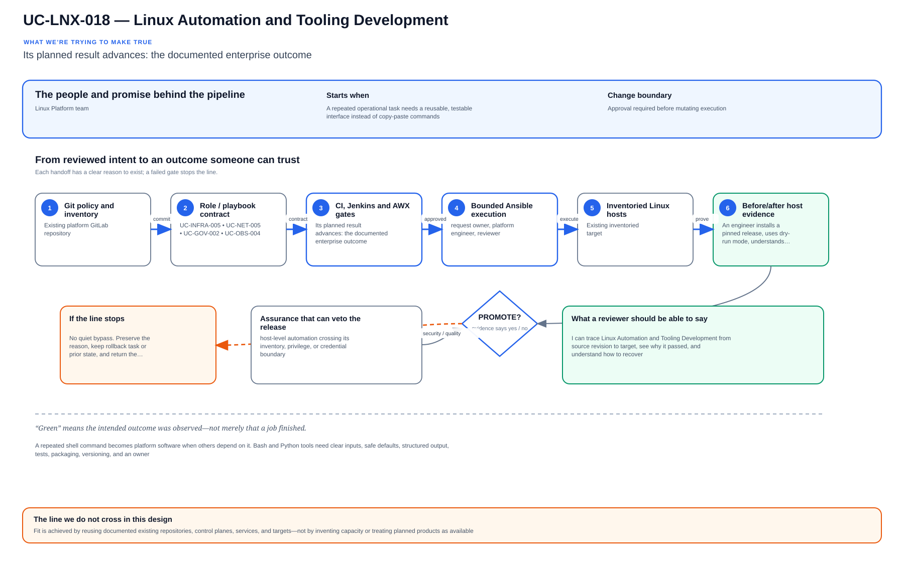

# UC-LNX-018: Linux Automation and Tooling Development

Last verified: 2026-08-02

## Use-case record

| Field | Value |
| --- | --- |
| Portfolio | Enterprise Linux Systems Engineering Platform |
| Canonical coverage target | Tested Bash/Python utilities, APIs and reusable operational automation |
| Delivery model | End-to-end infrastructure as code |
| Primary roles | Linux automation engineer, Python developer, platform engineer, security reviewer |
| Target environment | Linux operations utilities executed in CI, Jenkins, AWX execution environments, or approved admin hosts |
| Current state | **Defined backlog. The repository contains shell validation but no accepted tooling framework, packaging pipeline, API contract, or release process.** |
| Related change | None; implementation requires a future approved change record |
| Owner | Linux Platform team |

## Purpose

A repeated shell command becomes platform software when others depend on it. Bash and Python tools need clear inputs, safe defaults, structured output, tests, packaging, versioning, and an owner.

## Expected outcome

An engineer installs a pinned release, uses dry-run mode, understands exit codes and logs, and sees the same behavior in CI and on a canary. Failures stop safely and rollback keeps the prior release.

## Trigger and actors

| Item | Definition |
| --- | --- |
| Trigger | A repeated operational task needs a reusable, testable interface instead of copy-paste commands |
| Engineering owners | Linux automation engineer, Python developer, platform engineer, security reviewer |
| Approver | Confirms scope, risk, window, plan, and recovery readiness |
| Operations/SRE | Reviews health, evidence, incident linkage, and acceptance |

## Preconditions

- The sequential change record authorizes this exact use case and no conflicting infrastructure work is active.
- GitLab, tagged runner, Jenkins, AWX, inventory, DNS, and observability dependencies are healthy.
- Exact target/canary limits and owners are known; secrets are referenced from approved systems.
- The selected SHA passed source, syntax, lint, policy, security, and plan/check gates.
- Recovery prerequisites and stop conditions are verified before mutation.

## Scope and exclusions

**In scope:** Bash/Python standards, CLI/API design, input validation, packaging, tests, logging, dry run, privilege boundary, versioning, release artifacts, and deprecation.

**Excluded:** One-off unreviewed scripts, embedded credentials, mutable downloads, and tools that bypass Terraform/Ansible ownership.

## Architecture diagram

An operational need becomes a tested CLI or API through source review, integration gates, a dry-run canary, and versioned release telemetry.

## IaC delivery model

| Layer | Responsibility |
| --- | --- |
| GitLab | Source of truth, merge request, protected branch, CI, immutable SHA, artifacts |
| Jenkins | Manual PLAN/CHECK/APPLY/ROLLBACK, approval, concurrency, evidence aggregation |
| Terraform/image automation | VM/image/volume/network lifecycle only when required |
| AWX and Ansible | OS desired state, inventory limit, check mode, serial rollout, job events |
| Observability/evidence | Health, logs, metrics, expected-versus-observed, incidents, acceptance |

Current-source reality: scripts/local-validate.sh is real source-validation tooling; a general operational-tool lifecycle is not implemented.

## End-to-end implementation

### Code and configuration map

| State | Repository path | Responsibility |
| --- | --- | --- |
| Existing | `linux-systems-platform: scripts/local-validate.sh` | Repository-local validation entry point |
| Planned | `linux-systems-platform: tools/linux_platform and pyproject.toml` | Typed Python package, CLI, API clients, logging, and unit tests |
| Planned | `linux-systems-platform: scripts/lib and tests` | Strict Bash library, ShellCheck/Bats tests, fixtures, and compatibility matrix |

### Required variables and controls

| Variable/control | Example or constraint | Purpose |
| --- | --- | --- |
| `tool_action` | plan/check/apply/report | Safe explicit mode |
| `tool_target` | validated inventory expression | Prevents injection and broad defaults |
| `tool_output_format` | json plus human summary | Automation and operator use |
| `tool_release_version` | immutable semver artifact | Traceable deployment |

### Delivery sequence

1. Define the user, task boundary, ownership, inputs, outputs, exit codes, failure semantics, dry-run behavior, and privilege needs.
2. Choose Bash only for small host-local orchestration; use Python for data, APIs, retries, concurrency, or reusable domain logic.
3. Implement strict validation, structured logs, timeouts, bounded retries, deterministic output, and secret redaction.
4. Add unit, integration, negative, compatibility, ShellCheck/Ruff/type, dependency, secret, and packaging tests.
5. Publish a versioned artifact from GitLab CI and pin that version in Jenkins/AWX execution environments.
6. Run a canary task, compare results with manual truth, repeat for idempotence, and document rollback/deprecation.

## Code and configuration map

The implementation map above distinguishes observed `Existing` paths from `Planned` IaC design targets. Planned paths must not be used as evidence of completion.

## Jira breakdown

### STORY-LNX-018-001: Implement and validate the source model

**Description:** The platform team keeps the inputs, roles or modules, tests, pipeline gates, and operating boundaries for Linux Automation and Tooling Development in Git. A reviewer can reproduce the proposal from the selected commit without relying on settings that exist only in a console.

**Status:** In progress only where supporting source is listed; the full source gate is not accepted.

**Acceptance criteria:**

- Inputs have schemas/defaults, safe bounds, ownership, and secret references.
- CI rejects malformed, unsafe, non-idempotent, and out-of-scope changes.
- CI publishes immutable SHA, exact assumptions, and plan/check artifacts.

**Implementation steps:**

1. Define the user, task boundary, ownership, inputs, outputs, exit codes, failure semantics, dry-run behavior, and privilege needs.
2. Choose Bash only for small host-local orchestration; use Python for data, APIs, retries, concurrency, or reusable domain logic.
3. Implement strict validation, structured logs, timeouts, bounded retries, deterministic output, and secret redaction.

**Completed work:** scripts/local-validate.sh is real source-validation tooling; a general operational-tool lifecycle is not implemented.

**Validation and rollback:** Validate without runtime mutation; revert source and regenerate artifacts from the prior accepted revision if incorrect.

**Required attachments:** `ART-LNX-018-001` and `ATT-LNX-018-001`.

### STORY-LNX-018-002: Execute the bounded canary and rollout

**Description:** The operator reviews PLAN or CHECK output against one named canary before applying Linux Automation and Tooling Development. Failed health or negative tests stop the run, and expansion requires explicit approval.

**Status:** Planned; no runtime acceptance is claimed.

**Acceptance criteria:**

- Execution uses the reviewed SHA, credential references, inventory, variables, and canary limit.
- Health and negative tests pass before any cohort expansion.
- Failure thresholds stop the workflow and preserve evidence without hidden manual correction.

**Implementation steps:**

1. Add unit, integration, negative, compatibility, ShellCheck/Ruff/type, dependency, secret, and packaging tests.
2. Publish a versioned artifact from GitLab CI and pin that version in Jenkins/AWX execution environments.
3. Run a canary task, compare results with manual truth, repeat for idempotence, and document rollback/deprecation.

**Completed work:** The execution design is documented; no successful live canary is claimed.

**Validation and rollback:** CLI/API contract and exit codes are covered by positive and negative tests; Static, dependency, secret, unit, and integration gates pass; Canary uses the pinned artifact and produces structured sanitized evidence. Pin the prior signed/versioned artifact in the execution environment, remove the faulty release from promotion, and preserve both artifacts and incident evidence.

**Required attachments:** `ART-LNX-018-002`, `ATT-LNX-018-002`, and `ATT-LNX-018-003`.

### STORY-LNX-018-003: Prove convergence, recovery, and handoff

**Description:** Operations accepts Linux Automation and Tooling Development only after the same revision converges cleanly, runtime health is visible, and the recovery path has been exercised. The evidence must explain what moved, what stayed stable, and how the team recovered it.

**Status:** Planned; blocked until the canary story succeeds.

**Acceptance criteria:**

- Repeating identical code and inputs produces zero unexpected change.
- Recovery is exercised and service returns within the approved objective.
- Logs, metrics, job output, owner, result, and incidents are linked.

**Implementation steps:**

1. Repeat the identical execution and compare the changed set.
2. Exercise the documented recovery path on the bounded target.
3. Verify service health, monitoring, security posture, and consumer access.
4. Publish sanitized evidence and obtain owner/SRE acceptance.

**Completed work:** Acceptance requirements are defined; no runtime proof is claimed.

**Validation and rollback:** Repeat execution is safe and artifact rollback restores the prior behavior. Pin the prior signed/versioned artifact in the execution environment, remove the faulty release from promotion, and preserve both artifacts and incident evidence.

**Required attachments:** `ART-LNX-018-003`, `ATT-LNX-018-004`, and `ATT-LNX-018-005`.

## Evidence and screenshot register

| ID | Required evidence | Source | Status |
| --- | --- | --- | --- |
| `ART-LNX-018-001` | CI, immutable SHA, and plan/check artifact | GitLab | Pending |
| `ATT-LNX-018-001` | Successful source pipeline | GitLab | Pending |
| `ART-LNX-018-002` | Canary execution and changed set | Jenkins/AWX/Terraform | Pending |
| `ATT-LNX-018-002` | Canary result | Control plane | Pending |
| `ATT-LNX-018-003` | Runtime health and expected state | Dashboard/CLI | Pending |
| `ART-LNX-018-003` | Second convergence and recovery log | Control plane | Pending |
| `ATT-LNX-018-004` | Recovery result | Control plane | Pending |
| `ATT-LNX-018-005` | Final accepted state | Dashboard/CLI | Pending |

## Expected versus current result

| Area | Expected | Current observation | Decision |
| --- | --- | --- | --- |
| Source | Complete IaC and pipeline for Linux Automation and Tooling Development | scripts/local-validate.sh is real source-validation tooling; a general operational-tool lifecycle is not implemented. | Not yet code complete |
| Runtime | Approved canary/cohort execution | No accepted use-case run | Pending |
| Idempotence | Identical second run has zero unexpected change | No accepted convergence proof | Pending |
| Recovery | Recovery exercised and timed | No accepted recovery artifact | Pending |
| Evidence | Sanitized artifacts tied to immutable executions | Register defined; captures pending | Pending |

## Validation, idempotence, and rollback

- CLI/API contract and exit codes are covered by positive and negative tests.
- Static, dependency, secret, unit, and integration gates pass.
- Canary uses the pinned artifact and produces structured sanitized evidence.
- Repeat execution is safe and artifact rollback restores the prior behavior.

**Rollback/recovery:** Pin the prior signed/versioned artifact in the execution environment, remove the faulty release from promotion, and preserve both artifacts and incident evidence.

Idempotence means the same reviewed revision, target, variables, and action produces zero unexplained changes plus stable consumer health. First-run success is not enough.

## Troubleshooting guide

Primary scenario: **A Python tool retries an API mutation after a timeout and creates duplicate objects.**

1. Stop propagation and preserve SHA, plan/check, execution IDs, timestamps, and targets.
2. Isolate source, orchestration, infrastructure, connectivity, privilege, host state, and consumer health.
3. Compare live facts with intended variables and the last accepted baseline; correlate logs/metrics to the window.
4. Reproduce only on the canary or in PLAN/CHECK and change one hypothesis at a time.
5. Recover through the documented path and record unexpected failures or near misses.

## Interview preparation

1. **Question:** Explain the end-to-end IaC architecture for Linux Automation and Tooling Development.
   **Answer signals:** Cover GitLab review and CI, Jenkins approval, Terraform/image ownership where relevant, AWX/Ansible execution, observability, convergence, recovery, and evidence.

2. **Question:** How would you make the implementation idempotent and reusable?
   **Answer signals:** tool_action, tool_target, tool_output_format, tool_release_version; explicit schemas, stable identities, bounded targets, deterministic tasks, and no UI-only state.

3. **Question:** What pipeline and plan/check evidence is required before APPLY?
   **Answer signals:** CLI/API contract and exit codes are covered by positive and negative tests; Static, dependency, secret, unit, and integration gates pass; immutable SHA, runner identity, target assumptions, scan/test results, and no exposed secret.

4. **Question:** Troubleshooting scenario: A Python tool retries an API mutation after a timeout and creates duplicate objects. How do you respond?
   **Answer signals:** Stop propagation, preserve execution evidence, verify target and source revision, isolate the failed layer, compare live facts to desired/baseline, and test recovery on the canary.

5. **Question:** How do you prove idempotence?
   **Answer signals:** Repeat identical SHA, inputs, target, credentials scope, and action; require zero unexplained changes plus stable health and equivalent evidence.

6. **Question:** What rollback or recovery path would you defend?
   **Answer signals:** Pin the prior signed/versioned artifact in the execution environment, remove the faulty release from promotion, and preserve both artifacts and incident evidence.

7. **Question:** Which security/audit controls should an interviewer hear?
   **Answer signals:** Protected source, least privilege, secret references, approval gates, short-lived access, canary limits, immutable artifacts, exception expiry, and incident linkage.

8. **Question:** Discuss the tradeoff between retries for resilience and exactly-once operational behavior.
   **Answer signals:** Frame business impact and failure modes, choose a safe default, measure canary results, keep recovery available, and document justified exceptions.

9. **Question:** Tell me about a time you owned a difficult Linux Automation and Tooling Development change or incident across multiple teams. What did you do?
   **Answer signals:** Use a concise STAR example showing ownership, risk communication, evidence-based decisions, a safe stop or rollback, collaboration with service/security/SRE owners, measurable recovery or improvement, and a durable IaC correction.

## Safety and security controls

- Protected source, merge requests, tagged runners, immutable revisions, and retained artifacts.
- Least-privilege credentials referenced from approved secret systems.
- PLAN/CHECK by default; APPLY/ROLLBACK requires confirmation and exact target limits.
- Canary rollout, failure thresholds, health gates, and stop conditions.
- No credentials, private keys, secrets, or protected health information in artifacts.

## Acceptance decision

UC-LNX-018 is **not yet accepted**. Acceptance requires implemented source, passing CI, controlled execution, runtime health, zero-change second convergence, exercised recovery, reviewed evidence, and publication on the canonical branch.
