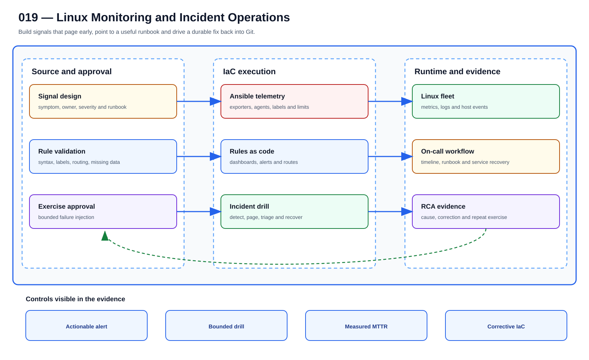

# UC-LNX-019: Linux Monitoring and Incident Operations

Last verified: 2026-08-02

## Use-case record

| Field | Value |
| --- | --- |
| Portfolio | Enterprise Linux Systems Engineering Platform |
| Canonical coverage target | Host metrics, logs, alerts, on-call triage, RCA and durable corrective actions |
| Delivery model | End-to-end infrastructure as code |
| Primary roles | SRE, Linux systems engineer, observability engineer, incident commander |
| Target environment | The managed Linux fleet and existing Prometheus, Elastic, Loki, and Splunk exercise paths |
| Current state | **Defined backlog with adjacent observability services. No Linux-specific dashboards-as-code, alert tests, runbook routing, or accepted incident exercise is recorded.** |
| Related change | None; implementation requires a future approved change record |
| Owner | Linux Platform team |

## Purpose

Monitoring earns its cost when an alert leads the on-call engineer to the right action. Metrics, logs, thresholds, ownership, runbooks, incident timelines, and durable fixes belong to one operating loop.

## Expected outcome

A representative fault creates one actionable alert with correct severity, owner, context, and runbook. Recovery clears it without hiding the cause, and the corrective change returns through Git.

## Trigger and actors

| Item | Definition |
| --- | --- |
| Trigger | A host signal breaches an actionable threshold or an operator declares an incident |
| Engineering owners | SRE, Linux systems engineer, observability engineer, incident commander |
| Approver | Confirms scope, risk, window, plan, and recovery readiness |
| Operations/SRE | Reviews health, evidence, incident linkage, and acceptance |

## Preconditions

- The sequential change record authorizes this exact use case and no conflicting infrastructure work is active.
- GitLab, tagged runner, Jenkins, AWX, inventory, DNS, and observability dependencies are healthy.
- Exact target/canary limits and owners are known; secrets are referenced from approved systems.
- The selected SHA passed source, syntax, lint, policy, security, and plan/check gates.
- Recovery prerequisites and stop conditions are verified before mutation.

## Scope and exclusions

**In scope:** Host exporters/agents, logs, dashboards, alerts, SLO/support signals, routing, runbooks, triage bundles, incident timeline, RCA, and corrective IaC.

**Excluded:** Alerting on every metric, screenshots as sole evidence, untested paging routes, and permanent console fixes during incidents.

## Architecture diagram

Host signals pass through alert rules and triage into incident response, then recovery evidence and a durable Git correction close the loop.

## IaC delivery model

| Layer | Responsibility |
| --- | --- |
| GitLab | Source of truth, merge request, protected branch, CI, immutable SHA, artifacts |
| Jenkins | Manual PLAN/CHECK/APPLY/ROLLBACK, approval, concurrency, evidence aggregation |
| Terraform/image automation | VM/image/volume/network lifecycle only when required |
| AWX and Ansible | OS desired state, inventory limit, check mode, serial rollout, job events |
| Observability/evidence | Health, logs, metrics, expected-versus-observed, incidents, acceptance |

Current-source reality: The Linux repository collects capacity evidence, and separate observability repositories operate fleet telemetry; the two paths are not yet integrated end to end.

## End-to-end implementation

### Code and configuration map

| State | Repository path | Responsibility |
| --- | --- | --- |
| Existing | `linux-systems-platform: roles/performance_capacity` | Host first-response evidence |
| Planned | `linux-systems-platform: roles/linux_observability` | Node/log agent state, labels, endpoints, and health |
| Planned | `observability-sre-platform: dashboards/linux and alerts/linux` | Dashboard and alert rules with tests, ownership, and runbook URLs |

### Required variables and controls

| Variable/control | Example or constraint | Purpose |
| --- | --- | --- |
| `linux_service_tier` | critical/standard/lab | Signal and routing policy |
| `alert_for_duration` | symptom-specific duration | Noise control |
| `runbook_url` | versioned operating procedure | Actionability |
| `incident_evidence_window` | UTC before/after interval | RCA correlation |

### Delivery sequence

1. Define user-impacting symptoms, service tiers, owners, labels, telemetry sources, retention, and runbook actions before alerts.
2. Deploy exporters/log agents through Ansible with TLS/credentials references and resource limits.
3. Create dashboards and alerts as code; test rule syntax, labels, routing, missing-data behavior, and known failure fixtures.
4. Inject one bounded host failure, verify telemetry, page route, acknowledgement, runbook, timeline, and recovery.
5. Perform RCA across metrics/logs/events/change history and convert durable fixes into reviewed IaC.
6. Repeat the exercise, measure detection/acknowledgement/recovery, and tune noise without hiding real failure.

## Code and configuration map

The implementation map above distinguishes observed `Existing` paths from `Planned` IaC design targets. Planned paths must not be used as evidence of completion.

## Jira breakdown

### STORY-LNX-019-001: Implement and validate the source model

**Description:** The platform team keeps the inputs, roles or modules, tests, pipeline gates, and operating boundaries for Linux Monitoring and Incident Operations in Git. A reviewer can reproduce the proposal from the selected commit without relying on settings that exist only in a console.

**Status:** In progress only where supporting source is listed; the full source gate is not accepted.

**Acceptance criteria:**

- Inputs have schemas/defaults, safe bounds, ownership, and secret references.
- CI rejects malformed, unsafe, non-idempotent, and out-of-scope changes.
- CI publishes immutable SHA, exact assumptions, and plan/check artifacts.

**Implementation steps:**

1. Define user-impacting symptoms, service tiers, owners, labels, telemetry sources, retention, and runbook actions before alerts.
2. Deploy exporters/log agents through Ansible with TLS/credentials references and resource limits.
3. Create dashboards and alerts as code; test rule syntax, labels, routing, missing-data behavior, and known failure fixtures.

**Completed work:** The Linux repository collects capacity evidence, and separate observability repositories operate fleet telemetry; the two paths are not yet integrated end to end.

**Validation and rollback:** Validate without runtime mutation; revert source and regenerate artifacts from the prior accepted revision if incorrect.

**Required attachments:** `ART-LNX-019-001` and `ATT-LNX-019-001`.

### STORY-LNX-019-002: Execute the bounded canary and rollout

**Description:** The operator reviews PLAN or CHECK output against one named canary before applying Linux Monitoring and Incident Operations. Failed health or negative tests stop the run, and expansion requires explicit approval.

**Status:** Planned; no runtime acceptance is claimed.

**Acceptance criteria:**

- Execution uses the reviewed SHA, credential references, inventory, variables, and canary limit.
- Health and negative tests pass before any cohort expansion.
- Failure thresholds stop the workflow and preserve evidence without hidden manual correction.

**Implementation steps:**

1. Inject one bounded host failure, verify telemetry, page route, acknowledgement, runbook, timeline, and recovery.
2. Perform RCA across metrics/logs/events/change history and convert durable fixes into reviewed IaC.
3. Repeat the exercise, measure detection/acknowledgement/recovery, and tune noise without hiding real failure.

**Completed work:** The execution design is documented; no successful live canary is claimed.

**Validation and rollback:** Every alert has owner, severity, service/host identity, runbook, and actionable threshold; Agent/exporter failure and missing data are visible; Controlled incident pages correctly and the runbook restores health. Revert faulty alert/dashboard/agent source, redeploy the prior revision, and verify coverage. During an incident, recover the service first through its approved path and preserve telemetry.

**Required attachments:** `ART-LNX-019-002`, `ATT-LNX-019-002`, and `ATT-LNX-019-003`.

### STORY-LNX-019-003: Prove convergence, recovery, and handoff

**Description:** Operations accepts Linux Monitoring and Incident Operations only after the same revision converges cleanly, runtime health is visible, and the recovery path has been exercised. The evidence must explain what moved, what stayed stable, and how the team recovered it.

**Status:** Planned; blocked until the canary story succeeds.

**Acceptance criteria:**

- Repeating identical code and inputs produces zero unexpected change.
- Recovery is exercised and service returns within the approved objective.
- Logs, metrics, job output, owner, result, and incidents are linked.

**Implementation steps:**

1. Repeat the identical execution and compare the changed set.
2. Exercise the documented recovery path on the bounded target.
3. Verify service health, monitoring, security posture, and consumer access.
4. Publish sanitized evidence and obtain owner/SRE acceptance.

**Completed work:** Acceptance requirements are defined; no runtime proof is claimed.

**Validation and rollback:** Corrective IaC and repeated exercise reduce or eliminate recurrence. Revert faulty alert/dashboard/agent source, redeploy the prior revision, and verify coverage. During an incident, recover the service first through its approved path and preserve telemetry.

**Required attachments:** `ART-LNX-019-003`, `ATT-LNX-019-004`, and `ATT-LNX-019-005`.

## Evidence and screenshot register

| ID | Required evidence | Source | Status |
| --- | --- | --- | --- |
| `ART-LNX-019-001` | CI, immutable SHA, and plan/check artifact | GitLab | Pending |
| `ATT-LNX-019-001` | Successful source pipeline | GitLab | Pending |
| `ART-LNX-019-002` | Canary execution and changed set | Jenkins/AWX/Terraform | Pending |
| `ATT-LNX-019-002` | Canary result | Control plane | Pending |
| `ATT-LNX-019-003` | Runtime health and expected state | Dashboard/CLI | Pending |
| `ART-LNX-019-003` | Second convergence and recovery log | Control plane | Pending |
| `ATT-LNX-019-004` | Recovery result | Control plane | Pending |
| `ATT-LNX-019-005` | Final accepted state | Dashboard/CLI | Pending |

## Expected versus current result

| Area | Expected | Current observation | Decision |
| --- | --- | --- | --- |
| Source | Complete IaC and pipeline for Linux Monitoring and Incident Operations | The Linux repository collects capacity evidence, and separate observability repositories operate fleet telemetry; the two paths are not yet integrated end to end. | Not yet code complete |
| Runtime | Approved canary/cohort execution | No accepted use-case run | Pending |
| Idempotence | Identical second run has zero unexpected change | No accepted convergence proof | Pending |
| Recovery | Recovery exercised and timed | No accepted recovery artifact | Pending |
| Evidence | Sanitized artifacts tied to immutable executions | Register defined; captures pending | Pending |

## Validation, idempotence, and rollback

- Every alert has owner, severity, service/host identity, runbook, and actionable threshold.
- Agent/exporter failure and missing data are visible.
- Controlled incident pages correctly and the runbook restores health.
- Corrective IaC and repeated exercise reduce or eliminate recurrence.

**Rollback/recovery:** Revert faulty alert/dashboard/agent source, redeploy the prior revision, and verify coverage. During an incident, recover the service first through its approved path and preserve telemetry.

Idempotence means the same reviewed revision, target, variables, and action produces zero unexplained changes plus stable consumer health. First-run success is not enough.

## Troubleshooting guide

Primary scenario: **Disk-full alert fires after the filesystem is already read-only and logs can no longer be written.**

1. Stop propagation and preserve SHA, plan/check, execution IDs, timestamps, and targets.
2. Isolate source, orchestration, infrastructure, connectivity, privilege, host state, and consumer health.
3. Compare live facts with intended variables and the last accepted baseline; correlate logs/metrics to the window.
4. Reproduce only on the canary or in PLAN/CHECK and change one hypothesis at a time.
5. Recover through the documented path and record unexpected failures or near misses.

## Interview preparation

1. **Question:** Explain the end-to-end IaC architecture for Linux Monitoring and Incident Operations.
   **Answer signals:** Cover GitLab review and CI, Jenkins approval, Terraform/image ownership where relevant, AWX/Ansible execution, observability, convergence, recovery, and evidence.

2. **Question:** How would you make the implementation idempotent and reusable?
   **Answer signals:** linux_service_tier, alert_for_duration, runbook_url, incident_evidence_window; explicit schemas, stable identities, bounded targets, deterministic tasks, and no UI-only state.

3. **Question:** What pipeline and plan/check evidence is required before APPLY?
   **Answer signals:** Every alert has owner, severity, service/host identity, runbook, and actionable threshold; Agent/exporter failure and missing data are visible; immutable SHA, runner identity, target assumptions, scan/test results, and no exposed secret.

4. **Question:** Troubleshooting scenario: Disk-full alert fires after the filesystem is already read-only and logs can no longer be written. How do you respond?
   **Answer signals:** Stop propagation, preserve execution evidence, verify target and source revision, isolate the failed layer, compare live facts to desired/baseline, and test recovery on the canary.

5. **Question:** How do you prove idempotence?
   **Answer signals:** Repeat identical SHA, inputs, target, credentials scope, and action; require zero unexplained changes plus stable health and equivalent evidence.

6. **Question:** What rollback or recovery path would you defend?
   **Answer signals:** Revert faulty alert/dashboard/agent source, redeploy the prior revision, and verify coverage. During an incident, recover the service first through its approved path and preserve telemetry.

7. **Question:** Which security/audit controls should an interviewer hear?
   **Answer signals:** Protected source, least privilege, secret references, approval gates, short-lived access, canary limits, immutable artifacts, exception expiry, and incident linkage.

8. **Question:** Discuss the tradeoff between early detection sensitivity and sustainable alert noise.
   **Answer signals:** Frame business impact and failure modes, choose a safe default, measure canary results, keep recovery available, and document justified exceptions.

9. **Question:** Tell me about a time you owned a difficult Linux Monitoring and Incident Operations change or incident across multiple teams. What did you do?
   **Answer signals:** Use a concise STAR example showing ownership, risk communication, evidence-based decisions, a safe stop or rollback, collaboration with service/security/SRE owners, measurable recovery or improvement, and a durable IaC correction.

## Safety and security controls

- Protected source, merge requests, tagged runners, immutable revisions, and retained artifacts.
- Least-privilege credentials referenced from approved secret systems.
- PLAN/CHECK by default; APPLY/ROLLBACK requires confirmation and exact target limits.
- Canary rollout, failure thresholds, health gates, and stop conditions.
- No credentials, private keys, secrets, or protected health information in artifacts.

## Acceptance decision

UC-LNX-019 is **not yet accepted**. Acceptance requires implemented source, passing CI, controlled execution, runtime health, zero-change second convergence, exercised recovery, reviewed evidence, and publication on the canonical branch.
