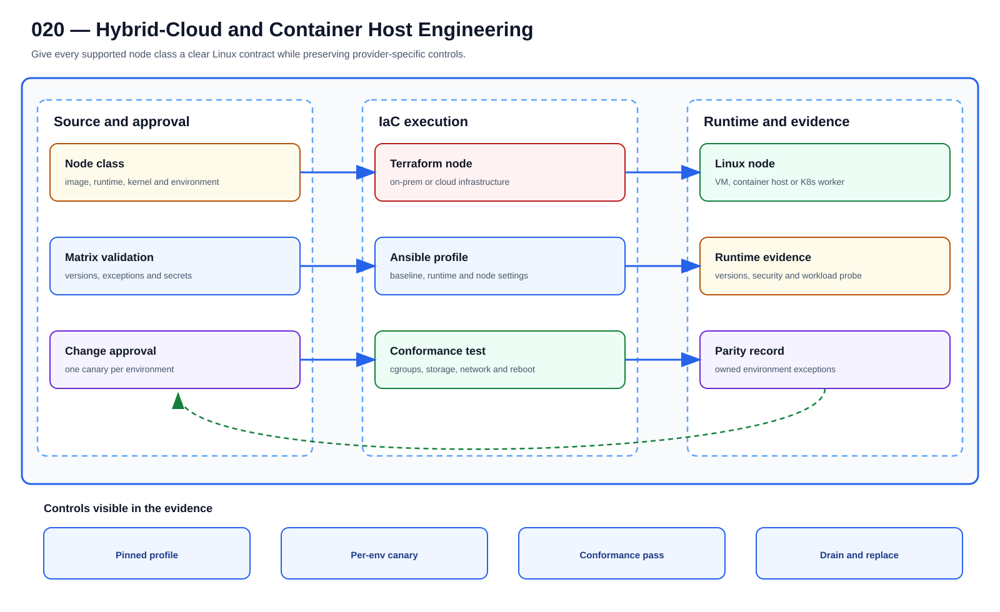

# UC-LNX-020: Hybrid-Cloud and Container Host Engineering

Last verified: 2026-08-02

## Use-case record

| Field | Value |
| --- | --- |
| Portfolio | Enterprise Linux Systems Engineering Platform |
| Canonical coverage target | Secure Linux hosts for cloud VMs, Docker/Podman, Kubernetes and hybrid workloads |
| Delivery model | End-to-end infrastructure as code |
| Primary roles | Cloud platform engineer, Linux engineer, container engineer, security engineer, SRE |
| Target environment | On-premises, cloud, container-runtime, and Kubernetes Linux node classes |
| Current state | **Defined backlog. Existing cloud bootstrap and container-host playbooks are adjacent source, but no unified Linux host contract and acceptance matrix is published.** |
| Related change | None; implementation requires a future approved change record |
| Owner | Linux Platform team |

## Purpose

A container host still needs a dependable operating system. Provider provisioning stays separate from a shared baseline for kernel, runtime, storage, network, security, observability, and node lifecycle.

## Expected outcome

The same node class can be created on a supported on-premises or cloud target, join the workload platform, pass admission checks, and be replaced without manual repair.

## Platform and enterprise fit

| Relationship | Detailed fit |
| --- | --- |
| Owning platform | **Hybrid-Cloud and Container Host Engineering** belongs to the the documented enterprise outcome because that platform turns GitLab-reviewed standards through Jenkins approval and Terraform/image or AWX/Ansible execution into verified operating-system state. |
| Enterprise consumers | The capability supports the Linux foundation beneath provider, payer, database, Kubernetes, observability, and shared services. |
| Enterprise outcome | Its planned result advances: the documented enterprise outcome. |
| Control contribution | The design adds repeatability, least privilege, canary scope, idempotence, recovery, and host-level evidence. |
| Cross-platform handoff | Supporting platforms consume a reviewed result or evidence artifact; they do not take ownership away from the primary platform. |
| Infrastructure boundary | Fit is achieved by reusing documented existing repositories, control planes, services, and targets—not by inventing capacity or treating planned products as available. |

The platform fit is therefore based on ownership and a reusable decision, not
on the presence of a particular tool. Enterprise fit requires evidence that the
named outcome was observed for the bounded scope; completing documentation or
running an isolated technology demonstration is insufficient.

## Trigger and actors

| Item | Definition |
| --- | --- |
| Trigger | A new Linux node class or runtime baseline is needed across on-premises or cloud environments |
| Engineering owners | Cloud platform engineer, Linux engineer, container engineer, security engineer, SRE |
| Approver | Confirms scope, risk, window, plan, and recovery readiness |
| Operations/SRE | Reviews health, evidence, incident linkage, and acceptance |

## Preconditions

- The sequential change record authorizes this exact use case and no conflicting infrastructure work is active.
- GitLab, tagged runner, Jenkins, AWX, inventory, DNS, and observability dependencies are healthy.
- Exact target/canary limits and owners are known; secrets are referenced from approved systems.
- The selected SHA passed source, syntax, lint, policy, security, and plan/check gates.
- Recovery prerequisites and stop conditions are verified before mutation.

## Scope and exclusions

**In scope:** Image and bootstrap parity, cloud metadata/identity, container runtime, cgroups, storage/network prerequisites, kernel modules/sysctls, node hardening, labels, telemetry, and conformance.

**Excluded:** Application container deployment, Kubernetes add-ons, cloud IAM design beyond host attachment, and snowflake images.

## Architecture diagram

A shared node specification branches through provider provisioning, converges on one container-host baseline, and finishes with platform admission and health evidence.

## IaC delivery model

| Layer | Responsibility |
| --- | --- |
| GitLab | Source of truth, merge request, protected branch, CI, immutable SHA, artifacts |
| Jenkins | Manual PLAN/CHECK/APPLY/ROLLBACK, approval, concurrency, evidence aggregation |
| Terraform/image automation | VM/image/volume/network lifecycle only when required |
| AWX and Ansible | OS desired state, inventory limit, check mode, serial rollout, job events |
| Observability/evidence | Health, logs, metrics, expected-versus-observed, incidents, acceptance |

Current-source reality: cloud-infra-automation-platform contains bootstrap-linux.yml and container-host.yml; Linux-platform ownership and cross-environment acceptance are not complete.

## End-to-end implementation

### Code and configuration map

| State | Repository path | Responsibility |
| --- | --- | --- |
| Existing | `cloud-infra-automation-platform: ansible/playbooks/bootstrap-linux.yml and container-host.yml` | Adjacent Linux bootstrap and container-host automation |
| Planned | `linux-systems-platform: roles/container_host and vars/node_classes.yml` | Unified Podman/Docker/containerd and Kubernetes-node desired state |
| Planned | `linux-systems-platform: tests/node-conformance` | On-prem/cloud/runtime matrix and node admission tests |

### Required variables and controls

| Variable/control | Example or constraint | Purpose |
| --- | --- | --- |
| `node_class` | vm/container-host/kubernetes-node | Selects bounded profile |
| `container_runtime` | podman/docker/containerd plus version | Pinned runtime |
| `cgroup_mode` | v2 | Kernel/runtime contract |
| `cloud_identity_profile` | reference only | No long-lived cloud keys |

### Delivery sequence

1. Define node classes and the common versus provider/runtime-specific controls for image, kernel, storage, network, identity, security, and telemetry.
2. Provision one canary in each approved environment through its owning Terraform/image pipeline.
3. Apply the common Linux baseline, then the container/node-class role through AWX or cloud bootstrap automation.
4. Validate runtime version, cgroups, namespaces, storage driver, network path, registry trust, logging, metrics, security controls, and reboot.
5. Run a small conformance workload without deploying production applications.
6. Repeat desired state, compare parity exceptions, and publish node admission evidence.

## Code and configuration map

The implementation map above distinguishes observed `Existing` paths from `Planned` IaC design targets. Planned paths must not be used as evidence of completion.

## Jira breakdown

### STORY-LNX-020-001: Implement and validate the source model

**Description:** The platform team keeps the inputs, roles or modules, tests, pipeline gates, and operating boundaries for Hybrid-Cloud and Container Host Engineering in Git. A reviewer can reproduce the proposal from the selected commit without relying on settings that exist only in a console.

**Status:** In progress only where supporting source is listed; the full source gate is not accepted.

**Acceptance criteria:**

- Inputs have schemas/defaults, safe bounds, ownership, and secret references.
- CI rejects malformed, unsafe, non-idempotent, and out-of-scope changes.
- CI publishes immutable SHA, exact assumptions, and plan/check artifacts.

**Implementation steps:**

1. Define node classes and the common versus provider/runtime-specific controls for image, kernel, storage, network, identity, security, and telemetry.
2. Provision one canary in each approved environment through its owning Terraform/image pipeline.
3. Apply the common Linux baseline, then the container/node-class role through AWX or cloud bootstrap automation.

**Completed work:** cloud-infra-automation-platform contains bootstrap-linux.yml and container-host.yml; Linux-platform ownership and cross-environment acceptance are not complete.

**Validation and rollback:** Validate without runtime mutation; revert source and regenerate artifacts from the prior accepted revision if incorrect.

**Required attachments:** `ART-LNX-020-001` and `ATT-LNX-020-001`.

### STORY-LNX-020-002: Execute the bounded canary and rollout

**Description:** The operator reviews PLAN or CHECK output against one named canary before applying Hybrid-Cloud and Container Host Engineering. Failed health or negative tests stop the run, and expansion requires explicit approval.

**Status:** Planned; no runtime acceptance is claimed.

**Acceptance criteria:**

- Execution uses the reviewed SHA, credential references, inventory, variables, and canary limit.
- Health and negative tests pass before any cohort expansion.
- Failure thresholds stop the workflow and preserve evidence without hidden manual correction.

**Implementation steps:**

1. Validate runtime version, cgroups, namespaces, storage driver, network path, registry trust, logging, metrics, security controls, and reboot.
2. Run a small conformance workload without deploying production applications.
3. Repeat desired state, compare parity exceptions, and publish node admission evidence.

**Completed work:** The execution design is documented; no successful live canary is claimed.

**Validation and rollback:** Node class selects explicit supported image, runtime, kernel, and control versions; No persistent cloud credential or registry secret is committed; Conformance and reboot tests pass in each supported environment. Drain or remove the unaccepted node from scheduling, return traffic/workload to accepted nodes, destroy the canary through Terraform, and pin the prior node image/runtime profile.

**Required attachments:** `ART-LNX-020-002`, `ATT-LNX-020-002`, and `ATT-LNX-020-003`.

### STORY-LNX-020-003: Prove convergence, recovery, and handoff

**Description:** Operations accepts Hybrid-Cloud and Container Host Engineering only after the same revision converges cleanly, runtime health is visible, and the recovery path has been exercised. The evidence must explain what moved, what stayed stable, and how the team recovered it.

**Status:** Planned; blocked until the canary story succeeds.

**Acceptance criteria:**

- Repeating identical code and inputs produces zero unexpected change.
- Recovery is exercised and service returns within the approved objective.
- Logs, metrics, job output, owner, result, and incidents are linked.

**Implementation steps:**

1. Repeat the identical execution and compare the changed set.
2. Exercise the documented recovery path on the bounded target.
3. Verify service health, monitoring, security posture, and consumer access.
4. Publish sanitized evidence and obtain owner/SRE acceptance.

**Completed work:** Acceptance requirements are defined; no runtime proof is claimed.

**Validation and rollback:** Second run is unchanged and exceptions are owned and time-bounded. Drain or remove the unaccepted node from scheduling, return traffic/workload to accepted nodes, destroy the canary through Terraform, and pin the prior node image/runtime profile.

**Required attachments:** `ART-LNX-020-003`, `ATT-LNX-020-004`, and `ATT-LNX-020-005`.

## Evidence and screenshot register

| ID | Required evidence | Source | Status |
| --- | --- | --- | --- |
| `ART-LNX-020-001` | CI, immutable SHA, and plan/check artifact | GitLab | Pending |
| `ATT-LNX-020-001` | Successful source pipeline | GitLab | Pending |
| `ART-LNX-020-002` | Canary execution and changed set | Jenkins/AWX/Terraform | Pending |
| `ATT-LNX-020-002` | Canary result | Control plane | Pending |
| `ATT-LNX-020-003` | Runtime health and expected state | Dashboard/CLI | Pending |
| `ART-LNX-020-003` | Second convergence and recovery log | Control plane | Pending |
| `ATT-LNX-020-004` | Recovery result | Control plane | Pending |
| `ATT-LNX-020-005` | Final accepted state | Dashboard/CLI | Pending |

## Expected versus current result

| Area | Expected | Current observation | Decision |
| --- | --- | --- | --- |
| Source | Complete IaC and pipeline for Hybrid-Cloud and Container Host Engineering | cloud-infra-automation-platform contains bootstrap-linux.yml and container-host.yml; Linux-platform ownership and cross-environment acceptance are not complete. | Not yet code complete |
| Runtime | Approved canary/cohort execution | No accepted use-case run | Pending |
| Idempotence | Identical second run has zero unexpected change | No accepted convergence proof | Pending |
| Recovery | Recovery exercised and timed | No accepted recovery artifact | Pending |
| Evidence | Sanitized artifacts tied to immutable executions | Register defined; captures pending | Pending |

## Validation, idempotence, and rollback

- Node class selects explicit supported image, runtime, kernel, and control versions.
- No persistent cloud credential or registry secret is committed.
- Conformance and reboot tests pass in each supported environment.
- Second run is unchanged and exceptions are owned and time-bounded.

**Rollback/recovery:** Drain or remove the unaccepted node from scheduling, return traffic/workload to accepted nodes, destroy the canary through Terraform, and pin the prior node image/runtime profile.

Idempotence means the same reviewed revision, target, variables, and action produces zero unexplained changes plus stable consumer health. First-run success is not enough.

## Troubleshooting guide

Primary scenario: **Containers run on the canary, but Kubernetes rejects it because cgroup and runtime settings disagree.**

1. Stop propagation and preserve SHA, plan/check, execution IDs, timestamps, and targets.
2. Isolate source, orchestration, infrastructure, connectivity, privilege, host state, and consumer health.
3. Compare live facts with intended variables and the last accepted baseline; correlate logs/metrics to the window.
4. Reproduce only on the canary or in PLAN/CHECK and change one hypothesis at a time.
5. Recover through the documented path and record unexpected failures or near misses.

## Interview preparation

1. **Question:** Explain the end-to-end IaC architecture for Hybrid-Cloud and Container Host Engineering.
   **Answer signals:** Cover GitLab review and CI, Jenkins approval, Terraform/image ownership where relevant, AWX/Ansible execution, observability, convergence, recovery, and evidence.

2. **Question:** How would you make the implementation idempotent and reusable?
   **Answer signals:** node_class, container_runtime, cgroup_mode, cloud_identity_profile; explicit schemas, stable identities, bounded targets, deterministic tasks, and no UI-only state.

3. **Question:** What pipeline and plan/check evidence is required before APPLY?
   **Answer signals:** Node class selects explicit supported image, runtime, kernel, and control versions; No persistent cloud credential or registry secret is committed; immutable SHA, runner identity, target assumptions, scan/test results, and no exposed secret.

4. **Question:** Troubleshooting scenario: Containers run on the canary, but Kubernetes rejects it because cgroup and runtime settings disagree. How do you respond?
   **Answer signals:** Stop propagation, preserve execution evidence, verify target and source revision, isolate the failed layer, compare live facts to desired/baseline, and test recovery on the canary.

5. **Question:** How do you prove idempotence?
   **Answer signals:** Repeat identical SHA, inputs, target, credentials scope, and action; require zero unexplained changes plus stable health and equivalent evidence.

6. **Question:** What rollback or recovery path would you defend?
   **Answer signals:** Drain or remove the unaccepted node from scheduling, return traffic/workload to accepted nodes, destroy the canary through Terraform, and pin the prior node image/runtime profile.

7. **Question:** Which security/audit controls should an interviewer hear?
   **Answer signals:** Protected source, least privilege, secret references, approval gates, short-lived access, canary limits, immutable artifacts, exception expiry, and incident linkage.

8. **Question:** Discuss the tradeoff between cross-environment standardization and provider-specific optimization.
   **Answer signals:** Frame business impact and failure modes, choose a safe default, measure canary results, keep recovery available, and document justified exceptions.

9. **Question:** Tell me about a time you owned a difficult Hybrid-Cloud and Container Host Engineering change or incident across multiple teams. What did you do?
   **Answer signals:** Use a concise STAR example showing ownership, risk communication, evidence-based decisions, a safe stop or rollback, collaboration with service/security/SRE owners, measurable recovery or improvement, and a durable IaC correction.

## Safety and security controls

- Protected source, merge requests, tagged runners, immutable revisions, and retained artifacts.
- Least-privilege credentials referenced from approved secret systems.
- PLAN/CHECK by default; APPLY/ROLLBACK requires confirmation and exact target limits.
- Canary rollout, failure thresholds, health gates, and stop conditions.
- No credentials, private keys, secrets, or protected health information in artifacts.

## Acceptance decision

UC-LNX-020 is **not yet accepted**. Acceptance requires implemented source, passing CI, controlled execution, runtime health, zero-change second convergence, exercised recovery, reviewed evidence, and publication on the canonical branch.
